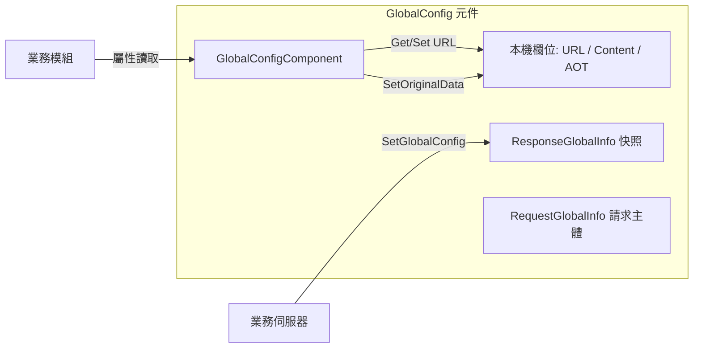

# 簡介

GameFrameX GlobalConfig 是 GameFrameX 框架的全域設定元件，用於集中管理由伺服器下發或在本機設定的全域參數。其中包含應用程式版本檢查 URL、資源版本檢查 URL、主機服務位址、AOT 中繼資料清單以及自訂擴充內容等。該元件以 Unity MonoBehaviour 的形式掛載，並透過 `GameFrameworkComponent` 接入框架生命週期，讓業務模組能夠按需讀取。

## 快速開始

### 1. 安裝

請選擇以下任一方法，將元件新增至 Unity 專案。

1. 在 `Packages/manifest.json` 中新增 scoped registry。

   ```json
   {
     "scopedRegistries": [
       {
         "name": "GameFrameX",
         "url": "https://gameframex.upm.alianblank.uk",
         "scopes": ["com.gameframex"]
       }
     ],
     "dependencies": {
       "com.gameframex.unity.globalconfig": "1.3.2"
     }
   }
   ```

2. 直接在 `dependencies` 節點下新增 Git URL。

   ```json
   {
     "com.gameframex.unity.globalconfig": "https://github.com/gameframex/com.gameframex.unity.globalconfig.git"
   }
   ```

3. 在 Unity Package Manager 中透過 `Add package from git URL` 新增上述位址。

4. 直接將儲存庫複製到 Unity 專案的 `Packages/` 目錄中。

### 2. 掛載元件

在場景中的 `GameFrameX` 框架進入物件上新增 `Global Config` 元件（選單路徑：`Add Component → GameFrameX → Global Config`）。該元件繼承自 `GameFrameworkComponent`，會在 `Awake` 中停用自動註冊，改由框架進入點統一管理。

來源：[GlobalConfigComponent.cs#L11-L13](https://github.com/GameFrameX/com.gameframex.unity.globalconfig/blob/main/Runtime/GlobalConfig/GlobalConfigComponent.cs#L11-L13)

### 3. 設定欄位

該元件會在 Inspector 中公開以下欄位。您可以直接在編輯器中輸入，也可以在執行階段透過屬性賦值。

| 欄位 | 類型 | 說明 |
|------|------|------|
| `Check App Version Url` | string | 應用程式版本檢查介面位址 |
| `Check Resource Version Url` | string | 資源版本檢查介面位址 |
| `AOT Code List` | string | AOT 補充中繼資料清單（JSON 字串）。賦值時會自動解析為 `AOTCodeLists` |
| `Host Server Url` | string | 用於連線後端的主機服務位址 |
| `Content` | string | 自訂擴充內容 |
| `Original Data` | string（唯讀）| 透過 `SetOriginalData` 寫入的原始資料 |

來源：[GlobalConfigComponent.cs#L18-L134](https://github.com/GameFrameX/com.gameframex.unity.globalconfig/blob/main/Runtime/GlobalConfig/GlobalConfigComponent.cs#L18-L134)

### 4. 執行階段讀取

在框架進入點取得元件實例後，即可直接讀取屬性。

```csharp
var globalConfig = GameFrameXEntry.GetComponent<GlobalConfigComponent>();
string hostUrl = globalConfig.HostServerUrl;
string appVersionUrl = globalConfig.CheckAppVersionUrl;
string content = globalConfig.Content;
```

## 運作原理概覽

元件內部會維護一個 `ResponseGlobalInfo` 物件，用於儲存伺服器下發的全域設定快照。本機欄位則儲存 URL、原始資料、AOT 清單等擴充資訊。請求與回應類型採分離定義，方便業務端透過繼承進行擴充。



## 相關連結

- [GlobalConfigComponent.cs](https://github.com/GameFrameX/com.gameframex.unity.globalconfig/blob/main/Runtime/GlobalConfig/GlobalConfigComponent.cs)
- [RequestGlobalInfo.cs](https://github.com/GameFrameX/com.gameframex.unity.globalconfig/blob/main/Runtime/GlobalConfig/RequestGlobalInfo.cs)
- [ResponseGlobalInfo.cs](https://github.com/GameFrameX/com.gameframex.unity.globalconfig/blob/main/Runtime/GlobalConfig/ResponseGlobalInfo.cs)
- [RequestBase.cs](https://github.com/GameFrameX/com.gameframex.unity.globalconfig/blob/main/Runtime/GlobalConfig/RequestBase.cs)
- [Editor/Inspector/GlobalConfigComponentInspector.cs](https://github.com/GameFrameX/com.gameframex.unity.globalconfig/blob/main/Editor/Inspector/GlobalConfigComponentInspector.cs)
- [README.zh-CN.md](https://github.com/GameFrameX/com.gameframex.unity.globalconfig/blob/main/README.zh-CN.md)