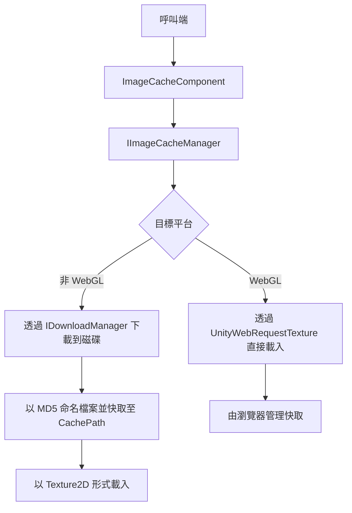

# 概要

GameFrameX.ImageCache 是 GameFrameX 框架的圖片快取元件。它會下載遠端圖片並儲存到本地，以 URL 的 MD5 作為檔案名稱寫入磁碟。第二次及之後載入時，會直接從磁碟以 `Texture2D` 形式讀取，從而避免重複下載，縮短 UI 圖片顯示時間。

## 快速開始

1. 在 Unity 專案的 `Packages/manifest.json` 中新增 GameFrameX 的 registry：

```json
{
  "scopedRegistries": [
    {
      "name": "GameFrameX",
      "url": "https://gameframex.upm.alianblank.uk",
      "scopes": [
        "com.gameframex"
      ]
    }
  ]
}
```

2. 在 `dependencies` 中新增相依套件：

```json
{
  "dependencies": {
    "com.gameframex.unity.imagecache": "0.0.1"
  }
}
```

3. 在場景中加入 `ImageCacheComponent`（選單 `GameFrameX/Image Cache`），並在 Inspector 中視需要調整 `CachePath`、`MaxDiskSize`、`ExpireDays`。元件會在 `Awake` 時將設定同步至 `IImageCacheManager`，預設的快取路徑為 `Application path + "/cache/images/"`。

4. 呼叫介面以載入遠端圖片：

```csharp
// 取得圖片快取元件
var imageCache = GameEntry.GetComponent<ImageCacheComponent>();

// 非同步載入遠端圖片
Texture2D texture = await imageCache.LoadImageAsync("https://example.com/image.png");

// 確認圖片是否已快取
bool cached = imageCache.IsCached("https://example.com/image.png");

// 刪除指定的快取
imageCache.RemoveCache("https://example.com/image.png");

// 清除所有快取
imageCache.ClearCache();
```

出處:[ImageCacheComponent.cs](https://github.com/GameFrameX/com.gameframex.unity.imagecache/blob/main/Runtime/ImageCache/ImageCacheComponent.cs#L73-L76)、[README.zh-CN.md](https://github.com/GameFrameX/com.gameframex.unity.imagecache/blob/main/README.zh-CN.md#L78-L93)

## 運作機制概觀



- **非 WebGL 平台**：透過 `IDownloadManager` 將圖片下載到磁碟，檔案以 URL 的 MD5 命名。載入時會先檢查快取，若不存在則進行下載。
- **WebGL 平台**：使用 `UnityWebRequestTexture` 直接載入圖片。快取完全由瀏覽器管理，因此本地的 `IsCached` / `RemoveCache` / `ClearCache` 介面不會作用。

出處:[ImageCacheManager.cs](https://github.com/GameFrameX/com.gameframex.unity.imagecache/blob/main/Runtime/ImageCache/ImageCacheManager.cs)、[IImageCacheManager.cs](https://github.com/GameFrameX/com.gameframex.unity.imagecache/blob/main/Runtime/ImageCache/IImageCacheManager.cs#L26-L47)

## 下一步

- 快取參數與預設值：請參閱《reference/config》
- 在 Inspector 中調整參數：請參閱《tasks/configure-cache》
- 圖片載入失敗的疑難排解：請參閱《troubleshooting/load-failed》
- 平台差異與 WebGL 的運作方式：請參閱《reference/platform-support》