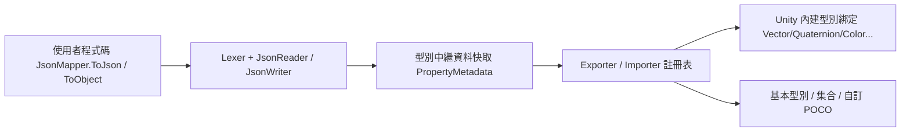

# 概覽

GameFrameX.LitJSON 是一個適用於 Unity 的 JSON 序列化函式庫，基於 [LitJSON](https://github.com/LitJSON/litjson) 進行額外封裝並整合至 GameFrameX 生態系統。它原生支援 Unity 內建型別、`float`、屬性（Attribute）驅動的欄位控制，以及 IL2CPP 程式碼剝離保護。命名空間為 `GameFrameX.LitJSON.Runtime`。

## 快速開始

### 1. 安裝

在 Unity 專案的 `Packages/manifest.json` 中，透過 scoped registry 新增此套件：

```json
{
  "scopedRegistries": [
    {
      "name": "GameFrameX",
      "url": "https://gameframex.upm.alianblank.uk",
      "scopes": ["com.gameframex"]
    }
  ],
  "dependencies": {
    "com.gameframex.unity.litjson": "1.1.3"
  }
}
```

如需其他安裝方式（Git URL、手動 clone），請參閱 [README.md](https://github.com/GameFrameX/com.gameframex.unity.litjson/blob/main/README.md#L60-L96)。

### 2. 序列化與反序列化

```csharp
using GameFrameX.LitJSON.Runtime;

class PlayerData
{
    public int Id { get; set; }
    public string Name { get; set; }
    public float Hp { get; set; }
}

// 序列化（預設輸出格式化的 JSON）
var player = new PlayerData { Id = 42, Name = "Blank", Hp = 100.5f };
string json = JsonMapper.ToJson(player);
// {"Id":42,"Name":"Blank","Hp":100.5}（傳入 false 可輸出緊湊格式）

// 反序列化
PlayerData restored = JsonMapper.ToObject<PlayerData>(json);
```

來源：[README.md](https://github.com/GameFrameX/com.gameframex.unity.litjson/blob/main/README.md#L100-L128)

### 3. 控制欄位輸出

使用 `[JsonIgnore]` 略過成員，並使用 `[JsonProperty("name")]` 自訂 JSON 鍵名：

```csharp
class Account
{
    [JsonProperty("user_name")]
    public string UserName { get; set; }

    [JsonIgnore]
    public string Password { get; set; }
}
```

來源：[README.md](https://github.com/GameFrameX/com.gameframex.unity.litjson/blob/main/README.md#L131-L143)

## 運作原理（簡要說明）



入口型別 [JsonMapper](https://github.com/GameFrameX/com.gameframex.unity.litjson/blob/main/Runtime/JsonMapper.cs) 負責讀取器/寫入器之間的分派、型別快取以及自訂轉換器註冊表。透過反射讀取的屬性/欄位由 [PropertyMetadata](https://github.com/GameFrameX/com.gameframex.unity.litjson/blob/main/Runtime/JsonMapper.cs#L31-L56) 進行快取。Unity 內建實值型別的轉換集中註冊於 [UnityTypeBindings.cs](https://github.com/GameFrameX/com.gameframex.unity.litjson/blob/main/Runtime/UnityTypeBindings.cs)。IL2CPP 剝離保護由 [link.xml](https://github.com/GameFrameX/com.gameframex.unity.litjson/blob/main/link.xml) 與 [LitJsonCroppingHelper](https://github.com/GameFrameX/com.gameframex.unity.litjson/blob/main/Runtime/LitJsonCroppingHelper.cs) 共同提供，並透過執行階段反射觸發。

## 後續步驟

- 若要了解如何將 Unity 型別（例如 `Vector3`、`Color`）寫入 JSON，請參閱「如何序列化 Unity 內建型別」
- 當需要略過或重新命名欄位時，請參閱「如何控制欄位輸出」
- 若在建置後反序列化拋出 `MissingMethodException`，請參閱「當 IL2CPP 剝離導致反序列化失敗時該怎麼辦」
- 如需完整的 API 快速參考，請參閱「API 參考」
- 如需升級資訊，請參閱 [CHANGELOG.md](https://github.com/GameFrameX/com.gameframex.unity.litjson/blob/main/CHANGELOG.md)