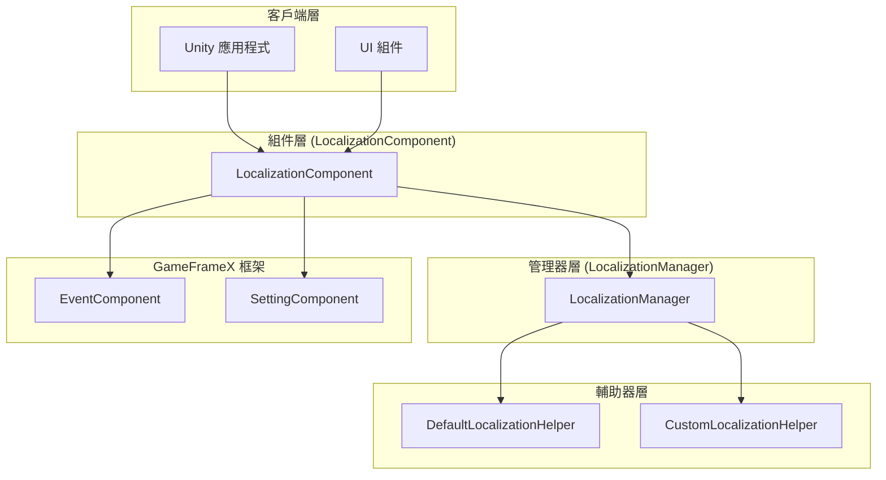
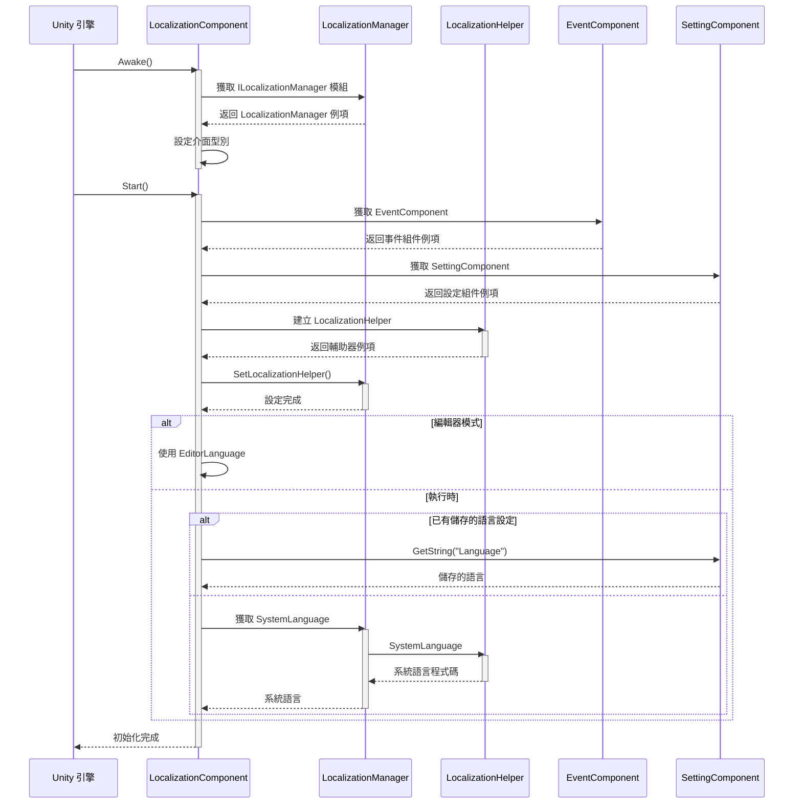
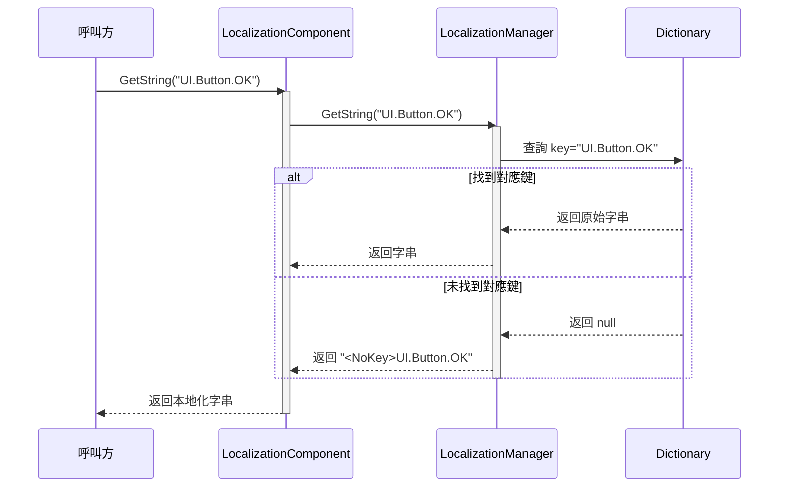
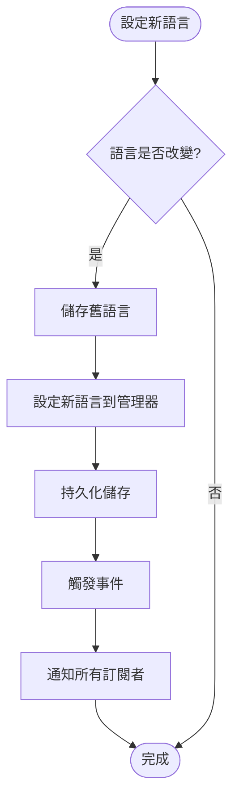
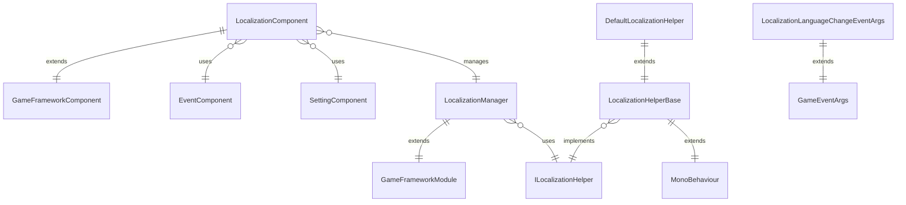

# 概述

GameFrameX Localization 是 GameFrameX 遊戲框架的核心組件之一，提供完整的 Unity 本地化解決方案。該組件支援多語言動態切換、字串格式化、系統語言檢測以及完整的字典管理功能，使開發者能夠輕鬆實現遊戲的國際化需求。

## 概述

GameFrameX Localization 組件是 Unity 遊戲框架中專門負責處理多語言本地化的模組。它採用組件-管理器-輔助器三層架構設計，透過介面分離和依賴注入等設計模式，提供了一個靈活、可擴充套件的本地化解決方案。

本組件的主要職責包括：管理多語言字典資料、提供本地化字串獲取介面、處理執行時語言切換、檢測系統語言環境，以及透過事件系統通知語言變化。開發者可以透過簡單的 API 呼叫實現複雜的國際化功能，無需關心底層實現細節。

該組件是 GameFrameX 框架的核心模組之一，與 Event（事件系統）、Setting（設定管理）、Asset（資源管理）等模組緊密協作，共同構建完整的遊戲開發基礎設施。

## 系統架構

GameFrameX Localization 採用清晰的三層架構設計，各層職責明確，層與層之間透過介面進行通訊，實現了高內聚、低耦合的設計目標。



### 核心組件說明

**LocalizationComponent** 是 Unity 層面的組件，繼承自 GameFrameworkComponent，作為對外提供服務的入口點。它實現了 Awake 和 Start 生命週期方法，在初始化時建立本地化輔助器並註冊到管理器中。組件提供了豐富的 GetString 過載方法，支援 0 到 16 個引數的字串格式化需求。

**LocalizationManager** 是核心的業務邏輯管理器，繼承自 GameFrameworkModule 並實現 ILocalizationManager 介面。它維護一個 Dictionary<string, string> 型別的字典資料結構，負責字串的儲存、查詢和格式化操作。管理器不直接與 Unity 互動，而是透過 ILocalizationHelper 介面獲取系統語言資訊。

**ILocalizationHelper** 介面定義了本地化輔助器的規範，目前只包含一個 SystemLanguage 屬性，用於獲取當前系統的語言程式碼。這種設計允許開發者透過實現自定義的輔助器來控制語言檢測邏輯，例如從伺服器獲取語言設定或根據使用者配置決定初始語言。

**LocalizationHelperBase** 是輔助器的抽象基類，繼承自 MonoBehaviour 並實現 ILocalizationHelper 介面。這使得輔助器可以掛載到 Unity 遊戲物件上，便於在編輯器中配置和管理。

**DefaultLocalizationHelper** 是預設的輔助器實現，透過 .NET 的 CultureInfo.CurrentCulture.Name 獲取系統語言，並將連字元替換為下劃線以符合 RFC 5646 標準（如 zh-CN 轉換為 zh_CN）。

## 核心流程

本地化組件的初始化和字串獲取流程體現了框架的核心設計理念。以下流程圖展示了從組件啟動到獲取本地化字串的完整過程。



### 字串獲取流程

當應用程式需要獲取本地化字串時，會呼叫 LocalizationComponent 的 GetString 方法。該方法將請求轉發給 LocalizationManager，後者從字典中查詢對應的字串，並根據需要執行格式化操作。



### 語言切換流程

語言切換是本地化系統的核心功能之一。當應用程式需要更改當前語言時，需要透過 LocalizationComponent 的 Language 屬性進行設定。



語言切換時會觸發 LocalizationLanguageChangeEventArgs 事件，應用程式可以透過訂閱此事件來響應語言變化，例如重新整理 UI 顯示或更新遊戲內容。

## 依賴關係

GameFrameX Localization 組件依賴 GameFrameX 框架的其他核心模組，這些依賴關係確保了本地化功能能夠正常執行並與其他系統協調工作。



### 依賴模組說明

| 依賴模組 | 說明 | 用途 |
|---------|------|------|
| GameFrameX.Runtime | 核心執行時模組 | 提供基礎框架功能，包括模組系統、物件池、日誌等 |
| GameFrameX.Event.Runtime | 事件系統模組 | 實現語言切換事件的釋出和訂閱機制 |
| GameFrameX.Setting.Runtime | 設定管理模組 | 持久化儲存使用者的語言設定 |

## 主要特性

GameFrameX Localization 提供了豐富的功能特性，滿足各種遊戲開發中的本地化需求。

**多語言支援**：組件不限制語言數量，開發者可以新增任意數量的語言變體。每種語言透過唯一的語言程式碼標識，如 zh_CN（簡體中文）、en_US（美式英語）、ja_JP（日語）等。

**動態語言切換**：支援在遊戲執行時無縫切換語言，切換過程會自動觸發事件通知，應用程式可以實時響應語言變化，無需重啟應用。

**引數化字串**：提供強大的字串格式化功能，支援最多 16 個格式化引數。開發者可以在字典中定義包含佔位符的模板字串，如 "玩家等級：{0}，經驗值：{1}"，執行時動態替換引數值。

**系統語言檢測**：預設情況下組件會自動檢測作業系統語言並採用相應語言，可以透過自定義輔助器實現自定義的語言檢測邏輯。

**字典管理**：提供完整的字典 CRUD 操作，包括檢查鍵是否存在、獲取原始值、新增新字典項、移除字典項、清空所有字典等功能。

**編輯器支援**：提供編輯器模式，可以在 Unity 編輯器中預覽不同語言的顯示效果，方便開發和除錯。

## 快速使用

在 Unity 專案中使用 GameFrameX Localization 非常簡單。以下是基本的使用流程。

首先，需要在場景中的 GameFrameX 管理器上新增 LocalizationComponent 組件。組件會自動初始化並載入本地化功能。

```csharp
// 獲取本地化組件
var localization = GameEntry.GetComponent<LocalizationComponent>();

// 設定語言
localization.Language = "zh_CN"; // 簡體中文
localization.Language = "en_US"; // 英文

// 獲取本地化字串
string text = localization.GetString("UI.Button.OK");

// 帶引數的本地化字串
string message = localization.GetString("UI.Message.Welcome", playerName);
string info = localization.GetString("UI.Info.Score", score, level);
```
> Source: [LocalizationComponent.cs](https://github.com/GameFrameX/com.gameframex.unity.localization/blob/main/Runtime/Localization/LocalizationComponent.cs#L246-L262)

### 字典管理

應用程式可以在執行時動態管理字典資料，實現熱更新語言資源的功能。

```csharp
// 檢查字典是否存在
bool exists = localization.HasRawString("UI.Button.Cancel");

// 獲取原始字串
string rawText = localization.GetRawString("UI.Button.Cancel");

// 新增字典項
localization.AddRawString("UI.Button.NewButton", "新按鈕");

// 移除字典項
bool removed = localization.RemoveRawString("UI.Button.Cancel");

// 清空所有字典
localization.RemoveAllRawStrings();
```
> Source: [LocalizationComponent.cs](https://github.com/GameFrameX/com.gameframex.unity.localization/blob/main/Runtime/Localization/LocalizationComponent.cs#L717-L758)

### 事件監聽

透過訂閱語言變化事件，應用程式可以在語言切換時執行自定義邏輯，如重新整理 UI 顯示。

```csharp
// 訂閱語言變化事件
GameEntry.GetComponent<EventComponent>().Subscribe(
    LocalizationLanguageChangeEventArgs.EventId, 
    OnLanguageChanged);

private void OnLanguageChanged(object sender, GameEventArgs e)
{
    var args = (LocalizationLanguageChangeEventArgs)e;
    Debug.Log($"語言從 {args.OldLanguage} 切換到 {args.Language}");
    
    // 更新UI顯示
    RefreshUI();
}
```
> Source: [LocalizationLanguageChangeEventArgs.cs](https://github.com/GameFrameX/com.gameframex.unity.localization/blob/main/Runtime/EventArgs/LocalizationLanguageChangeEventArgs.cs#L52-L58)

## 語言程式碼規範

GameFrameX Localization 遵循 RFC 5646 語言標籤標準，使用下劃線分隔的語言程式碼格式。以下是常用的語言程式碼示例：

| 語言程式碼 | 說明 |
|---------|------|
| zh_CN | 簡體中文（中國） |
| zh_TW | 繁體中文（臺灣） |
| en_US | 美式英語（美國） |
| en_GB | 英式英語（英國） |
| ja_JP | 日語（日本） |
| ko_KR | 韓語（韓國） |
| fr_FR | 法語（法國） |
| de_DE | 德語（德國） |
| es_ES | 西班牙語（西班牙） |
| ru_RU | 俄語（俄羅斯） |

開發者在定義語言程式碼時應注意：語言程式碼區分大小寫，建議使用標準的命名規範；每個語言程式碼由語言和可選的地區兩部分組成，使用下劃線分隔而非連字元。

## 相關連結

- [安裝指南](./2-installation)
- [快速開始](./3-getting-started)
- [核心功能 - 獲取本地化字串](./4-core-features.get-string)
- [核心功能 - 字典管理](./4-core-features.dictionary-management)
- [核心功能 - 語言切換與事件](./4-core-features.language-switching)
- [API 參考](./5-api-reference)
- [配置](./6-configuration)
- [最佳實踐](./7-best-practices)
- [GitHub 倉庫](https://github.com/GameFrameX/com.gameframex.unity.localization.git)
- [官方文件](https://gameframex.doc.alianblank.com/)
