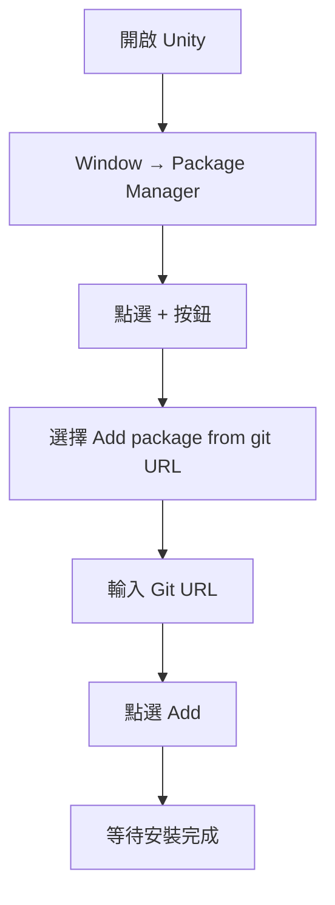
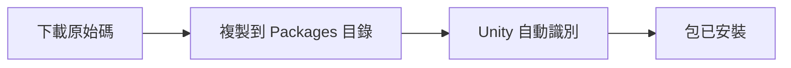
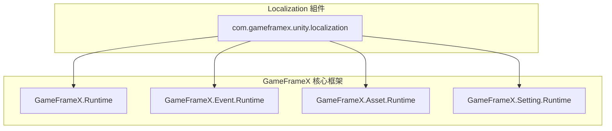

# 安裝

本文件介紹如何將 GameFrameX Localization 本地化組件安裝到您的 Unity 專案中。

## 概述

GameFrameX Localization 是 GameFrameX 遊戲框架的本地化功能組件，提供完整的多語言本地化解決方案。該組件支援動態語言切換、字串格式化、系統語言檢測等功能，可幫助開發者快速實現遊戲的國際化。

**版本要求：**
- Unity 2019.4 或更高版本

**包資訊：**
- 包名：`com.gameframex.unity.localization`
- 顯示名稱：GameFrameX Localization
- 當前版本：2.2.1

## 安裝方式

### 方式一：透過 Unity Package Manager 安裝（推薦）

這是最推薦的安裝方式，可以方便地獲取最新版本並管理依賴。

**操作步驟：**

1. 開啟 Unity 編輯器
2. 進入選單 **Window → Package Manager**
3. 點選左上角的 **+** 按鈕
4. 選擇 **Add package from git URL...**
5. 在輸入框中輸入以下 Git URL：

```
https://github.com/GameFrameX/com.gameframex.unity.localization.git
```

6. 點選 **Add** 按鈕等待安裝完成



### 方式二：透過 manifest.json 安裝

直接編輯專案的 `Packages/manifest.json` 檔案來新增依賴。

**操作步驟：**

1. 找到專案根目錄下的 `Packages` 資料夾
2. 使用文字編輯器開啟 `manifest.json` 檔案
3. 在 `dependencies` 節點中新增以下內容：

```json
{
  "dependencies": {
    "com.gameframex.unity.localization": "https://github.com/GameFrameX/com.gameframex.unity.localization.git"
  }
}
```

4. 儲存檔案並返回 Unity
5. Unity 會自動解析並安裝依賴包

> 注意：此方式在每次開啟專案時都會嘗試從 Git 拉取最新版本。如需鎖定版本，請使用下面的格式指定版本號：
> ```json
> "com.gameframex.unity.localization": "2.2.1"
> ```

### 方式三：本地原始碼安裝

如果您需要自定義修改原始碼或處於離線環境，可以使用本地安裝方式。

**操作步驟：**

1. 從 GitHub 倉庫克隆或下載原始碼：
   ```bash
   https://github.com/GameFrameX/com.gameframex.unity.localization.git
   ```
2. 將整個倉庫資料夾複製到您 Unity 專案的 `Packages` 目錄下
3. Unity 會自動識別並載入該包
4. 如需更新，直接替換資料夾內容即可



## 依賴項說明

GameFrameX Localization 組件依賴以下 GameFrameX 核心模組：

| 依賴包 | 版本 | 說明 |
|--------|------|------|
| com.gameframex.unity | 1.1.1 | 核心執行時模組 |
| com.gameframex.unity.asset | 1.0.6 | 資源管理模組 |
| com.gameframex.unity.event | 1.0.0 | 事件系統模組 |

**自動依賴解析：**

當使用 Package Manager 或 manifest.json 安裝時，Unity 會自動解析並下載所有依賴項。

如果使用本地安裝方式，請確保以下模組也已安裝：

| 模組 | Assembly 定義 | 說明 |
|------|---------------|------|
| GameFrameX.Runtime | GameFrameX.Runtime | 核心框架 |
| GameFrameX.Event.Runtime | GameFrameX.Event.Runtime | 事件系統 |
| GameFrameX.Asset.Runtime | GameFrameX.Asset.Runtime | 資源管理 |
| GameFrameX.Setting.Runtime | GameFrameX.Setting.Runtime | 設定管理 |



## 驗證安裝

安裝完成後，請按以下步驟驗證：

### 1. 檢查 Package Manager

在 Package Manager 視窗中確認 `GameFrameX Localization` 已出現在列表中，並且狀態顯示為正常。

### 2. 檢查程式集

在專案目錄中應存在以下程式集定義檔案：

- `Packages/com.gameframex.unity.localization/Runtime/GameFrameX.Localization.Runtime.asmdef`
- `Packages/com.gameframex.unity.localization/Editor/GameFrameX.Localization.Editor.asmdef`

### 3. 建立測試場景

1. 在 Unity 場景中建立一個空 GameObject
2. 新增 **LocalizationComponent** 組件（選單路徑：**Component → GameFrameX → Localization**）
3. 檢查組件 Inspector 面板是否正常顯示配置選項

> Source: [LocalizationComponent.cs](https://github.com/GameFrameX/com.gameframex.unity.localization/blob/main/Runtime/Localization/LocalizationComponent.cs#L44-L47)

### 4. 執行基礎程式碼測試

```csharp
using GameFrameX.Runtime;

// 獲取本地化組件
var localization = GameEntry.GetComponent<LocalizationComponent>();

// 獲取系統語言
Debug.Log($"系統語言: {localization.SystemLanguage}");

// 獲取一個本地化字串測試
string text = localization.GetString("Test.Key");
Debug.Log($"測試結果: {text}");
```

## 組件配置

在場景中新增 LocalizationComponent 後，可在 Inspector 面板中配置以下選項：

| 配置項 | 型別 | 預設值 | 說明 |
|--------|------|--------|------|
| Editor Language | string | zh_CN | 編輯器模式下使用的語言 |
| Default Language | string | zh_CN | 預設語言（載入失敗時的備用語言） |
| Enable Load Dictionary Update Event | bool | false | 是否啟用字典載入更新事件 |
| Is Enable Editor Mode | bool | false | 是否啟用編輯器模式 |
| Localization Helper Type Name | string | DefaultLocalizationHelper | 本地化輔助器型別名稱 |
| Custom Localization Helper | LocalizationHelperBase | null | 自定義本地化輔助器例項 |

> 注意：Editor Language 僅在 Unity 編輯器中生效，不會影響打包後的遊戲。

## 常見問題

### Q1: 安裝後出現編譯錯誤

**原因：** 缺少依賴項

**解決方案：** 確保所有 GameFrameX 依賴項已正確安裝。請嘗試重新開啟 Package Manager 並檢查依賴項狀態。

### Q2: 無法找到 LocalizationComponent

**原因：** 程式集未正確載入

**解決方案：**
1. 檢查 Assembly Definition 檔案是否存在
2. 嘗試重新匯入所有資源：**Assets → Reimport All**
3. 檢查 Console 視窗中的錯誤資訊

### Q3: 版本不相容

**原因：** Unity 版本過低或依賴包版本衝突

**解決方案：**
1. 確認 Unity 版本不低於 2019.4
2. 檢查是否有其他包宣告瞭不同版本的 GameFrameX 依賴

## 相關連結

- [快速開始](./3-getting-started) - 開始使用本地化功能
- [核心功能](./4-core-features.get-string) - 瞭解核心功能
- [API 參考](./5-api-reference) - 完整的 API 文件
- [GitHub 倉庫](https://github.com/GameFrameX/com.gameframex.unity.localization.git) - 獲取原始碼和最新版本
- [官方文件](https://gameframex.doc.alianblank.com/) - GameFrameX 完整文件
