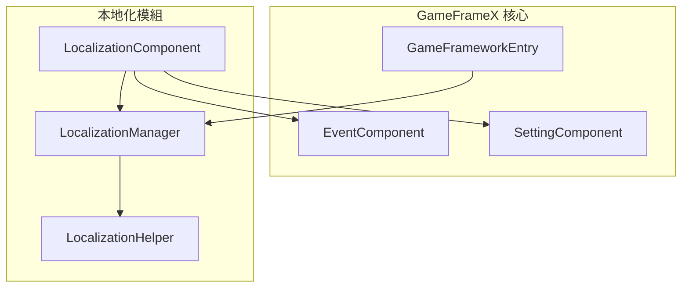
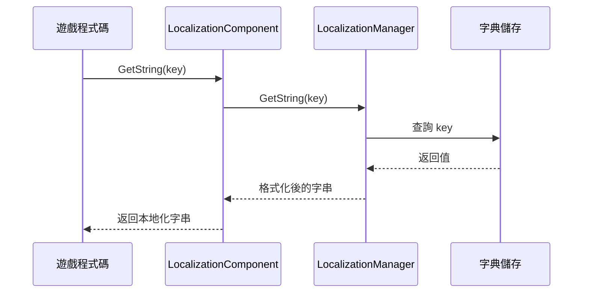
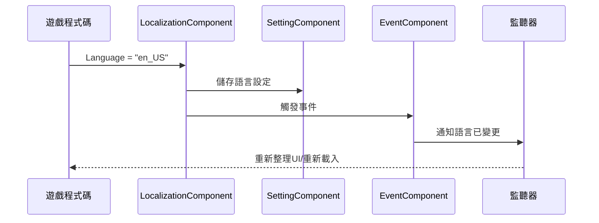

# 快速開始

本指南將幫助您快速上手 GameFrameX Localization 組件，實現 Unity 遊戲的本地化功能。

## 概述

GameFrameX Localization 是 GameFrameX 遊戲框架的本地化組件，提供完整的遊戲本地化解決方案。該組件支援：
- 多語言字串管理（字典形式）
- 動態引數插值（最多支援 16 個引數）
- 執行時語言切換
- 系統語言自動檢測
- 語言設定持久化

## 架構概覽



**組件說明：**
- **LocalizationComponent**：Unity 組件，整合到 Game Framework，負責初始化和協調
- **LocalizationManager**：核心管理器，處理字典儲存和字串獲取
- **LocalizationHelper**：輔助器，用於檢測系統語言
- **EventComponent**：事件系統，用於釋出語言切換事件
- **SettingComponent**：設定系統，用於持久化語言偏好

## 核心流程

### 字串獲取流程



### 語言切換流程



## 使用示例

### 基本用法

在 Unity 場景中新增 LocalizationComponent 組件後，可以透過以下方式獲取本地化字串：

```csharp
using GameFrameX.Localization.Runtime;

// 獲取 LocalizationComponent 例項
var localization = GameEntry.GetComponent<LocalizationComponent>();

// 獲取簡單字串
string greeting = localization.GetString("greeting"); // 輸出：你好

// 獲取帶引數的字串
string playerName = localization.GetString("welcome_player", "張三"); // 輸出：歡迎，張三！
```

> Source: [LocalizationComponent.cs](https://github.com/GameFrameX/com.gameframex.unity.localization/blob/main/Runtime/Localization/LocalizationComponent.cs#L246-L262)

### 高階用法：多引數插值

組件支援最多 16 個引數的字串插值：

```csharp
// 兩個引數
string message = localization.GetString("level_complete", 5, "1000"); 
// 假設字典：level_complete = "第 {0} 關完成！得分：{1}"
// 輸出：第 5 關完成！得分：1000

// 四個引數
string complex = localization.GetString("battle_result", "勝利", 1000, 500, 50);
// 假設字典：battle_result = "{0}！經驗+{1}，金幣+{2}，鑽石+{3}"
// 輸出：勝利！經驗+1000，金幣+500，鑽石+50
```

> Source: [LocalizationManager.cs](https://github.com/GameFrameX/com.gameframex.unity.localization/blob/main/Runtime/Localization/Localization/LocalizationManager#L168-L311)

### 字典管理

手動新增和管理字典：

```csharp
// 新增字典
localization.AddRawString("game_title", "我的遊戲");
localization.AddRawString("start_game", "開始遊戲");

// 檢查字典是否存在
bool exists = localization.HasRawString("game_title"); // true

// 獲取原始值（不經過格式化）
string rawValue = localization.GetRawString("game_title"); // 我的遊戲

// 移除字典
localization.RemoveRawString("game_title");

// 清空所有字典
localization.RemoveAllRawStrings();
```

### 語言切換與事件監聽

監聽語言切換事件：

```csharp
using GameFrameX.Event.Runtime;

// 訂閱語言切換事件
EventComponent eventComponent = GameEntry.GetComponent<EventComponent>();
eventComponent.Subscribe(LocalizationLanguageChangeEventArgs.EventId, OnLanguageChanged);

// 事件處理方法
private void OnLanguageChanged(object sender, GameEventArgs e)
{
    var args = (LocalizationLanguageChangeEventArgs)e;
    Debug.Log($"語言從 {args.OldLanguage} 切換到 {args.Language}");
    
    // 重新整理所有UI文字
    RefreshAllUI();
}

// 切換語言
localization.Language = "en_US";
```

> Source: [LocalizationLanguageChangeEventArgs.cs](https://github.com/GameFrameX/com.gameframex.unity.localization/blob/main/Runtime/EventArgs/LocalizationLanguageChangeEventArgs.cs#L52-L58)

## 配置說明

在 Unity 編輯器中配置 LocalizationComponent：

| 配置項 | 型別 | 預設值 | 說明 |
|--------|------|--------|------|
| EditorLanguage | string | "zh_CN" | 編輯器中使用的語言 |
| DefaultLanguage | string | "zh_CN" | 預設語言（載入失敗時使用） |
| EnableLoadDictionaryUpdateEvent | bool | false | 是否啟用字典載入更新事件 |
| IsEnableEditorMode | bool | false | 是否啟用編輯器模式 |
| LocalizationHelperTypeName | string | "GameFrameX.Localization.Runtime.DefaultLocalizationHelper" | 本地化輔助器型別 |

> Source: [LocalizationComponent.cs](https://github.com/GameFrameX/com.gameframex.unity.localization/blob/main/Runtime/Localization/LocalizationComponent.cs#L60-L69)

## 字典格式示例

典型的本地化字典格式如下：

```json
{
  "zh_CN": {
    "greeting": "你好",
    "welcome_player": "歡迎，{0}！",
    "level_complete": "第 {0} 關完成！得分：{1}",
    "battle_result": "{0}！經驗+{1}，金幣+{2}"
  },
  "en_US": {
    "greeting": "Hello",
    "welcome_player": "Welcome, {0}!",
    "level_complete": "Level {0} Complete! Score: {1}",
    "battle_result": "{0}! EXP+{1}, Gold+{2}"
  }
}
```

## 依賴項

本組件依賴以下 GameFrameX 核心模組：
- `com.gameframex.unity` (>= 1.1.1)
- `com.gameframex.unity.asset` (>= 1.0.6)
- `com.gameframex.unity.event` (>= 1.0.0)

## 後續步驟

- 瞭解更多核心功能，請參閱 [獲取本地化字串](./4-core-features.get-string)
- 瞭解字典管理，請參閱 [字典管理](./4-core-features.dictionary-management)
- 瞭解語言切換機制，請參閱 [語言切換與事件](./4-core-features.language-switching)
- 檢視完整 API，請參閱 [API 參考](./5-api-reference)
