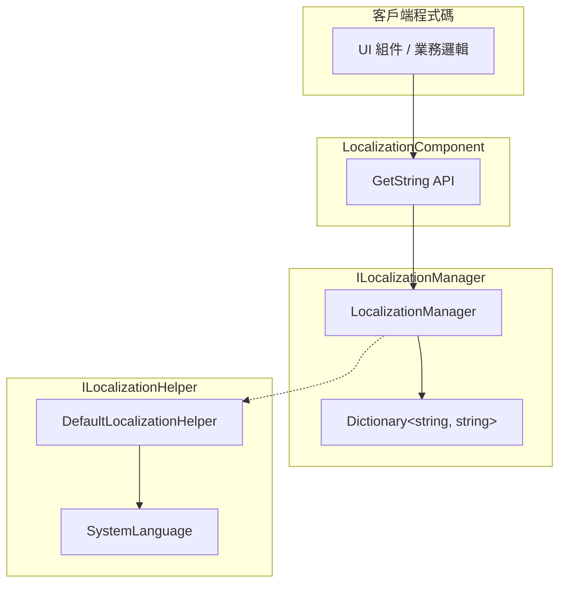

# 獲取本地化字串

獲取本地化字串是 GameFrameX Localization 模組的核心功能。透過字典主鍵（Key）可以獲取對應語言的字串內容，並支援動態引數替換功能。

## 概述

LocalizationComponent 組件提供了豐富的 `GetString` 方法來獲取本地化字串。這些方法支援：

- **基礎獲取**：根據 key 直接獲取字串
- **引數替換**：支援 0-16 個引數，實現動態字串格式化
- **錯誤處理**：當 key 不存在或格式化失敗時，返回有意義的錯誤提示

設計意圖：提供型別安全的引數化字串獲取方式，避免執行時字串拼接錯誤，同時保持與 .NET string.Format 類似的用法。

## 架構



### 組件說明

| 組件 | 職責 |
|------|------|
| LocalizationComponent | Unity 組件層，暴露公共 API |
| ILocalizationManager | 定義本地化管理的介面契約 |
| LocalizationManager | 實現字典儲存和字串格式化邏輯 |
| ILocalizationHelper | 系統語言檢測介面 |

## 核心流程

```mermaid
sequenceDiagram
    participant Client as 客戶端
    participant Comp as LocalizationComponent
    participant Mgr as LocalizationManager
    participant Dict as Dictionary

    Client->>Comp: GetString(key)
    Comp->>Mgr: GetString(key)
    Mgr->>Dict: TryGetValue(key)
    
    alt Key 存在
        Dict-->>Mgr: rawString
        Mgr-->>Comp: rawString
        Comp-->>Client: 字串
    else Key 不存在
        Dict-->>Mgr: null
        Mgr-->>Comp: &lt;NoKey&gt;{key}
        Comp-->>Client: 錯誤提示字串
    end
```

```mermaid
sequenceDiagram
    participant Client as 客戶端
    participant Comp as LocalizationComponent
    participant Mgr as LocalizationManager
    participant Dict as Dictionary
    participant Format as string.Format

    Client->>Comp: GetString(key, arg1, arg2)
    Comp->>Mgr: GetString(key, arg1, arg2)
    Mgr->>Dict: TryGetValue(key)
    
    alt Key 存在
        Dict-->>Mgr: rawString
        Mgr->>Format: Format(rawString, arg1, arg2)
        
        alt 格式化成功
            Format-->>Mgr: formattedString
            Mgr-->>Comp: formattedString
            Comp-->>Client: 格式化後的字串
        else 格式化失敗
            Format-->>Mgr: Exception
            Mgr-->>Comp: &lt;Error&gt;{details}
            Comp-->>Client: 錯誤提示字串
        end
    else Key 不存在
        Dict-->>Mgr: null
        Mgr-->>Comp: &lt;NoKey&gt;{key}
        Comp-->>Client: 錯誤提示字串
    end
```

## 使用示例

### 基礎用法

最簡單的用法是根據 key 獲取字串：

```csharp
using GameFrameX.Localization.Runtime;

// 獲取 LocalizationComponent 例項
var localization = GameEntry.GetComponent<LocalizationComponent>();

// 獲取簡單字串（無引數）
string welcome = localization.GetString("UI_Welcome");
```

> Source: [LocalizationComponent.cs](https://github.com/GameFrameX/com.gameframex.unity.localization/blob/main/Runtime/Localization/LocalizationComponent.cs#L246-L249)

### 單引數用法

使用單引數替換字串中的佔位符 `{0}`：

```csharp
// 字典內容: "Hello {0}, welcome to {1}!"
// 獲取帶引數的字串
string message = localization.GetString<string>("UI_Greeting", "Player");
// 結果: "Hello Player, welcome to {1}!"
```

> Source: [LocalizationComponent.cs](https://github.com/GameFrameX/com.gameframex.unity.localization/blob/main/Runtime/Localization/LocalizationComponent.cs#L272-L275)

### 多引數用法

支援最多 16 個引數，適用於複雜的訊息格式化：

```csharp
// 字典內容: "{0} found {1} items in {2}"
// 使用兩個引數
string result = localization.GetString<string, int, string>("UI_FindItems", "Player", 100);
// 結果: "Player found 100 items in {2}"

// 使用三個引數（完整格式化）
string fullResult = localization.GetString<string, int, string>("UI_FindItems", "Player", 100, "Dungeon");
// 結果: "Player found 100 items in Dungeon"
```

> Source: [LocalizationComponent.cs](https://github.com/GameFrameX/com.gameframex.unity.localization/blob/main/Runtime/Localization/LocalizationComponent.cs#L287-L290)

### 動態引數陣列用法

使用 `params` 方式傳遞不確定數量的引數：

```csharp
// 使用 params 陣列
object[] args = new object[] { "Alice", 25, "Beijing" };
string message = localization.GetString("UI_UserInfo", args);
```

> Source: [LocalizationComponent.cs](https://github.com/GameFrameX/com.gameframex.unity.localization/blob/main/Runtime/Localization/LocalizationComponent.cs#L259-L262)

### 字典操作

在獲取字串之前，需要先向字典新增資料：

```csharp
// 新增字典條目
localization.AddRawString("UI_StartGame", "開始遊戲");
localization.AddRawString("UI_Score", "得分: {0}");

// 檢查 key 是否存在
if (localization.HasRawString("UI_StartGame"))
{
    // 獲取字串
    string text = localization.GetString("UI_StartGame");
}

// 移除字典條目
localization.RemoveRawString("UI_StartGame");

// 清空所有字典
localization.RemoveAllRawStrings();
```

> Source: [LocalizationComponent.cs](https://github.com/GameFrameX/com.gameframex.unity.localization/blob/main/Runtime/Localization/LocalizationComponent.cs#L737-L758)

## API 參考

### LocalizationComponent

#### `GetString(string key): string`

獲取無引數的本地化字串。

**引數：**
- `key` (string): 字典主鍵

**返回：** 字串內容，如果 key 不存在返回 `<NoKey>{key}`

**示例：**
```csharp
string text = localization.GetString("UI_Title");
```

---

#### `GetString<T>(string key, T arg): string`

獲取帶單個引數的本地化字串。

**引數：**
- `key` (string): 字典主鍵
- `arg` (T): 替換引數

**返回：** 格式化後的字串

**示例：**
```csharp
string text = localization.GetString<int>("UI_Score", 100);
// 字典: "Score: {0}" → 結果: "Score: 100"
```

---

#### `GetString<T1, T2>(string key, T1 arg1, T2 arg2): string`

獲取帶兩個引數的本地化字串。

**引數：**
- `key` (string): 字典主鍵
- `arg1` (T1): 第一個引數
- `arg2` (T2): 第二個引數

**返回：** 格式化後的字串

---

#### `GetString(string key, params object[] args): string`

使用引數陣列獲取本地化字串。

**引數：**
- `key` (string): 字典主鍵
- `args` (object[]): 引數陣列

**返回：** 格式化後的字串

---

#### `HasRawString(string key): bool`

檢查字典中是否存在指定的 key。

**引數：**
- `key` (string): 字典主鍵

**返回：** 存在返回 true，否則返回 false

---

#### `GetRawString(string key): string`

獲取原始字典值（不經過格式化）。

**引數：**
- `key` (string): 字典主鍵

**返回：** 原始字串，key 不存在時返回空字串

---

#### `AddRawString(string key, string value): void`

向字典新增新條目。

**引數：**
- `key` (string): 字典主鍵
- `value` (string): 字典值

---

#### `RemoveRawString(string key): bool`

從字典移除指定條目。

**引數：**
- `key` (string): 字典主鍵

**返回：** 移除成功返回 true，key 不存在返回 false

---

#### `RemoveAllRawStrings(): void`

清空所有字典條目。

---

### ILocalizationManager

ILocalizationManager 介面定義了核心的本地化管理功能，完整方法列表請參考 [API 參考](./5-api-reference) 文件。

## 錯誤處理

系統對錯誤情況提供了友好的處理機制：

| 錯誤場景 | 返回值示例 |
|---------|-----------|
| Key 不存在 | `<NoKey>UI_MissingKey` |
| 格式化引數不匹配 | `<Error>UI_Format,{0}實際內容,arg,System.FormatException` |

這種設計確保了：
1. 開發時能快速發現缺失的 key
2. 執行時不會因為錯誤導致應用崩潰
3. 錯誤資訊包含了除錯所需的關鍵資料

## 相關連結

- [概述](./1-overview) - 瞭解本地化模組整體架構
- [安裝](./2-installation) - 安裝和配置本地化模組
- [快速開始](./3-getting-started) - 快速上手本地化功能
- [字典管理](./4-core-features.dictionary-management) - 管理本地化字典
- [語言切換與事件](./4-core-features.language-switching) - 切換語言和事件處理
- [API 參考](./5-api-reference) - 完整的 API 文件
- [配置](./6-configuration) - 模組配置選項
- [最佳實踐](./7-best-practices) - 使用建議和技巧
