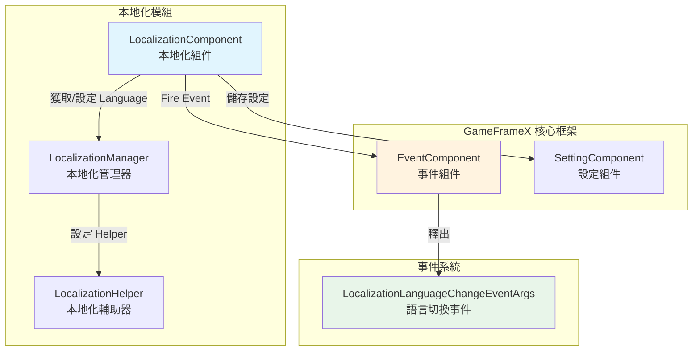
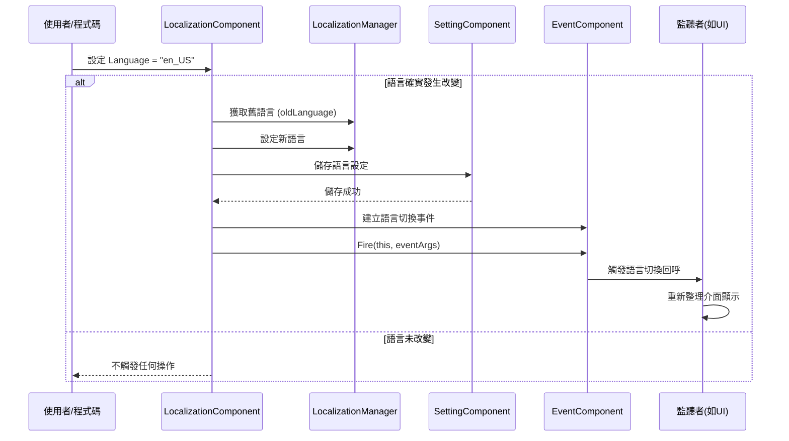

# 語言切換與事件

語言切換與事件是 GameFrameX 本地化系統的核心功能之一，允許開發者在執行時動態切換應用語言，並透過事件機制通知所有監聽者語言已變更，從而實現 UI、文字等內容的自動重新整理。

## 概述

GameFrameX 本地化系統採用了**事件驅動架構**來實現語言切換功能。當應用程式的語言設定發生改變時，系統會：

1. 更新內部語言狀態
2. 將新的語言設定持久化儲存
3. 透過事件系統釋出語言切換事件
4. 監聽者收到事件後執行相應操作（如重新整理 UI 顯示）

這種設計實現了**松耦合**：語言切換的發起者不需要知道誰會響應語言變化，而響應者也不需要關心語言是如何被切換的。

> **設計意圖**：使用事件機制處理語言切換，可以讓多個系統（如 UI 系統、音效系統、日期格式系統）獨立響應語言變化，而無需在語言切換程式碼中直接依賴這些系統。這符合**觀察者模式**的設計理念，提高了系統的可擴充套件性和可維護性。

## 架構設計

### 組件關係圖



### 語言切換流程



## 語言切換詳解

### 設定語言

透過 `LocalizationComponent` 的 `Language` 屬性可以設定當前語言：

```csharp
// 獲取本地化組件
var localizationComponent = GameEntry.GetComponent<LocalizationComponent>();

// 設定語言為英文
localizationComponent.Language = "en_US";

// 設定語言為中文
localizationComponent.Language = "zh_CN";

// 設定語言為日文
localizationComponent.Language = "ja_JP";
```
> Source: [LocalizationComponent.cs](https://github.com/GameFrameX/com.gameframex.unity.localization/blob/main/Runtime/Localization/LocalizationComponent.cs#L116-L143)

**語言切換的內部實現邏輯：**

```csharp
public string Language
{
    get { /* ... */ }
    set
    {
        if (m_LocalizationManager.Language != value)  // 僅當語言確實改變時才處理
        {
            var oldLanguage = m_LocalizationManager.Language;  // 記錄舊語言
            m_LocalizationManager.Language = value;            // 設定新語言
            m_SettingComponent.SetString(...);                 // 持久化儲存
            m_SettingComponent.Save();
            
            // 觸發語言切換事件
            var eventArgs = LocalizationLanguageChangeEventArgs.Create(oldLanguage, value);
            m_EventComponent.Fire(this, eventArgs);
        }
    }
}
```
> Source: [LocalizationComponent.cs](https://github.com/GameFrameX/com.gameframex.unity.localization/blob/main/Runtime/Localization/LocalizationComponent.cs#L131-L142)

### 獲取當前語言

```csharp
var localizationComponent = GameEntry.GetComponent<LocalizationComponent>();

// 獲取當前語言
string currentLanguage = localizationComponent.Language;

// 獲取系統語言
string systemLanguage = localizationComponent.SystemLanguage;

// 獲取預設語言
string defaultLanguage = localizationComponent.DefaultLanguage;
```

### 獲取系統語言

系統語言是指裝置當前的區域語言設定：

```csharp
var localizationComponent = GameEntry.GetComponent<LocalizationComponent>();
string systemLang = localizationComponent.SystemLanguage;
```

## 事件詳解

### 語言切換事件

當語言發生切換時，系統會發布 `LocalizationLanguageChangeEventArgs` 事件。

#### 事件引數結構

```csharp
public sealed class LocalizationLanguageChangeEventArgs : GameEventArgs
{
    /// <summary>
    /// 事件ID
    /// </summary>
    public static readonly string EventId = typeof(LocalizationLanguageChangeEventArgs).FullName;

    /// <summary>
    /// 當前語言
    /// </summary>
    public string Language { get; set; }

    /// <summary>
    /// 舊的語言
    /// </summary>
    public string OldLanguage { get; set; }
}
```
> Source: [LocalizationLanguageChangeEventArgs.cs](https://github.com/GameFrameX/com.gameframex.unity.localization/blob/main/Runtime/EventArgs/LocalizationLanguageChangeEventArgs.cs#L11-L33)

#### 訂閱語言切換事件

```csharp
using GameFrameX.Event.Runtime;
using GameFrameX.Localization.Runtime;

public class MyLanguageListener : MonoBehaviour
{
    private EventComponent _eventComponent;

    private void Start()
    {
        _eventComponent = GameEntry.GetComponent<EventComponent>();
        
        // 訂閱語言切換事件
        _eventComponent.Subscribe(LocalizationLanguageChangeEventArgs.EventId, OnLanguageChanged);
    }

    private void OnLanguageChanged(object sender, GameEventArgs e)
    {
        var args = e as LocalizationLanguageChangeEventArgs;
        Debug.Log($"語言從 {args.OldLanguage} 切換到 {args.Language}");
        
        // 在這裡可以重新整理 UI 顯示、重新載入本地化字串等
        RefreshUI();
    }

    private void OnDestroy()
    {
        // 記得取消訂閱，避免記憶體洩漏
        if (_eventComponent != null)
        {
            _eventComponent.Unsubscribe(LocalizationLanguageChangeEventArgs.EventId, OnLanguageChanged);
        }
    }

    private void RefreshUI()
    {
        // 實現 UI 重新整理邏輯
    }
}
```
> Source: [LocalizationLanguageChangeEventArgs.cs](https://github.com/GameFrameX/com.gameframex.unity.localization/blob/main/Runtime/EventArgs/LocalizationLanguageChangeEventArgs.cs#L52-L58)

### 字典載入事件

除了語言切換事件，系統還提供了字典載入相關的事件（目前程式碼中為註釋狀態，但類已定義）：

| 事件 | 描述 |
|------|------|
| `LoadDictionarySuccessEventArgs` | 字典載入成功事件 |
| `LoadDictionaryFailureEventArgs` | 字典載入失敗事件 |

```csharp
// 字典載入成功事件引數
public sealed class LoadDictionarySuccessEventArgs : GameEventArgs
{
    /// <summary>
    /// 事件ID
    /// </summary>
    public static readonly string EventId = typeof(LoadDictionarySuccessEventArgs).FullName;

    /// <summary>
    /// 字典資源名稱
    /// </summary>
    public string DictionaryAssetName { get; private set; }

    /// <summary>
    /// 載入持續時間
    /// </summary>
    public float Duration { get; private set; }

    /// <summary>
    /// 使用者自定義資料
    /// </summary>
    public object UserData { get; private set; }
}
```
> Source: [LoadDictionarySuccessEventArgs.cs](https://github.com/GameFrameX/com.gameframex.unity.localization/blob/main/Runtime/EventArgs/LoadDictionarySuccessEventArgs.cs#L42-L85)

## 最佳實踐

### 1. 監聽語言切換自動重新整理 UI

建立一個通用的語言切換監聽器，自動重新整理所有需要本地化的 UI 元素：

```csharp
using UnityEngine;
using GameFrameX.Event.Runtime;
using GameFrameX.Localization.Runtime;

public class LanguageChangedListener : MonoBehaviour
{
    private EventComponent _eventComponent;

    private void Awake()
    {
        _eventComponent = GameEntry.GetComponent<EventComponent>();
    }

    private void OnEnable()
    {
        _eventComponent.Subscribe(LocalizationLanguageChangeEventArgs.EventId, OnLanguageChanged);
    }

    private void OnDisable()
    {
        _eventComponent.Unsubscribe(LocalizationLanguageChangeEventArgs.EventId, OnLanguageChanged);
    }

    private void OnLanguageChanged(object sender, GameEventArgs e)
    {
        var args = e as LocalizationLanguageChangeEventArgs;
        Debug.Log($"語言已切換: {args.OldLanguage} → {args.Language}");
        
        // 通知所有需要重新整理的組件
        BroadcastMessage("OnLanguageChanged", SendMessageOptions.DontRequireReceiver);
    }
}
```

### 2. 儲存使用者語言偏好

語言設定會自動儲存到本地，但也可以手動控制儲存時機：

```csharp
var localizationComponent = GameEntry.GetComponent<LocalizationComponent>();

// 獲取使用者上次儲存的語言
string savedLanguage = localizationComponent.Language;

// 修改語言後會自動儲存，但如果需要立即儲存可以呼叫：
// (Set 屬性中已經包含了自動儲存邏輯)

// 設定預設語言（僅在首次啟動時使用）
string defaultLang = localizationComponent.DefaultLanguage;
```

### 3. 切換語言時處理資源

在語言切換時，可能需要重新載入某些語言相關的資源：

```csharp
private void OnLanguageChanged(object sender, GameEventArgs e)
{
    var args = e as LocalizationLanguageChangeEventArgs;
    
    // 清除舊的字典快取
    var localizationComponent = GameEntry.GetComponent<LocalizationComponent>();
    localizationComponent.RemoveAllRawStrings();
    
    // 重新載入新語言的字典
    // LoadNewLanguageDictionary(args.Language);
    
    // 重新整理介面
    RefreshAllLocalizedContent();
}
```

## 常見問題

### Q: 語言切換後 UI 沒有自動更新？

**A**: 需要訂閱語言切換事件並實現 UI 重新整理邏輯。GameFrameX 不會自動重新整理 UI，需要開發者監聽事件後手動重新整理。

### Q: 如何獲取系統當前語言？

```csharp
var localizationComponent = GameEntry.GetComponent<LocalizationComponent>();
string systemLang = localizationComponent.SystemLanguage;
```

### Q: 語言切換事件在哪裡觸發？

**A**: 語言切換事件在 `LocalizationComponent.Language` 屬性的 setter 中觸發。當且僅當設定的值與當前語言不同時，才會觸發事件。

### Q: 如何防止重複觸發語言切換事件？

**A**: `LocalizationComponent` 內部已經做了判斷，只有當新語言與當前語言不同時才會觸發事件：

```csharp
if (m_LocalizationManager.Language != value)
{
    // 只有值不同時才執行
}
```

## 相關連結

- [獲取本地化字串](./4-core-features.get-string) - 瞭解如何獲取本地化文字
- [字典管理](./4-core-features.dictionary-management) - 瞭解字典的載入和管理
- [API 參考](./5-api-reference) - 完整的 API 文件
- [配置](./6-configuration) - 本地化系統配置說明
- [最佳實踐](./7-best-practices) - 更多使用技巧
