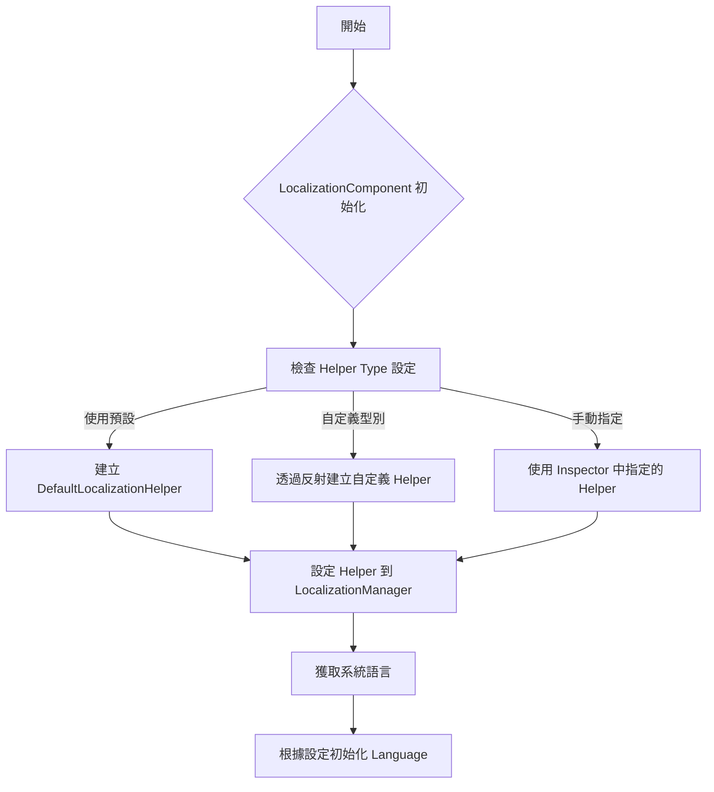
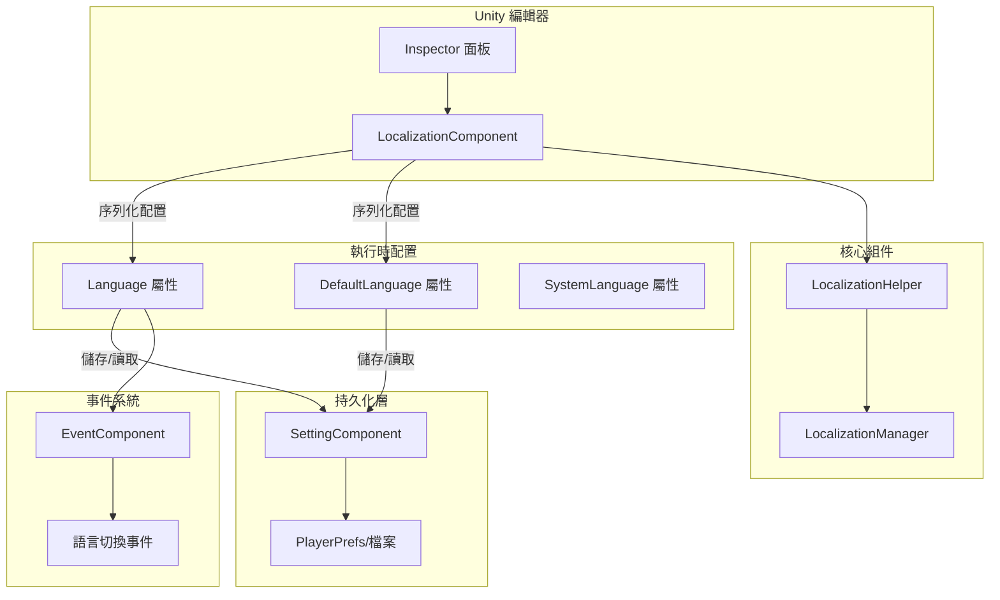

# 配置

本文件詳細介紹 GameFrameX Localization 組件的各項配置選項，包括編輯器配置和執行時配置。

## 概述

GameFrameX Localization 組件提供靈活的本地化配置機制，支援透過 Unity 編輯器介面配置和程式碼執行時配置兩種方式。配置系統採用分層設計，允許開發者自定義本地化輔助器、設定預設語言、啟用編輯器測試模式等功能。

LocalizationComponent 是 Unity 引擎的核心組件，繼承自 GameFrameworkComponent，透過序列化欄位提供配置選項。這些配置在組件初始化時生效，控制本地化系統的行為。

> 原始碼檔案：
> - [LocalizationComponent.cs](https://github.com/GameFrameX/com.gameframex.unity.localization/blob/main/Runtime/Localization/LocalizationComponent.cs#L48-L777)
> - [LocalizationManager.cs](https://github.com/GameFrameX/com.gameframex.unity.localization/blob/main/Runtime/Localization/Localization/LocalizationManager.cs#L43-L937)

## 編輯器配置

### 新增本地化組件

在 Unity 編輯器中，透過以下步驟新增本地化組件：

1. 在場景中建立空 GameObject 或選擇現有物件
2. 點選選單 **GameObject → GameFrameX → Localization**
3. 或在 Inspector 面板中點選 **Add Component**，搜尋 "Localization"

組件新增後，Inspector 面板將顯示配置選項。

### 配置選項說明

```csharp
// LocalizationComponent 核心配置欄位
[SerializeField] private string m_EditorLanguage = "zh_CN";           // 編輯器語言
[SerializeField] private string m_DefaultLanguage = "zh_CN";         // 預設語言
[SerializeField] private bool m_IsEnableEditorMode = false;          // 啟用編輯器模式
[SerializeField] private string m_LocalizationHelperTypeName;        // 輔助器型別名稱
[SerializeField] private LocalizationHelperBase m_CustomLocalizationHelper; // 自定義輔助器例項
```

> Source: [LocalizationComponentInspector.cs](https://github.com/GameFrameX/com.gameframex.unity.localization/blob/main/Editor/Inspector/LocalizationComponentInspector.cs#L42-L46)

下表詳細說明各配置項：

| 配置項 | 型別 | 預設值 | 說明 |
|--------|------|--------|------|
| **Default Language** | string | "zh_CN" | 預設語言程式碼，當載入本地化失敗時使用此語言 |
| **Is Enable Editor Mode** | bool | false | 是否啟用編輯器模式，啟用後使用編輯器語言而非執行時語言 |
| **Editor Language** | string | "zh_CN" | 編輯器模式下使用的語言，僅在編輯器中有效 |
| **Localization Helper** | HelperInfo | DefaultLocalizationHelper | 本地化輔助器型別，可自定義實現 |

### 語言程式碼參考

語言程式碼遵循 RFC 5646 標準，格式為 `[語言程式碼]_[國家/地區程式碼]`，例如：
- `zh_CN` - 簡體中文（中國）
- `zh_TW` - 繁體中文（臺灣）
- `en_US` - 英語（美國）
- `ja_JP` - 日語（日本）
- `ko_KR` - 韓語（韓國）

系統預定義了豐富的語言程式碼常量，可透過 `LocalizationCode` 類直接引用：

```csharp
// 使用預定義的語言程式碼常量
LocalizationComponent component = gameObject.GetComponent<LocalizationComponent>();
component.DefaultLanguage = LocalizationCode.Chinese;        // zh_CN
component.DefaultLanguage = LocalizationCode.English;         // en_US
component.DefaultLanguage = LocalizationCode.Japanese;        // ja_JP
```

> Source: [LocalizationCode.cs](https://github.com/GameFrameX/com.gameframex.unity.localization/blob/main/Runtime/Localization/LocalizationCode.cs#L45-L986)

## 執行時配置

### 透過程式碼配置語言

在遊戲執行時，可以透過程式碼動態配置語言設定：

```csharp
using GameFrameX.Localization.Runtime;

// 獲取本地化組件
var localizationComponent = GameEntry.GetComponent<LocalizationComponent>();

// 設定當前語言
localizationComponent.Language = "en_US";

// 設定預設語言（當載入失敗時使用）
localizationComponent.DefaultLanguage = "zh_CN";

// 獲取當前語言
string currentLanguage = localizationComponent.Language;

// 獲取系統語言
string systemLanguage = localizationComponent.SystemLanguage;
```

> Source: [LocalizationComponent.cs](https://github.com/GameFrameX/com.gameframex.unity.localization/blob/main/Runtime/Localization/LocalizationComponent.cs#L116-L143)

### 配置持久化機制

Language 和 DefaultLanguage 設定會自動持久化到本地設定系統中。首次執行時，系統語言將作為預設語言：

```csharp
// 初始化流程虛擬碼
if (Language == UnknownLocalization)
{
    Language = SystemLanguage;  // 使用系統語言
}
DefaultLanguage = m_DefaultLanguage != UnknownLocalization ? m_DefaultLanguage : SystemLanguage;
```

> Source: [LocalizationComponent.cs](https://github.com/GameFrameX/com.gameframex.unity.localization/blob/main/Runtime/Localization/LocalizationComponent.cs#L232-L237)

### 配置屬性詳解

#### Language 屬性

獲取或設定當前本地化語言。設定新語言時會觸發語言切換事件：

```csharp
public string Language
{
    get
    {
        if (m_LocalizationManager.Language == UnknownLocalization)
        {
            var value = m_SettingComponent.GetString(nameof(LocalizationComponent) + "." + nameof(Language));
            if (value.IsNotNullOrWhiteSpace())
            {
                m_LocalizationManager.Language = value;
            }
        }
        return m_LocalizationManager.Language;
    }
    set
    {
        if (m_LocalizationManager.Language != value)
        {
            var oldLanguage = m_LocalizationManager.Language;
            m_LocalizationManager.Language = value;
            m_SettingComponent.SetString(nameof(LocalizationComponent) + "." + nameof(Language), value);
            m_SettingComponent.Save();
            var localizationLanguageChangeEventArgs = LocalizationLanguageChangeEventArgs.Create(oldLanguage, value);
            m_EventComponent.Fire(this, localizationLanguageChangeEventArgs);
        }
    }
}
```

**設計意圖**：Language 屬性採用延遲載入機制，從持久化儲存中讀取上次儲存的語言設定。設定新值時自動儲存，確保語言偏好跨會話保持。同時觸發事件通知其他系統語言已更改。

#### DefaultLanguage 屬性

獲取或設定預設本地化語言，當載入本地化失敗時使用：

```csharp
public string DefaultLanguage
{
    get
    {
        if (m_LocalizationManager.DefaultLanguage == UnknownLocalization)
        {
            var value = m_SettingComponent.GetString(nameof(LocalizationComponent) + "." + nameof(DefaultLanguage));
            if (value.IsNotNullOrWhiteSpace())
            {
                m_LocalizationManager.DefaultLanguage = value;
            }
        }
        return m_LocalizationManager.DefaultLanguage;
    }
    set
    {
        if (m_LocalizationManager.DefaultLanguage != value)
        {
            m_LocalizationManager.DefaultLanguage = value;
            m_SettingComponent.SetString(nameof(LocalizationComponent) + "." + nameof(DefaultLanguage), value);
            m_SettingComponent.Save();
        }
    }
}
```

**設計意圖**：DefaultLanguage 作為回退機制，確保在目標語言資源缺失時仍能顯示內容，提升使用者體驗。

#### SystemLanguage 屬性

獲取裝置系統語言：

```csharp
public string SystemLanguage
{
    get { return m_LocalizationManager.SystemLanguage; }
}
```

系統語言由 LocalizationHelper 提供，DefaultLocalizationHelper 透過 CultureInfo 獲取：

```csharp
public override string SystemLanguage
{
    get { return _regionName; }  // 如 "zh_CN", "en_US"
}
```

> Source: [DefaultLocalizationHelper.cs](https://github.com/GameFrameX/com.gameframex.unity.localization/blob/main/Runtime/Localization/DefaultLocalizationHelper.cs#L43-L57)

## 自定義本地化輔助器

### 為什麼需要自定義輔助器

預設的 LocalizationHelper 透過 `CultureInfo.CurrentCulture.Name` 獲取系統語言。在某些場景下，你可能需要自定義邏輯來確定系統語言，例如：
- 從伺服器獲取語言設定
- 根據玩家賬戶設定確定語言
- 使用配置檔案中的語言設定

### 建立自定義輔助器

1. 繼承 LocalizationHelperBase：

```csharp
using GameFrameX.Localization.Runtime;
using UnityEngine;

public class CustomLocalizationHelper : LocalizationHelperBase
{
    // 自定義系統語言獲取邏輯
    public override string SystemLanguage
    {
        get
        {
            // 從伺服器或配置獲取語言
            return PlayerPrefs.GetString("Language", "zh_CN");
        }
    }
}
```

> Source: [LocalizationHelperBase.cs](https://github.com/GameFrameX/com.gameframex.unity.localization/blob/main/Runtime/Localization/LocalizationHelperBase.cs#L41-L48)

2. 在編輯器中配置自定義輔助器：

在 LocalizationComponent 的 Inspector 面板中，設定 Helper Type 為自定義類，或直接將自定義輔助器組件拖入 Custom Localization Helper 欄位。

### 輔助器配置流程



> Source: [LocalizationComponent.cs](https://github.com/GameFrameX/com.gameframex.unity.localization/blob/main/Runtime/Localization/LocalizationComponent.cs#L214-L237)

## 配置架構圖



## 配置選項彙總表

### LocalizationComponent 配置

| 屬性 | 型別 | 預設值 | 執行時可寫 | 說明 |
|------|------|--------|------------|------|
| `EditorLanguage` | string | "zh_CN" | 否（僅編輯器） | 編輯器測試用語言 |
| `DefaultLanguage` | string | "zh_CN" | 是 | 載入失敗時的回退語言 |
| `IsEnableEditorMode` | bool | false | 否 | 是否在編輯器中使用 EditorLanguage |
| `Language` | string | 系統語言 | 是 | 當前使用的語言 |
| `SystemLanguage` | string | 裝置語言 | 只讀 | 作業系統語言 |

### LocalizationManager 核心屬性

| 屬性 | 型別 | 說明 |
|------|------|------|
| `DefaultLanguage` | string | 預設語言 |
| `Language` | string | 當前語言 |
| `SystemLanguage` | string | 系統語言 |
| `DictionaryCount` | int | 當前字典數量 |

### 預定義語言程式碼（常用）

| 常量 | 值 | 說明 |
|------|-----|------|
| `LocalizationCode.Chinese` | "zh_CN" | 簡體中文 |
| `LocalizationCode.ChineseTraditionalTW` | "zh_TW" | 繁體中文（臺灣） |
| `LocalizationCode.Japanese` | "ja_JP" | 日語 |
| `LocalizationCode.Korean` | "ko_KR` | 韓語 |
| `LocalizationCode.English` | "en_US" | 英語（美國） |
| `LocalizationCode.EnglishUK` | "en_GB" | 英語（英國） |
| `LocalizationCode.French` | "fr_FR" | 法語 |
| `LocalizationCode.German` | "de_DE" | 德語 |
| `LocalizationCode.Spanish` | "es_ES" | 西班牙語 |
| `LocalizationCode.Russian` | "ru_RU` | 俄語 |

> Source: [LocalizationCode.cs](https://github.com/GameFrameX/com.gameframex.unity.localization/blob/main/Runtime/Localization/LocalizationCode.cs#L46-L148)

## 最佳實踐

### 1. 遊戲啟動時設定語言

建議在遊戲啟動流程中儘早設定語言，確保所有 UI 文字使用正確的語言：

```csharp
// 在遊戲初始化階段設定語言
var localizationComponent = GameEntry.GetComponent<LocalizationComponent>();

// 方式一：使用儲存的語言設定
string savedLanguage = PlayerPrefs.GetString("GameLanguage");
if (!string.IsNullOrEmpty(savedLanguage))
{
    localizationComponent.Language = savedLanguage;
}
else
{
    // 方式二：使用系統語言作為預設
    localizationComponent.Language = localizationComponent.SystemLanguage;
}
```

### 2. 語言切換監聽

監聽語言切換事件以更新 UI：

```csharp
// 訂閱語言切換事件
EventComponent eventComponent = GameEntry.GetComponent<EventComponent>();
eventComponent.Subscribe(LocalizationLanguageChangeEventArgs.EventId, OnLanguageChanged);

private void OnLanguageChanged(object sender, GameEventArgs e)
{
    var args = (LocalizationLanguageChangeEventArgs)e;
    Debug.Log($"語言從 {args.OldLanguage} 切換到 {args.Language}");
    
    // 重新整理所有需要本地化的 UI 組件
    // RefreshAllLocalizedUI();
}
```

> Source: [LocalizationLanguageChangeEventArgs.cs](https://github.com/GameFrameX/com.gameframex.unity.localization/blob/main/Runtime/EventArgs/LocalizationLanguageChangeEventArgs.cs#L52-L58)

### 3. 配置檢查清單

部署遊戲前檢查以下配置：

- [ ] DefaultLanguage 設定為專案主要語言
- [ ] 所有支援的語言都有對應的字典資源
- [ ] 自定義 LocalizationHelper 已正確實現
- [ ] 語言切換事件已正確處理
- [ ] 測試了系統語言不在支援列表時的回退行為

## 相關連結

- [獲取本地化字串](../4-core-features.get-string) - 瞭解如何獲取本地化文字
- [字典管理](../4-core-features.dictionary-management) - 瞭解字典資料管理
- [語言切換與事件](../4-core-features.language-switching) - 瞭解語言切換機制
- [API 參考](../5-api-reference) - 完整的 API 文件
- [快速開始](../3-getting-started) - 快速上手指南
