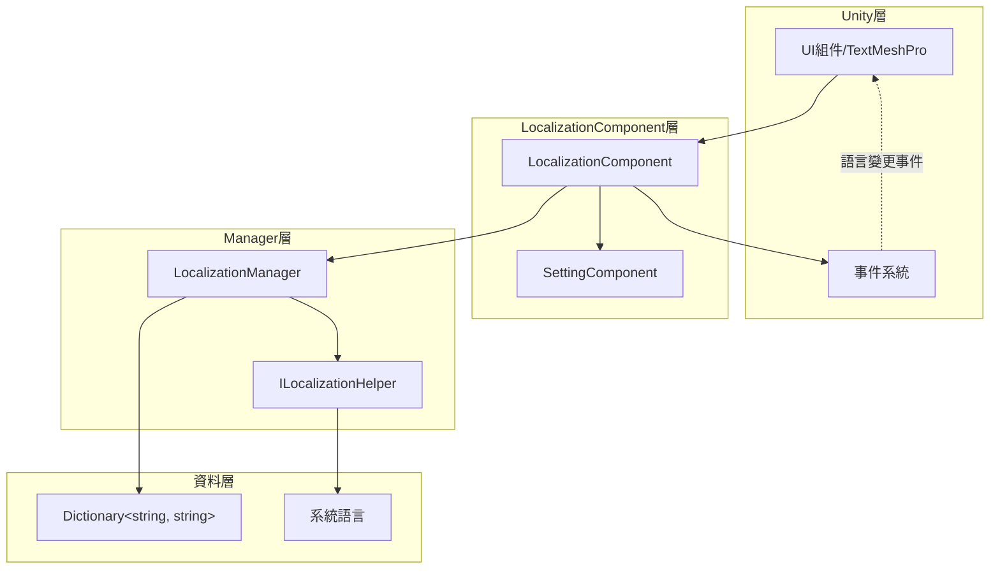

# 最佳實踐

本文件提供 GameFrameX Localization 組件的最佳實踐指南，幫助開發者高效、規範地實現多語言功能。

## 概述

GameFrameX Localization 組件為 Unity 遊戲提供了完整的本地化解決方案。遵循本文件的最佳實踐，可以幫助你構建可維護、可擴充套件的多語言系統，避免常見的陷阱和反模式。

## 核心架構回顧



### 組件職責

| 組件 | 職責 |
|------|------|
| LocalizationComponent | Unity 組件層，負責初始化和事件觸發 |
| LocalizationManager | 核心管理器，處理字典儲存和字串檢索 |
| ILocalizationHelper | 系統語言檢測介面，可自定義實現 |
| SettingComponent | 持久化語言設定 |

## 最佳實踐

### 1. 鍵名命名規範

採用層級化的鍵名命名策略，便於管理和查詢。

**推薦格式：**

```csharp
// 格式：功能模組_介面元素_具體描述
"main_menu_start_button"           // 主選單-開始按鈕
"main_menu_settings_button"        // 主選單-設定按鈕
"game_hud_score_label"             // 遊戲HUD-分數標籤
"game_dialog_confirm_message"      // 遊戲彈窗-確認訊息
"settings_audio_master_volume"     // 設定-音訊-主音量
```

**不推薦：**

```csharp
// ❌ 無規律命名
"start"                            // 含義不明確
"button1"                          // 無上下文
"msg_001"                          // 難以維護
```

**使用常量類管理鍵名：**

```csharp
// 建議建立專門的常量類管理鍵名
public static class LocalizationKeys
{
    public const string MainMenuStart = "main_menu_start_button";
    public const string MainMenuSettings = "main_menu_settings_button";
    public const string GameHudScore = "game_hud_score_label";
}
```

> Source: [LocalizationManager.cs](https://github.com/GameFrameX/com.gameframex.unity.localization/blob/main/Runtime/Localization/Localization/LocalizationManager.cs#L168-L177)

### 2. 預設語言設定

始終設定合理的預設語言，並利用 `DefaultLanguage` 屬性作為回退機制。

**基礎設定：**

```csharp
var localizationComponent = GameEntry.GetComponent<LocalizationComponent>();
// 設定預設語言為簡體中文
localizationComponent.DefaultLanguage = LocalizationCode.ChineseSimplified;
```

> Source: [LocalizationComponent.cs](parameterName=86-L110)

**多層回退策略：**

```csharp
// 設計回退鏈：使用者設定 -> 系統語言 -> 預設語言
// 1. 首先嚐試使用使用者儲存的語言設定
// 2. 如果未設定，使用系統語言
// 3. 如果系統語言不支援，回退到預設語言
if (string.IsNullOrEmpty(savedLanguage))
{
    localizationComponent.Language = localizationComponent.SystemLanguage;
}
```

### 3. 引數化字串處理

利用泛型方法處理動態內容，支援最多 16 個引數。

**單引數使用：**

```csharp
// 簡單引數替換
string welcome = localizationComponent.GetString("game_welcome_message", playerName);
// 模板："歡迎回來，{0}！" -> "歡迎回來，張三！"
```

> Source: [LocalizationManager.cs](parameterName=205-L221)

**多引數使用：**

```csharp
// 複雜格式化
string levelInfo = localizationComponent.GetString("game_level_info", 
    currentLevel,      // T1
    maxLevel,          // T2
    playerScore);      // T3
// 模板："第 {0} 關 / 共 {1} 關 - 分數：{2}"
```

> Source: [LocalizationManager.cs](parameterName=263-L279)

**使用 params 陣列：**

```csharp
// 動態數量的引數
object[] args = { itemName, itemCount, playerGold };
string message = localizationComponent.GetString("shop_purchase_info", args);
```

> Source: [LocalizationManager.cs](parameterName=186-L195)

### 4. 語言變更事件處理

監聽語言變更事件，實現 UI 的自動重新整理。

**事件訂閱：**

```csharp
private void OnLanguageChanged(object sender, LocalizationLanguageChangeEventArgs e)
{
    // 重新整理所有本地化文字
    RefreshAllLocalizedTexts();
    
    // 或者重新載入當前場景
    // SceneManager.LoadScene(SceneManager.GetActiveScene().name);
}

private void Start()
{
    var eventComponent = GameEntry.GetComponent<EventComponent>();
    eventComponent.Subscribe(LocalizationLanguageChangeEventArgs.EventId, OnLanguageChanged);
}
```

> Source: [LocalizationLanguageChangeEventArgs.cs](https://github.com/GameFrameX/com.gameframex.unity.localization/blob/main/Runtime/EventArgs/LocalizationLanguageChangeEventArgs.cs#L52-L58)

**事件觸發機制：**

```csharp
// 在 LocalizationComponent 中設定語言時會自動觸發事件
localizationComponent.Language = LocalizationCode.English; 
// 觸發 LocalizationLanguageChangeEventArgs 事件
```

> Source: [LocalizationComponent.cs](parameterName=131-L143)

### 5. 字典管理策略

**按功能模組組織字典：**

```csharp
// UI 字典
AddRawString("ui_main_menu_title", "主選單");
AddRawString("ui_main_menu_start", "開始遊戲");
AddRawString("ui_main_menu_settings", "設定");

// 遊戲內字典
AddRawString("game_hud_health", "生命值");
AddRawString("game_hud_energy", "能量值");
AddRawString("game_level_complete", "關卡完成！");

// 提示資訊字典
AddRawString("tips_welcome", "歡迎來到遊戲世界");
AddRawString("tips_first_step", "使用方向鍵移動角色");
```

**動態新增字典：**

```csharp
// 在遊戲啟動時載入語言包
public void LoadLanguagePack(string languageCode)
{
    // 從資源系統載入語言包資料
    var languageData = Resources.Load<TextAsset>($"Languages/{languageCode}");
    var lines = languageData.text.Split('\n');
    
    foreach (var line in lines)
    {
        var parts = line.Split('=');
        if (parts.Length == 2)
        {
            localizationComponent.AddRawString(parts[0].Trim(), parts[1].Trim());
        }
    }
}
```

> Source: [LocalizationManager.cs](parameterName=899-L913)

### 6. 效能最佳化

**避免在 Update 中頻繁呼叫 GetString：**

```csharp
// ❌ 反模式：每幀呼叫
void Update()
{
    text.text = localizationComponent.GetString("game_timer", currentTime);
}

// ✅ 正確模式：快取字串，只在值變化時更新
private string _cachedTimeKey = "game_timer";
private float _lastUpdateTime;

void Update()
{
    if (Mathf.Abs(currentTime - _lastUpdateTime) > 0.1f)
    {
        text.text = localizationComponent.GetString(_cachedTimeKey, currentTime);
        _lastUpdateTime = currentTime;
    }
}
```

**使用 HasRawString 進行存在性檢查：**

```csharp
// 檢查鍵是否存在，避免返回錯誤標記
if (localizationComponent.HasRawString(key))
{
    var value = localizationComponent.GetString(key);
}
```

> Source: [LocalizationManager.cs](parameterName=862-L870)

### 7. 自定義語言檢測助手

當預設的系統語言檢測不滿足需求時，可以擴充套件 `ILocalizationHelper`。

**實現自定義助手：**

```csharp
public class CustomLocalizationHelper : LocalizationHelperBase
{
    public override string SystemLanguage
    {
        get 
        {
            // 自定義語言檢測邏輯
            // 例如：從玩家配置中讀取語言設定
            var config = PlayerPrefs.GetString("language_preference");
            return string.IsNullOrEmpty(config) 
                ? base.SystemLanguage 
                : config;
        }
    }
}
```

> Source: [DefaultLocalizationHelper.cs](https://github.com/GameFrameX/com.gameframex.unity.localization/blob/main/Runtime/Localization/DefaultLocalizationHelper.cs#L41-L58)

### 8. 使用標準語言程式碼

使用 `LocalizationCode` 類中的常量確保語言程式碼的一致性。

```csharp
// ✅ 推薦：使用預定義常量
localizationComponent.Language = LocalizationCode.ChineseSimplified;  // "zh_CN"
localizationComponent.Language = LocalizationCode.English;             // "en_US"
localizationComponent.Language = LocalizationCode.Japanese;           // "ja_JP"

// ❌ 不推薦：手動輸入字串
localizationComponent.Language = "zh-CN";  // 格式不一致
```

> Source: [LocalizationCode.cs](https://github.com/GameFrameX/com.gameframex.unity.localization/blob/main/Runtime/Localization/LocalizationCode.cs#L1-L986)

### 9. 錯誤處理與回退

**處理缺失的鍵：**

```csharp
// GetString 方法會自動處理缺失的鍵
// 返回格式：<NoKey>key_name
string result = localizationComponent.GetString("nonexistent_key");
// 返回：<NoKey>nonexistent_key>
```

> Source: [LocalizationManager.cs](parameterName=170-L177)

**新增自定義回退邏輯：**

```csharp
public string GetStringSafe(string key, string fallback = "")
{
    if (localizationComponent.HasRawString(key))
    {
        return localizationComponent.GetString(key);
    }
    
    Log.Warning($"Localization key not found: {key}");
    return fallback;
}
```

### 10. 編輯器模式支援

利用編輯器模式加速開發和測試。

```csharp
// 在 LocalizationComponent 中啟用編輯器模式
// m_IsEnableEditorMode = true;
// m_EditorLanguage = "zh_CN";

// 在編輯器中可以快速切換語言預覽效果
// 不影響執行時行為
```

> Source: [LocalizationComponent.cs](parameterName=227-L236)

## 常見場景實踐

### 場景一：遊戲內語言切換

```csharp
public class LanguageSwitcher : MonoBehaviour
{
    public void SwitchToChinese()
    {
        var loc = GameEntry.GetComponent<LocalizationComponent>();
        loc.Language = LocalizationCode.ChineseSimplified;
    }

    public void SwitchToEnglish()
    {
        var loc = GameEntry.GetComponent<LocalizationComponent>();
        loc.Language = LocalizationCode.English;
    }
}
```

### 場景二：本地化文字組件

```csharp
public class LocalizedText : MonoBehaviour
{
    [SerializeField] private string _localizationKey;
    private TextMeshProUGUI _text;

    private void Start()
    {
        _text = GetComponent<TextMeshProUGUI>();
        RefreshText();
        
        // 訂閱語言變更事件
        GameEntry.GetComponent<EventComponent>()
            .Subscribe(LocalizationLanguageChangeEventArgs.EventId, OnLanguageChanged);
    }

    private void RefreshText()
    {
        var loc = GameEntry.GetComponent<LocalizationComponent>();
        _text.text = loc.GetString(_localizationKey);
    }

    private void OnLanguageChanged(object sender, GameEventArgs e)
    {
        RefreshText();
    }
}
```

### 場景三：動態格式化文字

```csharp
// 物品資訊格式化
string itemDescription = localizationComponent.GetString(
    "game_item_description",
    itemName,      // 物品名稱
    itemRarity,    // 稀有度
    itemLevel,     // 物品等級
    itemDamage     // 攻擊力
);
// 模板："【{0}】\n稀有度：{1}\n等級：{2}\n攻擊力：{3}"
```

## 總結

遵循以上最佳實踐，可以幫助你構建高質量的多語言系統：

1. **鍵名規範化** - 使用層級化命名，便於維護和查詢
2. **預設語言策略** - 設定合理的回退機制
3. **事件驅動更新** - 利用語言變更事件重新整理 UI
4. **效能關注** - 避免不必要的重複呼叫
5. **擴充套件性設計** - 利用介面系統自定義行為
6. **標準化程式碼** - 使用 `LocalizationCode` 常量類

---

## 相關連結

- [核心功能 - 獲取本地化字串](./4-core-features.get-string)
- [核心功能 - 字典管理](./4-core-features.dictionary-management)
- [核心功能 - 語言切換與事件](./4-core-features.language-switching)
- [API 參考](./5-api-reference)
- [配置](./6-configuration)
