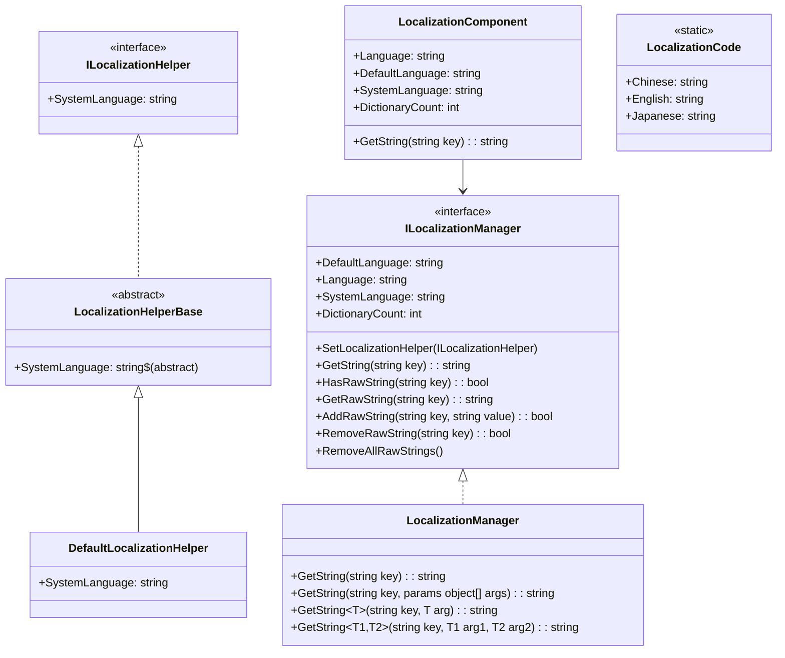
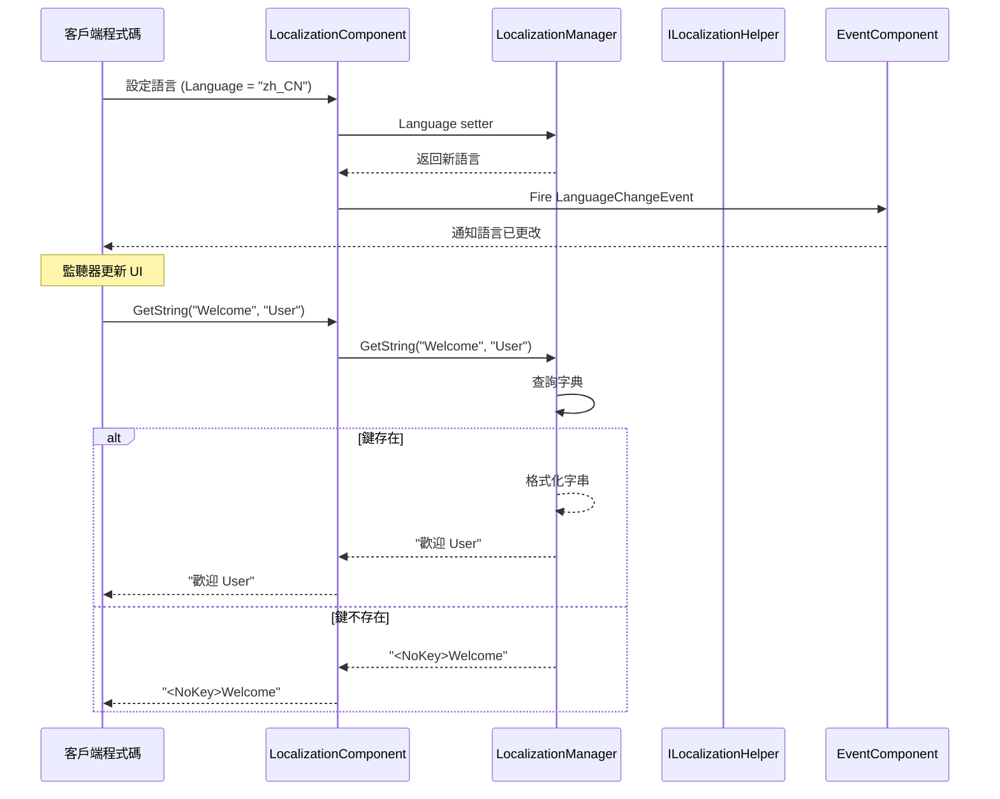

# API 參考

本文件詳細介紹 GameFrameX Localization 模組提供的所有公共 API 介面、類和方法。

## 概述

GameFrameX Localization 模組提供了一套完整的本地化解決方案，包括：
- 多語言字串管理
- 執行時語言切換
- 引數化字串格式化
- 系統語言自動檢測
- 事件驅動架構

## 核心架構



## ILocalizationManager 介面

`ILocalizationManager` 是本地化系統的核心介面，定義了管理本地化字串的所有必需操作。

> Source: [ILocalizationManager.cs](https://github.com/GameFrameX/com.gameframex.unity.localization/blob/main/Runtime/Localization/Localization/ILocalizationManager.cs#L34-L529)

### 屬性

| 屬性 | 型別 | 描述 |
|------|------|------|
| `DefaultLanguage` | `string` | 獲取或設定預設本地化語言。當載入本地化失敗時使用此語言。 |
| `Language` | `string` | 獲取或設定當前本地化語言。 |
| `SystemLanguage` | `string` | 獲取系統語言。 |
| `DictionaryCount` | `int` | 獲取當前載入的字典數量。 |

### 方法

#### `SetLocalizationHelper`

```csharp
void SetLocalizationHelper(ILocalizationHelper localizationHelper)
```

設定本地化輔助器，用於獲取系統語言資訊。

**引數：**
- `localizationHelper` (ILocalizationHelper): 本地化輔助器例項。

> Source: [ILocalizationManager.cs](https://github.com/GameFrameX/com.gameframex.unity.localization/blob/main/Runtime/Localization/Localization/ILocalizationManager.cs#L71)

---

#### `GetString(string key): string`

根據字典主鍵獲取字典內容字串。

```csharp
string GetString(string key)
```

**引數：**
- `key` (string): 字典主鍵。

**返回：** 字典內容字串，如果鍵不存在返回 `<NoKey>{key}` 格式的錯誤資訊。

> Source: [LocalizationManager.cs](https://github.com/GameFrameX/com.gameframex.unity.localization/blob/main/Runtime/Localization/Localization/LocalizationManager.cs#L168-L177)

---

#### `GetString(string key, params object[] args): string`

根據字典主鍵獲取字典內容字串，並使用引數列表格式化。

```csharp
string GetString(string key, params object[] args)
```

**引數：**
- `key` (string): 字典主鍵。
- `args` (params object[]): 格式化引數列表。

**返回：** 格式化後的字典內容字串。

> Source: [LocalizationManager.cs](https://github.com/GameFrameX/com.gameframex.unity.localization/blob/main/Runtime/Localization/Localization/LocalizationManager.cs#L186-L195)

---

#### 泛型 GetString 方法

系統提供了 17 個泛型過載方法，支援 0 到 16 個型別安全引數：

| 方法簽名 | 描述 |
|----------|------|
| `GetString<T>(string key, T arg)` | 單引數格式化 |
| `GetString<T1, T2>(string key, T1 arg1, T2 arg2)` | 雙引數格式化 |
| `GetString<T1, T2, T3>(string key, T1 arg1, T2 arg2, T3 arg3)` | 三引數格式化 |
| ... | ... |
| `GetString<T1, ..., T16>(string key, T1 arg1, ..., T16 arg16)` | 十六引數格式化 |

```csharp
// 示例：使用泛型 GetString 進行型別安全的格式化
string message = localizationManager.GetString("Welcome", "John", 25);
// 字典內容："歡迎 {0}，您今年 {1} 歲了"
// 結果："歡迎 John，您今年 25 歲了"
```

> Source: [LocalizationManager.cs](https://github.com/GameFrameX/com.gameframex.unity.localization/blob/main/Runtime/Localization/Localization/LocalizationManager.cs#L205-L855)

---

#### `HasRawString(string key): bool`

檢查指定鍵的字典是否存在。

```csharp
bool HasRawString(string key)
```

**引數：**
- `key` (string): 字典主鍵。

**返回：** 是否存在該字典。

> Source: [LocalizationManager.cs](https://github.com/GameFrameX/com.gameframex.unity.localization/blob/main/Runtime/Localization/Localization/LocalizationManager.cs#L862-L870)

---

#### `GetRawString(string key): string`

獲取字典原始值（不經過格式化處理）。

```csharp
string GetRawString(string key)
```

**引數：**
- `key` (string): 字典主鍵。

**返回：** 字典原始值，如果鍵不存在返回空字串。

> Source: [LocalizationManager.cs](https://github.com/GameFrameX/com.gameframex.unity.localization/blob/main/Runtime/Localization/Localization/LocalizationManager.cs#L878-L891)

---

#### `AddRawString(string key, string value): bool`

新增新的字典條目。

```csharp
bool AddRawString(string key, string value)
```

**引數：**
- `key` (string): 字典主鍵。
- `value` (string): 字典內容。

**返回：** 是否新增成功。如果鍵已存在則返回 false。

> Source: [LocalizationManager.cs](https://github.com/GameFrameX/com.gameframex.unity.localization/blob/main/Runtime/Localization/Localization/LocalizationManager.cs#L899-L913)

---

#### `RemoveRawString(string key): bool`

移除指定的字典條目。

```csharp
bool RemoveRawString(string key)
```

**引數：**
- `key` (string): 字典主鍵。

**返回：** 是否移除成功。

> Source: [LocalizationManager.cs](https://github.com/GameFrameX/com.gameframex.unity.localization/blob/main/Runtime/Localization/Localization/LocalizationManager.cs#L920-L928)

---

#### `RemoveAllRawStrings()`

清空所有字典。

```csharp
void RemoveAllRawStrings()
```

> Source: [LocalizationManager.cs](https://github.com/GameFrameX/com.gameframex.unity.localization/blob/main/Runtime/Localization/Localization/LocalizationManager.cs#L933-L936)

---

## ILocalizationHelper 介面

`ILocalizationHelper` 介面用於抽象系統語言檢測邏輯，允許開發者實現自定義的語言檢測方式。

> Source: [ILocalizationHelper.cs](https://github.com/GameFrameX/com.gameframex.unity.localization/blob/main/Runtime/Localization/Localization/ILocalizationHelper.cs#L34-L47)

### 屬性

| 屬性 | 型別 | 描述 |
|------|------|------|
| `SystemLanguage` | `string` | 獲取系統語言。 |

```csharp
public interface ILocalizationHelper
{
    string SystemLanguage { get; }
}
```

---

## LocalizationHelperBase 抽象類

`LocalizationHelperBase` 是本地化輔助器的抽象基類，繼承自 `MonoBehaviour` 並實現 `ILocalizationHelper` 介面。

> Source: [LocalizationHelperBase.cs](https://github.com/GameFrameX/com.gameframex.unity.localization/blob/main/Runtime/Localization/LocalizationHelperBase.cs#L35-L48)

```csharp
public abstract class LocalizationHelperBase : MonoBehaviour, ILocalizationHelper
{
    public abstract string SystemLanguage { get; }
}
```

---

## DefaultLocalizationHelper 類

`DefaultLocalizationHelper` 是預設的本地化輔助器實現，使用 .NET 的 `CultureInfo` 獲取系統區域設定。

> Source: [DefaultLocalizationHelper.cs](https://github.com/GameFrameX/com.gameframex.unity.localization/blob/main/Runtime/Localization/DefaultLocalizationHelper.cs#L36-L58)

```csharp
public class DefaultLocalizationHelper : LocalizationHelperBase
{
    readonly string _regionName = CultureInfo.CurrentCulture.Name.Replace("-", "_");

    public override string SystemLanguage
    {
        get { return _regionName; }
    }
}
```

**設計說明：** 預設實現將系統區域資訊（如 `zh-CN`）轉換為下劃線格式（`zh_CN`），與 `LocalizationCode` 中定義的語言程式碼保持一致。

---

## LocalizationComponent 類

`LocalizationComponent` 是 Unity 組件封裝類，繼承自 `GameFrameworkComponent`，提供與 Unity 生態系統無縫整合的本地化功能。

> Source: [LocalizationComponent.cs](https://github.com/GameFrameX/com.gameframex.unity.localization/blob/main/Runtime/Localization/LocalizationComponent.cs#L38-L777)

### 屬性

| 屬性 | 型別 | 描述 |
|------|------|------|
| `EditorLanguage` | `string` | 編輯器語言（僅在編輯器內有效）。 |
| `DefaultLanguage` | `string` | 預設本地化語言。 |
| `Language` | `string` | 當前本地化語言。設定此屬性會觸發語言切換事件。 |
| `SystemLanguage` | `string` | 獲取系統語言。 |
| `DictionaryCount` | `int` | 獲取字典數量。 |

### 方法

`LocalizationComponent` 提供了與 `ILocalizationManager` 完全相同的方法簽名，包括：

- `GetString(string key)` - 獲取本地化字串
- `GetString(string key, params object[] args)` - 帶引數格式化
- `GetString<T>(string key, T arg)` - 泛型單引數
- `GetString<T1, T2>(string key, T1 arg1, T2 arg2)` - 泛型雙引數
- ...（共 17 個過載，支援最多 16 個引數）
- `HasRawString(string key)` - 檢查鍵是否存在
- `GetRawString(string key)` - 獲取原始值
- `AddRawString(string key, string value)` - 新增字典
- `RemoveRawString(string key)` - 移除字典
- `RemoveAllRawStrings()` - 清空字典

### 使用示例

```csharp
// 獲取 LocalizationComponent 例項
var localization = GameEntry.GetComponent<LocalizationComponent>();

// 簡單字串獲取
string greeting = localization.GetString("Greeting");

// 帶引數的字串格式化
string message = localization.GetString("PlayerInfo", "張三", 100);
// 字典內容："玩家 {0}，等級 {1}"
// 結果："玩家 張三，等級 100"

// 切換語言
localization.Language = "en_US";

// 檢查字典
if (localization.HasRawString("ImportantKey"))
{
    string value = localization.GetRawString("ImportantKey");
}
```

---

## LocalizationCode 靜態類

`LocalizationCode` 提供了標準化的語言程式碼常量，遵循 ISO 639-1 語言程式碼和 ISO 3166-1 國家/地區程式碼標準。

> Source: [LocalizationCode.cs](https://github.com/GameFrameX/com.gameframex.unity.localization/blob/main/Runtime/Localization/LocalizationCode.cs#L35-L985)

### 主要語言程式碼常量

| 常量 | 程式碼 | 描述 |
|------|------|------|
| `Chinese` / `ChineseSimplified` | `zh_CN` | 中文簡體 |
| `ChineseTraditionalTW` | `zh_TW` | 中文繁體（臺灣） |
| `ChineseTraditionalHK` | `zh_HK` | 中文繁體（香港） |
| `Japanese` | `ja_JP` | 日語 |
| `Korean` | `ko_KR` | 韓語 |
| `English` | `en_US` | 英語（美國） |
| `EnglishUK` | `en_GB` | 英語（英國） |
| `French` | `fr_FR` | 法語 |
| `German` | `de_DE` | 德語 |
| `Spanish` | `es_ES` | 西班牙語 |
| `Portuguese` | `pt_PT` | 葡萄牙語 |
| `Russian` | `ru_RU` | 俄語 |
| `Arabic` | `ar_SA` | 阿拉伯語 |
| `Hindi` | `hi_IN` | 印地語 |
| `Thai` | `th_TH` | 泰語 |
| `Vietnamese` | `vi_VN` | 越南語 |
| `Indonesian` | `id_ID` | 印尼語 |

**使用示例：**

```csharp
// 使用常量設定語言
LocalizationComponent localization = GameEntry.GetComponent<LocalizationComponent>();
localization.Language = LocalizationCode.Chinese;      // 設為簡體中文
localization.Language = LocalizationCode.English;       // 設為英語
localization.Language = LocalizationCode.Japanese;      // 設為日語
```

---

## 事件系統

### LocalizationLanguageChangeEventArgs

當語言發生切換時觸發的事件引數。

> Source: [LocalizationLanguageChangeEventArgs.cs](https://github.com/GameFrameX/com.gameframex.unity.localization/blob/main/Runtime/EventArgs/LocalizationLanguageChangeEventArgs.cs#L5-L79)

```csharp
public sealed class LocalizationLanguageChangeEventArgs : GameEventArgs
{
    public static readonly string EventId = typeof(LocalizationLanguageChangeEventArgs).FullName;
    
    /// <summary>
    /// 當前語言
    /// </summary>
    public string Language { get; set; }
    
    /// <summary>
    /// 舊的 language
    /// </summary>
    public string OldLanguage { get; set; }
    
    public static LocalizationLanguageChangeEventArgs Create(string oldLanguage, string language);
    public override void Clear();
    public override string Id { get; }
}
```

### 訂閱語言切換事件

```csharp
void OnLanguageChanged(object sender, LocalizationLanguageChangeEventArgs e)
{
    Debug.Log($"語言從 {e.OldLanguage} 切換到 {e.Language}");
}

// 訂閱事件
var eventComponent = GameEntry.GetComponent<EventComponent>();
eventComponent.Subscribe(LocalizationLanguageChangeEventArgs.EventId, OnLanguageChanged);

// 取消訂閱
eventComponent.Unsubscribe(LocalizationLanguageChangeEventArgs.EventId, OnLanguageChanged);
```

---

## API 使用流程



---

## 錯誤處理

### 錯誤返回值

當發生錯誤時，系統會返回特定格式的錯誤資訊：

| 錯誤型別 | 返回格式 | 示例 |
|----------|----------|------|
| 鍵不存在 | `<NoKey>{key}` | `<NoKey>Welcome` |
| 格式化錯誤 | `<Error>{key},{value},{args},{exception}` | `<Error>PlayerName,玩家{0}...` |

### 異常情況

| 場景 | 行為 |
|------|------|
| 設定 `Language` 為 `zxx`（未知語言） | 丟擲 `GameFrameworkException` |
| 設定 `DefaultLanguage` 為 `zxx` | 丟擲 `GameFrameworkException` |
| 未設定 `ILocalizationHelper` 時訪問 `SystemLanguage` | 丟擲 `GameFrameworkException` |

---

## 相關連結

- [概述](./1-overview)
- [安裝](./2-installation)
- [快速開始](./3-getting-started)
- [核心功能 - 獲取本地化字串](./4-core-features.get-string)
- [核心功能 - 字典管理](./4-core-features.dictionary-management)
- [核心功能 - 語言切換與事件](./4-core-features.language-switching)
- [配置](./6-configuration)
- [最佳實踐](./7-best-practices)
