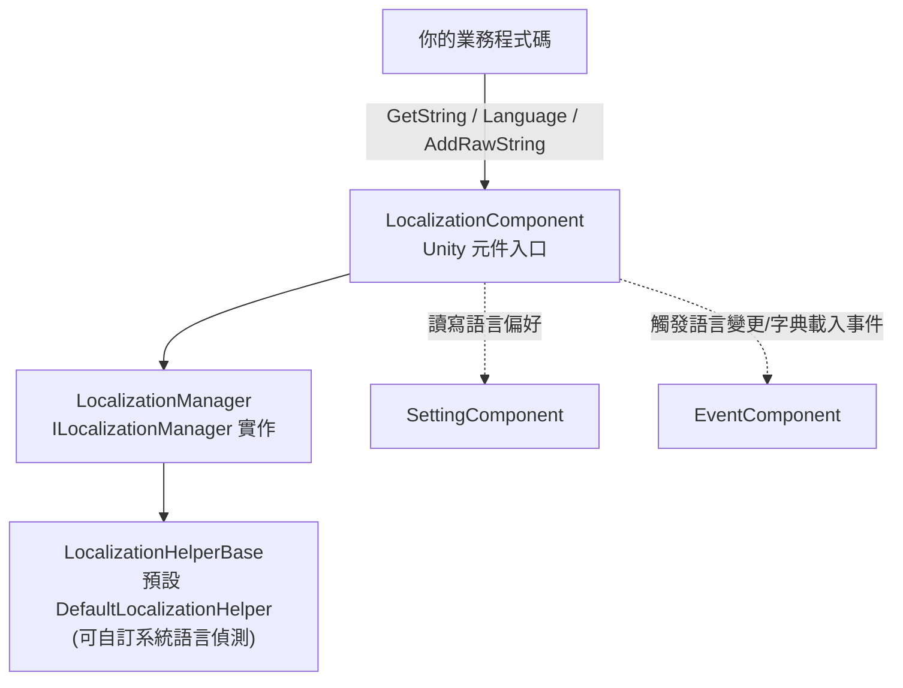

# 在地化套件概覽：能做什麼

Game Frame X Localization(`com.gameframex.unity.localization`)是基於 GameFrameX 框架的 Unity 在地化套件：它用「字典 key → 翻譯文字」的方式管理多語言字串，支援參數化格式化(最多 16 個型別化參數)、執行時切換語言並廣播事件、自動偵測系統語言、以及將語言偏好持久化到 Setting 系統。核心入口是 `LocalizationComponent` 元件，掛上即可用。

它能為你的遊戲提供：

- **基於字典的在 地化** — 執行時新增、查詢、刪除翻譯項目(`AddRawString` / `GetString` / `RemoveRawString`)
- **參數化字串格式化** — 1~16 個型別化參數的泛型 `GetString` 多載，支援 .NET 標準佔位符 `{0}`、`{1}`、`{2:P}` 等
- **執行時語言切換** — 設定 `Language` 屬性即觸發變更事件，UI 可即時重新整理
- **系統語言偵測與回退** — 透過 `CultureInfo` 偵測裝置語言，載入失敗時回退到預設語言
- **語言偏好持久化** — 語言與預設語言會經由 `SettingComponent` 自動儲存
- **編輯器模式** — 在 Play Mode 中以指定語言覆寫系統語言，方便測試
- **180+ 語言代碼常數** — `LocalizationCode` 靜態類別，如 `ChineseSimplified`(`zh_CN`)、`Japanese`(`ja_JP`)
- **可替換 Helper** — 繼承 `LocalizationHelperBase` 即可自訂系統語言偵測

## 快速入門

1. 編輯 Unity 專案的 `Packages/manifest.json`,新增 GameFrameX scoped registry 與相依套件：

```json
{
  "scopedRegistries": [
    {
      "name": "GameFrameX",
      "url": "https://gameframex.upm.alianblank.uk",
      "scopes": [
        "com.gameframex"
      ]
    }
  ],
  "dependencies": {
    "com.gameframex.unity.localization": "2.3.0"
  }
}
```

Source: [README.zh-CN.md](https://github.com/GameFrameX/com.gameframex.unity.localization/blob/main/README.zh-CN.md#L68-L84)

   也可以直接在 `dependencies` 下寫 Git URL(`https://github.com/gameframex/com.gameframex.unity.localization.git`),或把儲存庫下載後放進 `Packages` 目錄。

2. 在場景物件上掛載元件：選單路徑為 `GameFrameX/Localization`(`LocalizationComponent` 帶有 `[AddComponentMenu("GameFrameX/Localization")]`,並自動相依於 `GameFrameXLocalizationCroppingHelper`)。Inspector 中可設定 Helper、`Default Language`(預設 `zh_CN`)、編輯器模式等；元件序列化預設值見原始碼：

```csharp
[SerializeField] private string m_EditorLanguage = "zh_CN";

[SerializeField] private string m_DefaultLanguage = "zh_CN";

[SerializeField] private bool m_EnableLoadDictionaryUpdateEvent = false;
[SerializeField] private bool m_IsEnableEditorMode = false;

[SerializeField] private string m_LocalizationHelperTypeName = "GameFrameX.Localization.Runtime.DefaultLocalizationHelper";
```

Source: [LocalizationComponent.cs](https://github.com/GameFrameX/com.gameframex.unity.localization/blob/main/Runtime/Localization/LocalizationComponent.cs#L66-L75)

3. 在程式碼中取得元件並使用：

```csharp
using GameFrameX.Localization.Runtime;

// 標準方式：透過 GameEntry 取得
var localization = GameEntry.GetComponent<LocalizationComponent>();
```

Source: [README.zh-CN.md](https://github.com/GameFrameX/com.gameframex.unity.localization/blob/main/README.zh-CN.md#L100-L105)

4. 新增翻譯項目、切換語言、取得字串，跑通第一個功能：

```csharp
// 新增項目（key 已存在或為 null/空時回傳 false）
bool added = localization.AddRawString("UI.Button.NewButton", "新按鈕");

// 設定目前語言（觸發變更事件，自動持久化）
localization.Language = "zh_CN";
localization.Language = "en_US";

// 簡單鍵查詢；key 不存在時回傳 "<NoKey>{key}"
string okText = localization.GetString("UI.Button.OK");
```

Sources: [README.zh-CN.md](https://github.com/GameFrameX/com.gameframex.unity.localization/blob/main/README.zh-CN.md#L110-L116) · [README.zh-CN.md](https://github.com/GameFrameX/com.gameframex.unity.localization/blob/main/README.zh-CN.md#L134-L143) · [README.zh-CN.md](https://github.com/GameFrameX/com.gameframex.unity.localization/blob/main/README.zh-CN.md#L174-L179)

## 運作原理速覽



元件職責一目了然:`LocalizationComponent`([LocalizationComponent.cs](https://github.com/GameFrameX/com.gameframex.unity.localization/blob/main/Runtime/Localization/LocalizationComponent.cs#L51-L56))持有 `ILocalizationManager`、`EventComponent`、`SettingComponent` 三個相依項。讀取 `Language` 時，若值為 Unknown 會先從 Setting 復原；寫入 `Language` 時，會依序持久化並連發三個事件(Before / Change / After):

```csharp
var localizationLanguageChangeBeforeEventArgs = LocalizationLanguageChangeBeforeEventArgs.Create(oldLanguage, value);
m_EventComponent.Fire(this, localizationLanguageChangeBeforeEventArgs);
var localizationLanguageChangeEventArgs = LocalizationLanguageChangeEventArgs.Create(oldLanguage, value);
m_EventComponent.Fire(this, localizationLanguageChangeEventArgs);
var localizationLanguageChangeAfterEventArgs = LocalizationLanguageChangeAfterEventArgs.Create(oldLanguage, value);
m_EventComponent.Fire(this, localizationLanguageChangeAfterEventArgs);
```

Source: [LocalizationComponent.cs](https://github.com/GameFrameX/com.gameframex.unity.localization/blob/main/Runtime/Localization/LocalizationComponent.cs#L155-L169)

## 常用功能速查

| 功能 | 關鍵 API(`LocalizationComponent`) | 說明 |
|------|----------------------------------|------|
| 目前語言 | `Language` | get 時未設定則回退 Setting→系統語言；set 觸發事件並持久化 |
| 預設語言 | `DefaultLanguage` | 載入失敗時的回退語言，持久化到 Setting |
| 系統語言 | `SystemLanguage` | 裝置偵測到的語言代碼 |
| 取得翻譯 | `GetString(key)` / `GetString<T1..T16>(key, ...)` | key 不存在回傳 `<NoKey>{key}`;泛型多載避免裝箱 |
| 檢查/取原文 | `HasRawString(key)` / `GetRawString(key)` | 原始未格式化值，未找到回傳 `null` |
| 增刪項目 | `AddRawString` / `RemoveRawString` / `RemoveAllRawStrings` | 執行時管理字典 |
| 項目數 | `DictionaryCount` | 已載入項目總數 |
| 語言代碼 | `LocalizationCode.ChineseSimplified` 等 | 180+ 常數，格式 `語言_地區` |

參數化範例(字典值使用 `{0}`、`{1}` 等 .NET 佔位符；參數不符時結果以 `<Error>` 開頭):

```csharp
// 泛型多載（建議——避免實值型別的裝箱）
string info = localization.GetString<string, int, int>("UI.Info.Score", playerName, score, level);
```

Source: [README.zh-CN.md](https://github.com/GameFrameX/com.gameframex.unity.localization/blob/main/README.zh-CN.md#L156-L167)

## 事件一覽

| 事件類別 | 觸發條件 | 關鍵欄位 |
|--------|----------|----------|
| `LocalizationLanguageChangeEventArgs` | 設定 `Language` 屬性時 | `OldLanguage`、`Language` |
| `LoadDictionarySuccessEventArgs` | 字典資源載入完成 | `DictionaryAssetName`、`Duration`、`UserData` |
| `LoadDictionaryFailureEventArgs` | 字典資源載入失敗 | `DictionaryAssetName`、`ErrorMessage`、`UserData` |
| `LoadDictionaryUpdateEventArgs` | 字典載入進度更新 | `DictionaryAssetName`、`Progress`、`UserData` |

(另有成對的 `LocalizationLanguageChangeBeforeEventArgs` / `LocalizationLanguageChangeAfterEventArgs`,見 [Runtime/EventArgs](https://github.com/GameFrameX/com.gameframex.unity.localization/blob/main/Runtime/EventArgs/LocalizationLanguageChangeBeforeEventArgs.cs)。所有事件類別皆使用 GameFrameX 參考池，觸發時零分配。)

## 接下來

- 安裝細節與元件 Inspector 欄位說明(`Enable Editor Mode`、`Editor Language` 等)：見儲存庫 [README.zh-CN.md](https://github.com/GameFrameX/com.gameframex.unity.localization/blob/main/README.zh-CN.md)
- 監聽語言變更並重新整理 UI 的完整範例:[README.zh-CN.md #監聽語言變更](https://github.com/GameFrameX/com.gameframex.unity.localization/blob/main/README.zh-CN.md#L198-L244)
- 語言代碼常數完整清單:[LocalizationCode.cs](https://github.com/GameFrameX/com.gameframex.unity.localization/blob/main/Runtime/Localization/LocalizationCode.cs)
- 自訂系統語言偵測(繼承 `LocalizationHelperBase`):[LocalizationHelperBase.cs](https://github.com/GameFrameX/com.gameframex.unity.localization/blob/main/Runtime/Localization/LocalizationHelperBase.cs)
- 管理器介面與實作:[ILocalizationManager.cs](https://github.com/GameFrameX/com.gameframex.unity.localization/blob/main/Runtime/Localization/Localization/ILocalizationManager.cs) · [LocalizationManager.cs](https://github.com/GameFrameX/com.gameframex.unity.localization/blob/main/Runtime/Localization/Localization/LocalizationManager.cs)
- 版本歷史:[CHANGELOG.md](https://github.com/GameFrameX/com.gameframex.unity.localization/blob/main/CHANGELOG.md)