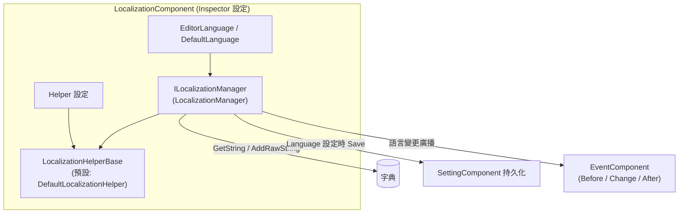

# 安裝與首次執行：安裝套件、掛載元件、設定 Inspector

本頁帶你把 GameFrameX Localization 跑起來：安裝 UPM 套件、在場景中掛載 `LocalizationComponent`、設定 Inspector 中的語言與 Helper 欄位，最後用程式碼驗證第一條翻譯文字能正常取出。整個過程只需幾分鐘。

## 快速開始

### 1. 安裝套件

任選以下一種方式（推薦方式 1，便於統一升級 GameFrameX 系列套件）：

- 編輯 Unity 專案的 `Packages/manifest.json`，新增 `scopedRegistries` 並宣告相依性：

```json
{
  "scopedRegistries": [
    {
      "name": "GameFrameX",
      "url": "https://gameframex.upm.alianblank.uk",
      "scopes": [
        "com.gameframex"
      ]
    }
  ],
  "dependencies": {
    "com.gameframex.unity.localization": "2.3.0"
  }
}
```

`scopes` 控制哪些套件透過此 registry 解析，只有以 `com.gameframex` 開頭的套件才會從這個 registry 取得。

Source: [README.zh-CN.md](https://github.com/GameFrameX/com.gameframex.unity.localization/blob/main/README.zh-CN.md#L68-L86)

- 直接在 `manifest.json` 的 `dependencies` 節點下新增 Git 位址：

```json
{
   "com.gameframex.unity.localization": "https://github.com/gameframex/com.gameframex.unity.localization.git"
}
```

Source: [README.zh-CN.md](https://github.com/GameFrameX/com.gameframex.unity.localization/blob/main/README.zh-CN.md#L88-L93)

- 或在 Unity `Package Manager` 中以 `Git URL` 方式新增：`https://github.com/gameframex/com.gameframex.unity.localization.git`。
- 或直接下載存放庫放到 Unity 專案的 `Packages` 目錄下，Unity 會自動載入並識別。

版本需求：Unity 2019.4 及以上（見 [README.zh-CN.md](https://github.com/GameFrameX/com.gameframex.unity.localization/blob/main/README.zh-CN.md#L9)）。元件相依於 GameFrameX 的 Event、Setting 與核心執行階段組件。

### 2. 掛載元件

在啟動場景的 GameFrameX 元件宿主物件上，透過 `Add Component` 選單選擇 `GameFrameX/Localization` 來新增 `LocalizationComponent`:

```csharp
[DisallowMultipleComponent]
[AddComponentMenu("GameFrameX/Localization")]
[HelpURL("https://datatracker.ietf.org/doc/html/rfc5646")]
[Preserve]
[RequireComponent(typeof(GameFrameXLocalizationCroppingHelper))]
public sealed class LocalizationComponent : GameFrameworkComponent
```

Source: [LocalizationComponent.cs](https://github.com/GameFrameX/com.gameframex.unity.localization/blob/main/Runtime/Localization/LocalizationComponent.cs#L46-L51)

要點：

- `[RequireComponent(typeof(GameFrameXLocalizationCroppingHelper))]`:新增本元件時會自動附帶裁剪輔助元件，無需手動掛載。
- `[DisallowMultipleComponent]`:同一物件只能掛一個，重複新增會被 Unity 阻止。

### 3. 設定 Inspector

元件序列化欄位及預設值如下，全部可在 Inspector 中直接修改：

| Inspector 欄位 | 預設值 | 說明 |
|------|------|------|
| EditorLanguage | `zh_CN` | 編輯器語言，僅在編輯器內有效，方便在 Play 模式測試不同語言 |
| DefaultLanguage | `zh_CN` | 預設本地化語言，載入本地化失敗時回退使用 |
| EnableLoadDictionaryUpdateEvent | `false` | 是否啟用字典載入進度更新事件 |
| IsEnableEditorMode | `false` | 是否啟用編輯器模式 |
| LocalizationHelperTypeName | `GameFrameX.Localization.Runtime.DefaultLocalizationHelper` | 本地化 Helper 型別名稱 |
| CustomLocalizationHelper | `null` | 自訂 Helper，留空則使用上方的預設 Helper |

欄位定義原始碼：

```csharp
[SerializeField] private string m_EditorLanguage = "zh_CN";
[SerializeField] private string m_DefaultLanguage = "zh_CN";
[SerializeField] private bool m_EnableLoadDictionaryUpdateEvent = false;
[SerializeField] private bool m_IsEnableEditorMode = false;
[SerializeField] private string m_LocalizationHelperTypeName = "GameFrameX.Localization.Runtime.DefaultLocalizationHelper";
[SerializeField] private LocalizationHelperBase m_CustomLocalizationHelper = null;
```

Source: [LocalizationComponent.cs](https://github.com/GameFrameX/com.gameframex.unity.localization/blob/main/Runtime/Localization/LocalizationComponent.cs#L66-L75)

語言代碼採用 RFC 5646 風格，如 `zh_CN`、`en_US`、`ja_JP`(元件 `HelpURL` 即指向 RFC 5646 規範)。

### 4. 首次執行驗證

進入 Play 模式，先註冊一條翻譯再用程式碼取出：

```csharp
using GameFrameX.Localization.Runtime;

// 標準方式：透過 GameEntry 取得
var localization = GameEntry.GetComponent<LocalizationComponent>();

// 執行階段新增一條翻譯(key 已存在或為 null/空時回傳 false)
bool added = localization.AddRawString("UI.Button.NewButton", "新按鈕");

// 取出翻譯；如果 key 不存在，回傳 "<NoKey>{key}"
string text = localization.GetString("UI.Button.NewButton");
```

Sources: [README.zh-CN.md](https://github.com/GameFrameX/com.gameframex.unity.localization/blob/main/README.zh-CN.md#L100-L105) · [README.zh-CN.md](https://github.com/GameFrameX/com.gameframex.unity.localization/blob/main/README.zh-CN.md#L173-L176) · [README.zh-CN.md](https://github.com/GameFrameX/com.gameframex.unity.localization/blob/main/README.zh-CN.md#L134-L137)

看到 `text` 輸出「新按鈕」即安裝成功。注意：若 key 不存在回傳的是 `<NoKey>{key}`,格式化參數不相符時結果以 `<Error>` 開頭，這兩類前綴都說明字典內容或參數有問題。

## 工作原理速覽

元件採用「元件殼 + 管理器 + Helper」的分層結構，Inspector 設定最終會傳給 `LocalizationManager` 執行，語言切換會自動寫入 Setting 並廣播事件：



元件在設定 `Language` 時會先寫入 `SettingComponent` 並呼叫 `Save()`，隨後依序觸發 `LocalizationLanguageChangeBeforeEventArgs`、`LocalizationLanguageChangeEventArgs`、`LocalizationLanguageChangeAfterEventArgs` 三個事件；取得 `Language`/`DefaultLanguage` 時若為未知值則先從 Setting 讀取。

Source: [LocalizationComponent.cs](https://github.com/GameFrameX/com.gameframex.unity.localization/blob/main/Runtime/Localization/LocalizationComponent.cs#L140-L171)

## 常見錯誤

| 現象 | 原因 | 修復 |
|------|------|------|
| 取出的文字是 `<NoKey>{key}` | 字典中沒有該 key | 先用 `AddRawString` 註冊條目，或用 `HasRawString` 先檢查 |
| 格式化結果以 `<Error>` 開頭 | 佔位符與提供的參數不相符 | 核對字典值中的 `{0}`、`{1}` 與傳入參數個數/型別 |
| 元件回報缺少相依性 | 未安裝 Event/Setting 等相依套件 | 透過 scoped registry 一併安裝 `com.gameframex` 系列套件 |
| 同一物件掛不上第二個 | `[DisallowMultipleComponent]` | 一個場景宿主只掛一個 `LocalizationComponent` |

錯誤行為依據見 [README.zh-CN.md](https://github.com/GameFrameX/com.gameframex.unity.localization/blob/main/README.zh-CN.md#L167) 與 [LocalizationComponent.cs](https://github.com/GameFrameX/com.gameframex.unity.localization/blob/main/Runtime/Localization/LocalizationComponent.cs#L46-L51)。

## 接下來

- 執行階段語言切換與事件監聽範例：見 [README.zh-CN.md](https://github.com/GameFrameX/com.gameframex.unity.localization/blob/main/README.zh-CN.md#L194-L236)
- 參數化格式化(最多 16 個型別化參數的 `GetString` 多載)：見 [README.zh-CN.md](https://github.com/GameFrameX/com.gameframex.unity.localization/blob/main/README.zh-CN.md#L146-L165)
- 語言代碼常數 `LocalizationCode`(180+ 種語言)：見 [LocalizationCode.cs](https://github.com/GameFrameX/com.gameframex.unity.localization/blob/main/Runtime/Localization/LocalizationCode.cs)
- 自訂 Helper(繼承 `LocalizationHelperBase` 覆寫系統語言偵測)：見 [LocalizationHelperBase.cs](https://github.com/GameFrameX/com.gameframex.unity.localization/blob/main/Runtime/Localization/LocalizationHelperBase.cs)
- Inspector 自訂介面實作：見 [LocalizationComponentInspector.cs](https://github.com/GameFrameX/com.gameframex.unity.localization/blob/main/Editor/Inspector/LocalizationComponentInspector.cs)
- 官方文件：<https://gameframex.doc.alianblank.com/>