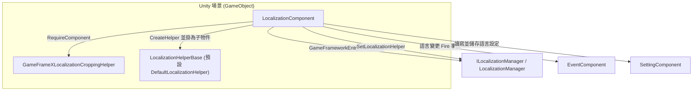

# 工作原理：元件、Manager 與 Helper 的分工

本套件按三層組織：`LocalizationComponent` 是掛在 Unity 場景上的 Mono 門面，`ILocalizationManager` / `LocalizationManager` 是框架核心模組（負責字典資料與語言狀態），`ILocalizationHelper` / `LocalizationHelperBase` 是可替換的輔助器（負責系統語言等能力）。業務程式碼只與 `LocalizationComponent` 互動，後兩層由它在啟動時自動裝配。

## 三層分工一覽

| 層 | 實際型別 | 檔案 | 職責 |
|------|----------|------|------|
| 元件層 | `LocalizationComponent : GameFrameworkComponent` | `Runtime/Localization/LocalizationComponent.cs` | Unity 門面：持有 Inspector 設定項目、初始化 Manager/Helper、把 `GetString` / `Language` 等呼叫轉發給 Manager，並把語言設定持久化到 `SettingComponent` |
| 管理器層 | `ILocalizationManager` / `LocalizationManager` | `Runtime/Localization/Localization/` | 框架核心模組：由 `GameFrameworkEntry.GetModule<ILocalizationManager>()` 取得，持有字典資料、目前語言、預設語言與系統語言，定義常數 `UnknownLocalization` |
| 輔助器層 | `ILocalizationHelper` / `LocalizationHelperBase` / `DefaultLocalizationHelper` | `Runtime/Localization/` | 可替換實作：由元件透過 `Helper.CreateHelper` 建立並注入 Manager；介面僅宣告 `SystemLanguage` |

三層關係與協作元件（箭頭均來自原始碼中可核實的呼叫）：



輔助器介面非常精簡，只宣告了系統語言：

```csharp
public interface ILocalizationHelper
{
    string SystemLanguage { get; }
}
```

Source: [ILocalizationHelper.cs](https://github.com/GameFrameX/com.gameframex.unity.localization/blob/main/Runtime/Localization/Localization/ILocalizationHelper.cs#L40-L47)

## 啟動初始化流程

`LocalizationComponent` 透過兩個生命週期方法完成裝配，順序如下：

1. **`Awake()` — 取得核心模組**。設定實作型別與介面型別，再從框架入口取得 `ILocalizationManager`，失敗則 `Log.Fatal("Localization manager is invalid.")` 並停止。

```csharp
protected override void Awake()
{
    ImplementationComponentType = Utility.Assembly.GetType(componentType);
    InterfaceComponentType = typeof(ILocalizationManager);
    base.Awake();
    m_LocalizationManager = GameFrameworkEntry.GetModule<ILocalizationManager>();
    if (m_LocalizationManager == null)
    {
        Log.Fatal("Localization manager is invalid.");
        return;
    }
}
```

Source: [LocalizationComponent.cs](https://github.com/GameFrameX/com.gameframex.unity.localization/blob/main/Runtime/Localization/LocalizationComponent.cs#L211-L222)

2. **`Start()` — 驗證相依元件**。依次透過 `GameEntry.GetComponent<T>()` 取得 `BaseComponent`、`EventComponent`、`SettingComponent`，任一缺失即 `Log.Fatal("Base component is invalid." / "Event component is invalid." / "Setting component is invalid.")`。

3. **`Start()` — 建立並注入 Helper**。用 Inspector 上的 `m_LocalizationHelperTypeName`（預設 `"GameFrameX.Localization.Runtime.DefaultLocalizationHelper"`）或 `m_CustomLocalizationHelper` 參考建立輔助器，命名為 `"Localization Helper"`、掛為本元件子物件，然後呼叫 `SetLocalizationHelper` 注入 Manager。

```csharp
LocalizationHelperBase localizationHelper = Helper.CreateHelper(m_LocalizationHelperTypeName, m_CustomLocalizationHelper);
if (localizationHelper == null)
{
    Log.Fatal("Can not create localization helper.");
    return;
}

localizationHelper.name = "Localization Helper";
Transform localizationHelperTransform = localizationHelper.transform;
localizationHelperTransform.SetParent(this.transform);
localizationHelperTransform.localScale = Vector3.one;
m_LocalizationManager.SetLocalizationHelper(localizationHelper);
```

Source: [LocalizationComponent.cs](https://github.com/GameFrameX/com.gameframex.unity.localization/blob/main/Runtime/Localization/LocalizationComponent.cs#L249-L260)

4. **`Start()` — 初始化語言**。編輯器模式下若勾選 `m_IsEnableEditorMode`，使用 `EditorLanguage`（預設 `"zh_CN"`）；執行時若 `Language` 仍為 `UnknownLocalization` 則回退到 `SystemLanguage`；`DefaultLanguage` 的後備邏輯相同。

```csharp
#if UNITY_EDITOR
    if (m_IsEnableEditorMode)
    {
        Language = EditorLanguage != UnknownLocalization ? EditorLanguage : m_LocalizationManager.SystemLanguage;
    }
#else
    if (Language == UnknownLocalization)
    {
        Language = m_LocalizationManager.SystemLanguage;
    }
#endif
    DefaultLanguage = m_DefaultLanguage != UnknownLocalization ? m_DefaultLanguage : m_LocalizationManager.SystemLanguage;
```

Source: [LocalizationComponent.cs](https://github.com/GameFrameX/com.gameframex.unity.localization/blob/main/Runtime/Localization/LocalizationComponent.cs#L261-L272)

### 元件上的序列化設定項目

| 設定項目 | 預設值 | 作用 |
|--------|--------|------|
| `m_EditorLanguage` | `"zh_CN"` | 編輯器內語言（僅編輯器模式生效） |
| `m_DefaultLanguage` | `"zh_CN"` | 預設本地化語言，載入失敗時作為後備 |
| `m_EnableLoadDictionaryUpdateEvent` | `false` | 是否開啟字典載入進度更新事件 |
| `m_IsEnableEditorMode` | `false` | 是否啟用編輯器模式語言 |
| `m_LocalizationHelperTypeName` | `"GameFrameX.Localization.Runtime.DefaultLocalizationHelper"` | 輔助器型別完整名稱 |
| `m_CustomLocalizationHelper` | `null` | 自訂輔助器參考（優先於型別名稱） |

Source: [LocalizationComponent.cs](https://github.com/GameFrameX/com.gameframex.unity.localization/blob/main/Runtime/Localization/LocalizationComponent.cs#L66-L75)

元件宣告本身也體現了對裁剪輔助器的硬性相依：`[RequireComponent(typeof(GameFrameXLocalizationCroppingHelper))]`、`[DisallowMultipleComponent]`、`[AddComponentMenu("GameFrameX/Localization")]`（見 [LocalizationComponent.cs](https://github.com/GameFrameX/com.gameframex.unity.localization/blob/main/Runtime/Localization/LocalizationComponent.cs#L46-L51)）。

## 語言切換的資料流

`Language` 屬性的 setter 是元件層協調 Manager、Setting 與 Event 三方的典型範例。當值變化時，它會依次做四件事：更新 Manager 的語言並寫入 `SettingComponent` 以持久化儲存；然後按固定順序廣播三個語言變更事件（Before → Change → After）。

```csharp
set
{
    if (m_LocalizationManager.Language != value)
    {
        var oldLanguage = m_LocalizationManager.Language;
        m_LocalizationManager.Language = value;
        m_SettingComponent.SetString(nameof(LocalizationComponent) + "." + nameof(Language), value);
        m_SettingComponent.Save();
        var localizationLanguageChangeBeforeEventArgs = LocalizationLanguageChangeBeforeEventArgs.Create(oldLanguage, value);
        m_EventComponent.Fire(this, localizationLanguageChangeBeforeEventArgs);
        var localizationLanguageChangeEventArgs = LocalizationLanguageChangeEventArgs.Create(oldLanguage, value);
        m_EventComponent.Fire(this, localizationLanguageChangeEventArgs);
        var localizationLanguageChangeAfterEventArgs = LocalizationLanguageChangeAfterEventArgs.Create(oldLanguage, value);
        m_EventComponent.Fire(this, localizationLanguageChangeAfterEventArgs);
    }
}
```

Source: [LocalizationComponent.cs](https://github.com/GameFrameX/com.gameframex.unity.localization/blob/main/Runtime/Localization/LocalizationComponent.cs#L155-L170)

getter 則採惰性載入：若 Manager 中語言仍為 `UnknownLocalization`，先從 `SettingComponent` 讀取上次儲存的值（鍵名為 `LocalizationComponent.Language`），再回填給 Manager。

三個語言變更事件對應的參數類別均位於 `Runtime/EventArgs/`：

| 事件參數類別 | 檔案 | 觸發時機 |
|------------|------|----------|
| `LocalizationLanguageChangeBeforeEventArgs` | `Runtime/EventArgs/LocalizationLanguageChangeBeforeEventArgs.cs` | 語言即將變更（最先） |
| `LocalizationLanguageChangeEventArgs` | `Runtime/EventArgs/LocalizationLanguageChangeEventArgs.cs` | 語言已變更 |
| `LocalizationLanguageChangeAfterEventArgs` | `Runtime/EventArgs/LocalizationLanguageChangeAfterEventArgs.cs` | 變更後收尾（最後） |
| `LoadDictionaryFailureEventArgs` | `Runtime/EventArgs/LoadDictionaryFailureEventArgs.cs` | 字典載入失敗 |
| `LoadDictionarySuccessEventArgs` | `Runtime/EventArgs/LoadDictionarySuccessEventArgs.cs` | 字典載入成功 |
| `LoadDictionaryUpdateEventArgs` | `Runtime/EventArgs/LoadDictionaryUpdateEventArgs.cs` | 字典載入進度更新（受 `m_EnableLoadDictionaryUpdateEvent` 控制） |

## 業務呼叫如何穿透三層

業務程式碼呼叫 `LocalizationComponent.GetString(...)`，元件原樣轉發給 `m_LocalizationManager`，Manager 從字典取值並按參數格式化。元件提供了從 0 到 6 個參數的 `GetString` 多載，全部是純轉發：

```csharp
public string GetString(string key)
{
    return m_LocalizationManager.GetString(key);
}

public string GetString(string key, params object[] args)
{
    return m_LocalizationManager.GetString(key, args);
}
```

Source: [LocalizationComponent.cs](https://github.com/GameFrameX/com.gameframex.unity.localization/blob/main/Runtime/Localization/LocalizationComponent.cs#L284-L303)

因此在執行期，`LocalizationComponent` 只是門面：真正的字典資料、語言狀態、載入回呼都存放在 `LocalizationManager` 中；而 Manager 又把「系統語言是什麼」這類平台相關的問題委派給它持有的 `LocalizationHelperBase` 實作。替換 Helper（例如改用自訂的系統語言判定）只需改 Inspector 上的輔助器型別或參考，無需更動元件或業務程式碼。

## 常見錯誤

| 症狀（Log.Fatal 原文） | 根本原因 | 修復 |
|------|------|------|
| `Localization manager is invalid.` | `GameFrameworkEntry.GetModule<ILocalizationManager>()` 傳回空值 | 確認框架核心已初始化、套件已正確引入 |
| `Base component is invalid.` | 場景缺少 `BaseComponent` | 在 GameEntry 上補齊 `BaseComponent` |
| `Event component is invalid.` | 場景缺少 `EventComponent` | 新增 `EventComponent`（語言變更事件相依於它） |
| `Setting component is invalid.` | 場景缺少 `SettingComponent` | 新增 `SettingComponent`（語言持久化相依於它） |
| `Can not create localization helper.` | `m_LocalizationHelperTypeName` 型別名稱錯誤且未提供 `m_CustomLocalizationHelper` | 核對輔助器型別完整名稱或直接拖入自訂 Helper 參考 |

以上訊息原文均出自 `Start()`/`Awake()` 中的驗證邏輯（[LocalizationComponent.cs](https://github.com/GameFrameX/com.gameframex.unity.localization/blob/main/Runtime/Localization/LocalizationComponent.cs#L217-L253)）。

## 相關連結

- [LocalizationComponent.cs](https://github.com/GameFrameX/com.gameframex.unity.localization/blob/main/Runtime/Localization/LocalizationComponent.cs) — 元件層門面與初始化流程
- [ILocalizationManager.cs](https://github.com/GameFrameX/com.gameframex.unity.localization/blob/main/Runtime/Localization/Localization/ILocalizationManager.cs) — 管理器介面
- [LocalizationManager.cs](https://github.com/GameFrameX/com.gameframex.unity.localization/blob/main/Runtime/Localization/Localization/LocalizationManager.cs) — 管理器實作
- [ILocalizationHelper.cs](https://github.com/GameFrameX/com.gameframex.unity.localization/blob/main/Runtime/Localization/Localization/ILocalizationHelper.cs) — 輔助器介面
- [LocalizationHelperBase.cs](https://github.com/GameFrameX/com.gameframex.unity.localization/blob/main/Runtime/Localization/LocalizationHelperBase.cs) — 輔助器基底類別
- [DefaultLocalizationHelper.cs](https://github.com/GameFrameX/com.gameframex.unity.localization/blob/main/Runtime/Localization/DefaultLocalizationHelper.cs) — 預設輔助器
- [LocalizationComponentInspector.cs](https://github.com/GameFrameX/com.gameframex.unity.localization/blob/main/Editor/Inspector/LocalizationComponentInspector.cs) — 編輯器 Inspector