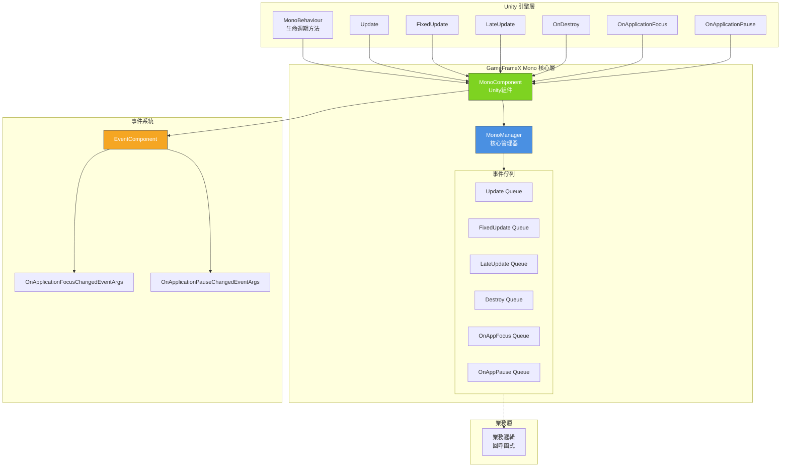

# 外掛介紹

GameFrameX Unity Mono 組件是 GameFrameX 遊戲框架的核心模組之一，專門用於統一管理 Unity 中 MonoBehaviour 的生命週期事件，並提供便捷的事件監聽機制。

## 概述

在 Unity 開發中，MonoBehaviour 的生命週期方法（如 `Update`、`FixedUpdate`、`LateUpdate`、`OnDestroy` 等）是遊戲邏輯的核心載體。然而，傳統寫法存在以下問題：

- **耦合度高**：業務邏輯直接寫在 MonoBehaviour 中，難以複用和測試
- **管理混亂**：多個指令碼可能需要訪問相同的生命週期事件，缺乏統一管理
- **效能問題**：頻繁建立和銷燬 MonoBehaviour 影響效能

GameFrameX Mono 組件透過以下設計解決這些問題：

- **統一管理**：透過 MonoManager 集中管理所有生命週期事件監聽
- **觀察者模式**：使用回呼函式訂閱/取消訂閱事件，解耦業務邏輯
- **執行緒安全**：使用鎖機制確保多執行緒環境下的安全性
- **事件整合**：與 Event 組件整合，支援全域性事件系統

## 架構設計



### 核心組件

| 組件 | 描述 | 職責 |
|------|------|------|
| **MonoManager** | 核心管理器 | 統一管理所有生命週期事件的監聽和分發 |
| **MonoComponent** | Unity 組件 | 提供 Unity 層面的事件入口，自動轉發生命週期事件 |
| **IMonoManager** | 介面定義 | 定義 MonoManager 的標準介面，便於測試和擴充套件 |

### 事件流程

```mermaid
sequenceDiagram
    participant Unity as Unity 引擎
    participant MC as MonoComponent
    participant MM as MonoManager
    participant EC as EventComponent
    participant BL as 業務邏輯

    Unity->>MC: Unity 生命週期方法呼叫
    activate MC
    MC->>MM: 轉發事件
    activate MM
    MM->>BL: 遍歷呼叫回呼佇列
    BL-->>MM: 執行回呼
    deactivate BL
    
    MM-->>MC: 返回
    deactivate MM
    
    alt 應用焦點/暫停事件
        MC->>EC: Fire 事件
        activate EC
        EC-->>MC: 事件分發
        deactivate EC
    end
    
    MC-->>Unity: 返回
    deactivate MC
```

## 功能特性

### 1. 生命週期事件管理

MonoManager 支援以下生命週期事件的統一管理：

| 事件 | 描述 | 回呼引數 |
|------|------|----------|
| **Update** | 每幀呼叫 | `(float elapseSeconds, float realElapseSeconds)` |
| **FixedUpdate** | 固定幀率呼叫 | `(float elapseSeconds, float fixedElapseSeconds)` |
| **LateUpdate** | 所有 Update 後呼叫 | `(float elapseSeconds, float fixedElapseSeconds)` |
| **OnDestroy** | 物件銷燬時呼叫 | `()` |
| **OnApplicationFocus** | 應用焦點變化 | `(bool focusStatus)` |
| **OnApplicationPause** | 應用暫停變化 | `(bool pauseStatus)` |

### 2. 執行緒安全性

所有事件佇列的操作都使用 `lock` 機制確保執行緒安全：

```csharp
// 執行緒安全的新增監聽器示例
public void AddUpdateListener(Action<float, float> action)
{
    if (action == null)
    {
        throw new ArgumentNullException(nameof(action));
    }

    lock (Lock)
    {
        _updateQueue.AddLast(action);
    }
}
```
> Source: [MonoManager.cs](https://github.com/GameFrameX/com.gameframex.unity.mono/blob/main/Runtime/Mono/MonoManager.cs#L176-L187)

### 3. 異常處理

每個監聽器的呼叫都包含在 try-catch 塊中，確保單個回呼的異常不會影響其他回呼的執行：

```csharp
private static void QueueInvoking(LinkedList<Action<float, float>> list, float elapseSeconds, float fixedElapseSeconds)
{
    lock (Lock)
    {
        foreach (var action in list)
        {
            try
            {
                action.Invoke(elapseSeconds, fixedElapseSeconds);
            }
            catch (Exception e)
            {
                Log.Error(e);
            }
        }
    }
}
```
> Source: [MonoManager.cs](https://github.com/GameFrameX/com.gameframex.unity.mono/blob/main/Runtime/Mono/MonoManager.cs#L364-L380)

### 4. 效能最佳化

- 使用 Unity Profiler 進行效能分析
- 支援主動釋放資源 (`Release()` 方法)
- 使用 LinkedList 提供 O(1) 的新增/刪除複雜度

## 快速開始

### 基本使用流程

1. **建立 MonoComponent**：在場景中建立帶有 `MonoComponent` 的 GameObject
2. **獲取管理器**：透過 `MonoComponent` 獲取事件監聽能力
3. **註冊監聽**：新增相應的生命週期事件監聽
4. **執行業務**：在回呼函式中編寫業務邏輯
5. **登出監聽**：在適當時候移除監聽（避免記憶體洩漏）

### 程式碼示例

```csharp
public class MyGameController : MonoBehaviour
{
    private MonoComponent _monoComponent;

    private void Start()
    {
        // 獲取 MonoComponent
        _monoComponent = GetComponent<MonoComponent>();
        
        // 註冊 Update 監聽
        _monoComponent.AddUpdateListener(OnUpdate);
        
        // 註冊 FixedUpdate 監聽
        _monoComponent.AddFixedUpdateListener(OnFixedUpdate);
        
        // 註冊應用暫停監聽
        _monoComponent.AddOnApplicationPauseListener(OnApplicationPause);
    }

    private void OnUpdate(float elapseSeconds, float realElapseSeconds)
    {
        // 每幀執行的邏輯
    }

    private void OnFixedUpdate(float elapseSeconds, float fixedElapseSeconds)
    {
        // 固定幀率執行的邏輯（如物理計算）
    }

    private void OnApplicationPause(bool pauseStatus)
    {
        Debug.Log($"應用暫停狀態: {pauseStatus}");
    }

    private void OnDestroy()
    {
        // 移除所有監聽器
        if (_monoComponent != null)
        {
            _monoComponent.RemoveUpdateListener(OnUpdate);
            _monoComponent.RemoveFixedUpdateListener(OnFixedUpdate);
            _monoComponent.RemoveOnApplicationPauseListener(OnApplicationPause);
        }
    }
}
```
> Source: [MonoComponent.cs](https://github.com/GameFrameX/com.gameframex.unity.mono/blob/main/Runtime/Mono/MonoComponent.cs#L186-L210)

## 依賴關係

GameFrameX Mono 組件依賴以下模組：

| 依賴模組 | 版本要求 | 描述 |
|----------|----------|------|
| GameFrameX.Runtime | ≥1.0.0 | 核心框架，提供基礎服務 |
| GameFrameX.Event | ≥1.0.0 | 事件系統，支援全域性事件 |

```json
{
  "dependencies": {
    "com.gameframex.unity.runtime": ">=1.0.0",
    "com.gameframex.unity.event": ">=1.0.0"
  }
}
```
> Source: [GameFrameX.Mono.Runtime.asmdef](https://github.com/GameFrameX/com.gameframex.unity.mono/blob/main/Runtime/GameFrameX.Mono.Runtime.asmdef#L3-L6)

## 版本資訊

| 版本 | 更新內容 |
|------|----------|
| 1.1.0 | 當前版本 |
| 1.0.0 | 初始版本 |

- **Unity 版本支援**：2017.1+
- **許可證**：MIT + Apache License 2.0 雙許可

## 相關連結

- [安裝指南](./2-installation.1-installation-methods)
- [基礎使用](./3-getting-started.1-basic-usage)
- [MonoManager 詳解](./4-core-components.1-monomanager)
- [MonoComponent 詳解](./4-core-components.2-monocomponent)
- [事件型別](./5-events.1-event-types)
- [事件引數](./5-events.2-event-args)
- [常見問題解答](./6-troubleshooting.1-faq)
- [GitHub 倉庫](https://github.com/GameFrameX/com.gameframex.unity.mono.git)
- [官方文件](https://gameframex.doc.alianblank.com/)
