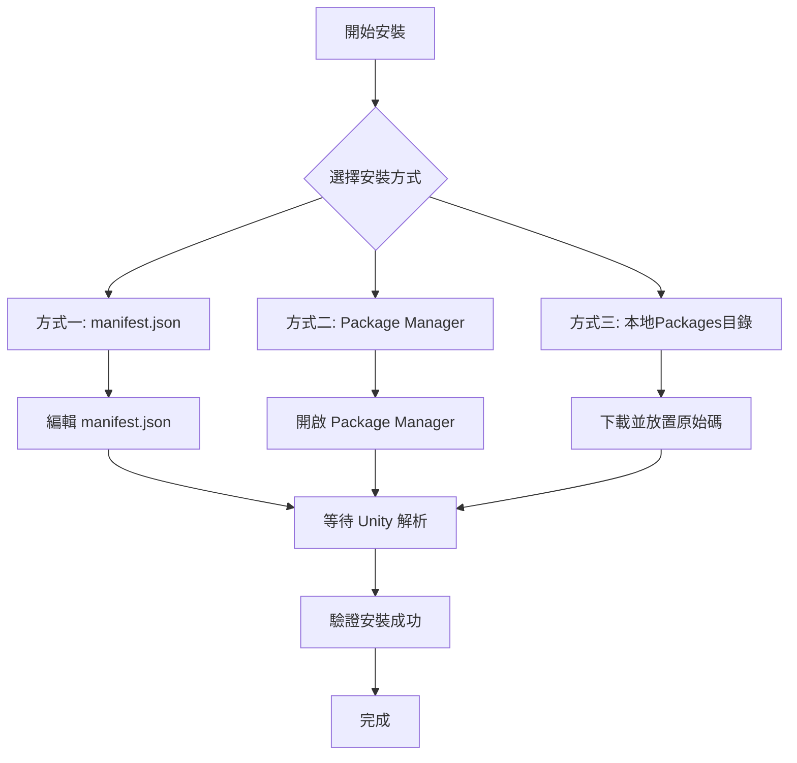

# 安裝方式

本文件介紹如何將 GameFrameX Mono 組件安裝到您的 Unity 專案中。

## 概述

**GameFrameX Mono** 是 GameFrameX 框架的 MonoBehaviour 生命週期管理組件，提供了一種簡便的方式來監聽和管理 Unity 生命週期事件（如 Update、FixedUpdate、LateUpdate、OnDestroy 等）。

### 前置要求

| 要求 | 最低版本 |
|------|----------|
| Unity | 2017.1+ |
| GameFrameX.Runtime | 最新版本 |
| GameFrameX.Event.Runtime | 最新版本 |

> **注意**：Mono 組件依賴於 Event 組件，請確保已安裝 [com.alianblank.gameframex.unity.event](https://github.com/GameFrameX/com.alianblank.gameframex.unity.event)。

### 安裝方式概覽



---

## 安裝方法

### 方式一：透過 manifest.json 安裝（推薦）

這是最推薦的安裝方式，方便版本管理和團隊協作。

**步驟：**

1. 找到您 Unity 專案的 `Packages/manifest.json` 檔案
2. 在 `dependencies` 節點中新增以下內容：

```json
{
  "dependencies": {
    "com.gameframex.unity.mono": "https://github.com/GameFrameX/com.gameframex.unity.mono.git"
  }
}
```

> Source: [README.md](https://github.com/GameFrameX/com.gameframex.unity.mono/blob/main/README.md#L46-L50)

3. 儲存檔案後，Unity 會自動解析並下載包

**優點：**
- 版本管理方便
- 團隊成員自動同步
- 可以鎖定特定版本

---

### 方式二：透過 Unity Package Manager 安裝

適合喜歡使用 GUI 的開發者。

**步驟：**

1. 開啟 Unity 編輯器
2. 進入 **Window → Package Manager**
3. 點選左上角的 **+** 按鈕
4. 選擇 **Add package from git URL**
5. 輸入以下地址：

```
https://github.com/GameFrameX/com.gameframex.unity.mono.git
```

6. 點選 **Add** 按鈕等待安裝完成

> Source: [README.md](https://github.com/GameFrameX/com.gameframex.unity.mono/blob/main/README.md#L50)

**優點：**
- 操作簡單直觀
- 無需手動編輯檔案

---

### 方式三：本地 Packages 目錄安裝

適合離線環境或需要深度定製原始碼的場景。

**步驟：**

1. 克隆或下載 GitHub 倉庫：

```bash
git clone https://github.com/GameFrameX/com.gameframex.unity.mono.git
```

2. 將下載的資料夾複製到您 Unity 專案的 `Packages` 目錄下
3. Unity 會自動識別並載入該包

> Source: [README.md](https://github.com/GameFrameX/com.gameframex.unity.mono/blob/main/README.md#L52)

**優點：**
- 無需網路連線
- 可以直接修改原始碼進行除錯

**注意事項：**
- 需要手動更新包的內容
- 可能會被 Unity 自動清理功能影響

---

## 安裝驗證

安裝完成後，可以透過以下方式驗證是否成功：

### 方法一：檢查 Package Manager

在 Unity 中開啟 **Window → Package Manager**，確認 `GameFrameX Mono` 出現在已安裝包列表中。

### 方法二：檢查程式集定義

確認以下程式集定義檔案存在：
- `Packages/com.gameframex.unity.mono/Runtime/GameFrameX.Mono.Runtime.asmdef`
- `Packages/com.gameframex.unity.mono/Editor/GameFrameX.Mono.Editor.asmdef`

### 方法三：程式碼引用測試

在專案中嘗試引用 Mono 組件名稱空間：

```csharp
using GameFrameX.Mono.Runtime;

// 確保 IMonoManager 和 MonoComponent 可用
public class TestComponent : MonoBehaviour
{
    private void Start()
    {
        var monoManager = MonoManager.Instance;
        Debug.Log("GameFrameX Mono 安裝成功！");
    }
}
```

---

## 包資訊

| 屬性 | 值 |
|------|-----|
| 包名 | com.gameframex.unity.mono |
| 顯示名稱 | Game Frame X Mono |
| 版本 | 1.1.0 |
| Unity 最低版本 | 2017.1 |
| 分類 | Game Framework X |

> Source: [package.json](https://github.com/GameFrameX/com.gameframex.unity.mono/blob/main/package.json#L1-L10)

---

## 相關連結

- [外掛介紹](../1-overview.1-introduction)
- [基礎使用](../3-getting-started.1-basic-usage)
- [MonoManager 文件](../4-core-components.1-monomanager)
- [MonoComponent 文件](../4-core-components.2-monocomponent)
- [GitHub 倉庫](https://github.com/GameFrameX/com.gameframex.unity.mono.git)
- [依賴組件：Event](https://github.com/GameFrameX/com.alianblank.gameframex.unity.event)
