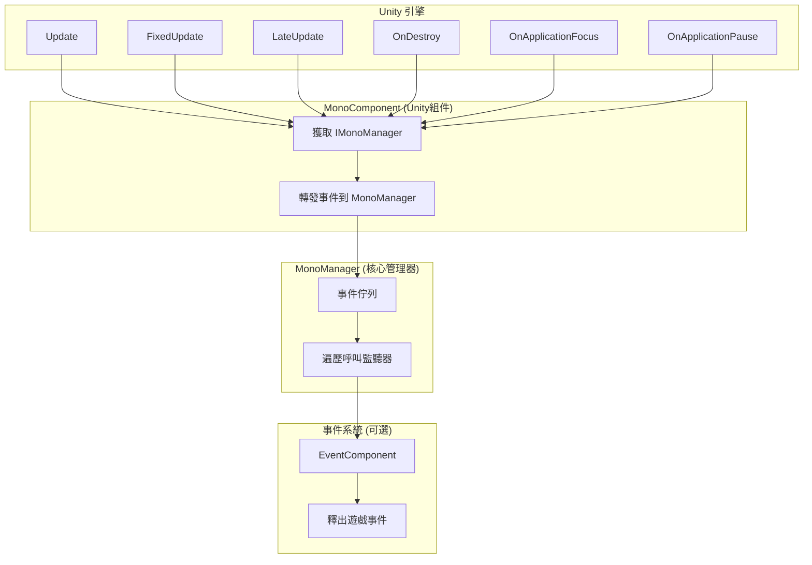
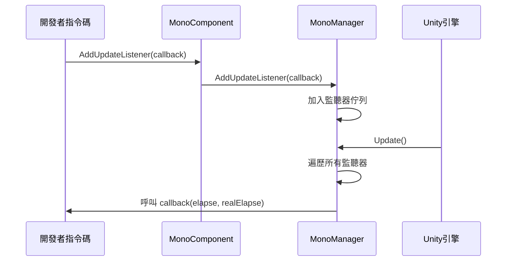

# 基礎使用

GameFrameX Mono 生命週期組件的基礎使用指南，幫助開發者快速上手並理解框架的核心用法。

## 概述

Mono 生命週期組件是 GameFrameX 框架的核心模組之一，用於統一管理 Unity 中 `MonoBehaviour` 的各種生命週期事件。該組件提供了簡潔的監聽器模式，使開發者可以方便地訂閱和管理 `Update`、`FixedUpdate`、`LateUpdate`、`OnDestroy`、`OnApplicationFocus` 以及 `OnApplicationPause` 等事件，而無需在每個指令碼中單獨處理這些回呼。

> **設計意圖**：將分散在各處的生命週期回呼邏輯集中到統一的事件管理系統中，避免程式碼耦合，便於維護和擴充套件。

## 架構概覽



**架構說明**：
- **MonoComponent**：掛載在 GameObject 上的 Unity 組件，負責接收 Unity 生命週期回呼並轉發給 MonoManager
- **MonoManager**：核心管理器，維護各個事件的監聽器列表，在收到回呼時依次呼叫所有監聽器
- **EventSystem**：可選模組，當焦點或暫停狀態變化時，透過 EventComponent 釋出遊戲事件供其他模組訂閱

## 核心概念

### 監聽器模式

框架採用經典的監聽器（Observer）模式，開發者可以訂閱感興趣的事件並在事件觸發時獲得通知。



### 執行緒安全設計

所有監聽器的新增和移除操作都使用 `lock` 保護，確保在多執行緒環境下的安全性。監聽器的呼叫也在鎖內執行，防止在呼叫過程中監聽器被意外修改。

> **效能最佳化**：MonoManager 使用 `LinkedList<T>` 儲存監聽器，支援高效的新增、刪除和遍歷操作。

## 使用方式

### 第一步：新增 MonoComponent

在 Unity 編輯器中，選中需要使用生命週期事件的 GameObject，點選 **Add Component**，搜尋 **GameFrameX/Mono** 並新增。

```csharp
// 原始碼位置：Runtime/Mono/MonoComponent.cs#L42-L44
[DisallowMultipleComponent]
[AddComponentMenu("GameFrameX/Mono")]
public class MonoComponent : GameFrameworkComponent
```

或者透過程式碼動態新增：

```csharp
var monoComponent = gameObject.AddComponent<GameFrameX.Mono.Runtime.MonoComponent>();
```
> Source: [MonoComponent.cs](https://github.com/GameFrameX/com.gameframex.unity.mono/blob/main/Runtime/Mono/MonoComponent.cs#L42-L44)

### 第二步：訂閱生命週期事件

在指令碼中獲取 `MonoComponent` 例項後，可以呼叫相應的方法訂閱事件。以下是完整的使用示例：

```csharp
using UnityEngine;
using GameFrameX.Mono.Runtime;
using System;

public class Example : MonoBehaviour
{
    private MonoComponent _monoComponent;

    private void Awake()
    {
        // 獲取 MonoComponent 例項
        _monoComponent = GetComponent<MonoComponent>();
    }

    private void Start()
    {
        // 訂閱 Update 事件
        _monoComponent.AddUpdateListener(OnGameUpdate);
        
        // 訂閱 FixedUpdate 事件
        _monoComponent.AddFixedUpdateListener(OnFixedUpdate);
        
        // 訂閱 LateUpdate 事件
        _monoComponent.AddLateUpdateListener(OnLateUpdate);
        
        // 訂閱 OnDestroy 事件
        _monoComponent.AddDestroyListener(OnGameObjectDestroy);
        
        // 訂閱焦點變化事件
        _monoComponent.AddOnApplicationFocusListener(OnApplicationFocus);
        
        // 訂閱暫停狀態變化事件
        _monoComponent.AddOnApplicationPauseListener(OnApplicationPause);
    }

    private void OnDestroy()
    {
        // 頁面銷燬時移除監聽器，避免記憶體洩漏
        if (_monoComponent != null)
        {
            _monoComponent.RemoveUpdateListener(OnGameUpdate);
            _monoComponent.RemoveFixedUpdateListener(OnFixedUpdate);
            _monoComponent.RemoveLateUpdateListener(OnLateUpdate);
            _monoComponent.RemoveDestroyListener(OnGameObjectDestroy);
            _monoComponent.RemoveOnApplicationFocusListener(OnApplicationFocus);
            _monoComponent.RemoveOnApplicationPauseListener(OnApplicationPause);
        }
    }

    // Update: 每幀呼叫，第一個引數是距離上一幀的時間，第二個引數是真實流逝時間
    private void OnGameUpdate(float elapseSeconds, float realElapseSeconds)
    {
        // 編寫遊戲邏輯
    }

    // FixedUpdate: 固定幀率呼叫，適合物理相關的邏輯
    private void OnFixedUpdate(float elapseSeconds, float fixedElapseSeconds)
    {
        // 編寫物理邏輯
    }

    // LateUpdate: 所有 Update 呼叫後呼叫，適合相機跟隨等需要在所有移動邏輯執行後的操作
    private void OnLateUpdate(float elapseSeconds, float fixedElapseSeconds)
    {
        // 編寫需要在最後執行的邏輯
    }

    // OnDestroy: GameObject 銷燬時呼叫，適合資源清理
    private void OnGameObjectDestroy()
    {
        // 清理資源
    }

    // OnApplicationFocus: 應用程式焦點變化時呼叫
    private void OnApplicationFocus(bool focusStatus)
    {
        if (focusStatus)
        {
            Debug.Log("應用程式獲得焦點");
        }
        else
        {
            Debug.Log("應用程式失去焦點");
        }
    }

    // OnApplicationPause: 應用程式暫停狀態變化時呼叫
    private void OnApplicationPause(bool pauseStatus)
    {
        if (pauseStatus)
        {
            Debug.Log("遊戲已暫停");
        }
        else
        {
            Debug.Log("遊戲已恢復");
        }
    }
}
```

> Source: [MonoComponent.cs](https://github.com/GameFrameX/com.gameframex.unity.mono/blob/main/Runtime/Mono/MonoComponent.cs#L126-L300)

## 事件型別詳解

| 事件型別 | 回呼引數 | 呼叫時機 | 適用場景 |
|---------|---------|---------|---------|
| **Update** | `(float elapseSeconds, float realElapseSeconds)` | 每幀呼叫，最先執行 | 遊戲主迴圈邏輯、輸入檢測 |
| **FixedUpdate** | `(float elapseSeconds, float fixedElapseSeconds)` | 固定幀率呼叫（預設0.02秒） | 物理引擎相關邏輯 |
| **LateUpdate** | `(float elapseSeconds, float fixedElapseSeconds)` | 所有 Update 後呼叫 | 相機跟隨、角色移動後的處理 |
| **OnDestroy** | `()` | GameObject 銷燬時呼叫 | 資源清理、事件登出 |
| **OnApplicationFocus** | `(bool focusStatus)` | 應用獲得/失去焦點時呼叫 | 暫停遊戲、記錄狀態 |
| **OnApplicationPause** | `(bool pauseStatus)` | 應用暫停/恢復時呼叫 | 儲存資料、停止音樂 |

### 引數說明

- **elapseSeconds**：距離上一幀的流逝時間（秒），受時間縮放影響
- **realElapseSeconds**：真實流逝時間（秒），不受時間縮放影響
- **fixedElapseSeconds**：固定更新模式的流逝時間
- **focusStatus**：焦點狀態，`true` 表示獲得焦點，`false` 表示失去焦點
- **pauseStatus**：暫停狀態，`true` 表示暫停，`false` 表示恢復

## 事件系統整合

除了透過監聽器回呼，`OnApplicationFocus` 和 `OnApplicationPause` 事件還會透過 GameFrameX 的事件系統釋出，開發者也可以使用事件系統來訂閱這些變化：

```csharp
using GameFrameX.Event.Runtime;
using GameFrameX.Mono.Runtime;

// 訂閱焦點變化事件
EventComponent.Subscribe<OnApplicationFocusChangedEventArgs>(OnFocusChanged);

// 訂閱暫停變化事件
EventComponent.Subscribe<OnApplicationPauseChangedEventArgs>(OnPauseChanged);

private void OnFocusChanged(OnApplicationFocusChangedEventArgs args)
{
    Debug.Log($"焦點變化: {args.IsFocus}");
}

private void OnPauseChanged(OnApplicationPauseChangedEventArgs args)
{
    Debug.Log($"暫停狀態: {args.IsPause}");
}
```

> **注意**：事件系統的釋出在 MonoComponent 中實現，詳細說明請參閱 [事件系統文件](../5-events.1-event-types)。

## 最佳實踐

### 1. 及時移除監聽器

在 `OnDestroy` 或組件禁用時移除監聽器，避免記憶體洩漏和空引用異常：

```csharp
private void OnDestroy()
{
    // 檢查是否為 null，因為 Unity 可能在組件銷燬時先清理引用
    _monoComponent?.RemoveUpdateListener(OnGameUpdate);
}
```

### 2. 不要在監聽器中執行耗時操作

生命週期事件每幀都會呼叫，耗時操作會阻塞遊戲主執行緒，影響效能：

```csharp
// ❌ 不推薦：執行耗時操作
private void OnGameUpdate(float elapse, float realElapse)
{
    LoadLargeResource(); // 這會阻塞主執行緒
}

// ✅ 推薦：使用協程或非同步操作
private void OnGameUpdate(float elapse, float realElapse)
{
    StartCoroutine(LoadResourceAsync());
}
```

### 3. 異常隔離

MonoManager 實現了異常隔離機制，單個監聽器的異常不會影響其他監聽器的執行：

```csharp
// MonoManager 內部實現（原始碼片段）
private static void QueueInvoking(LinkedList<Action<float, float>> list, float elapseSeconds, float fixedElapseSeconds)
{
    lock (Lock)
    {
        foreach (var action in list)
        {
            try
            {
                action.Invoke(elapseSeconds, fixedElapseSeconds);
            }
            catch (Exception e)
            {
                Log.Error(e); // 記錄異常但繼續執行其他監聽器
            }
        }
    }
}
```
> Source: [MonoManager.cs](https://github.com/GameFrameX/com.gameframex.unity.mono/blob/main/Runtime/Mono/MonoManager.cs#L364-L380)

### 4. 使用有意義的監聽器方法名

為監聽器使用描述性的方法名，提高程式碼可讀性：

```csharp
// ✅ 推薦
_monoComponent.AddUpdateListener(UpdatePlayerMovement);
_monoComponent.AddFixedUpdateListener(SyncPhysicsState);

// ❌ 不推薦
_monoComponent.AddUpdateListener(Update);
_monoComponent.AddFixedUpdateListener(Fixed);
```

## 常見問題

### Q1: MonoComponent 需要掛載在哪裡？

MonoComponent 需要掛載在需要接收生命週期事件的 GameObject 上。建議掛載在遊戲入口的 GameObject 上（如 GameManager），這樣可以在一個地方管理所有生命週期事件。

### Q2: 監聽器回呼中的異常會影響遊戲執行嗎？

不會。MonoManager 實現了異常隔離，單個監聽器的異常會被捕獲並記錄，不會影響其他監聽器的執行。

### Q3: Update、FixedUpdate、LateUpdate 有什麼區別？

- **Update**：每幀呼叫，時間間隔受 `Time.timeScale` 影響
- **FixedUpdate**：固定時間間隔呼叫（預設 0.02 秒），適合物理計算
- **LateUpdate**：在所有 Update 呼叫後呼叫，適合相機跟隨等需要等待其他邏輯完成後的操作

### Q4: 如何獲取 MonoManager 例項？

透過 GameFrameworkEntry 獲取：

```csharp
var monoManager = GameFrameworkEntry.GetModule<IMonoManager>();
```

### Q5: 事件監聽器和事件系統有什麼區別？

- **監聽器**：透過 MonoComponent 新增回呼，直接在事件觸發時呼叫，適合一對一的通訊
- **事件系統**：透過 EventComponent 釋出/訂閱事件，支援多訂閱者，適合一對多的通訊

## 相關連結

- [MonoManager 核心組件詳解](../4-core-components.1-monomanager)
- [MonoComponent 組件詳解](../4-core-components.2-monocomponent)
- [事件型別詳解](../5-events.1-event-types)
- [事件引數詳解](../5-events.2-event-args)
- [安裝指南](../2-installation.1-installation-methods)
- [外掛介紹](../1-overview.1-introduction)
