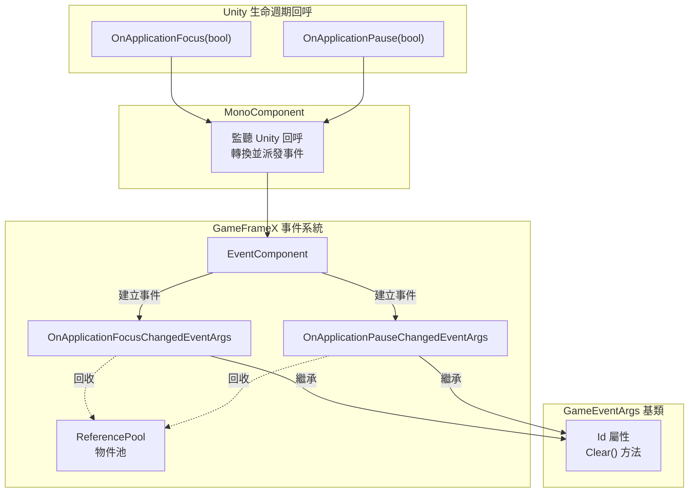
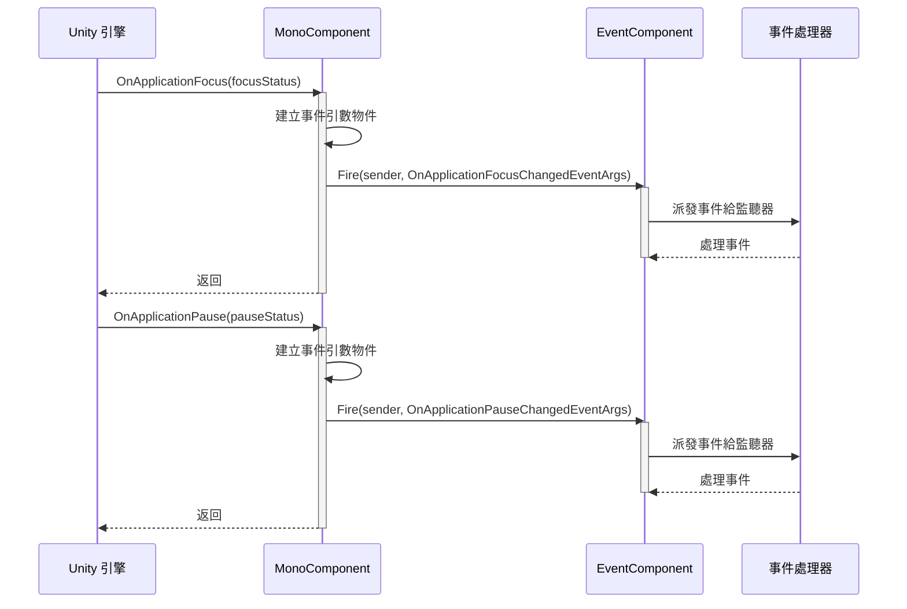

# 事件型別

本文件介紹 GameFrameX Mono 外掛中定義的事件型別，用於處理 Unity 應用程式生命週期中的焦點和暫停狀態變化。

## 概述

GameFrameX Mono 外掛提供了兩個核心事件型別，用於監聽 Unity 應用程式的生命週期變化。這些事件基於 GameFrameX 事件系統構建，支援物件池回收機制，可以高效地處理應用程式前後臺切換和暫停恢復場景。

**事件型別列表:**

| 事件型別 | 用途 | 事件ID |
|---------|------|--------|
| OnApplicationFocusChangedEventArgs | 應用程式前後臺切換事件 | 類的完整名稱 |
| OnApplicationPauseChangedEventArgs | 應用程式暫停/恢復事件 | 類的完整名稱 |

## 架構



**架構說明:**

1. **MonoComponent**: 掛載在場景中的 Unity 組件，監聽 Unity 生命週期回呼 (`OnApplicationFocus` 和 `OnApplicationPause`)
2. **事件轉換**: 將 Unity 的布林引數轉換為強型別的事件引數物件
3. **EventComponent**: GameFrameX 核心的事件組件，負責事件的派發和監聽管理
4. **事件引數**: 繼承自 `GameEventArgs` 基類，提供統一的介面和物件池支援

## 事件型別詳解

### OnApplicationFocusChangedEventArgs

應用程式前後臺切換事件，當應用程式獲得或失去焦點時觸發。

```csharp
public sealed class OnApplicationFocusChangedEventArgs : GameEventArgs
{
    /// <summary>
    /// 應用程式前後臺切換事件編號。
    /// </summary>
    public static readonly string EventId = typeof(OnApplicationFocusChangedEventArgs).FullName;

    /// <summary>
    /// 是否是前臺。
    /// </summary>
    public bool IsFocus { get; private set; }

    /// <summary>
    /// 建立應用程式前後臺切換事件。
    /// </summary>
    public static OnApplicationFocusChangedEventArgs Create(bool isFocus)
    {
        var args = ReferencePool.Acquire<OnApplicationFocusChangedEventArgs>();
        args.IsFocus = isFocus;
        return args;
    }

    /// <summary>
    /// 清理前後臺切換事件。
    /// </summary>
    public override void Clear()
    {
        IsFocus = false;
    }
}
```

> Source: [OnApplicationFocusChangedEventArgs.cs](https://github.com/GameFrameX/com.gameframex.unity.mono/blob/main/Runtime/EventArgs/OnApplicationFocusChangedEventArgs.cs#L40-L87)

**屬性說明:**

| 屬性 | 型別 | 說明 |
|-----|------|------|
| Id | string (override) | 返回事件唯一識別符號 |
| IsFocus | bool | true 表示獲得焦點（進入前臺），false 表示失去焦點（進入後臺） |

**使用場景:**
- 玩家切換到其他應用時暫停遊戲音樂
- 切換到後臺時儲存遊戲進度
- 檢測使用者是否正在與遊戲互動

### OnApplicationPauseChangedEventArgs

應用程式暫停狀態變化事件，當應用程式被暫停或恢復時觸發。

```csharp
public sealed class OnApplicationPauseChangedEventArgs : GameEventArgs
{
    /// <summary>
    /// 應用程式是否是暫停狀態變化事件編號。
    /// </summary>
    public static readonly string EventId = typeof(OnApplicationPauseChangedEventArgs).FullName;

    /// <summary>
    /// 是否暫停。
    /// </summary>
    public bool IsPause { get; private set; }

    /// <summary>
    /// 建立應用程式是否是暫停狀態變化事件。
    /// </summary>
    public static OnApplicationPauseChangedEventArgs Create(bool isPause)
    {
        var args = ReferencePool.Acquire<OnApplicationPauseChangedEventArgs>();
        args.IsPause = isPause;
        return args;
    }

    /// <summary>
    /// 清理應用程式是否是暫停狀態變化事件。
    /// </summary>
    public override void Clear()
    {
        IsPause = false;
    }
}
```

> Source: [OnApplicationPauseChangedEventArgs.cs](https://github.com/GameFrameX/com.gameframex.unity.mono/blob/main/Runtime/EventArgs/OnApplicationPauseChangedEventArgs.cs#L40-L88)

**屬性說明:**

| 屬性 | 型別 | 說明 |
|-----|------|------|
| Id | string (override) | 返回事件唯一識別符號 |
| IsPause | bool | true 表示應用程式暫停，false 表示應用程式恢復執行 |

**使用場景:**
- 暫停遊戲邏輯
- 顯示暫停介面
- 處理 iOS/Android 系統的來電中斷

## 事件流程



**流程說明:**

1. Unity 引擎檢測到應用程式焦點或暫停狀態變化
2. 呼叫 `MonoComponent` 的 `OnApplicationFocus` 或 `OnApplicationPause` 回呼
3. 建立對應的事件引數物件（使用 `Create` 靜態方法）
4. 透過 `EventComponent.Fire()` 派發事件
5. 所有訂閱該事件型別的處理器被依次呼叫
6. 事件處理完成後，物件被回收到 `ReferencePool` 供後續使用

## 使用示例

### 訂閱應用程式焦點變化事件

```csharp
using GameFrameX.Event.Runtime;
using GameFrameX.Mono.Runtime;

// 在需要監聽事件的類中
public class GameManager : MonoBehaviour
{
    private void Start()
    {
        // 訂閱應用程式焦點變化事件
        EventComponent.Instance.Subscribe<OnApplicationFocusChangedEventArgs>(OnAppFocusChanged);
    }

    private void OnDestroy()
    {
        // 取消訂閱事件（重要：防止記憶體洩漏）
        EventComponent.Instance.Unsubscribe<OnApplicationFocusChangedEventArgs>(OnAppFocusChanged);
    }

    private void OnAppFocusChanged(object sender, OnApplicationFocusChangedEventArgs e)
    {
        if (e.IsFocus)
        {
            Debug.Log("應用程式進入前臺");
            // 恢復遊戲
        }
        else
        {
            Debug.Log("應用程式進入後臺");
            // 儲存遊戲進度
        }
    }
}
```

> Source: [MonoComponent.cs](https://github.com/GameFrameX/com.gameframex.unity.mono/blob/main/Runtime/Mono/MonoComponent.cs#L100-L107)

### 訂閱應用程式暫停事件

```csharp
using GameFrameX.Event.Runtime;
using GameFrameX.Mono.Runtime;

public class PauseManager : MonoBehaviour
{
    private void Start()
    {
        EventComponent.Instance.Subscribe<OnApplicationPauseChangedEventArgs>(OnAppPauseChanged);
    }

    private void OnDestroy()
    {
        EventComponent.Instance.Unsubscribe<OnApplicationPauseChangedEventArgs>(OnAppPauseChanged);
    }

    private void OnAppPauseChanged(object sender, OnApplicationPauseChangedEventArgs e)
    {
        if (e.IsPause)
        {
            Debug.Log("遊戲已暫停");
            Time.timeScale = 0f; // 暫停遊戲時間
        }
        else
        {
            Debug.Log("遊戲已恢復");
            Time.timeScale = 1f; // 恢復遊戲時間
        }
    }
}
```

> Source: [MonoComponent.cs](https://github.com/GameFrameX/com.gameframex.unity.mono/blob/main/Runtime/Mono/MonoComponent.cs#L113-L120)

## 注意事項

1. **必須取消訂閱**: 在 `OnDestroy` 或組件銷燬時呼叫 `Unsubscribe` 取消事件訂閱，避免記憶體洩漏
2. **物件池機制**: 事件引數使用 ReferencePool 管理，建立事件時應使用 `Create` 方法而非直接例項化
3. **清理狀態**: 使用完事件後，系統會自動呼叫 `Clear()` 方法重置狀態並將物件回收到池中
4. **執行緒安全**: 事件派發在主執行緒進行，無需擔心執行緒安全問題

## 相關連結

- [MonoManager](./4-core-components.1-monomanager) - Mono 管理器文件
- [MonoComponent](./4-core-components.2-monocomponent) - Mono 組件文件
- [事件引數](./5-events.2-event-args) - 事件引數詳細說明
- [基礎使用](./3-getting-started.1-basic-usage) - 外掛基礎使用指南
