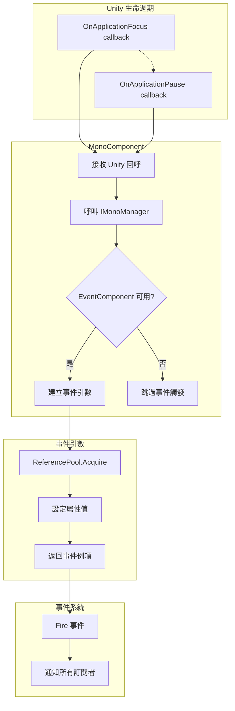

# 事件引數

事件引數（EventArgs）是 GameFrameX Mono 外掛中用於在應用程式生命週期事件觸發時傳遞資料的容器類。本文件詳細介紹當前外掛提供的兩種事件引數型別及其使用方式。

## 概述

在 Unity 應用程式執行過程中，某些系統級事件（如應用程式切換到後臺、暫停等）需要被其他模組感知並作出響應。事件引數（EventArgs）作為事件系統的核心組成部分，承擔著封裝事件相關資料的重要職責。

GameFrameX Mono 外掛基於 GameFrameX 事件系統構建，提供了兩種針對 Unity 應用程式生命週期的事件引數型別：

- **OnApplicationFocusChangedEventArgs**：應用程式前後臺切換事件
- **OnApplicationPauseChangedEventArgs**：應用程式暫停/恢復事件

這些事件引數採用物件池模式設計，透過 `ReferencePool` 實現物件的複用，有效減少了垃圾回收（GC）帶來的效能開銷。

## 架構設計

### 類圖結構

```mermaid
classDiagram
    class GameEventArgs {
        <<abstract>>
        +Id: string { get; }
        +Clear(): void
    }
    
    class OnApplicationFocusChangedEventArgs {
        +EventId: string
        +IsFocus: bool
        +Create(isFocus: bool): OnApplicationFocusChangedEventArgs
    }
    
    class OnApplicationPauseChangedEventArgs {
        +EventId: string
        +IsPause: bool
        +Create(isPause: bool): OnApplicationPauseChangedEventArgs
    }
    
    class ReferencePool {
        +Acquire~T~(): T
        +Release(instance): void
    }
    
    GameEventArgs <|-- OnApplicationFocusChangedEventArgs
    GameEventArgs <|-- OnApplicationPauseChangedEventArgs
    OnApplicationFocusChangedEventArgs ..> ReferencePool : uses
    OnApplicationPauseChangedEventArgs ..> ReferencePool : uses
```

### 事件流轉流程



## 核心組件詳解

### OnApplicationFocusChangedEventArgs

應用程式前後臺切換事件引數，當 Unity 應用程式的焦點狀態發生變化時觸發。

```csharp
public sealed class OnApplicationFocusChangedEventArgs : GameEventArgs
{
    /// <summary>
    /// 應用程式前後臺切換事件編號。
    /// </summary>
    public static readonly string EventId = typeof(OnApplicationFocusChangedEventArgs).FullName;

    /// <summary>
    /// 是否是前臺。
    /// </summary>
    public bool IsFocus { get; private set; }

    /// <summary>
    /// 建立應用程式前後臺切換事件。
    /// </summary>
    public static OnApplicationFocusChangedEventArgs Create(bool isFocus)
    {
        var loadDictionaryUpdateChangedEventArgs = ReferencePool.Acquire<OnApplicationFocusChangedEventArgs>();
        loadDictionaryUpdateChangedEventArgs.IsFocus = isFocus;
        return loadDictionaryUpdateChangedEventArgs;
    }

    /// <summary>
    /// 清理前後臺切換事件。
    /// </summary>
    public override void Clear()
    {
        IsFocus = false;
    }
}
```

> Source: [OnApplicationFocusChangedEventArgs.cs](https://github.com/GameFrameX/com.gameframex.unity.mono/blob/main/Runtime/EventArgs/OnApplicationFocusChangedEventArgs.cs#L40-L87)

**屬性說明：**

| 屬性 | 型別 | 說明 |
|------|------|------|
| EventId | string | 事件的唯一識別符號，使用型別的完全限定名 |
| IsFocus | bool | 應用程式是否獲得焦點，`true` 表示在前臺，`false` 表示在後臺 |

### OnApplicationPauseChangedEventArgs

應用程式暫停狀態變化事件引數，當 Unity 應用程式的暫停狀態發生變化時觸發。

```csharp
public sealed class OnApplicationPauseChangedEventArgs : GameEventArgs
{
    /// <summary>
    /// 應用程式是否是暫停狀態變化事件編號。
    /// </summary>
    public static readonly string EventId = typeof(OnApplicationPauseChangedEventArgs).FullName;

    /// <summary>
    /// 是否暫停。
    /// </summary>
    public bool IsPause { get; private set; }

    /// <summary>
    /// 建立應用程式是否是暫停狀態變化事件。
    /// </summary>
    public static OnApplicationPauseChangedEventArgs Create(bool isPause)
    {
        var loadDictionaryUpdateEventArgs = ReferencePool.Acquire<OnApplicationPauseChangedEventArgs>();
        loadDictionaryUpdateEventArgs.IsPause = isPause;
        return loadDictionaryUpdateEventArgs;
    }

    /// <summary>
    /// 清理應用程式是否是暫停狀態變化事件。
    /// </summary>
    public override void Clear()
    {
        IsPause = false;
    }
}
```

> Source: [OnApplicationPauseChangedEventArgs.cs](https://github.com/GameFrameX/com.gameframex.unity.mono/blob/main/Runtime/EventArgs/OnApplicationPauseChangedEventArgs.cs#L40-L88)

**屬性說明：**

| 屬性 | 型別 | 說明 |
|------|------|------|
| EventId | string | 事件的唯一識別符號，使用型別的完全限定名 |
| IsPause | bool | 應用程式是否暫停，`true` 表示暫停，`false` 表示恢復 |

## 事件觸發時機

### OnApplicationFocus 事件

當應用程式獲得或失去焦點時觸發。在 Unity 中，這是由 `MonoBehaviour.OnApplicationFocus(bool)` 回呼觸發的。

```csharp
/// <summary>
/// 當應用程式失去或獲得焦點時呼叫。
/// </summary>
/// <param name="focusStatus">應用程式的焦點狀態。true 表示獲得焦點，false 表示失去焦點。</param>
private void OnApplicationFocus(bool focusStatus)
{
    _monoManager.OnApplicationFocus(focusStatus);
    if (m_EventComponent != null)
    {
        m_EventComponent.Fire(this, OnApplicationFocusChangedEventArgs.Create(focusStatus));
    }
}
```

> Source: [MonoComponent.cs](https://github.com/GameFrameX/com.gameframex.unity.mono/blob/main/Runtime/Mono/MonoComponent.cs#L96-L107)

### OnApplicationPause 事件

當應用程式暫停或恢復時觸發。在 Unity 中，這是由 `MonoBehaviour.OnApplicationPause(bool)` 回呼觸發的。

```csharp
/// <summary>
/// 當應用程式暫停或恢復時呼叫。
/// </summary>
/// <param name="pauseStatus">應用程式的暫停狀態。true 表示暫停，false 表示恢復。</param>
private void OnApplicationPause(bool pauseStatus)
{
    _monoManager.OnApplicationPause(pauseStatus);
    if (m_EventComponent != null)
    {
        m_EventComponent.Fire(this, OnApplicationPauseChangedEventArgs.Create(pauseStatus));
    }
}
```

> Source: [MonoComponent.cs](https://github.com/GameFrameX/com.gameframex.unity.mono/blob/main/Runtime/Mono/MonoComponent.cs#L109-L120)

## 使用示例

### 訂閱應用程式前後臺事件

```csharp
using GameFrameX.Event.Runtime;
using GameFrameX.Mono.Runtime;

public class GameController : MonoBehaviour
{
    private void Start()
    {
        // 訂閱應用程式焦點變化事件
        EventComponent.Instance.Subscribe<OnApplicationFocusChangedEventArgs>(OnFocusChanged);
        
        // 訂閱應用程式暫停變化事件
        EventComponent.Instance.Subscribe<OnApplicationPauseChangedEventArgs>(OnPauseChanged);
    }

    private void OnDestroy()
    {
        // 取消訂閱事件
        EventComponent.Instance.Unsubscribe<OnApplicationFocusChangedEventArgs>(OnFocusChanged);
        EventComponent.Instance.Unsubscribe<OnApplicationPauseChangedEventArgs>(OnPauseChanged);
    }

    private void OnFocusChanged(object sender, OnApplicationFocusChangedEventArgs e)
    {
        if (e.IsFocus)
        {
            Debug.Log("應用程式獲得焦點 - 進入前臺");
        }
        else
        {
            Debug.Log("應用程式失去焦點 - 進入後臺");
        }
    }

    private void OnPauseChanged(object sender, OnApplicationPauseChangedEventArgs e)
    {
        if (e.IsPause)
        {
            Debug.Log("應用程式暫停");
        }
        else
        {
            Debug.Log("應用程式恢復");
        }
    }
}
```

> Source: [MonoComponent.cs](https://github.com/GameFrameX/com.gameframex.unity.mono/blob/main/Runtime/Mono/MonoComponent.cs#L64-L120)

### 處理移動端生命週期事件

在移動裝置上，應用程式經常會在不同狀態之間切換，以下示例展示如何處理這些場景：

```csharp
public class MobileLifecycleHandler : MonoBehaviour
{
    private bool _isBackground;

    private void OnEnable()
    {
        EventComponent.Instance.Subscribe<OnApplicationFocusChangedEventArgs>(HandleFocusChange);
        EventComponent.Instance.Subscribe<OnApplicationPauseChangedEventArgs>(HandlePauseChange);
    }

    private void OnDisable()
    {
        EventComponent.Instance.Unsubscribe<OnApplicationFocusChangedEventArgs>(HandleFocusChange);
        EventComponent.Instance.Unsubscribe<OnApplicationPauseChangedEventArgs>(HandlePauseChange);
    }

    private void HandleFocusChange(object sender, OnApplicationFocusChangedEventArgs e)
    {
        _isBackground = !e.IsFocus;
        
        if (_isBackground)
        {
            // 儲存遊戲進度
            SaveGame();
        }
        else
        {
            // 恢復遊戲
            ResumeGame();
        }
    }

    private void HandlePauseChange(object sender, OnApplicationPauseChangedEventArgs e)
    {
        if (e.IsPause)
        {
            // 暫停時暫停音樂
            AudioManager.Instance.PauseMusic();
        }
        else
        {
            // 恢復時繼續音樂
            AudioManager.Instance.ResumeMusic();
        }
    }
}
```

## 設計模式說明

### 物件池模式

事件引數類採用物件池模式設計，具有以下優勢：

1. **減少 GC 壓力**：透過複用物件，避免頻繁建立和銷燬事件引數例項
2. **提高效能**：物件池可以預分配物件，減少記憶體分配的開銷

物件池的核心方法：

```csharp
// 從物件池獲取例項
ReferencePool.Acquire<OnApplicationFocusChangedEventArgs>();

// 釋放例項回物件池（透過 Clear 方法）
public override void Clear()
{
    IsFocus = false;
}
```

### 工廠方法模式

每個事件引數類都提供一個靜態的 `Create()` 工廠方法：

- **封裝建立邏輯**：將物件獲取和屬性初始化的邏輯封裝在工廠方法中
- **保證一致性**：確保每次建立的事件引數都經過正確初始化
- **簡化呼叫**：使用者只需呼叫一個方法即可獲取完整配置的事件引數

## API 參考

### OnApplicationFocusChangedEventArgs

#### 屬性

| 屬性名 | 型別 | 訪問級別 | 說明 |
|--------|------|----------|------|
| EventId | string | public static readonly | 事件唯一識別符號 |
| Id | string | public override | 重寫的基類屬性，返回 EventId |
| IsFocus | bool | public get; private set | 應用程式是否在前臺 |

#### 方法

| 方法名 | 返回型別 | 說明 |
|--------|----------|------|
| Create(bool isFocus) | OnApplicationFocusChangedEventArgs | 靜態工廠方法，建立事件例項 |
| Clear() | void | 重置事件狀態，用於物件池回收 |

---

### OnApplicationPauseChangedEventArgs

#### 屬性

| 屬性名 | 型別 | 訪問級別 | 說明 |
|--------|------|----------|------|
| EventId | string | public static readonly | 事件唯一識別符號 |
| Id | string | public override | 重寫的基類屬性，返回 EventId |
| IsPause | bool | public get; private set | 應用程式是否暫停 |

#### 方法

| 方法名 | 返回型別 | 說明 |
|--------|----------|------|
| Create(bool isPause) | OnApplicationPauseChangedEventArgs | 靜態工廠方法，建立事件例項 |
| Clear() | void | 重置事件狀態，用於物件池回收 |

## 相關連結

- [事件型別](./5-events.1-event-types) - 瞭解 GameFrameX 事件系統的完整型別體系
- [MonoComponent](./4-core-components.2-monocomponent) - 瞭解如何觸發這些事件的組件
- [MonoManager](./4-core-components.1-monomanager) - 瞭解 Mono 管理器的核心功能
