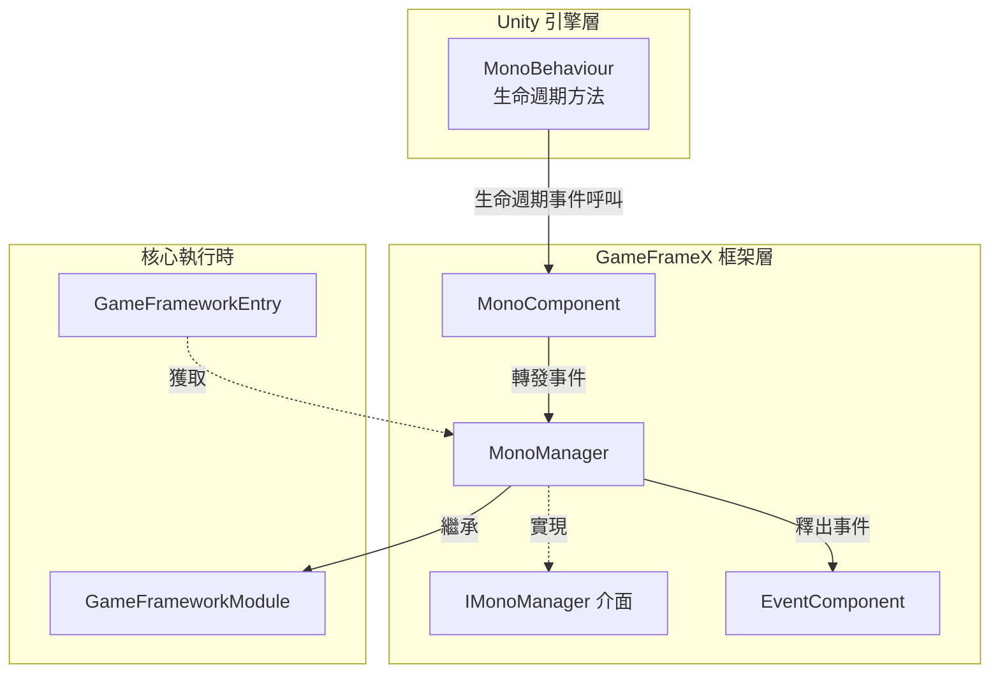
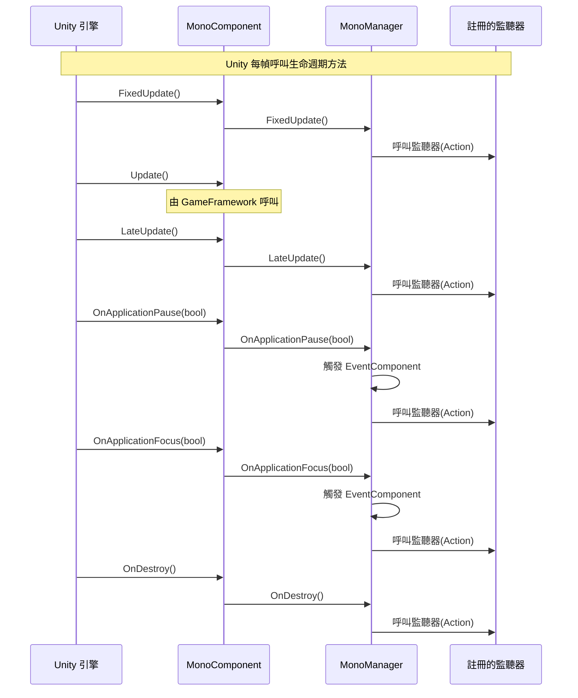
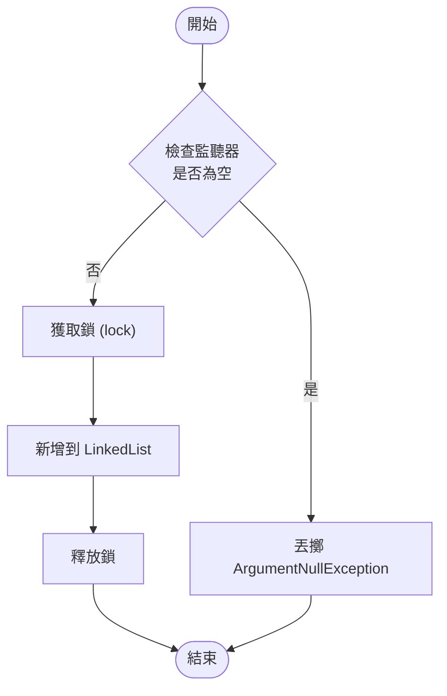

# MonoManager

MonoManager 是 GameFrameX 框架中的核心模組，負責統一管理 Unity MonoBehaviour 的生命週期事件，包括 Update、FixedUpdate、LateUpdate、OnDestroy、OnApplicationPause 和 OnApplicationFocus 等。

## 概述

MonoManager 提供了一種集中管理 Unity 生命週期事件的機制。在傳統的 Unity 開發中，開發者通常需要在每個 MonoBehaviour 指令碼中分別實現這些生命週期方法，這導致程式碼分散且難以維護。MonoManager 透過觀察者模式（監聽器模式），允許開發者在任意位置註冊和登出對特定生命週期事件的監聽，從而實現程式碼的解耦。

該模組繼承自 `GameFrameworkModule`，是 GameFrameX 框架的核心組件之一。它透過 `MonoComponent` 與 Unity 引擎的 MonoBehaviour 生命週期進行橋接，將 Unity 的生命週期事件統一收集並分發給已註冊的監聽器。

### 核心功能

- **統一的事件管理**：集中管理所有 MonoBehaviour 生命週期事件
- **執行緒安全**：使用鎖機制確保多執行緒環境下的安全訪問
- **效能最佳化**：使用 Unity Profiler 進行效能分析
- **事件轉發**：支援透過 EventComponent 將應用焦點和暫停事件作為框架事件釋出

## 架構



### 組件說明

| 組件 | 角色 | 描述 |
|------|------|------|
| MonoBehaviour | Unity 入口 | Unity 引擎的生命週期回呼入口 |
| MonoComponent | 橋接器 | 將 Unity 生命週期事件轉發給 MonoManager |
| MonoManager | 核心管理器 | 管理和分發所有生命週期事件監聽器 |
| IMonoManager | 介面定義 | 定義 MonoManager 的公開介面 |
| EventComponent | 事件系統 | 將部分事件轉換為框架事件釋出 |

## 工作流程

### 事件迴圈流程



### 監聽器註冊流程



## 使用示例

### 基本使用

透過 `MonoComponent` 新增 Update 監聽器：

```csharp
using UnityEngine;
using GameFrameX.Mono.Runtime;

public class ExampleScript : MonoBehaviour
{
    private MonoComponent _monoComponent;

    private void Awake()
    {
        // 獲取 MonoComponent 組件（需在場景中已新增）
        _monoComponent = GetComponent<MonoComponent>();
    }

    private void OnEnable()
    {
        // 新增 Update 監聽器
        _monoComponent.AddUpdateListener(OnUpdate);
    }

    private void OnDisable()
    {
        // 移除 Update 監聽器
        _monoComponent.RemoveUpdateListener(OnUpdate);
    }

    private void OnUpdate(float elapseSeconds, float realElapseSeconds)
    {
        // 在每幀 Update 時執行
        Debug.Log($"Update: {elapseSeconds:F2}s");
    }
}
```
> Source: [MonoComponent.cs](https://github.com/GameFrameX/com.gameframex.unity.mono/blob/main/Runtime/Mono/MonoComponent.cs#L186-L195)

### 使用 FixedUpdate

FixedUpdate 適用於物理相關的更新，每隔固定時間呼叫：

```csharp
private MonoComponent _monoComponent;

private void OnEnable()
{
    // 新增 FixedUpdate 監聽器
    _monoComponent.AddFixedUpdateListener(OnFixedUpdate);
}

private void OnDisable()
{
    // 移除 FixedUpdate 監聽器
    _monoComponent.RemoveFixedUpdateListener(OnFixedUpdate);
}

private void OnFixedUpdate(float elapseSeconds, float realElapseSeconds)
{
    // 物理更新邏輯
}
```
> Source: [MonoComponent.cs](https://github.com/GameFrameX/com.gameframex.unity.mono/blob/main/Runtime/Mono/MonoComponent.cs#L156-L164)

### 監聽應用暫停事件

```csharp
private MonoComponent _monoComponent;

private void OnEnable()
{
    // 監聽應用暫停事件
    _monoComponent.AddOnApplicationPauseListener(OnApplicationPause);
}

private void OnDisable()
{
    // 移除應用暫停監聽器
    _monoComponent.RemoveOnApplicationPauseListener(OnApplicationPause);
}

private void OnApplicationPause(bool pauseStatus)
{
    if (pauseStatus)
    {
        Debug.Log("遊戲已暫停");
    }
    else
    {
        Debug.Log("遊戲已恢復");
    }
}
```
> Source: [MonoComponent.cs](https://github.com/GameFrameX/com.gameframex.unity.mono/blob/main/Runtime/Mono/MonoComponent.cs#L246-L254)

### 監聽應用焦點事件

```csharp
private MonoComponent _monoComponent;

private void OnEnable()
{
    // 監聽應用焦點變化事件
    _monoComponent.AddOnApplicationFocusListener(OnApplicationFocus);
}

private void OnDisable()
{
    // 移除應用焦點監聽器
    _monoComponent.RemoveOnApplicationFocusListener(OnApplicationFocus);
}

private void OnApplicationFocus(bool focusStatus)
{
    Debug.Log(focusStatus ? "應用獲得焦點" : "應用失去焦點");
}
```
> Source: [MonoComponent.cs](https://github.com/GameFrameX/com.gameframex.unity.mono/blob/main/Runtime/Mono/MonoComponent.cs#L276-L284)

### 監聽銷燬事件

```csharp
private MonoComponent _monoComponent;

private void OnEnable()
{
    // 監聽物件銷燬事件
    _monoComponent.AddDestroyListener(OnDestroyCallback);
}

private void OnDisable()
{
    // 移除銷燬監聽器
    _monoComponent.RemoveDestroyListener(OnDestroyCallback);
}

private void OnDestroyCallback()
{
    // 物件銷燬時的清理邏輯
    Debug.Log("物件即將銷燬，執行清理...");
}
```
> Source: [MonoComponent.cs](https://github.com/GameFrameX/com.gameframex.unity.mono/blob/main/Runtime/Mono/MonoComponent.cs#L216-L224)

## API 參考

### IMonoManager 介面

`IMonoManager` 介面定義了 MonoManager 的所有公開方法。

#### Update 監聽器

```csharp
void AddUpdateListener(Action<float, float> action)
```
新增一個在 Update 期間呼叫的監聽器。

**引數：**
- `action` (Action<float, float>)：監聽器函式。第一個引數是流逝時間，第二個引數是真實流逝時間。

```csharp
void RemoveUpdateListener(Action<float, float> action)
```
從 Update 中移除一個監聽器。

**引數：**
- `action` (Action<float, float>)：監聽器函式。

#### FixedUpdate 監聽器

```csharp
void AddFixedUpdateListener(Action<float, float> action)
```
新增一個在 FixedUpdate 期間呼叫的監聽器。

**引數：**
- `action` (Action<float, float>)：監聽器函式。第一個引數是流逝時間，第二個引數是固定流逝時間。

```csharp
void RemoveFixedUpdateListener(Action<float, float> action)
```
從 FixedUpdate 中移除一個監聽器。

**引數：**
- `action` (Action<float, float>)：監聽器函式。

#### LateUpdate 監聽器

```csharp
void AddLateUpdateListener(Action<float, float> action)
```
新增一個在 LateUpdate 期間呼叫的監聽器。

**引數：**
- `action` (Action<float, float>)：監聽器函式。第一個引數是流逝時間，第二個引數是固定流逝時間。

```csharp
void RemoveLateUpdateListener(Action<float, float> action)
```
從 LateUpdate 中移除一個監聽器。

**引數：**
- `action` (Action<float, float>)：監聽器函式。

#### Destroy 監聽器

```csharp
void AddDestroyListener(Action action)
```
新增一個在 OnDestroy 期間呼叫的監聽器。

**引數：**
- `action` (Action)：監聽器函式。

```csharp
void RemoveDestroyListener(Action action)
```
從 Destroy 中移除一個監聽器。

**引數：**
- `action` (Action)：監聽器函式。

#### ApplicationPause 監聽器

```csharp
void AddOnApplicationPauseListener(Action<bool> action)
```
新增一個在 OnApplicationPause 期間呼叫的監聽器。

**引數：**
- `action` (`Action<bool>`)：監聽器函式。引數為暫停狀態。

```csharp
void RemoveOnApplicationPauseListener(Action<bool> action)
```
從 OnApplicationPause 中移除一個監聽器。

**引數：**
- `action` (`Action<bool>`)：監聽器函式。

#### ApplicationFocus 監聽器

```csharp
void AddOnApplicationFocusListener(Action<bool> action)
```
新增一個在 OnApplicationFocus 期間呼叫的監聽器。

**引數：**
- `action` (`Action<bool>`)：監聽器函式。引數為焦點狀態。

```csharp
void RemoveOnApplicationFocusListener(Action<bool> action)
```
從 OnApplicationFocus 中移除一個監聽器。

**引數：**
- `action` (`Action<bool>`)：監聽器函式。

### MonoManager 內部方法

以下方法由 MonoComponent 呼叫，不建議直接使用：

```csharp
void FixedUpdate()
```
在固定的幀率下呼叫。

```csharp
void LateUpdate()
```
在所有 Update 函式呼叫後每幀呼叫。

```csharp
void OnDestroy()
```
當 MonoBehaviour 將被銷燬時呼叫。

```csharp
void OnApplicationFocus(bool focusStatus)
```
當應用程式失去或獲得焦點時呼叫。

**引數：**
- `focusStatus` (bool)：應用程式的焦點狀態。true 表示獲得焦點，false 表示失去焦點。

```csharp
void OnApplicationPause(bool pauseStatus)
```
當應用程式暫停或恢復時呼叫。

**引數：**
- `pauseStatus` (bool)：應用程式的暫停狀態。true 表示暫停，false 表示恢復。

## 設計意圖

### 為什麼使用監聽器模式而非繼承

傳統的 Unity 開發中，開發者通常需要讓指令碼繼承 MonoBehaviour 並重寫其生命週期方法。這種方式存在以下問題：
1. **程式碼耦合**：業務邏輯與 Unity 生命週期方法緊密耦合
2. **難以測試**：難以對業務邏輯進行單元測試
3. **維護困難**：生命週期邏輯散落在各個指令碼中

MonoManager 透過監聽器模式解決了這些問題，允許在任意位置註冊監聽器，實現更好的程式碼解耦。

### 執行緒安全的考慮

MonoManager 使用 `lock` 關鍵字保護所有監聽器佇列的修改操作，確保在多執行緒環境下（如使用 Job System 或多執行緒指令碼時）仍然能夠安全地新增和移除監聽器。

### 效能最佳化

1. **Unity Profiler 整合**：使用 `Profiler.BeginSample` 和 `Profiler.EndSample` 標記關鍵效能路徑，便於在 Unity Profiler 中分析效能瓶頸。
2. **異常隔離**：每個監聽器的呼叫都包含在 try-catch 塊中，確保單個監聽器的異常不會影響其他監聽器的執行。
3. **LinkedList 最佳化**：使用 LinkedList 儲存監聽器，相比 List 具有 O(1) 的新增和移除時間複雜度。

## 相關連結

- [MonoComponent](./4-core-components.2-monocomponent) - MonoComponent 組件文件
- [事件型別](./5-events.1-event-types) - 框架事件型別
- [事件引數](./5-events.2-event-args) - 框架事件引數
- [GitHub 倉庫](https://github.com/GameFrameX/com.gameframex.unity.mono.git) - 官方 GitHub 倉庫
- [官方文件](https://gameframex.doc.alianblank.com/) - GameFrameX 官方文件
