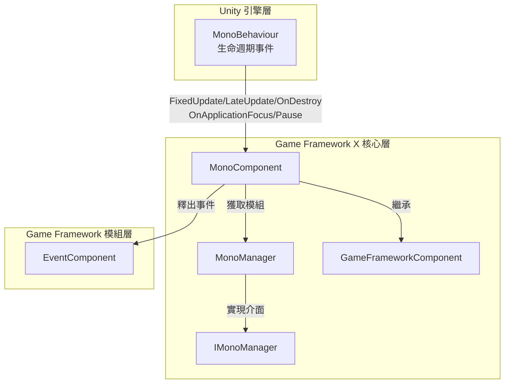

# MonoComponent

MonoComponent 是 Game Framework X 中的核心組件之一，負責管理 Unity MonoBehaviour 的生命週期事件，並提供統一的介面讓外部新增和移除各種更新迴圈事件的監聽器。

## 概述

MonoComponent 繼承自 `GameFrameworkComponent`，是一個 Unity `MonoBehaviour` 組件。它作為 Game Framework 與 Unity 生命週期事件系統之間的橋樑，主要功能包括：

1. **生命週期事件代理**：將 Unity 的 `Update`、`FixedUpdate`、`LateUpdate`、`OnDestroy` 等生命週期方法委託給內部的 `MonoManager` 處理
2. **事件監聽器管理**：提供新增和移除各類事件監聽器的公共介面
3. **應用級事件轉發**：整合 EventComponent，在應用焦點變化或暫停狀態變化時釋出相應的事件

### 核心特性

- **執行緒安全**：使用 `lock` 機制確保多執行緒環境下監聽器列表的安全性
- **異常處理**：監聽器執行過程中使用 try-catch 捕獲異常，避免單個監聽器錯誤影響整體系統
- **效能最佳化**：整合 Unity Profiler，支援效能分析
- **事件釋出**：自動釋出應用級事件（`OnApplicationFocusChangedEventArgs`、`OnApplicationPauseChangedEventArgs`）

## 架構

MonoComponent 在 Game Framework X 中的架構位置如下：



### 組件互動流程

```mermaid
sequenceDiagram
    participant Unity as Unity 引擎
    participant MC as MonoComponent
    participant MM as MonoManager
    participant EC as EventComponent
    participant Listener as 業務監聽器

    Unity->>MC: Awake()
    MC->>MC: 初始化組件型別和介面
    MC->>MM: GetModule&lt;IMonoManager&gt;()
    MC->>EC: GameEntry.GetComponent&lt;EventComponent&gt;()

    Unity->>MC: Update(deltaTime, realDeltaTime)
    MC->>MM: Update()
    MM->>MM: QueueInvoking(_updateQueue)
    MM->>Listener: 回呼 Update 監聽器

    Unity->>MC: OnApplicationFocus(focusStatus)
    MC->>MM: OnApplicationFocus(focusStatus)
    MC->>EC: Fire(this, OnApplicationFocusChangedEventArgs)
    EC->>Listener: 通知關注該事件的組件

    Unity->>MC: OnApplicationPause(pauseStatus)
    MC->>MM: OnApplicationPause(pauseStatus)
    MC->>EC: Fire(this, OnApplicationPauseChangedEventArgs)
```

## 核心功能

### 1. Update 監聽器管理

MonoComponent 允許你新增和移除 `Update` 事件的監聽器。`Update` 在每幀呼叫，是最常用的更新迴圈。

```csharp
// 新增 Update 監聽器
MonoComponent.Instance.AddUpdateListener(OnGameUpdate);

// 移除 Update 監聽器
MonoComponent.Instance.RemoveUpdateListener(OnGameUpdate);

// 監聽器回呼函式簽名
private void OnGameUpdate(float elapseSeconds, float realElapseSeconds)
{
    // elapseSeconds: 距離上一幀的流逝時間
    // realElapseSeconds: 真實的流逝時間（不受時間縮放影響）
}
```

> Source: [MonoComponent.cs](https://github.com/GameFrameX/com.gameframex.unity.mono/blob/main/Runtime/Mono/MonoComponent.cs#L186-L210)

### 2. FixedUpdate 監聽器管理

`FixedUpdate` 以固定時間間隔呼叫，適合物理相關的邏輯。

```csharp
// 新增 FixedUpdate 監聽器
MonoComponent.Instance.AddFixedUpdateListener(OnFixedUpdate);

// 移除 FixedUpdate 監聽器
MonoComponent.Instance.RemoveFixedUpdateListener(OnFixedUpdate);

// 監聽器回呼函式簽名
private void OnFixedUpdate(float elapseSeconds, float fixedElapseSeconds)
{
    // elapseSeconds: 距離上一幀的流逝時間
    // fixedElapseSeconds: 固定的時間間隔
}
```

> Source: [MonoComponent.cs](https://github.com/GameFrameX/com.gameframex.unity.mono/blob/main/Runtime/Mono/MonoComponent.cs#L156-L180)

### 3. LateUpdate 監聽器管理

`LateUpdate` 在所有 `Update` 方法之後呼叫，適合需要等待其他更新完成後再執行的邏輯。

```csharp
// 新增 LateUpdate 監聽器
MonoComponent.Instance.AddLateUpdateListener(OnLateUpdate);

// 移除 LateUpdate 監聽器
MonoComponent.Instance.RemoveLateUpdateListener(OnLateUpdate);

// 監聽器回呼函式簽名
private void OnLateUpdate(float elapseSeconds, float fixedElapseSeconds)
{
    // elapseSeconds: 距離上一幀的流逝時間
    // fixedElapseSeconds: 固定的時間間隔
}
```

> Source: [MonoComponent.cs](https://github.com/GameFrameX/com.gameframex.unity.mono/blob/main/Runtime/Mono/MonoComponent.cs#L126-L150)

### 4. OnDestroy 監聽器管理

`OnDestroy` 在組件被銷燬時呼叫，適合做清理工作。

```csharp
// 新增 OnDestroy 監聽器
MonoComponent.Instance.AddDestroyListener(OnGameDestroy);

// 移除 OnDestroy 監聽器
MonoComponent.Instance.RemoveDestroyListener(OnGameDestroy);

// 監聽器回呼函式簽名
private void OnGameDestroy()
{
    // 清理資源、取消訂閱事件等
}
```

> Source: [MonoComponent.cs](https://github.com/GameFrameX/com.gameframex.unity.mono/blob/main/Runtime/Mono/MonoComponent.cs#L216-L240)

### 5. 應用焦點變化監聽

監聽應用獲得或失去焦點的事件。

```csharp
// 新增應用焦點變化監聽器
MonoComponent.Instance.AddOnApplicationFocusListener(OnAppFocusChanged);

// 移除應用焦點變化監聽器
MonoComponent.Instance.RemoveOnApplicationFocusListener(OnAppFocusChanged);

// 監聽器回呼函式簽名
private void OnAppFocusChanged(bool hasFocus)
{
    // hasFocus: true 表示獲得焦點，false 表示失去焦點
    Debug.Log($"應用焦點狀態: {(hasFocus ? "獲得焦點" : "失去焦點")}");
}
```

> Source: [MonoComponent.cs](https://github.com/GameFrameX/com.gameframex.unity.mono/blob/main/Runtime/Mono/MonoComponent.cs#L276-L300)

### 6. 應用暫停狀態監聽

監聽應用暫停或恢復執行的事件。

```csharp
// 新增應用暫停狀態監聽器
MonoComponent.Instance.AddOnApplicationPauseListener(OnAppPauseChanged);

// 移除應用暫停狀態監聽器
MonoComponent.Instance.RemoveOnApplicationPauseListener(OnAppPauseChanged);

// 監聽器回呼函式簽名
private void OnAppPauseChanged(bool isPaused)
{
    // isPaused: true 表示暫停，false 表示恢復
    Debug.Log($"應用暫停狀態: {(isPaused ? "已暫停" : "已恢復")}");
}
```

> Source: [MonoComponent.cs](https://github.com/GameFrameX/com.gameframex.unity.mono/blob/main/Runtime/Mono/MonoComponent.cs#L246-L270)

## 使用示例

### 基礎用法

以下示例展示瞭如何註冊一個簡單的 Update 監聽器：

```csharp
using GameFrameX.Mono.Runtime;
using UnityEngine;

public class GameLoopExample : MonoBehaviour
{
    private void Start()
    {
        // 新增 Update 監聽器
        MonoComponent.Instance.AddUpdateListener(OnUpdate);
    }

    private void OnUpdate(float elapseSeconds, float realElapseSeconds)
    {
        // 在這裡執行每幀需要更新的邏輯
        // 例如：移動角色、處理輸入等
    }

    private void OnDestroy()
    {
        // 移除監聽器，避免記憶體洩漏
        MonoComponent.Instance.RemoveUpdateListener(OnUpdate);
    }
}
```

> Source: [MonoComponent.cs](https://github.com/GameFrameX/com.gameframex.unity.mono/blob/main/Runtime/Mono/MonoComponent.cs#L182-L211)

### 高階用法：使用事件系統

除了直接新增監聽器，還可以透過事件系統訂閱應用級事件：

```csharp
using GameFrameX.Event.Runtime;
using GameFrameX.Mono.Runtime;
using UnityEngine;

public class AppStateExample : MonoBehaviour
{
    private void Start()
    {
        // 訂閱應用暫停事件
        var eventComponent = GameEntry.GetComponent<EventComponent>();
        eventComponent.Subscribe(OnApplicationPauseChangedEventArgs.EventId, OnAppPauseHandler);
        
        // 訂閱應用焦點事件
        eventComponent.Subscribe(OnApplicationFocusChangedEventArgs.EventId, OnAppFocusHandler);
    }

    private void OnAppPauseHandler(object sender, GameEventArgs e)
    {
        var args = e as OnApplicationPauseChangedEventArgs;
        Debug.Log($"應用暫停狀態變化: {(args.IsPause ? "暫停" : "恢復")}");
    }

    private void OnAppFocusHandler(object sender, GameEventArgs e)
    {
        var args = e as OnApplicationFocusChangedEventArgs;
        Debug.Log($"應用焦點變化: {(args.IsFocus ? "獲得焦點" : "失去焦點")}");
    }

    private void OnDestroy()
    {
        // 取消訂閱事件
        var eventComponent = GameEntry.GetComponent<EventComponent>();
        eventComponent.Unsubscribe(OnApplicationPauseChangedEventArgs.EventId, OnAppPauseHandler);
        eventComponent.Unsubscribe(OnApplicationFocusChangedEventArgs.EventId, OnAppFocusHandler);
    }
}
```

> Source: [MonoComponent.cs](https://github.com/GameFrameX/com.gameframex.unity.mono/blob/main/Runtime/Mono/MonoComponent.cs#L99-L120)

### 典型應用場景

| 場景 | 推薦使用的事件 | 說明 |
|------|---------------|------|
| 遊戲邏輯更新 | `Update` | 每幀執行的常規遊戲邏輯 |
| 物理計算 | `FixedUpdate` | 物理引擎相關邏輯，需要固定時間步長 |
| 相機跟隨 | `LateUpdate` | 在所有移動邏輯完成後執行相機跟隨 |
| 資源清理 | `OnDestroy` | 組件銷燬時的清理工作 |
| 後臺執行處理 | `OnApplicationPause` | 切換到後臺時暫停/恢復遊戲 |
| 切屏處理 | `OnApplicationFocus` | 處理應用失去/獲得焦點 |

## API 參考

### MonoComponent 公共方法

#### `AddUpdateListener(Action<float, float> fun)`

新增 Update 監聽器。

**引數：**
- `fun` (Action&lt;float, float&gt;): Update 回呼函式，第一個引數是流逝時間，第二個引數是真實流逝時間。

**示例：**
```csharp
MonoComponent.Instance.AddUpdateListener((elapsed, realElapsed) => {
    // 處理更新邏輯
});
```

> Source: [MonoComponent.cs#L186-L195](https://github.com/GameFrameX/com.gameframex.unity.mono/blob/main/Runtime/Mono/MonoComponent.cs#L186-L195)

---

#### `RemoveUpdateListener(Action<float, float> fun)`

移除 Update 監聽器。

**引數：**
- `fun` (Action&lt;float, float&gt;): 要移除的 Update 回呼函式。

> Source: [MonoComponent.cs#L201-L210](https://github.com/GameFrameX/com.gameframex.unity.mono/blob/main/Runtime/Mono/MonoComponent.cs#L201-L210)

---

#### `AddFixedUpdateListener(Action<float, float> fun)`

新增 FixedUpdate 監聽器。

**引數：**
- `fun` (Action&lt;float, float&gt;): FixedUpdate 回呼函式，第一個引數是流逝時間，第二個引數是固定流逝時間。

> Source: [MonoComponent.cs#L156-L165](https://github.com/GameFrameX/com.gameframex.unity.mono/blob/main/Runtime/Mono/MonoComponent.cs#L156-L165)

---

#### `RemoveFixedUpdateListener(Action<float, float> fun)`

移除 FixedUpdate 監聽器。

**引數：**
- `fun` (Action&lt;float, float&gt;): 要移除的 FixedUpdate 回呼函式。

> Source: [MonoComponent.cs#L171-L180](https://github.com/GameFrameX/com.gameframex.unity.mono/blob/main/Runtime/Mono/MonoComponent.cs#L171-L180)

---

#### `AddLateUpdateListener(Action<float, float> fun)`

新增 LateUpdate 監聽器。

**引數：**
- `fun` (Action&lt;float, float&gt;): LateUpdate 回呼函式，第一個引數是流逝時間，第二個引數是固定流逝時間。

> Source: [MonoComponent.cs#L126-L135](https://github.com/GameFrameX/com.gameframex.unity.mono/blob/main/Runtime/Mono/MonoComponent.cs#L126-L135)

---

#### `RemoveLateUpdateListener(Action<float, float> fun)`

移除 LateUpdate 監聽器。

**引數：**
- `fun` (Action&lt;float, float&gt;): 要移除的 LateUpdate 回呼函式。

> Source: [MonoComponent.cs#L141-L150](https://github.com/GameFrameX/com.gameframex.unity.mono/blob/main/Runtime/Mono/MonoComponent.cs#L141-L150)

---

#### `AddDestroyListener(Action fun)`

新增 OnDestroy 監聽器。

**引數：**
- `fun` (Action): OnDestroy 回呼函式，無引數。

> Source: [MonoComponent.cs#L216-L225](https://github.com/GameFrameX/com.gameframex.unity.mono/blob/main/Runtime/Mono/MonoComponent.cs#L216-L225)

---

#### `RemoveDestroyListener(Action fun)`

移除 OnDestroy 監聽器。

**引數：**
- `fun` (Action): 要移除的 OnDestroy 回呼函式。

> Source: [MonoComponent.cs#L231-L240](https://github.com/GameFrameX/com.gameframex.unity.mono/blob/main/Runtime/Mono/MonoComponent.cs#L231-L240)

---

#### `AddOnApplicationPauseListener(Action<bool> fun)`

新增應用暫停狀態變化監聽器。

**引數：**
- `fun` (Action&lt;bool&gt;): 暫停狀態變化回呼函式，引數為暫停狀態。

> Source: [MonoComponent.cs#L246-L255](https://github.com/GameFrameX/com.gameframex.unity.mono/blob/main/Runtime/Mono/MonoComponent.cs#L246-L255)

---

#### `RemoveOnApplicationPauseListener(Action<bool> fun)`

移除應用暫停狀態變化監聽器。

**引數：**
- `fun` (Action&lt;bool&gt;): 要移除的回呼函式。

> Source: [MonoComponent.cs#L261-L270](https://github.com/GameFrameX/com.gameframex.unity.mono/blob/main/Runtime/Mono/MonoComponent.cs#L261-L270)

---

#### `AddOnApplicationFocusListener(Action<bool> fun)`

新增應用焦點變化監聽器。

**引數：**
- `fun` (Action&lt;bool&gt;): 焦點狀態變化回呼函式，引數為焦點狀態。

> Source: [MonoComponent.cs#L276-L285](https://github.com/GameFrameX/com.gameframex.unity.mono/blob/main/Runtime/Mono/MonoComponent.cs#L276-L285)

---

#### `RemoveOnApplicationFocusListener(Action<bool> fun)`

移除應用焦點變化監聽器。

**引數：**
- `fun` (Action&lt;bool&gt;): 要移除的回呼函式。

> Source: [MonoComponent.cs#L291-L300](https://github.com/GameFrameX/com.gameframex.unity.mono/blob/main/Runtime/Mono/MonoComponent.cs#L291-L300)

---

### MonoManager 核心方法

MonoManager 是實際執行監聽器的核心類，以下是主要方法：

#### `QueueInvoking`

私有方法，用於遍歷執行監聽器佇列中的所有回呼。

```csharp
private static void QueueInvoking(LinkedList<Action<float, float>> list, float elapseSeconds, float realElapseSeconds)
{
    lock (Lock)
    {
        foreach (var action in list)
        {
            try
            {
                action.Invoke(elapseSeconds, realElapseSeconds);
            }
            catch (Exception e)
            {
                Log.Error(e);
            }
        }
    }
}
```

**設計意圖：**
- 使用 `lock` 確保執行緒安全
- 包裹在 try-catch 中，確保單個監聽器異常不影響其他監聽器
- 支援 Unity Profiler 效能分析

> Source: [MonoManager.cs#L364-L380](https://github.com/GameFrameX/com.gameframex.unity.mono/blob/main/Runtime/Mono/MonoManager.cs#L364-L380)

## 相關連結

- [MonoManager](./4-core-components.1-monomanager) - Mono 管理器模組
- [事件型別](./5-events.1-event-types) - Game Framework 事件系統
- [事件引數](./5-events.2-event-args) - 事件引數詳解
- [快速開始](./3-getting-started.1-basic-usage) - 基礎使用指南
