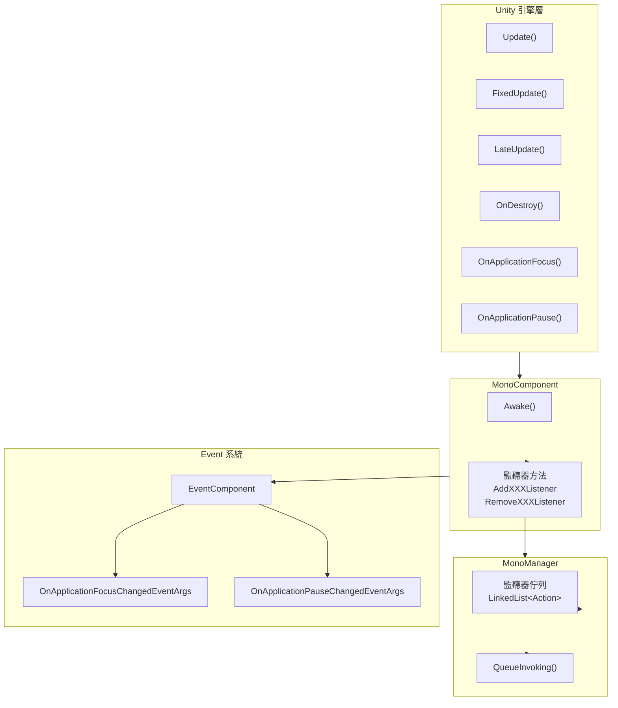

# 常見問題解答

本文件彙總了使用 GameFrameX Unity Mono 生命週期組件時常見的疑問解答。

## 概述

Mono 生命週期組件是 GameFrameX 框架的核心模組之一，用於統一管理 Unity MonoBehaviour 的各種生命週期事件，包括 Update、FixedUpdate、LateUpdate、OnDestroy、OnApplicationFocus 和 OnApplicationPause。本文件旨在幫助開發者快速解決使用過程中遇到的常見問題。

## 依賴問題

### Q1: 編譯報錯找不到 GameFrameX.Runtime 名稱空間

**問題描述：**
在專案中新增 Mono 組件後，編譯出現類似以下錯誤：
```
The type or namespace name 'Runtime' does not exist in the namespace 'GameFrameX'
```

**原因分析：**
Mono 組件依賴於 GameFrameX 核心執行時庫。該庫是整個 GameFrameX 框架的基礎，必須首先安裝。

**解決方案：**
需要安裝 `com.alianblank.gameframex.unity.runtime` 包。安裝方式是在專案的 `manifest.json` 中新增依賴：

```json
{
  "dependencies": {
    "com.alianblank.gameframex.unity.runtime": "https://github.com/GameFrameX/com.alianblank.gameframex.unity.runtime.git"
  }
}
```

> Source: [README.md](https://github.com/GameFrameX/com.gameframex.unity.mono/blob/main/README.md#L42)

---

### Q2: 編譯報錯找不到 Event 組件

**問題描述：**
編譯時出現以下錯誤：
```
The type or namespace name 'Event' does not exist in the namespace 'GameFrameX'
```

**原因分析：**
MonoComponent 在 `OnApplicationFocus` 和 `OnApplicationPause` 事件觸發時，會透過 EventComponent 釋出遊戲事件。因此需要安裝 Event 組件。

**解決方案：**
安裝 Event 組件包：

```json
{
  "dependencies": {
    "com.alianblank.gameframex.unity.event": "https://github.com/GameFrameX/com.alianblank.gameframex.unity.event.git"
  }
}
```

> Source: [README.md](https://github.com/GameFrameX/com.gameframex.unity.mono/blob/main/README.md#L42)

---

## 使用問題

### Q3: 如何註冊 Update 監聽器？

**問題描述：**
開發者想要在遊戲每幀執行特定邏輯，但不想建立額外的 MonoBehaviour 指令碼。

**解決方案：**
使用 MonoComponent 提供的監聽器方法。首先需要在場景中確保有 MonoComponent 組件（通常由 GameFramework 自動建立），然後透過該組件註冊監聽器：

```csharp
// 獲取 MonoComponent 例項（透過 Unity 組件或 GameEntry）
var monoComponent = GameEntry.GetComponent<MonoComponent>();

// 註冊 Update 監聽器
monoComponent.AddUpdateListener(OnGameUpdate);

// 定義回呼方法
private void OnGameUpdate(float elapseSeconds, float realElapseSeconds)
{
    // elapseSeconds: 流逝時間
    // realElapseSeconds: 真實流逝時間
    Debug.Log($"Update called, elapsed: {elapseSeconds}");
}

// 重要：不再使用時需要移除監聽器
monoComponent.RemoveUpdateListener(OnGameUpdate);
```

> Source: [MonoComponent.cs](https://github.com/GameFrameX/com.gameframex.unity.mono/blob/main/Runtime/Mono/MonoComponent.cs#L186-L210)

---

### Q4: Update、FixedUpdate、LateUpdate 有什麼區別？

**問題描述：**
這三個方法都有對應的監聽器，開發者不清楚應該選擇哪一個。

**技術說明：**
- **Update**：每幀呼叫一次，呼叫間隔不固定，受幀率影響。適合大多數遊戲邏輯。
- **FixedUpdate**：固定時間間隔呼叫（預設 0.02 秒，即 50 次/秒）。適合物理相關的邏輯。
- **LateUpdate**：在所有 Update 呼叫完成後呼叫。適合跟隨攝像機等需要在其他更新後執行的邏輯。

**使用建議：**
- 普通遊戲邏輯 → 使用 Update
- 物理計算相關 → 使用 FixedUpdate
- 相機跟隨、UI 更新等 → 使用 LateUpdate

```csharp
// Update 示例 - 每幀執行
monoComponent.AddUpdateListener((elapsed, realElapsed) => {
    // 遊戲主邏輯
});

// FixedUpdate 示例 - 固定間隔執行
monoComponent.AddFixedUpdateListener((elapsed, fixedElapsed) => {
    // 物理邏輯
});

// LateUpdate 示例 - 最後執行
monoComponent.AddLateUpdateListener((elapsed, fixedElapsed) => {
    // 相機跟隨等
});
```

> Source: [MonoManager.cs](https://github.com/GameFrameX/com.gameframex.unity.mono/blob/main/Runtime/Mono/MonoManager.cs#L63-L76)

---

### Q5: 監聽器傳入 null 會發生什麼？

**問題描述：**
開發者在註冊監聽器時不小心傳入了 null，想知道會發生什麼。

**程式碼行為：**
檢視原始碼可以發現，系統會對 null 引數進行檢測並丟擲異常：

```csharp
public void AddUpdateListener(Action<float, float> fun)
{
    if (fun == null)
    {
        Log.Fatal(nameof(fun) + "is invalid.");
        return;
    }
    _monoManager.AddUpdateListener(fun);
}
```

MonoComponent 中傳入 null 會記錄致命日誌並直接返回，不會丟擲異常。而 MonoManager 中傳入 null 會丟擲 `ArgumentNullException`。

> Source: [MonoComponent.cs](https://github.com/GameFrameX/com.gameframex.unity.mono/blob/main/Runtime/Mono/MonoComponent.cs#L188-L195)
> Source: [MonoManager.cs](https://github.com/GameFrameX/com.gameframex.unity.mono/blob/main/Runtime/Mono/MonoManager.cs#L176-L187)

---

### Q6: 如何監聽應用程式暫停/恢復事件？

**問題描述：**
開發者需要在玩家切換到後臺或恢復遊戲時執行特定操作。

**解決方案：**
使用 `OnApplicationPause` 監聽器：

```csharp
// 註冊暫停監聽器
monoComponent.AddOnApplicationPauseListener(OnApplicationPauseChanged);

// 回呼方法
private void OnApplicationPauseChanged(bool isPaused)
{
    if (isPaused)
    {
        Debug.Log("遊戲已暫停");
        // 儲存遊戲資料
    }
    else
    {
        Debug.Log("遊戲已恢復");
        // 恢復遊戲狀態
    }
}
```

同樣地，可以使用 `OnApplicationFocusListener` 監聽焦點變化：

```csharp
monoComponent.AddOnApplicationFocusListener(OnApplicationFocusChanged);

private void OnApplicationFocusChanged(bool hasFocus)
{
    Debug.Log($"應用程式焦點: {hasFocus}");
}
```

> Source: [MonoComponent.cs](https://github.com/GameFrameX/com.gameframex.unity.mono/blob/main/Runtime/Mono/MonoComponent.cs#L246-L270)

---

### Q7: 為什麼推薦使用 MonoComponent 而不是直接使用 MonoManager？

**問題描述：**
開發者可以直接透過 `GameFrameworkEntry.GetModule<IMonoManager>()` 獲取 MonoManager，為什麼還要使用 MonoComponent？

**設計說明：**
MonoComponent 繼承自 Unity 的 MonoBehaviour，具有以下優勢：

1. **自動生命週期繫結**：MonoComponent 自動繫結到 Unity 的生命週期方法（Update、OnDestroy 等），無需手動呼叫。
2. **與 GameFramework 無縫整合**：MonoComponent 是 GameFramework 的組件體系的一部分，可以方便地透過 GameEntry 訪問。
3. **編輯器友好**：MonoComponent 帶有 `[DisallowMultipleComponent]` 和 `[AddComponentMenu("GameFrameX/Mono")]` 屬性，在 Unity 編輯器中易於查詢和管理。

```csharp
// 透過 GameEntry 獲取 MonoComponent
var monoComponent = GameEntry.GetComponent<MonoComponent>();

// 或者直接在場景中的 GameObject 上獲取
var monoComponent = someGameObject.GetComponent<MonoComponent>();
```

> Source: [MonoComponent.cs](https://github.com/GameFrameX/com.gameframex.unity.mono/blob/main/Runtime/Mono/MonoComponent.cs#L42-L70)

---

## 生命週期管理問題

### Q8: 不移除監聽器會有什麼後果？

**問題描述：**
開發者在場景切換或物件銷燬時忘記移除監聽器，想知道會產生什麼問題。

**可能後果：**
1. **記憶體洩漏**：監聽器引用的物件無法被垃圾回收。
2. **空引用異常**：監聽器回呼嘗試訪問已銷燬的物件。
3. **邏輯錯誤**：過期的監聽器可能執行不正確的遊戲邏輯。

**最佳實踐：**
始終在適當的時機移除監聽器，例如：

```csharp
public class MyController : MonoBehaviour
{
    private MonoComponent _monoComponent;

    private void OnEnable()
    {
        _monoComponent = GameEntry.GetComponent<MonoComponent>();
        _monoComponent.AddUpdateListener(OnUpdate);
        _monoComponent.AddDestroyListener(OnDestroy);
    }

    private void OnDisable()
    {
        if (_monoComponent != null)
        {
            _monoComponent.RemoveUpdateListener(OnUpdate);
            _monoComponent.RemoveDestroyListener(OnDestroy);
        }
    }

    private void OnUpdate(float elapse, float realElapse) { }
    private void OnDestroy() { }
}
```

---

### Q9: MonoManager 是執行緒安全的嗎？

**問題描述：**
開發者在多執行緒環境下使用監聽器，想知道是否存線上程安全問題。

**技術說明：**
是的，MonoManager 是執行緒安全的。所有監聽器的新增和移除操作都使用了 `lock` 鎖來保護：

```csharp
public void AddUpdateListener(Action<float, float> action)
{
    if (action == null)
    {
        throw new ArgumentNullException(nameof(action));
    }

    lock (Lock)
    {
        _updateQueue.AddLast(action);
    }
}
```

但請注意，監聽器回呼本身的執行是在 Unity 主執行緒中呼叫的，因此不需要擔心回呼中的執行緒安全問題。

> Source: [MonoManager.cs](https://github.com/GameFrameX/com.gameframex.unity.mono/blob/main/Runtime/Mono/MonoManager.cs#L364-L380)

---

## 事件系統問題

### Q10: 如何透過事件系統監聽應用程式狀態變化？

**問題描述：**
除了使用監聽器回呼，開發者還想透過事件系統（EventSystem）來響應應用程式狀態變化。

**解決方案：**
MonoComponent 在觸發 OnApplicationFocus 和 OnApplicationPause 時會同時釋出遊戲事件。可以透過訂閱這些事件來響應：

```csharp
// 訂閱事件
EventComponent eventComponent = GameEntry.GetComponent<EventComponent>();
eventComponent.Subscribe<OnApplicationFocusChangedEventArgs>(OnFocusChanged);
eventComponent.Subscribe<OnApplicationPauseChangedEventArgs>(OnPauseChanged);

// 事件處理方法
private void OnFocusChanged(object sender, OnApplicationFocusChangedEventArgs e)
{
    Debug.Log($"焦點變化: {e.IsFocus}");
}

private void OnPauseChanged(object sender, OnApplicationPauseChangedEventArgs e)
{
    Debug.Log($"暫停狀態: {e.IsPause}");
}

// 取消訂閱
eventComponent.Unsubscribe<OnApplicationFocusChangedEventArgs>(OnFocusChanged);
eventComponent.Unsubscribe<OnApplicationPauseChangedEventArgs>(OnPauseChanged);
```

> Source: [OnApplicationFocusChangedEventArgs.cs](https://github.com/GameFrameX/com.gameframex.unity.mono/blob/main/Runtime/EventArgs/OnApplicationFocusChangedEventArgs.cs#L40-L87)

---

## 安裝問題

### Q11: 如何安裝 Mono 組件？

**問題描述：**
初次使用該外掛，不清楚如何正確安裝。

**解決方案：**
有三種安裝方式可供選擇：

**方式一：透過 manifest.json 安裝（推薦）**
在專案的 `Packages/manifest.json` 檔案中新增依賴：

```json
{
  "dependencies": {
    "com.gameframex.unity.mono": "https://github.com/GameFrameX/com.gameframex.unity.mono.git"
  }
}
```

**方式二：透過 Unity Package Manager**
1. 開啟 Unity 編輯器
2. 進入 Window → Package Manager
3. 點選 + 按鈕，選擇 "Add package from git URL"
4. 輸入：`https://github.com/GameFrameX/com.gameframex.unity.mono.git`

**方式三：直接下載放置**
直接從 GitHub 下載倉庫，將內容複製到 Unity 專案的 `Packages` 目錄下，系統會自動識別載入。

> Source: [README.md](https://github.com/GameFrameX/com.gameframex.unity.mono/blob/main/README.md#L44-L51)

---

## 架構圖

以下圖表展示了 Mono 組件的內部架構和事件流：



**圖解說明：**
1. Unity 引擎的生命週期方法自動呼叫到 MonoComponent
2. MonoComponent 暴露公共監聽器方法供外部呼叫
3. MonoManager 內部使用執行緒安全的 LinkedList 儲存監聽器
4. OnApplicationFocus 和 OnApplicationPause 事件還會發布到 Event 系統

---

## 相關連結

- [外掛介紹](../1-overview.1-introduction)
- [安裝指南](../2-installation.1-installation-methods)
- [基礎使用](../3-getting-started.1-basic-usage)
- [MonoManager 詳解](../4-core-components.1-monomanager)
- [MonoComponent 詳解](../4-core-components.2-monocomponent)
- [事件型別](../5-events.1-event-types)
- [事件引數](../5-events.2-event-args)
