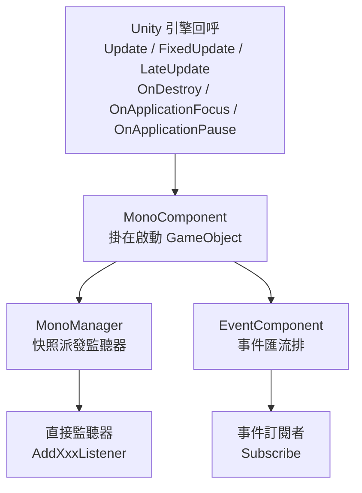

# Mono 元件套件簡介

`com.gameframex.unity.mono` 是 GameFrameX 框架下的 Mono 生命週期元件套件,用於將 Unity `MonoBehaviour` 的 `Update`、`FixedUpdate`、`LateUpdate`、`OnDestroy`、`OnApplicationFocus`、`OnApplicationPause` 等回呼統一註冊到全域監聽器清單中,業務端無須繼承 `MonoBehaviour` 就能訂閱這些事件。套件內透過 `MonoComponent`(掛在 GameFramework 啟動 GameObject 上)和 `MonoManager`(實際派發器)兩級協作,並把焦點 / 暫停事件轉送到 `EventComponent` 的事件匯流排。

## 快速開始

### 1. 安裝套件

編輯 Unity 專案的 `Packages/manifest.json`,在 `dependencies` 中加入:

```json
"com.gameframex.unity.mono": "1.1.1"
```

如果尚未設定 GameFrameX 的 UPM 註冊表,需要同時宣告 `scopedRegistries`(`scopes: ["com.gameframex"]`)並指向 `https://gameframex.upm.alianblank.uk`,完整範例請見 `README.zh-CN.md`。

相依套件只有 `com.gameframex.unity.event` 1.1.0。

### 2. 掛載 MonoComponent

把 `MonoComponent` 掛到 GameFramework 啟動 GameObject 上(與 `EventComponent`、`BaseComponent` 等同層)。該元件在 `Awake` 時透過反射尋找 `MonoManager` 實作類別,並在 `Start` 時取得 `EventComponent` 用於轉送焦點/暫停事件。

```csharp
// MonoComponent 類別宣告與元件選單路徑
[DisallowMultipleComponent]
[AddComponentMenu("GameFrameX/Mono")]
public sealed class MonoComponent : GameFrameworkComponent
```

Source: [MonoComponent.cs#L42-L44](https://github.com/GameFrameX/com.gameframex.unity.mono/blob/main/Runtime/Mono/MonoComponent.cs#L42-L44)

### 3. 註冊生命週期監聽

在任意指令碼中先取得元件,再註冊回呼:

```csharp
var monoComponent = GameEntry.GetComponent<MonoComponent>();

private void OnUpdate(float elapseSeconds, float realElapseSeconds) { /* 每影格 */ }
private void OnFixedUpdate(float elapseSeconds, float realElapseSeconds) { /* 物理步驟 */ }
private void OnLateUpdate(float elapseSeconds, float realElapseSeconds) { /* 影格結尾 */ }
private void OnDestroyCallback() { /* 元件銷毀 */ }
private void OnApplicationFocus(bool isFocus) { /* 焦點變化 */ }
private void OnApplicationPause(bool isPause) { /* 暫停變化 */ }

monoComponent.AddUpdateListener(OnUpdate);
monoComponent.AddFixedUpdateListener(OnFixedUpdate);
monoComponent.AddLateUpdateListener(OnLateUpdate);
monoComponent.AddDestroyListener(OnDestroyCallback);
monoComponent.AddOnApplicationFocusListener(OnApplicationFocus);
monoComponent.AddOnApplicationPauseListener(OnApplicationPause);
```

`Update / FixedUpdate / LateUpdate` 回呼的 `elapseSeconds` 是縮放後的增量時間,`realElapseSeconds` 是未縮放的實際增量時間,定義在 `IMonoManager` 介面上。

Source: [IMonoManager.cs](https://github.com/GameFrameX/com.gameframex.unity.mono/blob/main/Runtime/Mono/IMonoManager.cs)

### 4. 焦點 / 暫停事件匯流排訂閱(選用)

`MonoComponent` 在收到 Unity 焦點/暫停回呼時,除了呼叫直接監聽器,還會向 `EventComponent` 派發事件,業務端可透過事件匯流排訂閱:

```csharp
var eventComponent = GameEntry.GetComponent<EventComponent>();
eventComponent.Subscribe(OnApplicationFocusChangedEventArgs.EventId, OnFocusChanged);
eventComponent.Subscribe(OnApplicationPauseChangedEventArgs.EventId, OnPauseChanged);

private void OnFocusChanged(object sender, GameEventArgs e)
{
    var args = (OnApplicationFocusChangedEventArgs)e;
    if (args.IsFocus) { /* 取得焦點 */ }
}
private void OnPauseChanged(object sender, GameEventArgs e)
{
    var args = (OnApplicationPauseChangedEventArgs)e;
    if (args.IsPause) { /* 進入暫停 */ }
}
```

事件由 `MonoComponent.OnApplicationFocus / OnApplicationPause` 透過 `EventComponent.Fire` 發出。

Source: [MonoComponent.cs#L111-L141](https://github.com/GameFrameX/com.gameframex.unity.mono/blob/main/Runtime/Mono/MonoComponent.cs#L111-L141)

## 運作原理速覽

整個套件只有兩條主要鏈路:`Unity 回呼 → MonoComponent → MonoManager → 業務監聽器`,以及 `Unity 回呼 → MonoComponent → EventComponent → 事件訂閱者`。



## 接下來

- 監聽器註冊、移除的細節與執行緒安全說明,請見 [README.zh-CN.md](https://github.com/GameFrameX/com.gameframex.unity.mono/blob/main/README.zh-CN.md)
- 介面簽章與預設實作,請見 [IMonoManager.cs](https://github.com/GameFrameX/com.gameframex.unity.mono/blob/main/Runtime/Mono/IMonoManager.cs) 與 [MonoManager.cs](https://github.com/GameFrameX/com.gameframex.unity.mono/blob/main/Runtime/Mono/MonoManager.cs)
- 事件參數定義,請見 [OnApplicationFocusChangedEventArgs.cs](https://github.com/GameFrameX/com.gameframex.unity.mono/blob/main/Runtime/EventArgs/OnApplicationFocusChangedEventArgs.cs) 與 [OnApplicationPauseChangedEventArgs.cs](https://github.com/GameFrameX/com.gameframex.unity.mono/blob/main/Runtime/EventArgs/OnApplicationPauseChangedEventArgs.cs)
- Inspector 自訂,請見 [MonoComponentInspector.cs](https://github.com/GameFrameX/com.gameframex.unity.mono/blob/main/Editor/Inspector/MonoComponentInspector.cs)
- 單元測試參考,請見 [UnitTests.cs](https://github.com/GameFrameX/com.gameframex.unity.mono/blob/main/Tests/UnitTests.cs)