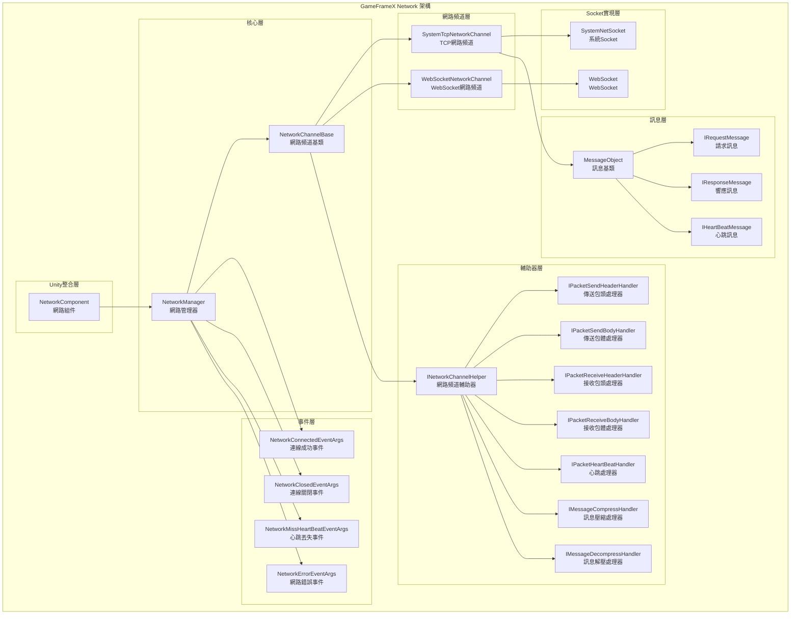
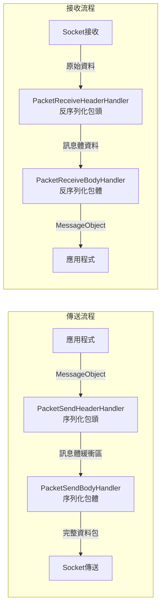
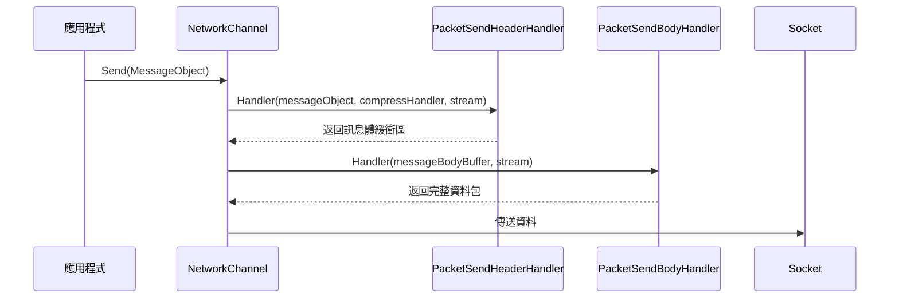
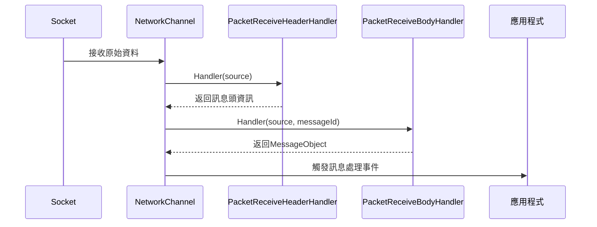
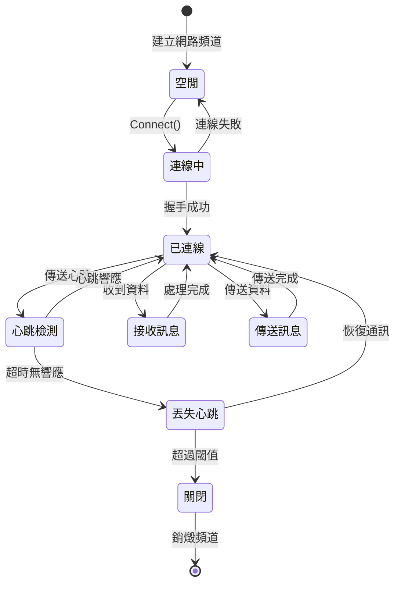
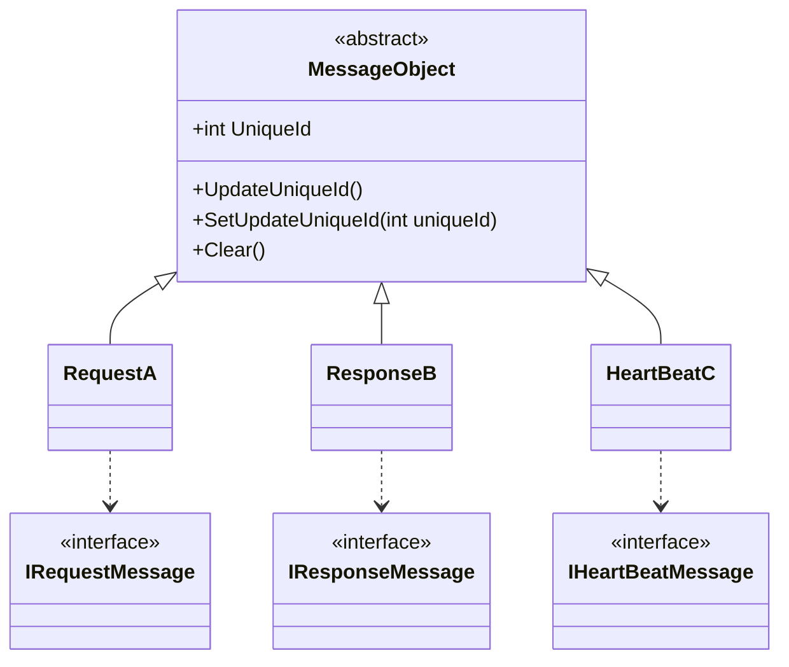
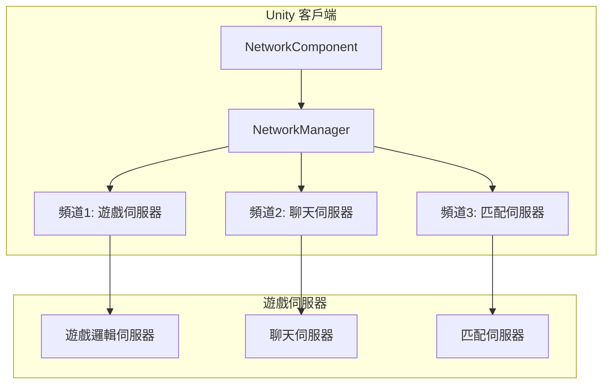

# 概述

GameFrameX Network 長連線網路組件是 GameFrameX 框架的核心網路模組，為 Unity 遊戲提供可靠的長連線通訊能力。該組件支援 TCP 和 WebSocket 兩種傳輸協議，實現了完整的心跳機制、RPC 遠端呼叫、訊息壓縮等功能。

> Source: [README.md](https://github.com/GameFrameX/com.gameframex.unity.network/blob/main/README.md#L1-L9)

## Overview

GameFrameX Network 長連線網路組件是專門為 Unity 遊戲設計的高效能網路通訊庫。作為 GameFrameX 框架的核心組件之一，它提供了穩定、可靠的長連線網路通訊能力，適用於各類需要與伺服器進行實時資料互動的遊戲場景。

該組件採用模組化設計，將網路連線的各個方面（連線管理、訊息序列化、心跳檢測、事件通知等）解耦為獨立的組件，開發者可以根據實際需求靈活配置和擴充套件。

## Architecture



### 核心組件說明

#### 1. NetworkManager（網路管理器）

NetworkManager 是整個網路組件的核心，負責管理所有的網路頻道（NetworkChannel）。它繼承自 GameFrameworkModule，是 GameFrameX 框架的標準模組實現。

```csharp
public sealed partial class NetworkManager : GameFrameworkModule, INetworkManager
{
    private readonly Dictionary<string, NetworkChannelBase> m_NetworkChannels;
}
```

> Source: [NetworkManager.cs](https://github.com/GameFrameX/com.gameframex.unity.network/blob/main/Runtime/Network/Network/NetworkManager.cs#L37-L63)

**主要職責：**
- 建立和銷燬網路頻道
- 管理多個併發網路連線
- 觸發網路相關事件
- 輪詢更新所有網路頻道狀態

#### 2. NetworkChannel（網路頻道）

網路頻道代表一個獨立的網路連線。每個頻道都有唯一的名稱，支援 TCP 和 WebSocket 兩種實現：

- **SystemTcpNetworkChannel**：基於 System.Net.Sockets 的 TCP 連線實現
- **WebSocketNetworkChannel**：基於 WebSocket 的連線實現（適用於 WebGL 平臺）

```csharp
#if (ENABLE_GAME_FRAME_X_WEB_SOCKET && UNITY_WEBGL) || FORCE_ENABLE_GAME_FRAME_X_WEB_SOCKET
    NetworkChannelBase networkChannel = new WebSocketNetworkChannel(channelName, networkChannelHelper, rpcTimeout);
#else
    NetworkChannelBase networkChannel = new SystemTcpNetworkChannel(channelName, networkChannelHelper, rpcTimeout);
#endif
```

> Source: [NetworkManager.cs](https://github.com/GameFrameX/com.gameframex.unity.network/blob/main/Runtime/Network/Network/NetworkManager.cs#L212-L216)

#### 3. 訊息處理管道

訊息處理採用分層管道設計，每層負責特定的功能：



#### 4. 事件系統

網路組件透過事件系統通知應用程式連線狀態的變化：

| 事件 | 說明 | 用途 |
|------|------|------|
| NetworkConnected | 連線成功事件 | 觸發時機：成功建立網路連線 |
| NetworkClosed | 連線關閉事件 | 觸發時機：網路連線被關閉 |
| NetworkMissHeartBeat | 心跳丟失事件 | 觸發時機：連續丟失心跳達到閾值 |
| NetworkError | 網路錯誤事件 | 觸發時機：發生網路錯誤 |

## 功能特性

### 1. 多通道支援

NetworkManager 支援同時管理多個網路頻道，每個頻道可以獨立連線到不同的伺服器：

```csharp
// 建立多個網路頻道
var channel1 = networkManager.CreateNetworkChannel("GameServer", helper1, 5000);
var channel2 = networkManager.CreateNetworkChannel("ChatServer", helper2, 3000);
```

> Source: [NetworkManager.cs](https://github.com/GameFrameX/com.gameframex.unity.network/blob/main/Runtime/Network/Network/NetworkManager.cs#L196-L223)

### 2. RPC 遠端呼叫

組件支援 RPC 風格的請求-響應模式，透過 Task 實現非同步等待：

```csharp
// 傳送 RPC 請求並等待響應
Task<TResult> Call<TResult>(MessageObject messageObject, bool isIgnoreErrorCode = false) where TResult : MessageObject, IResponseMessage;
```

> Source: [INetworkChannel.cs](https://github.com/GameFrameX/com.gameframex.unity.network/blob/main/Runtime/Network/Interface/INetworkChannel.cs#L235-L241)

### 3. 心跳機制

內建心跳檢測機制，用於檢測連線是否仍然存活：

- **預設心跳間隔**：30秒
- **預設允許丟失次數**：10次
- **支援焦點心跳**：應用程式失去焦點時是否繼續傳送心跳

```csharp
/// <summary>
/// 預設心跳間隔
/// </summary>
private const float DefaultHeartBeatInterval = 30f;

/// <summary>
/// 預設心跳丟失斷開次數
/// </summary>
private const int DefaultMissHeartBeatCountByClose = 10;
```

> Source: [NetworkManager.NetworkChannelBase.cs](https://github.com/GameFrameX/com.gameframex.unity.network/blob/main/Runtime/Network/Network/NetworkManager.NetworkChannelBase.cs#L50-L57)

### 4. 訊息壓縮

支援自定義訊息壓縮處理器，減少網路頻寬佔用：

```csharp
public interface IMessageCompressHandler
{
    byte[] Compress(byte[] data);
}

public interface IMessageDecompressHandler
{
    byte[] Decompress(byte[] data);
}
```

> Source: [IMessageCompressHandler.cs](https://github.com/GameFrameX/com.gameframex.unity.network/blob/main/Runtime/Network/Interface/IMessageCompressHandler.cs)

### 5. Unity 整合

透過 NetworkComponent 組件，可以方便地在 Unity 場景中使用網路功能：

```csharp
[DisallowMultipleComponent]
[AddComponentMenu("GameFrameX/Network")]
public sealed class NetworkComponent : GameFrameworkComponent
{
    [SerializeField] private int m_rpcTimeout = 5000;
    [SerializeField] private bool m_FocusHeartbeat = false;
}
```

> Source: [NetworkComponent.cs](https://github.com/GameFrameX/com.gameframex.unity.network/blob/main/Runtime/Network/NetworkComponent.cs#L39-L68)

## 資料流程

### 訊息傳送流程



### 訊息接收流程



### 連線生命週期



## 訊息型別體系

所有網路訊息都繼承自 MessageObject 基類：



> Source: [MessageObject.cs](https://github.com/GameFrameX/com.gameframex.unity.network/blob/main/Runtime/Network/Base/MessageObject.cs#L1-L56)

## 使用場景

### 典型遊戲網路架構



### 適用場景

1. **實時遊戲通訊**：玩家動作同步、狀態更新
2. **多人線上遊戲**：房間管理、玩家列表、聊天功能
3. **資料持久化**：遊戲存檔雲端同步
4. **實時排行榜**：分數上傳、排名查詢
5. **匹配系統**：玩家匹配、對戰房間建立

## 平臺支援

| 平臺 | 支援情況 | 說明 |
|------|----------|------|
| Windows | ✅ 完全支援 | TCP + WebSocket |
| macOS | ✅ 完全支援 | TCP + WebSocket |
| Linux | ✅ 完全支援 | TCP + WebSocket |
| Android | ✅ 完全支援 | TCP + WebSocket |
| iOS | ✅ 完全支援 | TCP + WebSocket |
| WebGL | ⚠️ 部分支援 | 僅 WebSocket |

## 版本資訊

當前版本：2.5.0

該組件採用 MIT 許可證與 Apache License 2.0 雙許可證分發。

> Source: [CHANGELOG.md](https://github.com/GameFrameX/com.gameframex.unity.network/blob/main/CHANGELOG.md#L1-L22)

## 相關連結

- [安裝指南](./2-installation)
- [快速開始](./3-getting-started)
- [網路管理器](./4-core-concepts.1-network-manager)
- [網路頻道](./4-core-concepts.2-network-channel)
- [訊息型別](./4-core-concepts.3-message-types)
- [資料包處理器](./4-core-concepts.4-packet-handlers)
- [心跳機制](./5-heartbeat)
- [事件系統](./6-events)
- [訊息壓縮](./7-message-compression)
- [RPC遠端呼叫](./8-rpc)
- [編輯器配置](./9-editor-configuration)
- [常見問題](./10-troubleshooting)
