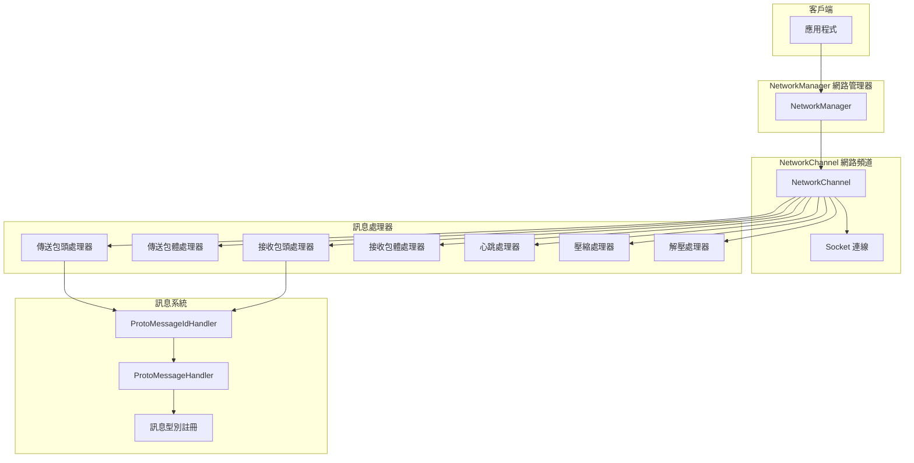
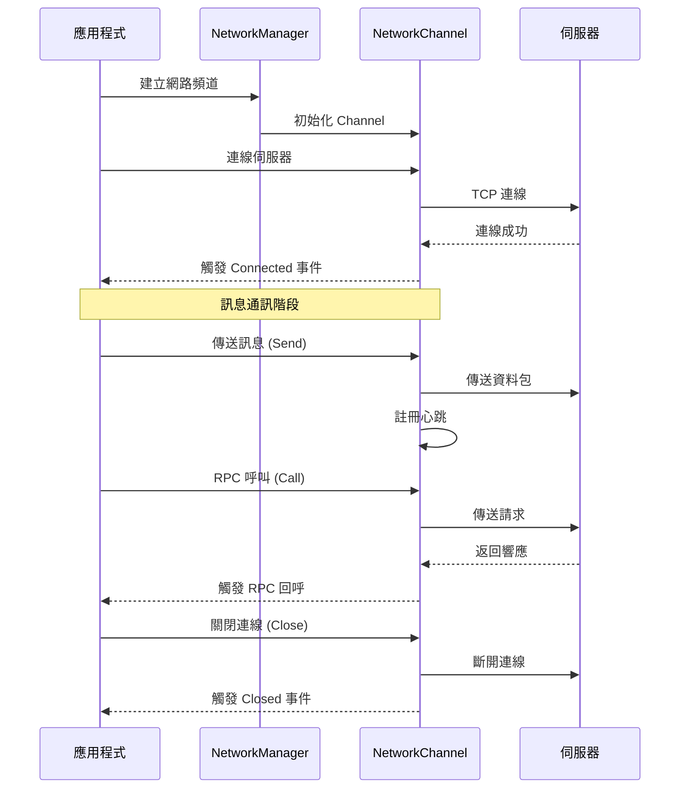
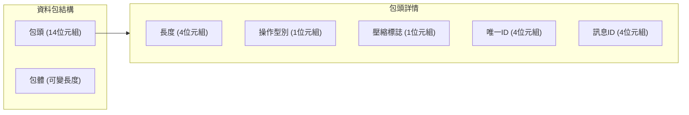

# 快速開始

本文件將幫助您快速上手 GameFrameX Network 網路組件，瞭解其核心概念並開始構建您的網路應用程式。

## 概述

GameFrameX Network 是 GameFrameX 遊戲框架的核心網路組件，提供 TCP 長連線功能，支援：
- 基於 TCP 的可靠連線
- Protocol Buffers 訊息序列化
- RPC 遠端過程呼叫
- 心跳檢測與自動重連
- 訊息壓縮與解壓

## 核心架構



## 基本使用流程



## 定義訊息型別

首先，需要定義您的請求和響應訊息型別。訊息必須繼承自 `MessageObject` 類：

### 請求訊息

```csharp
using GameFrameX.Network.Runtime;
using ProtoBuf;

namespace MyGame.Network.Messages
{
    /// <summary>
    /// 登入請求訊息
    /// </summary>
    [MessageTypeHandler(1001)]  // 訊息ID，不能重複
    [ProtoContract]
    public class C2G_LoginRequest : MessageObject, IRequestMessage
    {
        /// <summary>
        /// 使用者名稱
        /// </summary>
        [ProtoMember(1)]
        public string UserName { get; set; }

        /// <summary>
        /// 密碼
        /// </summary>
        [ProtoMember(2)]
        public string Password { get; set; }
    }
}
```

> Source: [MessageObject.cs](https://github.com/GameFrameX/com.gameframex.unity.network/blob/main/Runtime/Network/Base/MessageObject.cs#L15-L56)
> Source: [MessageTypeHandlerAttribute.cs](https://github.com/GameFrameX/com.gameframex.unity.network/blob/main/Runtime/Network/Base/MessageTypeHandlerAttribute.cs#L10-L27)

### 響應訊息

```csharp
using GameFrameX.Network.Runtime;
using ProtoBuf;

namespace MyGame.Network.Messages
{
    /// <summary>
    /// 登入響應訊息
    /// </summary>
    [MessageTypeHandler(1002)]  // 對應的響應訊息ID
    [ProtoContract]
    public class G2C_LoginResponse : MessageObject, IResponseMessage
    {
        /// <summary>
        /// 錯誤碼，0表示成功
        /// </summary>
        [ProtoMember(1)]
        public int ErrorCode { get; set; }

        /// <summary>
        /// 玩家ID
        /// </summary>
        [ProtoMember(2)]
        public long PlayerId { get; set; }

        /// <summary>
        /// 玩家名稱
        /// </summary>
        [ProtoMember(3)]
        public string PlayerName { get; set; }
    }
}
```

> Source: [IResponseMessage.cs](https://github.com/GameFrameX/com.gameframex.unity.network/blob/main/Runtime/Network/Base/IResponseMessage.cs#L1-L13)

### 心跳訊息

```csharp
using GameFrameX.Network.Runtime;
using ProtoBuf;

namespace MyGame.Network.Messages
{
    /// <summary>
    /// 心跳訊息
    /// </summary>
    [MessageTypeHandler(1)]  // 心跳訊息ID
    [ProtoContract]
    public class HeartBeatMessage : MessageObject, IHeartBeatMessage
    {
        /// <summary>
        /// 時間戳
        /// </summary>
        [ProtoMember(1)]
        public long Timestamp { get; set; }
    }
}
```

## 建立訊息處理器

使用 `MessageHandlerAttribute` 特性來註冊訊息處理函式：

```csharp
using GameFrameX.Network.Runtime;
using GameFrameX.Runtime;

namespace MyGame.Network.Handlers
{
    /// <summary>
    /// 登入訊息處理器
    /// </summary>
    public class LoginMessageHandler : MonoBehaviour
    {
        /// <summary>
        /// 處理登入響應
        /// </summary>
        /// <param name="message">登入響應訊息</param>
        [MessageHandler(typeof(G2C_LoginResponse), nameof(OnLoginResponse))]
        private void OnLoginResponse(G2C_LoginResponse message)
        {
            if (message.ErrorCode == 0)
            {
                Debug.Log($"登入成功！玩家ID: {message.PlayerId}, 名稱: {message.PlayerName}");
            }
            else
            {
                Debug.LogError($"登入失敗，錯誤碼: {message.ErrorCode}");
            }
        }
    }
}
```

> Source: [MessageHandlerAttribute.cs](https://github.com/GameFrameX/com.gameframex.unity.network/blob/main/Runtime/Network/Base/MessageHandlerAttribute.cs#L1-L60)

## 初始化網路組件

### 步驟 1：初始化訊息型別

在應用程式啟動時，需要初始化訊息型別對映：

```csharp
using GameFrameX.Network.Runtime;
using GameFrameX.Runtime;
using System.Reflection;

public class GameEntry : MonoBehaviour
{
    public void Awake()
    {
        // 初始化訊息ID對映
        ProtoMessageIdHandler.Init(typeof(GameEntry).Assembly);
    }
}
```

> Source: [ProtoMessageIdHandler.cs](https://github.com/GameFrameX/com.gameframex.unity.network/blob/main/Runtime/Network/Network/ProtoMessageIdHandler.cs#L107-L168)

### 步驟 2：建立網路頻道

```csharp
using GameFrameX.Network.Runtime;
using GameFrameX.Runtime;

// 獲取網路管理器
var networkManager = GameEntry.GetComponent<NetworkManager>();

// 建立網路頻道
// 引數說明：
// - channelName: 頻道名稱，用於標識不同的連線
// - networkChannelHelper: 網路頻道輔助器
// - rpcTimeout: RPC 超時時間（毫秒），最小值 3000
var networkChannel = networkManager.CreateNetworkChannel(
    "GameServer",
    new DefaultNetworkChannelHelper(),
    30000  // 30秒超時
);

// 設定心跳間隔（單位：秒）
networkChannel.HeartBeatInterval = 30f;

// 收到訊息時重置心跳計時
networkChannel.ResetHeartBeatElapseSecondsWhenReceivePacket = true;
```

> Source: [NetworkManager.cs](https://github.com/GameFrameX/com.gameframex.unity.network/blob/main/Runtime/Network/Network/NetworkManager.cs#L196-L223)

### 步驟 3：訂閱網路事件

```csharp
using GameFrameX.Network.Runtime;
using GameFrameX.Runtime;

// 獲取網路管理器
var networkManager = GameEntry.GetComponent<NetworkManager>();

// 訂閱連線成功事件
networkManager.NetworkConnected += OnNetworkConnected;

// 訂閱連線關閉事件
networkManager.NetworkClosed += OnNetworkClosed;

// 訂閱心跳丟失事件
networkManager.NetworkMissHeartBeat += OnNetworkMissHeartBeat;

// 訂閱網路錯誤事件
networkManager.NetworkError += OnNetworkError;

private void OnNetworkConnected(object sender, NetworkConnectedEventArgs e)
{
    Debug.Log($"網路連線成功: {e.NetworkChannel.Name}");
    // 可以在這裡處理連線成功後的邏輯
}

private void OnNetworkClosed(object sender, NetworkClosedEventArgs e)
{
    Debug.Log($"網路連線關閉: {e.NetworkChannel.Name}, 原因: {e.Reason}, 錯誤碼: {e.ErrorCode}");
    // 可以在這裡處理斷線重連邏輯
}

private void OnNetworkMissHeartBeat(object sender, NetworkMissHeartBeatEventArgs e)
{
    Debug.LogWarning($"心跳丟失: {e.NetworkChannel.Name}, 丟失次數: {e.MissCount}");
}

private void OnNetworkError(object sender, NetworkErrorEventArgs e)
{
    Debug.LogError($"網路錯誤: {e.NetworkChannel.Name}, 錯誤碼: {e.ErrorCode}, 錯誤資訊: {e.ErrorMessage}");
}
```

> Source: [NetworkConnectedEventArgs.cs](https://github.com/GameFrameX/com.gameframex.unity.network/blob/main/Runtime/EventArgs/NetworkConnectedEventArgs.cs#L40-L98)

### 步驟 4：連線到伺服器

```csharp
using System;

// 建立 Uri
var address = new Uri("tcp://127.0.0.1:8888");

// 獲取網路頻道並連線
var networkChannel = networkManager.GetNetworkChannel("GameServer");
networkChannel.Connect(address, "使用者資料");
```

> Source: [INetworkChannel.cs](https://github.com/GameFrameX/com.gameframex.unity.network/blob/main/Runtime/Network/Interface/INetworkChannel.cs#L207-L212)

## 傳送訊息

### 單向傳送（無需等待響應）

```csharp
using MyGame.Network.Messages;

// 建立訊息物件
var request = new C2G_LoginRequest
{
    UserName = "player1",
    Password = "123456"
};

// 傳送訊息
networkChannel.Send(request);
```

> Source: [INetworkChannel.cs](https://github.com/GameFrameX/com.gameframex.unity.network/blob/main/Runtime/Network/Interface/INetworkChannel.cs#L228-L233)

### RPC 呼叫（等待響應）

```csharp
using MyGame.Network.Messages;
using System.Threading.Tasks;

// 建立請求訊息
var request = new C2G_LoginRequest
{
    UserName = "player1",
    Password = "123456"
};

// 傳送 RPC 請求並等待響應
var response = await networkChannel.Call<G2C_LoginResponse>(request);

// 處理響應
if (response.ErrorCode == 0)
{
    Debug.Log($"登入成功，玩家ID: {response.PlayerId}");
}
else
{
    Debug.LogError($"登入失敗，錯誤碼: {response.ErrorCode}");
}
```

> Source: [INetworkChannel.cs](https://github.com/GameFrameX/com.gameframex.unity.network/blob/main/Runtime/Network/Interface/INetworkChannel.cs#L235-L242)

### 忽略錯誤碼的 RPC 呼叫

```csharp
// 設定 isIgnoreErrorCode = true 時，即使伺服器返回錯誤碼也不會丟擲異常
var response = await networkChannel.Call<G2C_LoginResponse>(request, isIgnoreErrorCode: true);
```

## 關閉連線

```csharp
// 關閉網路頻道
// 引數：關閉原因，錯誤碼
networkChannel.Close("使用者主動關閉", 0);

// 或者透過管理器銷燬
networkManager.DestroyNetworkChannel("GameServer");
```

> Source: [INetworkChannel.cs](https://github.com/GameFrameX/com.gameframex.unity.network/blob/main/Runtime/Network/Interface/INetworkChannel.cs#L221-L226)

## 完整示例

以下是一個完整的客戶端示例，展示了從連線到處傳送訊息的完整流程：

```csharp
using GameFrameX.Network.Runtime;
using GameFrameX.Runtime;
using MyGame.Network.Messages;
using System;
using System.Threading.Tasks;
using UnityEngine;

public class NetworkExample : MonoBehaviour
{
    private NetworkManager _networkManager;
    private INetworkChannel _channel;

    private void Start()
    {
        // 1. 初始化訊息型別對映
        ProtoMessageIdHandler.Init(typeof(NetworkExample).Assembly);

        // 2. 獲取網路管理器
        _networkManager = GameEntry.GetComponent<NetworkManager>();

        // 3. 訂閱網路事件
        _networkManager.NetworkConnected += OnConnected;
        _networkManager.NetworkClosed += OnClosed;
        _networkManager.NetworkMissHeartBeat += OnMissHeartBeat;
        _networkManager.NetworkError += OnError;

        // 4. 建立網路頻道
        _channel = _networkManager.CreateNetworkChannel(
            "GameServer",
            new DefaultNetworkChannelHelper(),
            30000
        );

        // 5. 設定心跳
        _channel.HeartBeatInterval = 30f;
        _channel.ResetHeartBeatElapseSecondsWhenReceivePacket = true;

        // 6. 連線伺服器
        _channel.Connect(new Uri("tcp://127.0.0.1:8888"));
    }

    private async void Login(string userName, string password)
    {
        if (_channel == null || !_channel.Connected)
        {
            Debug.LogError("未連線到伺服器");
            return;
        }

        var request = new C2G_LoginRequest
        {
            UserName = userName,
            Password = password
        };

        try
        {
            var response = await _channel.Call<G2C_LoginResponse>(request);
            if (response.ErrorCode == 0)
            {
                Debug.Log($"登入成功！玩家ID: {response.PlayerId}");
            }
            else
            {
                Debug.LogError($"登入失敗，錯誤碼: {response.ErrorCode}");
            }
        }
        catch (Exception ex)
        {
            Debug.LogError($"RPC 呼叫失敗: {ex.Message}");
        }
    }

    private void OnConnected(object sender, NetworkConnectedEventArgs e)
    {
        Debug.Log($"已連線到: {e.NetworkChannel.Name}");
    }

    private void OnClosed(object sender, NetworkClosedEventArgs e)
    {
        Debug.Log($"連線已關閉: {e.Reason}");
    }

    private void OnMissHeartBeat(object sender, NetworkMissHeartBeatEventArgs e)
    {
        Debug.LogWarning($"心跳丟失次數: {e.MissCount}");
    }

    private void OnError(object sender, NetworkErrorEventArgs e)
    {
        Debug.LogError($"網路錯誤: {e.ErrorMessage}");
    }

    private void OnDestroy()
    {
        if (_channel != null)
        {
            _channel.Close("客戶端銷燬");
        }
    }
}
```

## 訊息協議格式

網路組件使用自定義的二進位制協議格式，包含 14 位元組的包頭：



| 欄位 | 長度 | 說明 |
|------|------|------|
| PacketLength | 4 位元組 | 整個資料包的長度（網路位元組序） |
| OperationType | 1 位元組 | 操作型別：1=心跳，4=普通訊息 |
| ZipFlag | 1 位元組 | 壓縮標誌：0=未壓縮，1=已壓縮 |
| UniqueId | 4 位元組 | 訊息唯一編號，用於 RPC 匹配 |
| MessageId | 4 位元組 | 訊息型別 ID |

> Source: [DefaultPacketSendHeaderHandler.cs](https://github.com/GameFrameX/com.gameframex.unity.network/blob/main/Runtime/Network/Helper/DefaultPacketSendHeaderHandler.cs#L38-L44)

## 配置選項

### NetworkChannel 配置

透過 `INetworkChannel` 介面可以配置以下選項：

| 屬性 | 型別 | 預設值 | 說明 |
|------|------|--------|------|
| HeartBeatInterval | float | 30f | 心跳傳送間隔（秒） |
| ResetHeartBeatElapseSecondsWhenReceivePacket | bool | true | 收到訊息時是否重置心跳計時 |
| PacketSendHeaderHandler | IPacketSendHeaderHandler | DefaultPacketSendHeaderHandler | 傳送包頭處理器 |
| PacketSendBodyHandler | IPacketSendBodyHandler | - | 傳送包體處理器 |
| PacketReceiveHeaderHandler | IPacketReceiveHeaderHandler | DefaultPacketReceiveHeaderHandler | 接收包頭處理器 |
| PacketReceiveBodyHandler | IPacketReceiveBodyHandler | - | 接收包體處理器 |
| MessageCompressHandler | IMessageCompressHandler | - | 訊息壓縮處理器 |
| MessageDecompressHandler | IMessageDecompressHandler | - | 訊息解壓處理器 |

> Source: [INetworkChannel.cs](https://github.com/GameFrameX/com.gameframex.unity.network/blob/main/Runtime/Network/Interface/INetworkChannel.cs#L42-L132)

## 相關連結

- [概述](./1-overview) - 瞭解更多關於網路組件的整體設計
- [安裝](./2-installation) - 安裝和配置網路組件
- [網路管理器](./4-core-concepts.1-network-manager) - NetworkManager 詳細 API
- [網路頻道](./4-core-concepts.2-network-channel) - NetworkChannel 詳細 API
- [訊息型別](./4-core-concepts.3-message-types) - 訊息型別系統詳解
- [資料包處理器](./4-core-concepts.4-packet-handlers) - 資料包處理機制
- [心跳機制](./5-heartbeat) - 心跳檢測機制詳解
- [事件系統](./6-events) - 網路事件系統
- [訊息壓縮](./7-message-compression) - 訊息壓縮配置
- [RPC 遠端呼叫](./8-rpc) - RPC 呼叫機制
- [常見問題](./10-troubleshooting) - 常見問題與解決方案
