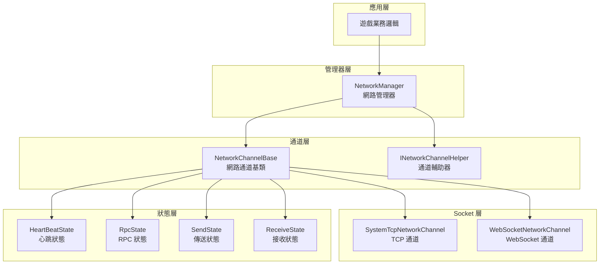
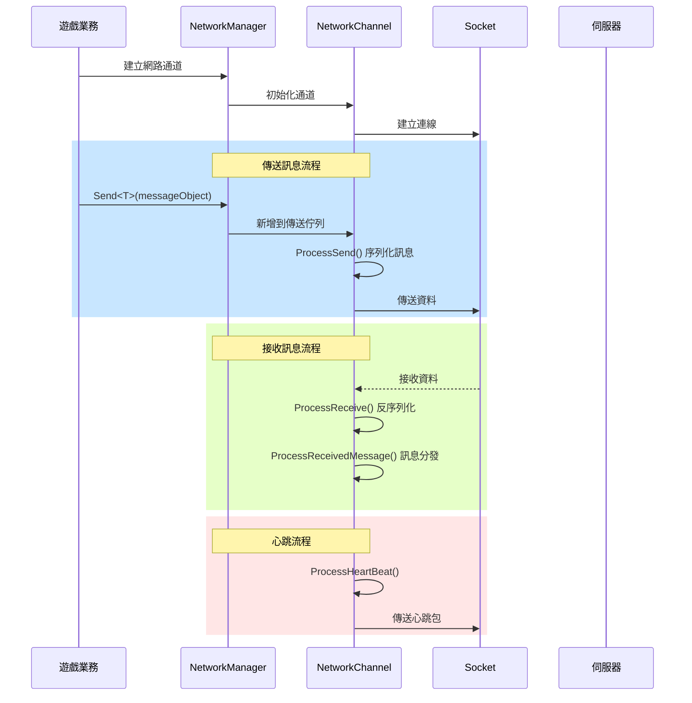
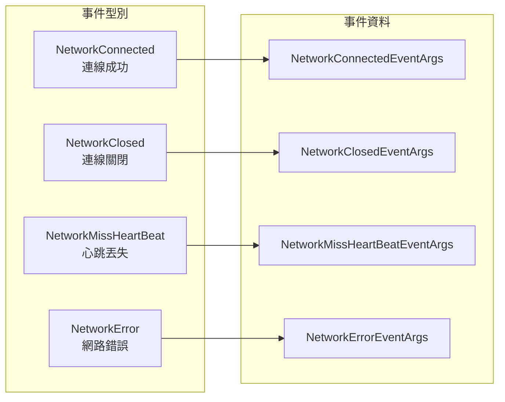

# 網路管理器

NetworkManager 是 GameFrameX 網路模組的核心組件，負責統一管理遊戲中的所有網路連線通道。它提供了網路頻道建立與銷燬、連線狀態管理、心跳檢測、RPC 遠端呼叫等核心功能。

## 概述

網路管理器作為 GameFrameX 框架的網路層核心，扮演著連線遊戲客戶端與伺服器的關鍵角色。其設計理念是提供一個統一、簡潔且強大的網路抽象層，讓開發者可以專注於業務邏輯而不必關心底層網路通訊細節。

### 核心職責

NetworkManager 的主要職責包括：

1. **多通道管理**：支援同時維護多個獨立的網路通道，每個通道可以連線到不同的伺服器
2. **連線生命週期**：管理網路連線的建立、保持和關閉過程
3. **心跳檢測**：透過定時傳送心跳包檢測連線健康狀態，自動處理斷開連線
4. **RPC 排程**：封裝遠端過程呼叫的請求/響應機制，支援非同步等待伺服器返回
5. **事件通知**：透過事件系統向業務層通知網路狀態變化

### 設計理念

NetworkManager 採用了以下設計原則：

- **模組化設計**：將網路通道、心跳、RPC 等功能分離為獨立狀態類，便於維護和擴充套件
- **事件驅動**：使用事件機制解耦網路狀態變化與業務處理
- **統一介面**：透過 INetworkChannel 介面抽象不同的網路實現（TCP/WebSocket）
- **自動管理**：在遊戲主迴圈中自動更新所有網路通道，減少手動輪詢負擔

## 架構

NetworkManager 採用分層架構設計，從上到下分為以下幾個層次：



### 組件說明

| 組件 | 說明 |
|------|------|
| NetworkManager | 網路管理器主類，負責管理所有網路通道的生命週期 |
| NetworkChannelBase | 網路通道抽象基類，封裝 Socket 操作和訊息處理邏輯 |
| INetworkChannelHelper | 通道輔助器介面，負責訊息的序列化和反序列化 |
| HeartBeatState | 心跳狀態類，管理心跳計時和丟失計數 |
| RpcState | RPC 狀態類，管理等待響應的 RPC 請求和超時處理 |
| SendState | 傳送狀態類，管理待傳送訊息佇列 |
| ReceiveState | 接收狀態類，管理接收緩衝區和資料包解析 |

### 訊息處理流程



## 核心功能

### 網路通道管理

NetworkManager 使用字典結構儲存所有網路通道，支援透過通道名稱進行快速檢索：

```csharp
// 建立網路通道
INetworkChannel channel = networkManager.CreateNetworkChannel("MainServer", channelHelper, 30000);

// 檢查通道是否存在
if (networkManager.HasNetworkChannel("MainServer"))
{
    // 獲取通道
    INetworkChannel channel = networkManager.GetNetworkChannel("MainServer");
}

// 獲取所有通道
INetworkChannel[] channels = networkManager.GetAllNetworkChannels();

// 銷燬通道
networkManager.DestroyNetworkChannel("MainServer");
```

> Source: [NetworkManager.cs](https://github.com/GameFrameX/com.gameframex.unity.network/blob/main/Runtime/Network/Network/NetworkManager.cs#L203-L247)

### 連線管理

網路通道支援連線到遠端伺服器，並提供完善的連線狀態管理：

```csharp
// 連線到伺服器
channel.Connect(new Uri("tcp://127.0.0.1:8888"), userData);

// 關閉連線
channel.Close("主動關閉");
```

> Source: [NetworkManager.NetworkChannelBase.cs](https://github.com/GameFrameX/com.gameframex.unity.network/blob/main/Runtime/Network/Network/NetworkManager.NetworkChannelBase.cs#L638-L756)

### RPC 遠端呼叫

NetworkManager 提供了基於 Task 的非同步 RPC 呼叫機制，支援等待伺服器響應：

```csharp
// 傳送 RPC 請求並等待響應
var request = new C2S_LoginRequest { Username = "test", Password = "123" };
var response = await channel.Call<C2S_LoginResponse>(request);

// 設定 RPC 回呼
channel.SetRPCStartHandler((sender, msg) => { 
    Debug.Log($"RPC 開始: {msg.GetType().Name}");
});

channel.SetRPCEndHandler((sender, msg) => { 
    Debug.Log($"RPC 結束: {msg.GetType().Name}");
});

channel.SetRPCErrorHandler((sender, msg) => { 
    Debug.Log($"RPC 錯誤: {msg.GetType().Name}");
});
```

> Source: [NetworkManager.RpcState.cs](https://github.com/GameFrameX/com.gameframex.unity.network/blob/main/Runtime/Network/Network/NetworkManager.RpcState.cs#L125-L144)

### 心跳檢測

網路通道內建心跳檢測機制，當丟失心跳達到閾值時自動斷開連線：

```csharp
// 設定心跳間隔（秒）
channel.HeartBeatInterval = 30f;

// 設定收到訊息時重置心跳計時
channel.ResetHeartBeatElapseSecondsWhenReceivePacket = true;

// 設定失去焦點時是否傳送心跳
networkManager.SetFocusHeartbeat(true);
```

> Source: [NetworkManager.NetworkChannelBase.cs](https://github.com/GameFrameX/com.gameframex.unity.network/blob/main/Runtime/Network/Network/NetworkManager.NetworkChannelBase.cs#L293-L311)

## 事件系統

NetworkManager 提供了完整的事件系統，用於通知網路狀態變化：



### 事件型別說明

| 事件 | 說明 | 事件引數 |
|------|------|----------|
| NetworkConnected | 成功連線到伺服器時觸發 | NetworkConnectedEventArgs |
| NetworkClosed | 連線關閉時觸發 | NetworkClosedEventArgs |
| NetworkMissHeartBeat | 心跳丟失時觸發 | NetworkMissHeartBeatEventArgs |
| NetworkError | 發生網路錯誤時觸發 | NetworkErrorEventArgs |

### 事件訂閱示例

```csharp
// 訂閱連線成功事件
networkManager.NetworkConnected += OnNetworkConnected;

// 訂閱連線關閉事件
networkManager.NetworkClosed += OnNetworkClosed;

// 訂閱心跳丟失事件
networkManager.NetworkMissHeartBeat += OnNetworkMissHeartBeat;

// 訂閱網路錯誤事件
networkManager.NetworkError += OnNetworkError;

private void OnNetworkConnected(object sender, NetworkConnectedEventArgs e)
{
    Debug.Log($"連線成功: {e.NetworkChannel.Name}");
}

private void OnNetworkClosed(object sender, NetworkClosedEventArgs e)
{
    Debug.Log($"連線關閉: {e.NetworkChannel.Name}, 原因: {e.Reason}, 錯誤碼: {e.ErrorCode}");
}

private void OnNetworkMissHeartBeat(object sender, NetworkMissHeartBeatEventArgs e)
{
    Debug.Log($"心跳丟失次數: {e.MissHeartBeatCount}");
}

private void OnNetworkError(object sender, NetworkErrorEventArgs e)
{
    Debug.Log($"網路錯誤: {e.ErrorCode}, 訊息: {e.ErrorMessage}");
}
```

> Source: [NetworkConnectedEventArgs.cs](https://github.com/GameFrameX/com.gameframex.unity.network/blob/main/Runtime/EventArgs/NetworkConnectedEventArgs.cs)

## 資料包處理器

NetworkManager 透過可插拔的處理器機制處理資料包的傳送和接收：

```csharp
// 註冊傳送頭處理器
channel.RegisterHandler(new DefaultPacketSendHeaderHandler());

// 註冊傳送體處理器
channel.RegisterHandler(new DefaultPacketSendBodyHandler());

// 註冊接收頭處理器
channel.RegisterHandler(new DefaultPacketReceiveHeaderHandler());

// 註冊接收體處理器
channel.RegisterHandler(new DefaultPacketReceiveBodyHandler());

// 註冊心跳處理器
channel.RegisterHeartBeatHandler(new DefaultPacketHeartBeatHandler());
```

> Source: [INetworkChannel.cs](https://github.com/GameFrameX/com.gameframex.unity.network/blob/main/Runtime/Network/Interface/INetworkChannel.cs#L100-L174)

### 訊息壓縮

支援訊息壓縮以減少網路傳輸資料量：

```csharp
// 註冊訊息壓縮處理器
channel.RegisterMessageCompressHandler(new DefaultMessageCompressHandler());

// 註冊訊息解壓處理器
channel.RegisterMessageDecompressHandler(new DefaultMessageDecompressHandler());
```

## 配置選項

### NetworkManager 配置

NetworkManager 本身作為 GameFrameworkModule 工作，無需直接配置。所有配置透過建立網路通道時指定。

### NetworkChannel 配置

| 選項 | 型別 | 預設值 | 說明 |
|------|------|--------|------|
| HeartBeatInterval | float | 30.0 | 心跳傳送間隔（秒） |
| ResetHeartBeatElapseSecondsWhenReceivePacket | bool | false | 收到訊息時是否重置心跳計時 |
| MissHeartBeatCountByClose | int | 10 | 丟失心跳次數閾值，超過則斷開連線 |

> Source: [NetworkManager.NetworkChannelBase.cs](https://github.com/GameFrameX/com.gameframex.unity.network/blob/main/Runtime/Network/Network/NetworkManager.NetworkChannelBase.cs#L52-L77)

## API 參考

### `NetworkManager` 類

繼承自 `GameFrameworkModule`，是網路模組的主入口。

#### 屬性

| 屬性 | 型別 | 說明 |
|------|------|------|
| NetworkChannelCount | int | 獲取網路通道數量 |

#### 事件

| 事件 | 說明 |
|------|------|
| NetworkConnected | 網路連線成功事件 |
| NetworkClosed | 網路連線關閉事件 |
| NetworkMissHeartBeat | 心跳丟失事件 |
| NetworkError | 網路錯誤事件 |

#### 方法

### `HasNetworkChannel(channelName: string): bool`

檢查是否存在指定名稱的網路通道。

**引數：**
- `channelName` (string): 網路頻道名稱

**返回：** 是否存在網路頻道

---

### `GetNetworkChannel(channelName: string): INetworkChannel`

獲取指定名稱的網路通道。

**引數：**
- `channelName` (string): 網路頻道名稱

**返回：** 網路通道介面，如果不存在則返回 null

---

### `CreateNetworkChannel(channelName: string, networkChannelHelper: INetworkChannelHelper, rpcTimeout: int): INetworkChannel`

建立新的網路通道。

**引數：**
- `channelName` (string): 網路頻道名稱
- `networkChannelHelper` (INetworkChannelHelper): 網路頻道輔助器
- `rpcTimeout` (int): RPC 超時時間（毫秒），最小值 3000

**返回：** 建立的網路通道

**異常：**
- `GameFrameworkException`: 當通道已存在時丟擲

---

### `DestroyNetworkChannel(channelName: string): bool`

銷燬指定的網路通道。

**引數：**
- `channelName` (string): 網路頻道名稱

**返回：** 是否銷燬成功

---

### `SetFocusHeartbeat(hasFocus: bool): void`

設定是否在應用程式失去焦點時傳送心跳包。

**引數：**
- `hasFocus` (bool): 是否在獲得焦點時傳送心跳

---

### `INetworkChannel` 介面

網路通道介面，定義網路通道的核心操作。

#### 屬性

| 屬性 | 型別 | 說明 |
|------|------|------|
| Name | string | 獲取通道名稱 |
| Socket | INetworkSocket | 獲取 Socket 物件 |
| Connected | bool | 獲取是否已連線 |
| AddressFamily | AddressFamily | 獲取地址型別 |
| SendPacketCount | int | 獲取待傳送訊息數量 |
| SentPacketCount | int | 獲取已傳送訊息數量 |
| ReceivedPacketCount | int | 獲取已接收訊息數量 |
| HeartBeatInterval | float | 獲取或設定心跳間隔 |
| HeartBeatElapseSeconds | float | 獲取心跳流逝時間 |
| MissHeartBeatCount | int | 獲取丟失心跳次數 |

#### 方法

### `Connect(address: Uri, userData: object): void`

連線到遠端伺服器。

**引數：**
- `address` (Uri): 伺服器地址
- `userData` (object): 使用者自定義資料

---

### `Send<T>(messageObject: T): void` 

向伺服器傳送訊息。

**引數：**
- `messageObject` (T): 訊息物件，必須繼承自 MessageObject

---

### `Call<TResult>(messageObject: MessageObject, isIgnoreErrorCode: bool): Task<TResult>`

傳送 RPC 請求並等待響應。

**引數：**
- `messageObject` (MessageObject): 請求訊息
- `isIgnoreErrorCode` (bool): 是否忽略錯誤碼

**返回：** 響應訊息的 Task

---

### `Close(reason: string, code: ushort): void`

關閉網路通道。

**引數：**
- `reason` (string): 關閉原因
- `code` (ushort): 錯誤碼

---

### `RegisterHandler(handler: IPacketSendHeaderHandler): void`

註冊資料包傳送頭處理器。

---

### `RegisterHeartBeatHandler(handler: IPacketHeartBeatHandler): void`

註冊心跳處理器。

---

### `SetRPCErrorHandler(handler: EventHandler<MessageObject>): void`

設定 RPC 錯誤處理函式。

---

### `SetRPCStartHandler(handler: EventHandler<MessageObject>): void`

設定 RPC 開始處理函式。

---

### `SetRPCEndHandler(handler: EventHandler<MessageObject>): void`

設定 RPC 結束處理函式。

---

## 相關連結

- [網路頻道](./4-core-concepts.2-network-channel) - 詳細瞭解網路通道的實現
- [訊息型別](./4-core-concepts.3-message-types) - 瞭解訊息物件的定義
- [資料包處理器](./4-core-concepts.4-packet-handlers) - 瞭解資料包的序列化和處理
- [心跳機制](./5-heartbeat) - 深入瞭解心跳檢測機制
- [事件系統](./6-events) - 瞭解事件系統的使用
- [訊息壓縮](./7-message-compression) - 瞭解訊息壓縮功能
- [RPC 遠端呼叫](./8-rpc) - 深入瞭解 RPC 機制
