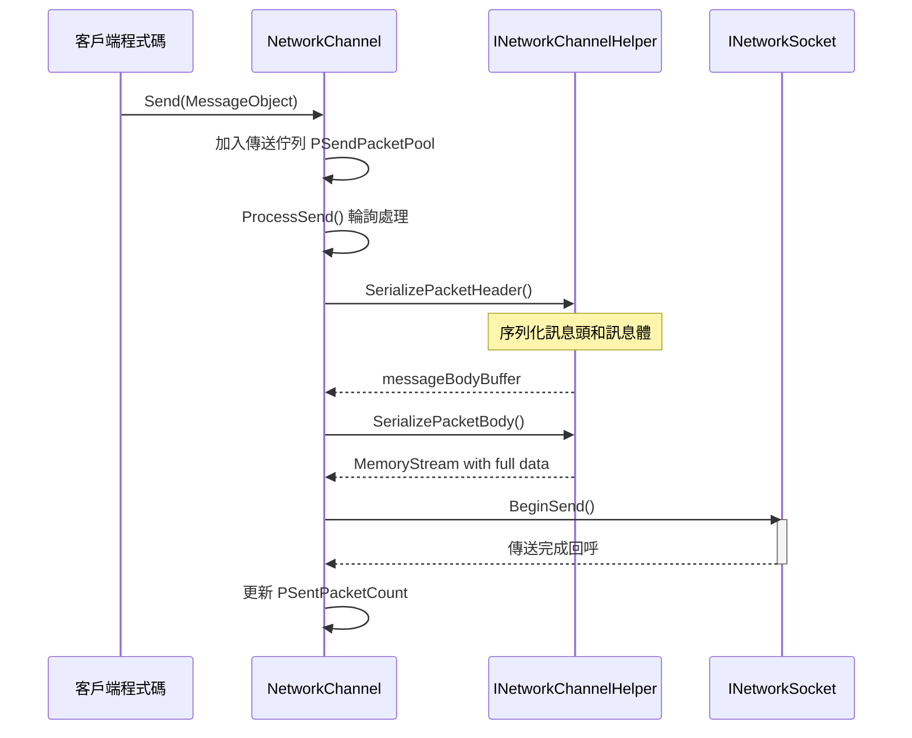
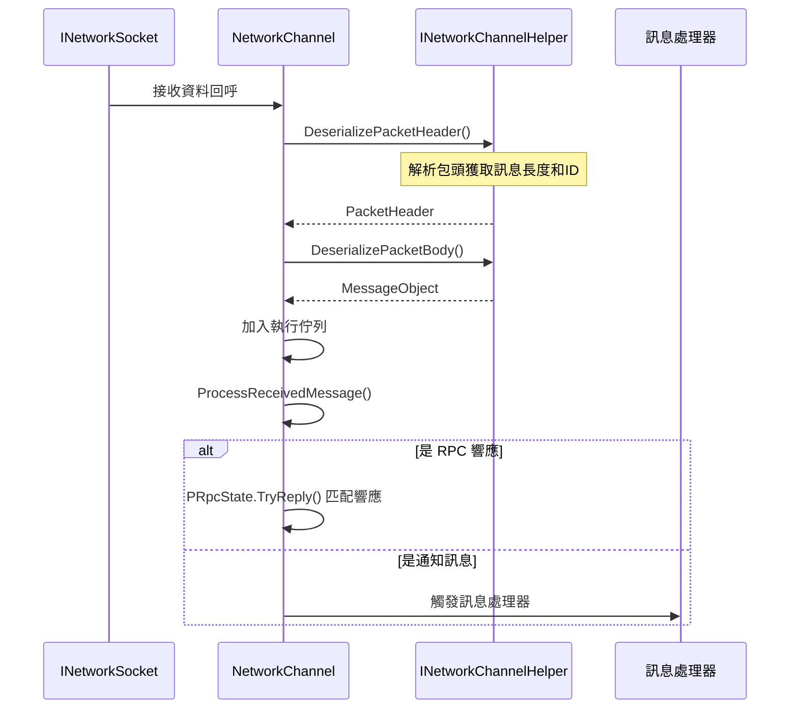
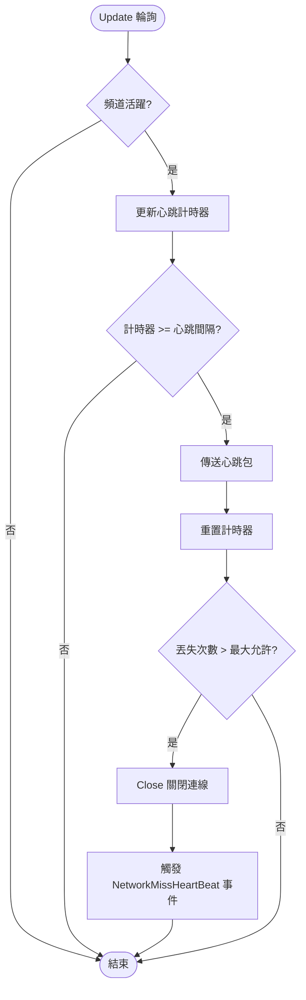

# 網路頻道

網路頻道（Network Channel）是 GameFrameX 網路框架中的核心組件，負責管理與遠端伺服器的單一連線。它封裝了 Socket 通訊、訊息序列化/反序列化、心跳檢測、RPC 呼叫等完整功能，使開發者能夠方便地進行網路通訊開發。

## 概述

在 GameFrameX 網路框架中，每個網路頻道代表一個獨立的網路連線。框架支援建立多個頻道同時連線不同的伺服器，每個頻道維護自己的連線狀態、傳送佇列、接收佇列和心跳狀態。

網路頻道的設計採用了分層架構：

- **介面層**：定義 `INetworkChannel` 介面，抽象所有網路操作
- **基類層**：提供 `NetworkChannelBase` 抽象基類，實現通用邏輯
- **實現層**：包括 `SystemTcpNetworkChannel`（TCP 連線）和 `WebSocketNetworkChannel`（WebSocket 連線）
- **輔助層**：透過 `INetworkChannelHelper` 委託訊息的序列化和反序列化

### 核心功能

網路頻道提供以下核心功能：

1. **連線管理**：建立和維護與遠端伺服器的連線
2. **訊息傳送**：將 MessageObject 序列化為網路資料併傳送
3. **訊息接收**：接收網路資料並反序列化為 MessageObject
4. **心跳機制**：定期傳送心跳包檢測連線狀態
5. **RPC 呼叫**：支援請求-響應模式的遠端過程呼叫
6. **訊息壓縮**：支援訊息壓縮以減少網路傳輸量
7. **事件通知**：透過事件系統通知連線狀態變更

## 架構

```mermaid
graph TD
    subgraph "外部呼叫"
        NetworkComponent
        GameLogic
    end
    
    subgraph "NetworkManager"
        Manager[網路管理器]
    end
    
    subgraph "網路頻道層"
        INetworkChannel[INetworkChannel 介面]
        BaseChannel[NetworkChannelBase 基類]
        TcpChannel[SystemTcpNetworkChannel]
        WsChannel[WebSocketNetworkChannel]
    end
    
    subgraph "處理器層"
        SendHeader[IPacketSendHeaderHandler]
        SendBody[IPacketSendBodyHandler]
        RecvHeader[IPacketReceiveHeaderHandler]
        RecvBody[IPacketReceiveBodyHandler]
        HeartBeat[IPacketHeartBeatHandler]
        Compress[IMessageCompressHandler]
        Decompress[IMessageDecompressHandler]
    end
    
    subgraph "輔助層"
        Helper[INetworkChannelHelper]
        DefaultHelper[DefaultNetworkChannelHelper]
    end
    
    subgraph "底層網路"
        Socket[INetworkSocket]
    end
    
    NetworkComponent --> Manager
    Manager --> INetworkChannel
    INetworkChannel <|-- BaseChannel
    BaseChannel --> TcpChannel
    BaseChannel --> WsChannel
    BaseChannel --> Helper
    BaseChannel --> SendHeader
    BaseChannel --> SendBody
    BaseChannel --> RecvHeader
    BaseChannel --> RecvBody
    BaseChannel --> HeartBeat
    BaseChannel --> Compress
    BaseChannel --> Decompress
    Helper <|.. DefaultHelper
    TcpChannel --> Socket
    WsChannel --> Socket
```

### 組件說明

| 組件 | 說明 |
|------|------|
| `INetworkChannel` | 網路頻道介面，定義所有網路操作 |
| `NetworkChannelBase` | 抽象基類，實現通用邏輯和狀態管理 |
| `SystemTcpNetworkChannel` | 基於 System.Net.Sockets 的 TCP 實現 |
| `WebSocketNetworkChannel` | 基於 WebSocket 的連線實現 |
| `INetworkChannelHelper` | 訊息序列化/反序列化輔助器介面 |
| `DefaultNetworkChannelHelper` | 預設實現，自動註冊處理器 |

## 訊息處理流程

### 傳送流程

當客戶端呼叫 `Send` 方法傳送訊息時，網路頻道按照以下流程處理：



> Source: [NetworkManager.NetworkChannelBase.cs](https://github.com/GameFrameX/com.gameframex.unity.network/blob/main/Runtime/Network/Network/NetworkManager.NetworkChannelBase.cs#L779-L822)

### 接收流程

接收到網路資料時，網路頻道按照以下流程處理：



> Source: [NetworkManager.NetworkChannelBase.cs](https://github.com/GameFrameX/com.gameframex.unity.network/blob/main/Runtime/Network/Network/NetworkManager.NetworkChannelBase.cs#L392-L430)

## 心跳機制

網路頻道內建心跳機制，用於檢測連線是否仍然有效。



> Source: [NetworkManager.NetworkChannelBase.cs](https://github.com/GameFrameX/com.gameframex.unity.network/blob/main/Runtime/Network/Network/NetworkManager.NetworkChannelBase.cs#L436-L479)

### 心跳配置

| 屬性 | 預設值 | 說明 |
|------|--------|------|
| `HeartBeatInterval` | 30秒 | 心跳傳送間隔 |
| `MissHeartBeatCountByClose` | 10 | 丟失心跳次數閾值，超過後自動斷開 |
| `ResetHeartBeatElapseSecondsWhenReceivePacket` | false | 收到訊息時是否重置心跳計時器 |

## 使用示例

### 建立頻道

```csharp
// 透過 NetworkComponent 建立網路頻道
var networkChannel = networkComponent.CreateNetworkChannel(
    "GameServer", 
    new DefaultNetworkChannelHelper()
);
```

> Source: [NetworkComponent.cs](https://github.com/GameFrameX/com.gameframex.unity.network/blob/main/Runtime/Network/NetworkComponent.cs#L176-L180)

### 連線伺服器

```csharp
// 連線到遠端伺服器
var channel = networkComponent.GetNetworkChannel("GameServer");
channel.Connect(new Uri("tcp://127.0.0.1:8888"));
```

> Source: [NetworkManager.NetworkChannelBase.cs](https://github.com/GameFrameX/com.gameframex.unity.network/blob/main/Runtime/Network/Network/NetworkManager.NetworkChannelBase.cs#L638-L706)

### 傳送訊息

```csharp
// 傳送訊息（非同步無返回）
var message = new C2S_LoginMessage 
{ 
    Username = "player1", 
    Password = "password" 
};
channel.Send(message);

// 傳送 RPC 請求（等待響應）
var response = await channel.Call<S2C_LoginResponse>(new C2S_LoginMessage 
{ 
    Username = "player1", 
    Password = "password" 
});
```

> Source: [NetworkManager.NetworkChannelBase.cs](https://github.com/GameFrameX/com.gameframex.unity.network/blob/main/Runtime/Network/Network/NetworkManager.NetworkChannelBase.cs#L765-L771)

### 配置心跳

```csharp
// 設定心跳間隔為 15 秒
channel.HeartBeatInterval = 15f;

// 設定丟失 5 次心跳後斷開
MissHeartBeatCountByClose = 5;

// 收到訊息時重置心跳計時器
channel.ResetHeartBeatElapseSecondsWhenReceivePacket = true;
```

> Source: [NetworkManager.NetworkChannelBase.cs](https://github.com/GameFrameX/com.gameframex.unity.network/blob/main/Runtime/Network/Network/NetworkManager.NetworkChannelBase.cs#L290-L297)

### 註冊訊息處理器

```csharp
// 在 DefaultNetworkChannelHelper.Initialize 中自動註冊所有處理器
// 開發者可以透過繼承 INetworkChannelChannelHelper 自定義處理器註冊邏輯

// 註冊自定義心跳處理器
channel.RegisterHeartBeatHandler(new CustomHeartBeatHandler());
```

> Source: [DefaultNetworkChannelHelper.cs](https://github.com/GameFrameX/com.gameframex.unity.network/blob/main/Runtime/Network/Helper/DefaultNetworkChannelHelper.cs#L40-L107)

### 關閉頻道

```csharp
// 關閉網路頻道
channel.Close("主動關閉", (ushort)NetworkErrorCode.Normal);
```

> Source: [NetworkManager.NetworkChannelBase.cs](https://github.com/GameFrameX/com.gameframex.unity.network/blob/main/Runtime/Network/Network/NetworkManager.NetworkChannelBase.cs#L714-L756)

## INetworkChannel 介面參考

### 連線管理

| 方法 | 說明 |
|------|------|
| `Connect(Uri address, object userData = null)` | 連線到遠端伺服器 |
| `Close(string reason, ushort code = 0)` | 關閉網路連線 |
| `Send<T>(T messageObject) where T : MessageObject` | 傳送訊息 |
| `Call<TResult>(MessageObject messageObject, bool isIgnoreErrorCode = false)` | 傳送 RPC 請求並等待響應 |

### 屬性

| 屬性 | 型別 | 說明 |
|------|------|------|
| `Name` | string | 獲取頻道名稱 |
| `Connected` | bool | 獲取是否已連線 |
| `AddressFamily` | AddressFamily | 獲取地址型別（IPv4/IPv6） |
| `Socket` | INetworkSocket | 獲取底層 Socket |
| `SendPacketCount` | int | 獲取待傳送訊息數量 |
| `SentPacketCount` | int | 獲取已傳送訊息總數 |
| `ReceivedPacketCount` | int | 獲取已接收訊息總數 |
| `HeartBeatInterval` | float | 獲取或設定心跳間隔（秒） |
| `HeartBeatElapseSeconds` | float | 獲取心跳流逝時間 |
| `MissHeartBeatCount` | int | 獲取丟失心跳次數 |

### 處理器管理

| 方法 | 說明 |
|------|------|
| `RegisterHandler(IPacketSendHeaderHandler)` | 註冊傳送包頭處理器 |
| `RegisterHandler(IPacketSendBodyHandler)` | 註冊傳送包體處理器 |
| `RegisterHandler(IPacketReceiveHeaderHandler)` | 註冊接收包頭處理器 |
| `RegisterHandler(IPacketReceiveBodyHandler)` | 註冊接收包體處理器 |
| `RegisterHeartBeatHandler(IPacketHeartBeatHandler)` | 註冊心跳處理器 |
| `RegisterMessageCompressHandler(IMessageCompressHandler)` | 註冊訊息壓縮處理器 |
| `RegisterMessageDecompressHandler(IMessageDecompressHandler)` | 註冊訊息解壓處理器 |

### RPC 回呼設定

| 方法 | 說明 |
|------|------|
| `SetRPCErrorCodeHandler(EventHandler<MessageObject>)` | 設定 RPC 錯誤碼回呼 |
| `SetRPCErrorHandler(EventHandler<MessageObject>)` | 設定 RPC 錯誤回呼 |
| `SetRPCStartHandler(EventHandler<MessageObject>)` | 設定 RPC 開始回呼 |
| `SetRPCEndHandler(EventHandler<MessageObject>)` | 設定 RPC 結束回呼 |

> Source: [INetworkChannel.cs](https://github.com/GameFrameX/com.gameframex.unity.network/blob/main/Runtime/Network/Interface/INetworkChannel.cs)

## INetworkChannelHelper 介面參考

`INetworkChannelHelper` 是網路頻道的輔助器介面，負責訊息的序列化和反序列化。

| 方法 | 說明 |
|------|------|
| `Initialize(INetworkChannel)` | 初始化輔助器 |
| `Shutdown()` | 關閉並清理輔助器 |
| `PrepareForConnecting()` | 連線前準備工作 |
| `SendHeartBeat()` | 傳送心跳訊息 |
| `SerializePacketHeader<T>()` | 序列化訊息頭 |
| `SerializePacketBody()` | 序列化訊息體 |
| `DeserializePacketHeader()` | 反序列化訊息頭 |
| `DeserializePacketBody()` | 反序列化訊息體 |

> Source: [INetworkChannelHelper.cs](https://github.com/GameFrameX/com.gameframex.unity.network/blob/main/Runtime/Network/Interface/INetworkChannelHelper.cs)

## 相關連結

- [網路管理器](./4-core-concepts.1-network-manager)
- [訊息型別](./4-core-concepts.3-message-types)
- [資料包處理器](./4-core-concepts.4-packet-handlers)
- [心跳機制](./5-heartbeat)
- [事件系統](./6-events)
- [訊息壓縮](./7-message-compression)
- [RPC 遠端呼叫](./8-rpc)
