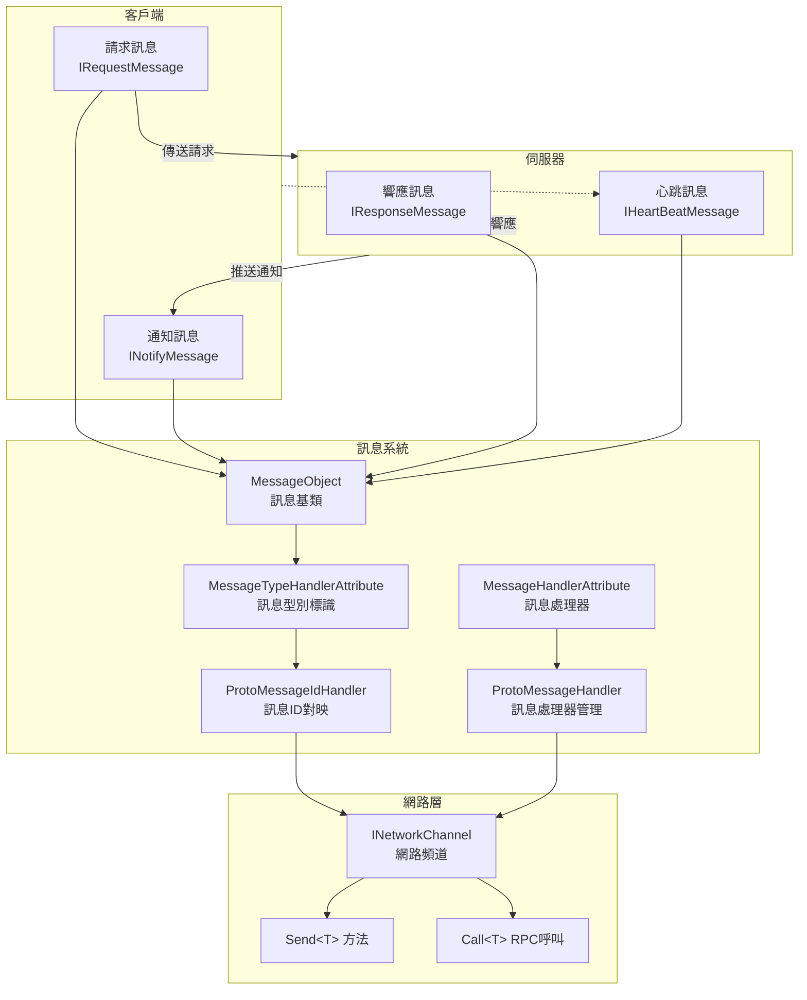
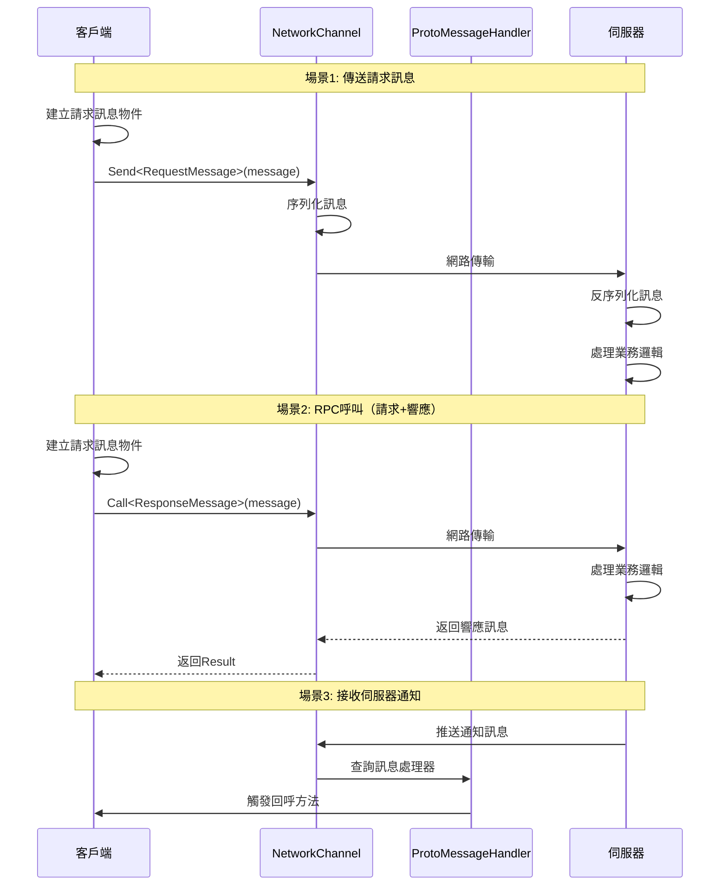

# 訊息型別

訊息型別是 GameFrameX 網路框架中用於定義客戶端與伺服器之間通訊資料結構的系統。透過訊息型別，開發者可以定義請求訊息、響應訊息、通知訊息和心跳訊息，以實現可靠的網路通訊。

## 概述

GameFrameX 網路框架採用基於訊息的通訊模式，所有網路傳輸的資料都被封裝為訊息物件。框架提供了一套完整的訊息型別體系，支援：

- **請求訊息 (Request)**：客戶端傳送給伺服器的請求
- **響應訊息 (Response)**：伺服器對客戶端請求的回應
- **通知訊息 (Notify)**：伺服器主動推送給客戶端的訊息
- **心跳訊息 (HeartBeat)**：用於保持連線活躍的輕量級訊息

訊息型別系統基於 `MessageObject` 基類構建，支援 JSON 和 Protobuf 兩種序列化方式，配合 `MessageTypeHandlerAttribute` 可以為每種訊息分配唯一的訊息 ID。

## 架構



### 訊息流轉流程



## 核心概念

### MessageObject - 訊息基類

所有網路訊息都必須繼承 `MessageObject` 基類。該類提供了唯一 ID 生成和序列化支援。

> Source: [MessageObject.cs](https://github.com/GameFrameX/com.gameframex.unity.network/blob/main/Runtime/Network/Base/MessageObject.cs#L1-L56)

```csharp
public class MessageObject : IReference
{
    /// <summary>
    /// 訊息唯一編號
    /// </summary>
    public int UniqueId { get; private set; }

    protected MessageObject()
    {
        UpdateUniqueId();
    }

    /// <summary>
    /// 更新唯一編碼
    /// </summary>
    public void UpdateUniqueId()
    {
        UniqueId = Utility.IdGenerator.GetNextUniqueIntId();
    }

    /// <summary>
    /// 清理引用
    /// </summary>
    public virtual void Clear()
    {
    }
}
```

### 訊息型別介面

框架定義了四個核心介面來區分不同型別的訊息：

| 介面 | 用途 | 說明 |
|------|------|------|
| `IRequestMessage` | 請求訊息 | 客戶端傳送給伺服器的請求 |
| `IResponseMessage` | 響應訊息 | 伺服器返回給客戶端的響應，包含 ErrorCode 屬性 |
| `INotifyMessage` | 通知訊息 | 伺服器主動推送給客戶端的訊息 |
| `IHeartBeatMessage` | 心跳訊息 | 用於保持連線活躍的輕量級訊息 |

> Source: [IRequestMessage.cs](https://github.com/GameFrameX/com.gameframex.unity.network/blob/main/Runtime/Network/Base/IRequestMessage.cs#L1-L9)
> Source: [IResponseMessage.cs](https://github.com/GameFrameX/com.gameframex.unity.network/blob/main/Runtime/Network/Base/IResponseMessage.cs#L1-L13)
> Source: [INotifyMessage.cs](https://github.com/GameFrameX/com.gameframex.unity.network/blob/main/Runtime/Network/Base/INotifyMessage.cs#L1-L9)
> Source: [IHeartBeatMessage.cs](https://github.com/GameFrameX/com.gameframex.unity.network/blob/main/Runtime/Network/Base/IHeartBeatMessage.cs#L1-L9)

### MessageTypeHandlerAttribute - 訊息型別標識

用於標記訊息類的唯一 ID。該屬性是訊息ID對映系統的核心，配合 `ProtoMessageIdHandler` 實現訊息ID與型別的雙向對映。

> Source: [MessageTypeHandlerAttribute.cs](https://github.com/GameFrameX/com.gameframex.unity.network/blob/main/Runtime/Network/Base/MessageTypeHandlerAttribute.cs#L1-L27)

### MessageHandlerAttribute - 訊息處理器

用於標記處理特定訊息型別的回呼方法。透過該屬性，開發者可以宣告式地註冊訊息處理器。

> Source: [MessageHandlerAttribute.cs](https://github.com/GameFrameX/com.gameframex.unity.network/blob/main/Runtime/Network/Base/MessageHandlerAttribute.cs#L1-L196)

## 使用示例

### 定義請求訊息

定義一個客戶端傳送給伺服器的請求訊息：

```csharp
using GameFrameX.Network.Runtime;

#if ENABLE_GAME_FRAME_X_PROTOBUF
using ProtoBuf;
#endif

#if ENABLE_GAME_FRAME_X_PROTOBUF
[ProtoContract]
#endif
[MessageTypeHandler(1)]  // 訊息ID為1
public class C2S_LoginRequest : MessageObject, IRequestMessage
{
#if ENABLE_GAME_FRAME_X_PROTOBUF
    [ProtoMember(1)]
#endif
    public string UserName { get; set; }

#if ENABLE_GAME_FRAME_X_PROTOBUF
    [ProtoMember(2)]
#endif
    public string Password { get; set; }
}
```

### 定義響應訊息

定義伺服器返回給客戶端的響應訊息：

```csharp
#if ENABLE_GAME_FRAME_X_PROTOBUF
[ProtoContract]
#endif
[MessageTypeHandler(101)]  // 訊息ID為101
public class S2C_LoginResponse : MessageObject, IResponseMessage
{
#if ENABLE_GAME_FRAME_X_PROTOBUF
    [ProtoMember(1)]
#endif
    public int ErrorCode { get; set; }

#if ENABLE_GAME_FRAME_X_PROTOBUF
    [ProtoMember(2)]
#endif
    public string Token { get; set; }

#if ENABLE_GAME_FRAME_X_PROTOBUF
    [ProtoMember(3)]
#endif
    public long UserId { get; set; }
}
```

### 定義通知訊息

定義伺服器主動推送給客戶端的通知訊息：

```csharp
#if ENABLE_GAME_FRAME_X_PROTOBUF
[ProtoContract]
#endif
[MessageTypeHandler(201)]  // 訊息ID為201
public class S2C_NoticeNotify : MessageObject, INotifyMessage
{
#if ENABLE_GAME_FRAME_X_PROTOBUF
    [ProtoMember(1)]
#endif
    public string Title { get; set; }

#if ENABLE_GAME_FRAME_X_PROTOBUF
    [ProtoMember(2)]
#endif
    public string Content { get; set; }
}
```

### 定義心跳訊息

定義用於保持連線活躍的心跳訊息：

```csharp
#if ENABLE_GAME_FRAME_X_PROTOBUF
[ProtoContract]
#endif
[MessageTypeHandler(10001)]  // 訊息ID為10001
public class HeartBeatMessage : MessageObject, IHeartBeatMessage
{
#if ENABLE_GAME_FRAME_X_PROTOBUF
    [ProtoMember(1)]
#endif
    public long Timestamp { get; set; }
}
```

### 註冊訊息處理器

使用 `MessageHandlerAttribute` 註冊訊息處理器來接收伺服器推送的訊息：

```csharp
public class NetworkMessageHandler : IMessageHandler
{
    public void Register()
    {
        ProtoMessageHandler.Add(this);
    }

    [MessageHandler(typeof(S2C_LoginResponse), nameof(OnLoginResponse))]
    private void OnLoginResponse(S2C_LoginResponse message)
    {
        if (message.ErrorCode == 0)
        {
            UnityEngine.Debug.Log($"登入成功! UserId: {message.UserId}");
        }
        else
        {
            UnityEngine.Debug.LogError($"登入失敗! ErrorCode: {message.ErrorCode}");
        }
    }

    [MessageHandler(typeof(S2C_NoticeNotify), nameof(OnNoticeNotify))]
    private void OnNoticeNotify(S2C_NoticeNotify message)
    {
        UnityEngine.Debug.Log($"收到通知: {message.Title} - {message.Content}");
    }
}
```

### 傳送訊息

透過 `INetworkChannel` 傳送訊息：

```csharp
// 傳送普通請求訊息
var loginRequest = new C2S_LoginRequest
{
    UserName = "player1",
    Password = "password123"
};
networkChannel.Send(loginRequest);

// 傳送RPC請求並等待響應
var loginRequest2 = new C2S_LoginRequest
{
    UserName = "player1",
    Password = "password123"
};
var response = await networkChannel.Call<S2C_LoginResponse>(loginRequest2);
if (response.ErrorCode == 0)
{
    UnityEngine.Debug.Log($"RPC呼叫成功! Token: {response.Token}");
}
```

> Source: [INetworkChannel.cs](https://github.com/GameFrameX/com.gameframex.unity.network/blob/main/Runtime/Network/Interface/INetworkChannel.cs#L228-L241)

## ProtoMessageIdHandler - 訊息ID對映管理

`ProtoMessageIdHandler` 負責管理所有訊息型別與訊息ID之間的對映關係。在程式啟動時，需要呼叫 `Init` 方法來掃描並註冊所有訊息型別。

> Source: [ProtoMessageIdHandler.cs](https://github.com/GameFrameX/com.gameframex.unity.network/blob/main/Runtime/Network/Network/ProtoMessageIdHandler.cs#L1-L170)

### 初始化訊息ID對映

```csharp
// 在程式啟動時呼叫
var assembly = typeof(C2S_LoginRequest).Assembly;
ProtoMessageIdHandler.Init(assembly);
```

`Init` 方法會自動掃描程式集中所有帶有 `MessageTypeHandlerAttribute` 的型別，並根據其實現的介面將其新增到對應的對映字典中：

- 實現 `IRequestMessage` → 新增到請求訊息字典
- 實現 `IResponseMessage` → 新增到響應訊息字典
- 實現 `INotifyMessage` → 新增到響應訊息字典（通知訊息也透過響應訊息通道接收）
- 實現 `IHeartBeatMessage` → 新增到心跳訊息列表

## ProtoMessageHandler - 訊息處理器管理

`ProtoMessageHandler` 負責管理訊息處理器的註冊和呼叫。

> Source: [ProtoMessageHandler.cs](https://github.com/GameFrameX/com.gameframex.unity.network/blob/main/Runtime/Network/Network/ProtoMessageHandler.cs#L1-L144)

### 註冊訊息處理器

```csharp
var messageHandler = new NetworkMessageHandler();
ProtoMessageHandler.Add(messageHandler);
```

### 移除訊息處理器

```csharp
ProtoMessageHandler.Remove(messageHandler);
```

## API 參考

### MessageObject

所有訊息的基類。

**屬性：**
| 屬性 | 型別 | 描述 |
|------|------|------|
| UniqueId | int | 訊息唯一識別符號 |

**方法：**
| 方法 | 返回型別 | 描述 |
|------|----------|------|
| UpdateUniqueId() | void | 更新訊息的唯一ID |
| SetUpdateUniqueId(int uniqueId) | void | 設定訊息的唯一ID |
| Clear() | void | 清理引用資源 |

### MessageTypeHandlerAttribute

用於標記訊息類並分配唯一訊息ID。

**建構函式：**
```csharp
public MessageTypeHandlerAttribute(int messageId)
```

**屬性：**
| 屬性 | 型別 | 描述 |
|------|------|------|
| MessageId | int | 訊息的唯一ID |

### MessageHandlerAttribute

用於標記訊息處理方法。

**建構函式：**
```csharp
public MessageHandlerAttribute(Type message, string invokeMethodName)
```

**引數：**
- `message` (Type): 繼承自 MessageObject 並實現 INotifyMessage 的訊息型別
- `invokeMethodName` (string): 處理訊息的方法名稱

### ProtoMessageHandler

管理訊息處理器的註冊和呼叫。

**方法：**
| 方法 | 描述 |
|------|------|
| Add(IMessageHandler) | 註冊訊息處理器 |
| Remove(IMessageHandler) | 移除訊息處理器 |

### ProtoMessageIdHandler

管理訊息ID與型別的雙向對映。

**方法：**
| 方法 | 返回型別 | 描述 |
|------|----------|------|
| Init(Assembly) | void | 初始化訊息ID對映 |
| GetReqTypeById(int) | Type | 根據訊息ID獲取請求型別 |
| GetReqMessageIdByType(Type) | int | 根據型別獲取請求訊息ID |
| GetRespTypeById(int) | Type | 根據訊息ID獲取響應型別 |
| GetRespMessageIdByType(Type) | int | 根據型別獲取響應訊息ID |
| IsHeartbeat(Type) | bool | 判斷是否為心跳訊息型別 |

### INetworkChannel

網路頻道介面，提供訊息傳送功能。

**方法：**
| 方法 | 描述 |
|------|------|
| `Send<T>`(T messageObject) | 傳送訊息到伺服器 |
| `Call<TResult>`(MessageObject, bool) | 傳送RPC請求並等待響應 |

## 相關連結

- [網路管理器](./4-core-concepts.1-network-manager) - 瞭解如何使用 NetworkManager 建立和管理網路連線
- [網路頻道](./4-core-concepts.2-network-channel) - 深入瞭解網路頻道的配置和訊息處理
- [資料包處理器](./4-core-concepts.4-packet-handlers) - 瞭解資料包的處理流程
- [心跳機制](./5-heartbeat) - 瞭解心跳訊息的工作原理
- [事件系統](./6-events) - 瞭解網路事件處理
- [RPC 遠端呼叫](./8-rpc) - 瞭解 RPC 呼叫的詳細用法
