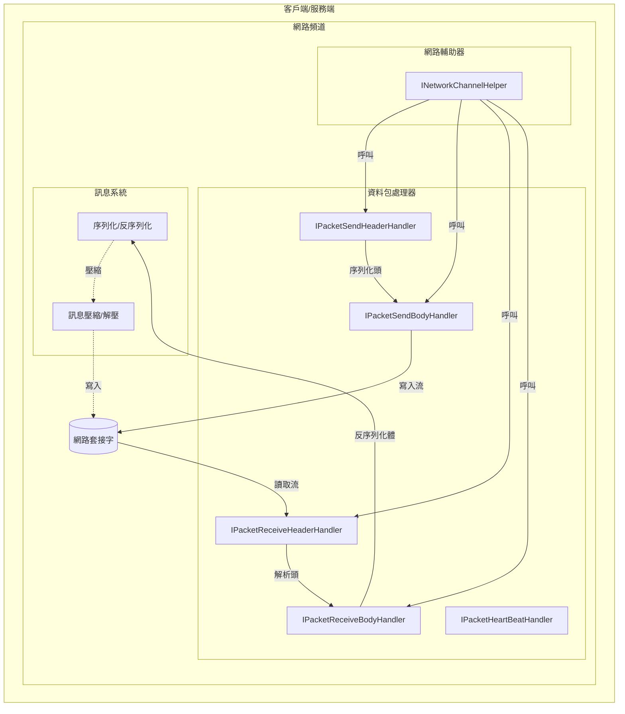
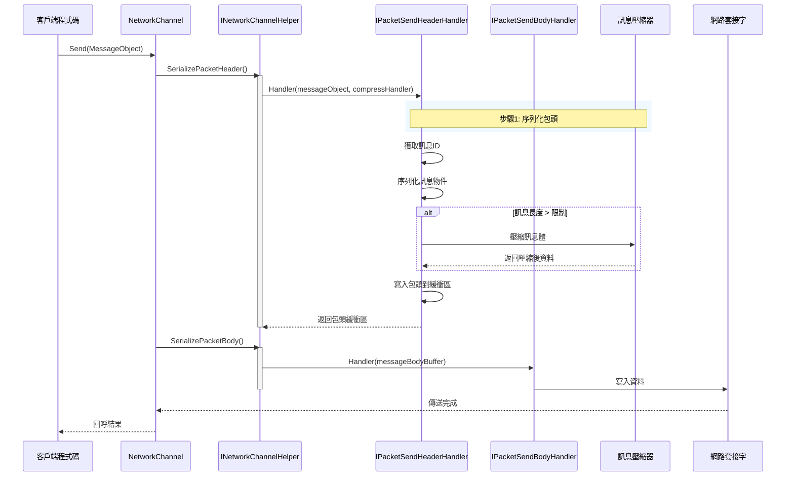
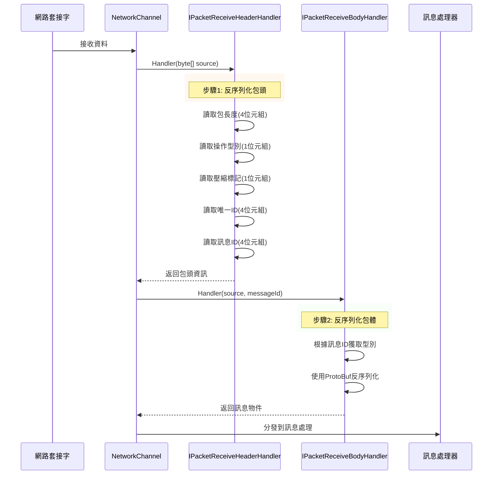

# 資料包處理器

資料包處理器是 GameFrameX 網路庫的核心組件，負責網路訊息的序列化和反序列化操作。它們將應用層的訊息物件轉換為網路位元組流（傳送時），並將接收到的位元組流轉換回訊息物件（接收時）。

## 概述

在網路通訊中，資料需要經過特定的格式處理才能在網路中傳輸。資料包處理器正是承擔這一職責的關鍵組件，它們定義了網路訊息的結構和解析方式，使得開發者可以專注於業務邏輯而無需關心底層網路通訊細節。

GameFrameX 網路庫提供了五類資料包處理器：
- **傳送包頭處理器**：負責序列化訊息頭部資訊
- **傳送包體處理器**：負責序列化訊息體內容
- **接收包頭處理器**：負責反序列化訊息頭部資訊
- **接收包體處理器**：負責反序列化訊息體內容
- **心跳包處理器**：負責處理心跳檢測相關邏輯

## 架構



上圖展示了資料包處理器在網路通訊中的核心位置。它們透過網路輔助器（INetworkChannelHelper）被呼叫，完成訊息的序列化和反序列化工作。

## 訊息傳送流程

當客戶端需要傳送訊息時，資料包處理器按照特定的順序處理訊息物件：



傳送流程分為兩個主要階段：
1. **包頭序列化**：傳送包頭處理器首先被呼叫，它獲取訊息的型別資訊（訊息ID），將訊息物件序列化為位元組陣列，根據配置決定是否壓縮，然後寫入包頭資訊（包長度、操作型別、壓縮標記、唯一ID、訊息ID）
2. **包體序列化**：傳送包體處理器將處理好的包體資料寫入目標流

## 訊息接收流程

當從網路接收到資料時，資料包處理器反向處理位元組流，將其轉換為訊息物件：



接收流程同樣分為兩個階段：
1. **包頭反序列化**：接收包頭處理器從位元組流中解析出包長度、操作型別、壓縮標記、唯一ID和訊息ID等資訊
2. **包體反序列化**：接收包體處理器根據訊息ID找到對應的訊息型別，使用 ProtoBuf 反序列化為訊息物件

## 介面定義

### IPacketHandler

標記介面，所有資料包處理器都需要實現此介面：

```csharp
namespace GameFrameX.Network.Runtime
{
    public interface IPacketHandler
    {
    }
}
```
> Source: [IPacketHandler.cs](https://github.com/GameFrameX/com.gameframex.unity.network/blob/main/Runtime/Network/Interface/IPacketHandler.cs#L3-L5)

### IPacketSendHeaderHandler

傳送包頭處理器介面，負責序列化訊息頭部：

```csharp
public interface IPacketSendHeaderHandler
{
    /// 訊息包頭長度
    ushort PacketHeaderLength { get; }

    /// 獲取網路訊息包協議編號
    int Id { get; }

    /// 獲取網路訊息包長度
    uint PacketLength { get; }

    /// 是否壓縮訊息內容
    bool IsZip { get; }

    /// 超過訊息的長度超過該值的時候啟用壓縮.該值 必須在設定壓縮器的時候才生效
    uint LimitCompressLength { get; }

    /// 處理訊息
    bool Handler<T>(T messageObject, IMessageCompressHandler messageCompressHandler, 
        MemoryStream destination, out byte[] messageBodyBuffer) where T : MessageObject;
}
```
> Source: [IPacketSendHeaderHandler.cs](https://github.com/GameFrameX/com.gameframex.unity.network/blob/main/Runtime/Network/Interface/IPacketSendHeaderHandler.cs#L8-L45)

### IPacketSendBodyHandler

傳送包體處理器介面，負責將訊息體寫入目標流：

```csharp
public interface IPacketSendBodyHandler
{
    /// 處理訊息體
    bool Handler(byte[] messageBodyBuffer, MemoryStream destination);
}
```
> Source: [IPacketSendBodyHandler.cs](https://github.com/GameFrameX/com.gameframex.unity.network/blob/main/Runtime/Network/Interface/IPacketSendBodyHandler.cs#L39-L48)

### IPacketReceiveHeaderHandler

接收包頭處理器介面，負責反序列化訊息頭部：

```csharp
public interface IPacketReceiveHeaderHandler
{
    /// 獲取網路訊息包長度
    uint PacketLength { get; }

    /// 訊息包頭長度
    ushort PacketHeaderLength { get; }

    /// 獲取網路訊息包協議編號
    int Id { get; }

    /// 訊息唯一編號
    int UniqueId { get; }

    /// 訊息操作型別
    byte OperationType { get; }

    /// 壓縮標記
    byte ZipFlag { get; }

    /// 訊息包處理
    bool Handler(object source);
}
```
> Source: [IPacketReceiveHeaderHandler.cs](https://github.com/GameFrameX/com.gameframex.unity.network/blob/main/Runtime/Network/Interface/IPacketReceiveHeaderHandler.cs#L37-L75)

### IPacketReceiveBodyHandler

接收包體處理器介面，負責反序列化訊息體：

```csharp
public interface IPacketReceiveBodyHandler
{
    /// 網路訊息包處理函式
    bool Handler<T>(byte[] source, int messageId, out T messageObject) where T : MessageObject;
}
```
> Source: [IPacketReceiveBodyHandler.cs](https://github.com/GameFrameX/com.gameframex.unity.network/blob/main/Runtime/Network/Interface/IPacketReceiveBodyHandler.cs#L6-L15)

### IPacketHeartBeatHandler

心跳包處理器介面，負責心跳訊息的生成和處理：

```csharp
public interface IPacketHeartBeatHandler
{
    /// 每次心跳的間隔
    float HeartBeatInterval { get; }

    /// 幾次心跳丟失觸發斷開網路
    int MissHeartBeatCountByClose { get; }

    /// 處理器
    MessageObject Handler();
}
```
> Source: [IPacketHeartBeatHandler.cs](https://github.com/GameFrameX/com.gameframex.unity.network/blob/main/Runtime/Network/Interface/IPacketHeartBeatHandler.cs#L6-L23)

## 預設實現

### DefaultPacketSendHeaderHandler

預設傳送包頭處理器實現了完整的包頭序列化邏輯：

```csharp
public class DefaultPacketSendHeaderHandler : IPacketSendHeaderHandler, IPacketHandler
{
    private const int NetPacketLength = sizeof(uint);
    private const int NetCmdIdLength = sizeof(int);
    private const int NetOperationTypeLength = sizeof(byte);
    private const int NetZipFlagLength = sizeof(byte);
    private const int NetUniqueIdLength = sizeof(int);

    public ushort PacketHeaderLength { get; }
    public int Id { get; private set; }
    public uint PacketLength { get; private set; }
    public bool IsZip { get; private set; }
    public virtual uint LimitCompressLength { get; } = 512;

    private int m_Offset;
    private readonly byte[] m_CachedByte;

    public DefaultPacketSendHeaderHandler()
    {
        PacketHeaderLength = NetPacketLength + NetOperationTypeLength + 
            NetZipFlagLength + NetUniqueIdLength + NetCmdIdLength;
        m_CachedByte = new byte[PacketHeaderLength];
    }

    public bool Handler<T>(T messageObject, IMessageCompressHandler messageCompressHandler, 
        MemoryStream destination, out byte[] messageBodyBuffer) where T : MessageObject
    {
        m_Offset = 0;
        var messageType = messageObject.GetType();
        Id = ProtoMessageIdHandler.GetReqMessageIdByType(messageType);
        messageBodyBuffer = SerializerHelper.Serialize(messageObject);
        
        // 根據長度決定是否壓縮
        if (messageCompressHandler != null && messageBodyBuffer.Length > LimitCompressLength)
        {
            IsZip = true;
            messageBodyBuffer = messageCompressHandler.Handler(messageBodyBuffer);
        }
        else
        {
            IsZip = false;
        }

        var messageLength = messageBodyBuffer.Length;
        PacketLength = (uint)(PacketHeaderLength + messageLength);
        
        // 寫入包頭資料
        m_CachedByte.WriteUInt(PacketLength, ref m_Offset);
        m_CachedByte.WriteByte((byte)(ProtoMessageIdHandler.IsHeartbeat(messageType) ? 1 : 4), ref m_Offset);
        m_CachedByte.WriteByte((byte)(IsZip ? 1 : 0), ref m_Offset);
        m_CachedByte.WriteInt(messageObject.UniqueId, ref m_Offset);
        m_CachedByte.WriteInt(Id, ref m_Offset);
        destination.Write(m_CachedByte, 0, PacketHeaderLength);
        return true;
    }
}
```
> Source: [DefaultPacketSendHeaderHandler.cs](https://github.com/GameFrameX/com.gameframex.unity.network/blob/main/Runtime/Network/Helper/DefaultPacketSendHeaderHandler.cs#L11-L114)

### DefaultPacketReceiveHeaderHandler

預設接收包頭處理器實現了完整的包頭解析邏輯：

```csharp
public sealed class DefaultPacketReceiveHeaderHandler : IPacketReceiveHeaderHandler, IPacketHandler
{
    public uint PacketLength { get; private set; }
    public int Id { get; private set; }
    public int UniqueId { get; private set; }
    public byte OperationType { get; private set; }
    public byte ZipFlag { get; private set; }
    public ushort PacketHeaderLength { get; } = 14; // 4+1+1+4+4

    public bool Handler(object source)
    {
        byte[] reader = source as byte[];
        if (reader == null)
        {
            return false;
        }

        int offset = 0;
        PacketLength = reader.ReadUInt(ref offset);
        OperationType = reader.ReadByte(ref offset);
        ZipFlag = reader.ReadByte(ref offset);
        UniqueId = reader.ReadInt(ref offset);
        Id = reader.ReadInt(ref offset);
        return true;
    }
}
```
> Source: [DefaultPacketReceiveHeaderHandler.cs](https://github.com/GameFrameX/com.gameframex.unity.network/blob/main/Runtime/Network/Helper/DefaultPacketReceiveHeaderHandler.cs#L9-L64)

### DefaultPacketSendBodyHandler

預設傳送包體處理器，將訊息體寫入目標流：

```csharp
public sealed class DefaultPacketSendBodyHandler : IPacketSendBodyHandler, IPacketHandler
{
    public bool Handler(byte[] messageBodyBuffer, MemoryStream destination)
    {
        destination.Write(messageBodyBuffer, 0, messageBodyBuffer.Length);
        return true;
    }
}
```
> Source: [DefaultPacketSendBodyHandler.cs](https://github.com/GameFrameX/com.gameframex.unity.network/blob/main/Runtime/Network/Helper/DefaultPacketSendBodyHandler.cs#L9-L16)

### DefaultPacketReceiveBodyHandler

預設接收包體處理器，使用 ProtoBuf 反序列化訊息：

```csharp
public sealed class DefaultPacketReceiveBodyHandler : IPacketReceiveBodyHandler, IPacketHandler
{
    public bool Handler<T>(byte[] source, int messageId, out T messageObject) where T : MessageObject
    {
        var messageType = ProtoMessageIdHandler.GetRespTypeById(messageId);
        messageObject = (T)SerializerHelper.Deserialize(source, messageType);
        return true;
    }
}
```
> Source: [DefaultPacketReceiveBodyHandler.cs](https://github.com/GameFrameX/com.gameframex.unity.network/blob/main/Runtime/Network/Helper/DefaultPacketReceiveBodyHandler.cs#L9-L17)

### BasePacketHeartBeatHandler

預設心跳包處理器基類：

```csharp
public class BasePacketHeartBeatHandler : IPacketHeartBeatHandler, IPacketHandler
{
    public virtual float HeartBeatInterval
    {
        get { return 5; }
    }

    public virtual int MissHeartBeatCountByClose { get; } = 5;

    public virtual MessageObject Handler()
    {
        throw new System.NotImplementedException();
    }
}
```
> Source: [DefaultPacketHeartBeatHandler.cs](https://github.com/GameFrameX/com.gameframex.unity.network/blob/main/Runtime/Network/Helper/DefaultPacketHeartBeatHandler.cs#L7-L26)

## 自定義資料包處理器

如果預設的處理器無法滿足需求，開發者可以建立自定義的資料包處理器。自定義處理器需要實現相應的介面並繼承 `IPacketHandler` 標記介面。

### 建立自定義接收包頭處理器

```csharp
using UnityEngine;
using GameFrameX.Network.Runtime;
using GameFrameX.Runtime;

[UnityEngine.Scripting.Preserve]
public sealed class CustomPacketReceiveHeaderHandler : IPacketReceiveHeaderHandler, IPacketHandler
{
    public uint PacketLength { get; private set; }
    public ushort PacketHeaderLength { get; } = 14;
    public int Id { get; private set; }
    public int UniqueId { get; private set; }
    public byte OperationType { get; private set; }
    public byte ZipFlag { get; private set; }

    public bool Handler(object source)
    {
        // 自定義解析邏輯
        byte[] reader = source as byte[];
        if (reader == null || reader.Length < PacketHeaderLength)
        {
            return false;
        }

        // 自定義解析實現...
        return true;
    }
}
```

### 建立自定義心跳包處理器

```csharp
using UnityEngine;
using GameFrameX.Network.Runtime;

[UnityEngine.Scripting.Preserve]
public sealed class CustomHeartBeatHandler : BasePacketHeartBeatHandler
{
    // 設定心跳間隔為10秒
    public override float HeartBeatInterval => 10;

    // 設定丟失5次心跳後斷開連線
    public override int MissHeartBeatCountByClose => 5;

    public override MessageObject Handler()
    {
        // 返回自定義的心跳訊息物件
        return new C2SHeartBeat();
    }
}
```

## 配置選項

資料包處理器的行為可以透過以下方式進行配置：

| 配置項 | 型別 | 預設值 | 說明 |
|--------|------|--------|------|
| LimitCompressLength | uint | 512 | 超過此長度時啟用訊息壓縮 |
| HeartBeatInterval | float | 5.0 | 心跳包傳送間隔（秒） |
| MissHeartBeatCountByClose | int | 5 | 丟失心跳次數上限，超過則斷開連線 |

## 相關連結

- [網路管理器](./4-core-concepts.1-network-manager)
- [網路頻道](./4-core-concepts.2-network-channel)
- [訊息型別](./4-core-concepts.3-message-types)
- [心跳機制](./5-heartbeat)
- [訊息壓縮](./7-message-compression)
