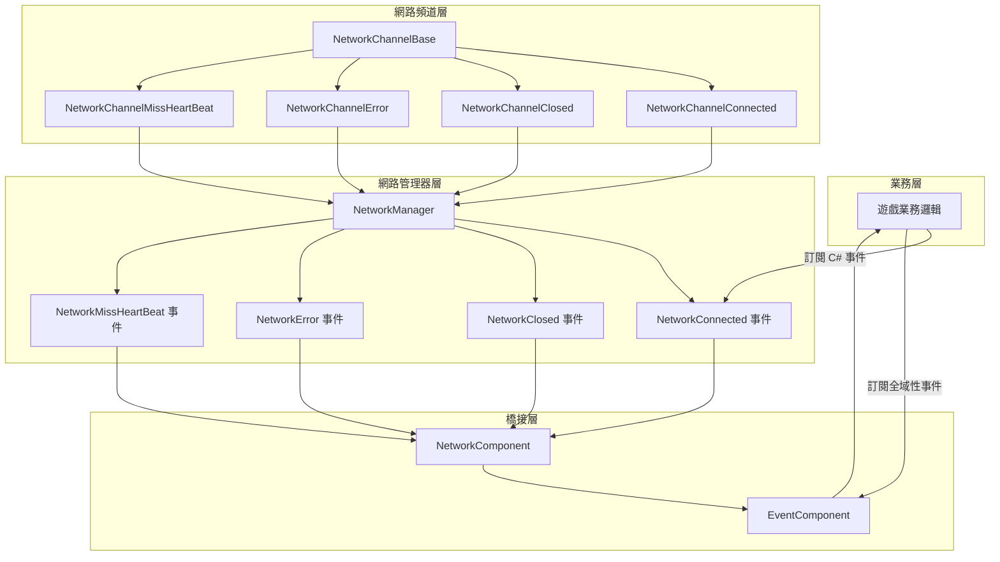
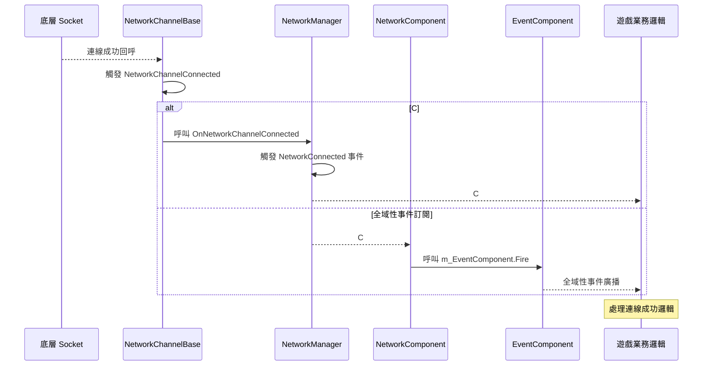

# 事件系統

GameFrameX Unity Network 模組提供了完整的事件系統，用於通知網路連線狀態變化、錯誤發生以及心跳丟失等關鍵網路事件。該事件系統採用雙層架構，既支援 C# 原生事件，也整合了 GameFrameX 的全域性事件系統。

## 概述

網路事件系統是 GameFrameX Unity Network 模組的核心組件之一，它解耦了網路邏輯與業務邏輯，使開發者可以靈活地響應各種網路狀態變化。事件系統設計遵循以下原則：

- **解耦設計**：網路底層透過事件向上層通知狀態變化，業務層透過訂閱事件來處理網路狀態
- **雙重支援**：同時支援 C# 原生事件委託和 GameFrameX 全域性事件系統
- **物件複用**：使用物件池技術管理事件引數，減少記憶體分配開銷

事件系統在遊戲開發中尤為重要，因為它允許您在不修改網路核心程式碼的情況下，為遊戲新增斷線重連、掉線提示、心跳異常處理等功能。

## 架構

GameFrameX Unity Network 的事件系統採用雙層架構設計，這種設計兼顧了易用性和靈活性。



### 架構說明

**網路頻道層（NetworkChannelBase）** 是網路事件的發源地。當底層 Socket 連線成功、斷開、發生錯誤或心跳丟失時，NetworkChannelBase 會觸發相應的 Action 委託。

**網路管理器層（NetworkManager）** 訂閱了 NetworkChannelBase 的內部事件，然後將這些事件轉換為公開的 C# 事件（event）。這一層是開發者直接互動的主要介面。

**橋接層（NetworkComponent）** 充當了 C# 事件系統和 GameFrameX 全域性事件系統之間的橋樑。它既提供了 C# 事件的直接訂閱方式，也透過 EventComponent 提供了全域性事件訂閱能力。

## 事件型別

GameFrameX Unity Network 模組定義了四種核心網路事件，每種事件都有對應的 EventArgs 類來攜帶事件相關資料。

### NetworkConnectedEventArgs - 連線成功事件

當網路連線成功建立時觸發此事件。該事件是最常用的網路事件之一，通常用於觸發遊戲登入、獲取伺服器時間等後續操作。

```csharp
using GameFrameX.Network.Runtime;

// 事件引數屬性說明
public sealed class NetworkConnectedEventArgs : GameEventArgs
{
    // 事件唯一識別符號
    public static readonly string EventId = typeof(NetworkConnectedEventArgs).FullName;

    // 獲取網路連線成功事件編號
    public override string Id => EventId;

    // 獲取網路頻道 - 觸發此事件的頻道物件
    public INetworkChannel NetworkChannel { get; private set; }

    // 獲取使用者自定義資料 - Connect 方法傳入的 userData 引數
    public object UserData { get; private set; }
}
```

> Source: [NetworkConnectedEventArgs.cs](https://github.com/GameFrameX/com.gameframex.unity.network/blob/main/Runtime/EventArgs/NetworkConnectedEventArgs.cs#L41-L97)

### NetworkClosedEventArgs - 連線關閉事件

當網路連線關閉時觸發此事件。該事件攜帶關閉原因和錯誤碼，可用於判斷是正常關閉還是異常斷開。

```csharp
public sealed class NetworkClosedEventArgs : GameEventArgs
{
    // 事件唯一識別符號
    public static readonly string EventId = typeof(NetworkClosedEventArgs).FullName;

    // 獲取網路頻道
    public INetworkChannel NetworkChannel { get; private set; }

    // 獲取關閉原因
    // 可能的值：Normal, Timeout, Dispose, ConnectClose, ConnectAddressError, ConnectAddressExceptionError, MissHeartBeat
    public string Reason { get; private set; }

    // 獲取錯誤碼
    public ushort ErrorCode { get; private set; }
}
```

> Source: [NetworkClosedEventArgs.cs](https://github.com/GameFrameX/com.gameframex.unity.network/blob/main/Runtime/EventArgs/NetworkClosedEventArgs.cs#L41-L103)

### NetworkErrorEventArgs - 網路錯誤事件

當網路發生錯誤時觸發此事件。該事件提供了豐富的錯誤資訊，包括應用層錯誤碼和底層 Socket 錯誤碼。

```csharp
public sealed class NetworkErrorEventArgs : GameEventArgs
{
    // 事件唯一識別符號
    public static readonly string EventId = typeof(NetworkErrorEventArgs).FullName;

    // 獲取網路頻道
    public INetworkChannel NetworkChannel { get; private set; }

    // 獲取應用層錯誤碼
    // 列舉值：Unknown, AddressFamilyError, SocketError, ConnectError, SendError, ReceiveError, SerializeError, DeserializePacketHeaderError, DeserializePacketError, MissHeartBeatError, DisposeError
    public NetworkErrorCode ErrorCode { get; private set; }

    // 獲取底層 Socket 錯誤碼
    public SocketError SocketErrorCode { get; private set; }

    // 獲取錯誤資訊
    public string ErrorMessage { get; private set; }
}
```

> Source: [NetworkErrorEventArgs.cs](https://github.com/GameFrameX/com.gameframex.unity.network/blob/main/Runtime/EventArgs/NetworkErrorEventArgs.cs#L42-L116)

### NetworkMissHeartBeatEventArgs - 心跳丟失事件

當心跳包丟失達到一定次數時觸發此事件。該事件可用於實現更細粒度的斷線重連邏輯，例如在丟失 3 次心跳時提示使用者網路不穩定。

```csharp
public sealed class NetworkMissHeartBeatEventArgs : GameEventArgs
{
    // 事件唯一識別符號
    public static readonly string EventId = typeof(NetworkMissHeartBeatEventArgs).FullName;

    // 獲取網路頻道
    public INetworkChannel NetworkChannel { get; private set; }

    // 獲取心跳包已丟失次數
    // 當丟失次數超過 MissHeartBeatCountByClose（預設 10 次）時，連線將被自動關閉
    public int MissCount { get; private set; }
}
```

> Source: [NetworkMissHeartBeatEventArgs.cs](https://github.com/GameFrameX/com.gameframex.unity.network/blob/main/Runtime/EventArgs/NetworkMissHeartBeatEventArgs.cs#L41-L97)

## 事件流程

網路事件的完整流程涉及多個組件的協作。理解這個流程有助於您更好地使用事件系統來構建可靠的網路功能。



### 事件觸發時機

| 事件型別 | 觸發時機 | 後續動作 |
|---------|---------|---------|
| NetworkConnected | 成功建立 TCP 連線後 | 可傳送登入請求或獲取伺服器時間 |
| NetworkClosed | 連線斷開時（正常/異常） | 清理資源，觸發重連邏輯 |
| NetworkError | 發生網路錯誤時 | 記錄日誌，可能觸發斷開連線 |
| NetworkMissHeartBeat | 心跳包丟失時 | 更新 UI 提示，可能觸發斷開連線 |

## 使用示例

### 方式一：使用 C# 原生事件

C# 原生事件是最直接的事件訂閱方式，適合簡單的網路事件處理場景。

```csharp
using GameFrameX.Network.Runtime;
using UnityEngine;

public class NetworkExample : MonoBehaviour
{
    private INetworkManager networkManager;
    private INetworkChannel channel;

    private void Start()
    {
        // 獲取網路管理器
        networkManager = GameFrameworkEntry.GetModule<INetworkManager>();
        
        // 訂閱網路事件
        networkManager.NetworkConnected += OnNetworkConnected;
        networkManager.NetworkClosed += OnNetworkClosed;
        networkManager.NetworkError += OnNetworkError;
        networkManager.NetworkMissHeartBeat += OnNetworkMissHeartBeat;
        
        // 建立網路頻道
        var helper = new DefaultNetworkChannelHelper();
        channel = networkManager.CreateNetworkChannel("GameServer", helper, 5000);
        
        // 連線到伺服器
        channel.Connect(new Uri("tcp://127.0.0.1:8888"));
    }

    private void OnNetworkConnected(object sender, NetworkConnectedEventArgs e)
    {
        Debug.Log($"連線成功！頻道: {e.NetworkChannel.Name}, 使用者資料: {e.UserData}");
    }

    private void OnNetworkClosed(object sender, NetworkClosedEventArgs e)
    {
        Debug.Log($"連線關閉！原因: {e.Reason}, 錯誤碼: {e.ErrorCode}");
    }

    private void OnNetworkError(object sender, NetworkErrorEventArgs e)
    {
        Debug.LogError($"網路錯誤！錯誤碼: {e.ErrorCode}, Socket錯誤: {e.SocketErrorCode}, 訊息: {e.ErrorMessage}");
    }

    private void OnNetworkMissHeartBeat(object sender, NetworkMissHeartBeatEventArgs e)
    {
        Debug.LogWarning($"心跳丟失！次數: {e.MissCount}");
    }

    private void OnDestroy()
    {
        // 取消訂閱事件
        if (networkManager != null)
        {
            networkManager.NetworkConnected -= OnNetworkConnected;
            networkManager.NetworkClosed -= OnNetworkClosed;
            networkManager.NetworkError -= OnNetworkError;
            networkManager.NetworkMissHeartBeat -= OnNetworkMissHeartBeat;
        }
    }
}
```

> Source: [NetworkManager.cs](https://github.com/GameFrameX/com.gameframex.unity.network/blob/main/Runtime/Network/Network/NetworkManager.cs#L261-L311)

### 方式二：使用 NetworkComponent 訂閱全域性事件

NetworkComponent 提供了與 GameFrameX EventComponent 的整合，您可以透過訂閱全域性事件來處理網路狀態變化。這種方式更適合需要跨模組通訊的場景。

```csharp
using GameFrameX.Event.Runtime;
using GameFrameX.Network.Runtime;
using UnityEngine;

public class GlobalEventExample : MonoBehaviour
{
    private EventComponent eventComponent;

    private void Start()
    {
        // 獲取事件組件
        eventComponent = GameEntry.GetComponent<EventComponent>();
        
        // 訂閱全域性事件
        eventComponent.Subscribe(NetworkConnectedEventArgs.EventId, OnNetworkConnected);
        eventComponent.Subscribe(NetworkClosedEventArgs.EventId, OnNetworkClosed);
        eventComponent.Subscribe(NetworkErrorEventArgs.EventId, OnNetworkError);
        eventComponent.Subscribe(NetworkMissHeartBeatEventArgs.EventId, OnNetworkMissHeartBeat);
    }

    private void OnNetworkConnected(object sender, GameEventArgs e)
    {
        var args = e as NetworkConnectedEventArgs;
        Debug.Log($"全域性事件 - 連線成功！頻道: {args.NetworkChannel.Name}");
    }

    private void OnNetworkClosed(object sender, GameEventArgs e)
    {
        var args = e as NetworkClosedEventArgs;
        Debug.Log($"全域性事件 - 連線關閉！原因: {args.Reason}");
    }

    private void OnNetworkError(object sender, GameEventArgs e)
    {
        var args = e as NetworkErrorEventArgs;
        Debug.LogError($"全域性事件 - 網路錯誤: {args.ErrorMessage}");
    }

    private void OnNetworkMissHeartBeat(object sender, GameEventArgs e)
    {
        var args = e as NetworkMissHeartBeatEventArgs;
        Debug.LogWarning($"全域性事件 - 心跳丟失次數: {args.MissCount}");
    }

    private void OnDestroy()
    {
        // 取消訂閱全域性事件
        if (eventComponent != null)
        {
            eventComponent.Unsubscribe(NetworkConnectedEventArgs.EventId, OnNetworkConnected);
            eventComponent.Unsubscribe(NetworkClosedEventArgs.EventId, OnNetworkClosed);
            eventComponent.Unsubscribe(NetworkErrorEventArgs.EventId, OnNetworkError);
            eventComponent.Unsubscribe(NetworkMissHeartBeatEventArgs.EventId, OnNetworkMissHeartBeat);
        }
    }
}
```

> Source: [NetworkComponent.cs](https://github.com/GameFrameX/com.gameframex.unity.network/blob/main/Runtime/Network/NetworkComponent.cs#L196-L214)

### 方式三：使用 NetworkComponent 事件屬性

NetworkComponent 也直接暴露了與 NetworkManager 相同的事件屬性，方便在 Unity 編輯器中透過 Inspector 或指令碼直接訂閱。

```csharp
public class DirectSubscribeExample : MonoBehaviour
{
    private NetworkComponent networkComponent;

    private void Start()
    {
        // 直接從 NetworkComponent 訂閱事件
        networkComponent = GetComponent<NetworkComponent>();
        networkComponent.NetworkConnected += OnConnected;
        networkComponent.NetworkClosed += OnClosed;
    }

    private void OnConnected(object sender, NetworkConnectedEventArgs e)
    {
        Debug.Log("連線成功");
    }

    private void OnClosed(object sender, NetworkClosedEventArgs e)
    {
        Debug.Log($"連線關閉: {e.Reason}");
    }
}
```

> Source: [NetworkComponent.cs](https://github.com/GameFrameX/com.gameframex.unity.network/blob/main/Runtime/Network/NetworkComponent.cs#L109-L112)

## 錯誤碼參考

### NetworkCloseReason - 關閉原因

| 常量 | 說明 |
|-----|------|
| Normal | 正常關閉 |
| Timeout | 超時關閉 |
| Dispose | 資源釋放關閉 |
| ConnectClose | 連線關閉 |
| ConnectAddressError | 連線地址錯誤關閉 |
| ConnectAddressExceptionError | 連線地址異常錯誤關閉 |
| MissHeartBeat | 心跳丟失關閉 |

> Source: [NetworkErrorCode.cs](https://github.com/GameFrameX/com.gameframex.unity.network/blob/main/Runtime/Network/Base/NetworkErrorCode.cs#L34-L74)

### NetworkErrorCode - 錯誤碼

| 值 | 說明 |
|---|------|
| Unknown | 未知錯誤 |
| AddressFamilyError | 地址族錯誤 |
| SocketError | Socket 錯誤 |
| ConnectError | 連線錯誤 |
| SendError | 傳送錯誤 |
| ReceiveError | 接收錯誤 |
| SerializeError | 序列化錯誤 |
| DeserializePacketHeaderError | 反序列化訊息包頭錯誤 |
| DeserializePacketError | 反序列化訊息包錯誤 |
| MissHeartBeatError | 心跳丟失錯誤 |
| DisposeError | 資源釋放錯誤 |

> Source: [NetworkErrorCode.cs](https://github.com/GameFrameX/com.gameframex.unity.network/blob/main/Runtime/Network/Base/NetworkErrorCode.cs#L76-L137)

## 最佳實踐

### 事件訂閱建議

1. **在合適的位置訂閱**：在遊戲開始或網路模組初始化時訂閱事件，在遊戲結束或場景切換時取消訂閱
2. **使用弱引用**：在某些場景下可以考慮使用弱引用模式，避免記憶體洩漏
3. **異常處理**：在事件處理回呼中新增適當的異常處理，避免單個事件處理錯誤影響整個系統
4. **避免耗時操作**：事件回呼中避免執行耗時操作，如需處理複雜邏輯，考慮使用訊息佇列非同步處理

### 斷線重連示例

以下是一個使用事件系統實現斷線重連的示例：

```csharp
public class ReconnectExample : MonoBehaviour
{
    private INetworkManager networkManager;
    private int reconnectAttempts = 0;
    private const int MaxReconnectAttempts = 3;
    private string serverAddress = "tcp://127.0.0.1:8888";

    private void Start()
    {
        networkManager = GameFrameworkEntry.GetModule<INetworkManager>();
        networkManager.NetworkClosed += OnNetworkClosed;
        networkManager.NetworkConnected += OnNetworkConnected;
        
        Connect();
    }

    private void Connect()
    {
        var helper = new DefaultNetworkChannelHelper();
        var channel = networkManager.CreateNetworkChannel("GameServer", helper, 5000);
        channel.Connect(new Uri(serverAddress));
    }

    private void OnNetworkConnected(object sender, NetworkConnectedEventArgs e)
    {
        reconnectAttempts = 0;
        Debug.Log("連線成功，開始遊戲");
    }

    private void OnNetworkClosed(object sender, NetworkClosedEventArgs e)
    {
        // 檢查是否需要重連
        if (e.Reason != NetworkCloseReason.Normal && reconnectAttempts < MaxReconnectAttempts)
        {
            reconnectAttempts++;
            Debug.Log($"連線斷開，{reconnectAttempts} 秒後嘗試重連...");
            Invoke(nameof(Connect), 3f);
        }
    }
}
```

## 相關連結

- [網路管理器](./4-core-concepts.1-network-manager) - 瞭解 NetworkManager 的完整 API
- [網路頻道](./4-core-concepts.2-network-channel) - 瞭解網路頻道的概念和使用
- [心跳機制](./5-heartbeat) - 瞭解心跳檢測的工作原理
- [RPC 遠端呼叫](./8-rpc) - 瞭解 RPC 呼叫與事件的配合使用
- [事件系統（GameFrameX Core）](https://github.com/GameFrameX/com.gameframex.unity.event) - 瞭解更多關於 GameFrameX 全域性事件系統
