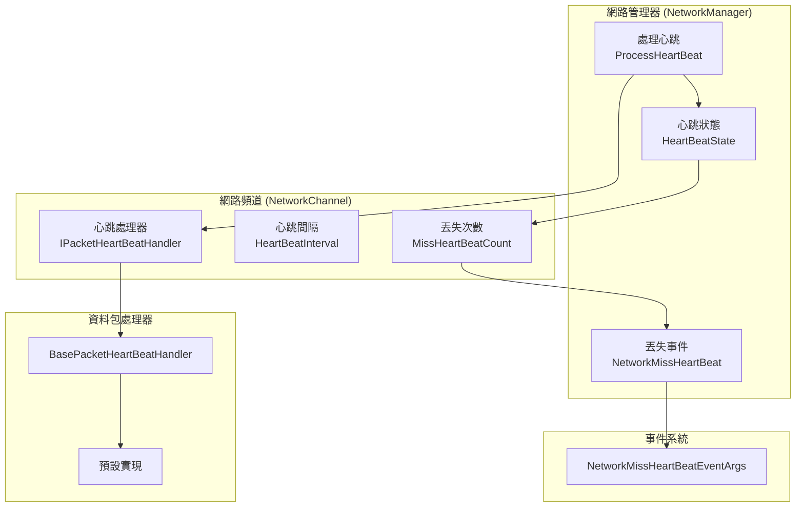
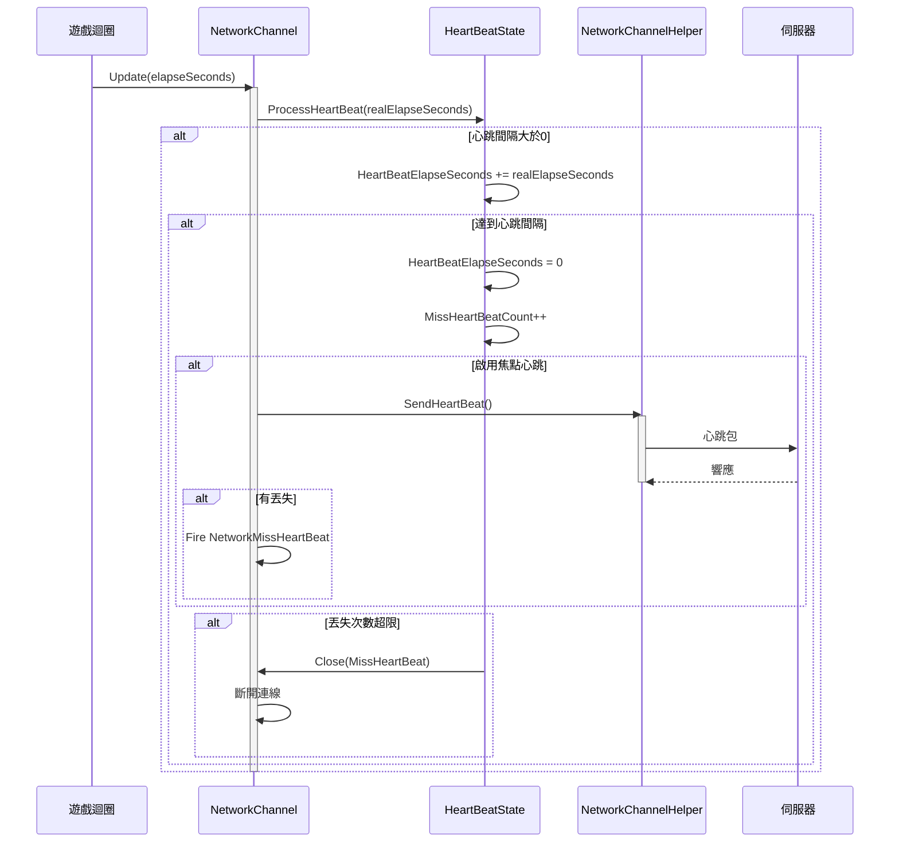

# 心跳機制

心跳機制是網路通訊中用於檢測連線存活狀態的重要功能。透過定期傳送心跳包，可以及時發現網路中斷或對端不可達的情況，從而採取相應的處理措施。

## 概述

GameFrameX 網路模組提供了一套完整的心跳機制，主要包括以下功能：

1. **定期心跳檢測**：客戶端按固定間隔向伺服器傳送心跳包
2. **丟失檢測**：伺服器端檢測心跳丟失次數，超過閾值時主動斷開連線
3. **應用焦點控制**：支援根據應用程式是否獲得焦點來控制心跳傳送
4. **事件通知**：心跳丟失時觸發事件，便於上層邏輯處理

心跳機制的核心設計理念是：**保活（Keep-Alive）**。在長連線通訊中，由於 TCP 協議的半關閉特性，連線雙方可能無法及時感知對端已經離線。心跳機制透過定期交換輕量級訊息，確保雙方都能及時發現連線狀態異常。

## 架構設計

心跳機制涉及多個核心組件，協同完成連線保活功能：



### 組件職責

| 組件 | 職責 | 關鍵屬性/方法 |
|------|------|--------------|
| `HeartBeatState` | 管理心跳狀態資料 | `HeartBeatElapseSeconds`、`MissHeartBeatCount`、`Reset()` |
| `IPacketHeartBeatHandler` | 定義心跳訊息處理器介面 | `HeartBeatInterval`、`MissHeartBeatCountByClose`、`Handler()` |
| `BasePacketHeartBeatHandler` | 心跳處理器的預設實現 | 預設心跳間隔5秒，丟失5次觸發斷開 |
| `ProcessHeartBeat()` | 核心心跳處理邏輯 | 檢測超時、傳送心跳、觸發斷開 |
| `NetworkMissHeartBeatEventArgs` | 心跳丟失事件引數 | `NetworkChannel`、`MissCount` |

## 核心流程

心跳機制的核心處理流程如下：



### 處理步驟詳解

1. **時間累加**：每幀更新時，將時間增量累加到心跳流逝時間
2. **傳送判斷**：當流逝時間超過心跳間隔時，觸發心跳傳送
3. **訊息傳送**：呼叫 `IPacketHeartBeatHandler.Handler()` 獲取心跳訊息併傳送
4. **丟失計數**：傳送心跳後，增加丟失計數
5. **事件觸發**：如果存在丟失，觸發 `NetworkMissHeartBeat` 事件
6. **斷開判斷**：當丟失次數超過閾值時，關閉連線

## 使用示例

### 基礎配置

在建立網路頻道時，心跳處理器會自動註冊：

```csharp
// 建立網路頻道時會自動使用預設的心跳處理器
var networkChannel = networkManager.CreateNetworkChannel("GameServer", networkChannelHelper, 5000);

// 預設配置：
// - 心跳間隔：30秒
// - 丟失閾值：10次
```
> Source: [NetworkManager.NetworkChannelBase.cs](https://github.com/GameFrameX/com.gameframex.unity.network/blob/main/Runtime/Network/Network/NetworkManager.NetworkChannelBase.cs#L52-L57)

### 自定義心跳處理器

可以透過實現 `IPacketHeartBeatHandler` 介面來自定義心跳行為：

```csharp
using GameFrameX.Network.Runtime;

// 自定義心跳處理器
public class CustomHeartBeatHandler : BasePacketHeartBeatHandler
{
    // 自定義心跳間隔：10秒
    public override float HeartBeatInterval => 10f;
    
    // 自定義丟失閾值：3次
    public override int MissHeartBeatCountByClose => 3;
    
    public override MessageObject Handler()
    {
        // 返回自定義的心跳訊息物件
        return new HeartBeatMessage();
    }
}

// 註冊自定義處理器
networkChannel.RegisterHeartBeatHandler(new CustomHeartBeatHandler());
```
> Source: [BasePacketHeartBeatHandler.cs](https://github.com/GameFrameX/com.gameframex.unity.network/blob/main/Runtime/Network/Helper/DefaultPacketHeartBeatHandler.cs#L7-L26)

### 監聽心跳丟失事件

可以訂閱 `NetworkMissHeartBeat` 事件來處理心跳丟失情況：

```csharp
// 在 NetworkComponent 或初始化程式碼中訂閱事件
m_NetworkManager.NetworkMissHeartBeat += OnNetworkMissHeartBeat;

private void OnNetworkMissHeartBeat(object sender, NetworkMissHeartBeatEventArgs eventArgs)
{
    var channelName = eventArgs.NetworkChannel.Name;
    var missCount = eventArgs.MissCount;
    
    Log.Warning($"心跳丟失！頻道：{channelName}，丟失次數：{missCount}");
    
    // 可以在這裡實現重連邏輯或其他處理
    if (missCount >= 5)
    {
        // 丟失次數過多，準備斷開連線
    }
}
```
> Source: [NetworkMissHeartBeatEventArgs.cs](https://github.com/GameFrameX/com.gameframex.unity.network/blob/main/Runtime/EventArgs/NetworkMissHeartBeatEventArgs.cs#L41-L97)

### 應用焦點控制

可以透過 `NetworkComponent` 配置是否在應用失去焦點時傳送心跳：

```csharp
// 在 NetworkComponent 的 Inspector 面板中：
// - 勾選 "Focus Send Heartbeat"：應用獲得焦點時傳送心跳
// - 不勾選：應用失去焦點時也會繼續傳送心跳（預設行為）

// 或者透過程式碼動態控制：
m_NetworkManager.SetFocusHeartbeat(true);  // 獲得焦點時傳送
m_NetworkManager.SetFocusHeartbeat(false); // 失去焦點時也傳送
```
> Source: [NetworkComponent.cs](https://github.com/GameFrameX/com.gameframex.unity.network/blob/main/Runtime/Network/NetworkComponent.cs#L65-L91)

### 接收訊息重置心跳

預設情況下，收到任何訊息包都會重置心跳流逝時間。如果需要禁用此行為：

```csharp
// 禁用收到訊息時重置心跳
networkChannel.ResetHeartBeatElapseSecondsWhenReceivePacket = false;

// 啟用收到訊息時重置心跳（預設）
networkChannel.ResetHeartBeatElapseSecondsWhenReceivePacket = true;
```
> Source: [INetworkChannel.cs](https://github.com/GameFrameX/com.gameframex.unity.network/blob/main/Runtime/Network/Interface/INetworkChannel.cs#L79-L82)

## 配置選項

### 心跳相關屬性

| 屬性 | 型別 | 預設值 | 說明 |
|------|------|--------|------|
| `HeartBeatInterval` | float | 30秒 | 心跳傳送間隔，單位：秒 |
| `MissHeartBeatCount` | int | 10 | 丟失多少次心跳後斷開連線 |
| `ResetHeartBeatElapseSecondsWhenReceivePacket` | bool | false | 收到訊息時是否重置心跳流逝時間 |
| `PFocusHeartbeat` | bool | true | 是否在應用獲得焦點時傳送心跳 |

### IPacketHeartBeatHandler 配置

| 屬性 | 型別 | 預設值 | 說明 |
|------|------|--------|------|
| `HeartBeatInterval` | float | 5秒 | 心跳處理器的心跳間隔 |
| `MissHeartBeatCountByClose` | int | 5 | 心跳處理器定義的斷開閾值 |

### 焦點心跳配置

| 配置項 | 型別 | 預設值 | 說明 |
|--------|------|--------|------|
| `m_FocusHeartbeat` | bool | false | NetworkComponent 上的序列化欄位 |

## API 參考

### `IPacketHeartBeatHandler`

心跳訊息處理器介面。

```csharp
public interface IPacketHeartBeatHandler
{
    /// <summary>
    /// 每次心跳的間隔
    /// </summary>
    float HeartBeatInterval { get; }

    /// <summary>
    /// 幾次心跳丟失。觸發斷開網路
    /// </summary>
    int MissHeartBeatCountByClose { get; }

    /// <summary>
    /// 處理器，返回心跳訊息物件
    /// </summary>
    MessageObject Handler();
}
```

> Source: [IPacketHeartBeatHandler.cs](https://github.com/GameFrameX/com.gameframex.unity.network/blob/main/Runtime/Network/Interface/IPacketHeartBeatHandler.cs#L1-L24)

### `INetworkChannel`

網路頻道介面中的心跳相關屬性和方法：

```csharp
// 獲取或設定當收到訊息包時是否重置心跳流逝時間
bool ResetHeartBeatElapseSecondsWhenReceivePacket { get; set; }

// 獲取丟失心跳的次數
int MissHeartBeatCount { get; }

// 獲取或設定心跳間隔時長，以秒為單位
float HeartBeatInterval { get; set; }

// 獲取心跳等待時長，以秒為單位
float HeartBeatElapseSeconds { get; }

// 獲取心跳訊息處理器
IPacketHeartBeatHandler PacketHeartBeatHandler { get; }

// 註冊網路訊息心跳處理函式
void RegisterHeartBeatHandler(IPacketHeartBeatHandler handler);
```

> Source: [INetworkChannel.cs](https://github.com/GameFrameX/com.gameframex.unity.network/blob/main/Runtime/Network/Interface/INetworkChannel.cs#L79-L174)

### `INetworkManager`

網路管理器介面中的心跳相關方法：

```csharp
/// <summary>
/// 網路心跳包丟失事件
/// </summary>
event EventHandler<NetworkMissHeartBeatEventArgs> NetworkMissHeartBeat;

/// <summary>
/// 設定是否在應用程式獲得焦點時傳送心跳包
/// </summary>
void SetFocusHeartbeat(bool hasFocus);
```

> Source: [INetworkManager.cs](https://github.com/GameFrameX/com.gameframex.unity.network/blob/main/Runtime/Network/Interface/INetworkManager.cs#L57-L113)

### `HeartBeatState`

心跳狀態管理類：

```csharp
public sealed class HeartBeatState
{
    /// <summary>
    /// 心跳間隔時長
    /// </summary>
    public float HeartBeatElapseSeconds { get; set; }

    /// <summary>
    /// 心跳丟失次數
    /// </summary>
    public int MissHeartBeatCount { get; set; }

    /// <summary>
    /// 重置心跳資料=>保活
    /// </summary>
    /// <param name="resetHeartBeatElapseSeconds">是否重置心跳流逝時長</param>
    public void Reset(bool resetHeartBeatElapseSeconds);
}
```

> Source: [NetworkManager.HeartBeatState.cs](https://github.com/GameFrameX/com.gameframex.unity.network/blob/main/Runtime/Network/Network/NetworkManager.HeartBeatState.cs#L39-L82)

### `NetworkMissHeartBeatEventArgs`

心跳丟失事件引數：

```csharp
public sealed class NetworkMissHeartBeatEventArgs : GameEventArgs
{
    /// <summary>
    /// 網路心跳包丟失事件編號
    /// </summary>
    public static readonly string EventId;

    /// <summary>
    /// 獲取網路頻道
    /// </summary>
    public INetworkChannel NetworkChannel { get; }

    /// <summary>
    /// 獲取心跳包已丟失次數
    /// </summary>
    public int MissCount { get; }

    /// <summary>
    /// 建立網路心跳包丟失事件
    /// </summary>
    public static NetworkMissHeartBeatEventArgs Create(INetworkChannel networkChannel, int missCount);
}
```

> Source: [NetworkMissHeartBeatEventArgs.cs](https://github.com/GameFrameX/com.gameframex.unity.network/blob/main/Runtime/EventArgs/NetworkMissHeartBeatEventArgs.cs#L41-L97)

## 設計考量

### 為什麼需要心跳機制？

1. **TCP 半關閉問題**：TCP 連線的一方可以獨立關閉寫端而保持讀端開啟，這種情況下無法透過底層 socket 錯誤來感知連線斷開
2. **NAT 超時**：大多數 NAT 裝置會在連線空閒一段時間後清除狀態，導致外網無法訪問內網主機
3. **伺服器負載**：伺服器需要及時清理無效連線以釋放資源

### 為什麼需要應用焦點控制？

在移動端或瀏覽器環境中，當應用失去焦點時（如切換到後臺、接聽電話），網路通訊可能變得不可靠或被系統掛起。此時：
- 繼續傳送心跳會造成無效網路請求
- 可能導致電池電量消耗
- 可能觸發伺服器不必要的斷開重連

透過 `Focus Send Heartbeat` 功能，可以在應用獲得焦點時立即傳送心跳，恢復正常檢測。

### 心跳間隔的設定建議

- **遊戲客戶端**：建議 5-30 秒，過短會增加伺服器負載，過長則影響斷開檢測的及時性
- **高可靠性場景**：可設定 3-5 秒，快速檢測連線狀態
- **低流量場景**：可設定 30-60 秒，減少網路開銷

## 相關連結

- [網路管理器](./4-core-concepts.1-network-manager)
- [網路頻道](./4-core-concepts.2-network-channel)
- [訊息型別](./4-core-concepts.3-message-types)
- [資料包處理器](./4-core-concepts.4-packet-handlers)
- [事件系統](./6-events)
- [RPC 遠端呼叫](./8-rpc)
