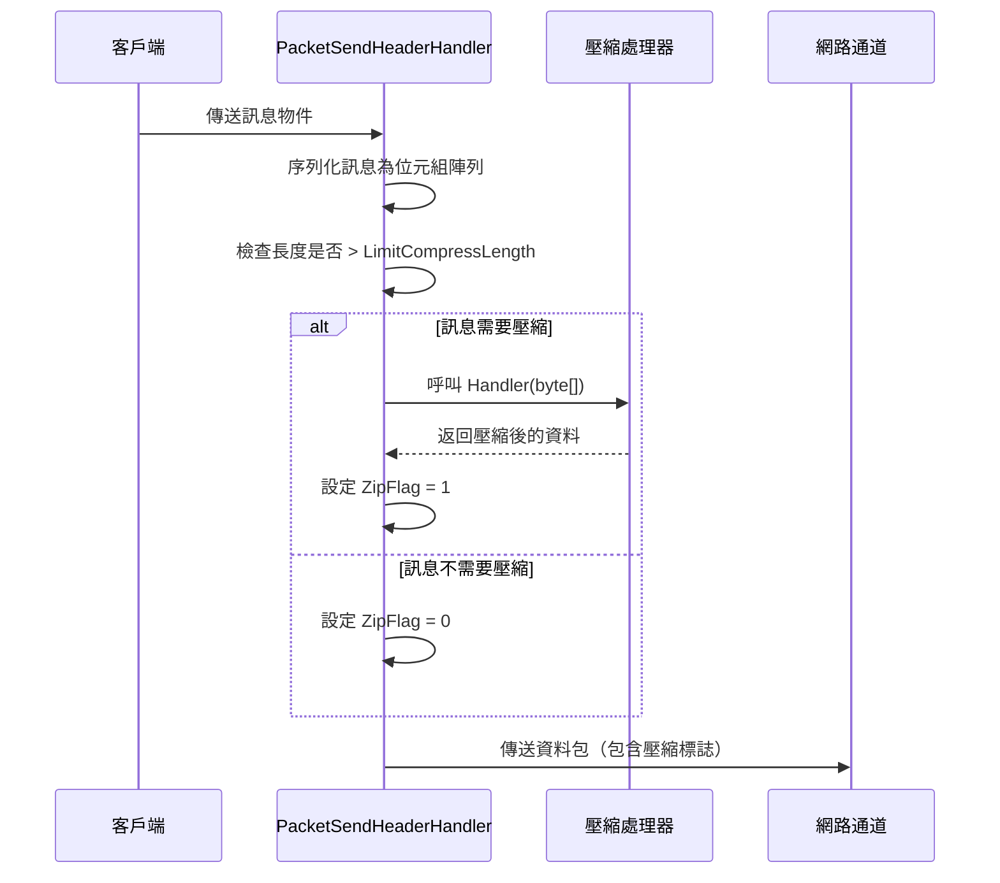
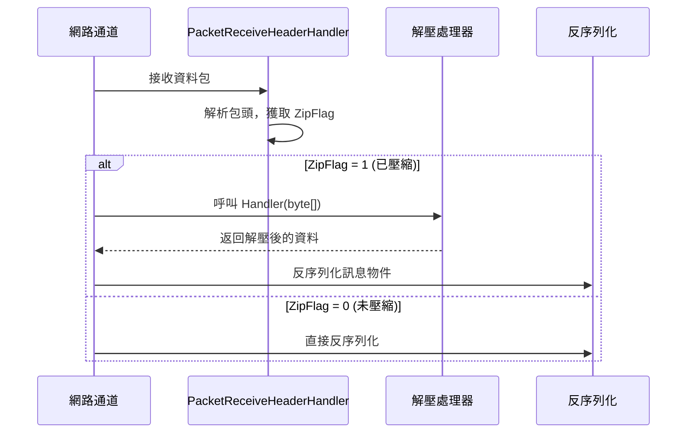

# 訊息壓縮

訊息壓縮功能用於在網路傳輸過程中對訊息 payload 進行壓縮，以減少網路頻寬消耗和傳輸時間。

## 概述

GameFrameX Network 提供了可擴充套件的訊息壓縮機制，預設使用 GZIP 壓縮演算法。壓縮系統採用閾值策略，只對超過指定大小的訊息進行壓縮，避免對小訊息進行不必要的壓縮處理。

### 核心功能

- **自動壓縮**：訊息傳送時自動判斷是否需要壓縮
- **自動解壓**：接收訊息時根據壓縮標誌自動解壓
- **可擴充套件介面**：支援自定義壓縮演算法
- **閾值控制**：透過 `LimitCompressLength` 配置壓縮啟用閾值

## Architecture

```mermaid
flowchart TD
    subgraph Send["訊息傳送流程"]
        S1[序列化訊息] --> S2{訊息長度 > LimitCompressLength?}
        S2 -->|是| S3[呼叫壓縮處理器]
        S2 -->|否| S4[不壓縮]
        S3 --> S5[設定壓縮標誌]
        S5 --> S6[新增包頭併傳送]
        S4 --> S6
    end

    subgraph Receive["訊息接收流程"]
        R1[接收資料包] --> R2[解析包頭]
        R2 --> R3{ZipFlag = 1?}
        R3 -->|是| R4[呼叫解壓處理器]
        R3 -->|否| R5[直接反序列化]
        R4 --> R6[反序列化訊息]
        R5 --> R6
    end

    subgraph Handlers["壓縮處理器"]
        H1[IMessageCompressHandler]
        H2[IMessageDecompressHandler]
        H3[DefaultMessageCompressHandler]
        H4[DefaultMessageDecompressHandler]
    end

    H1 <|.. H3
    H2 <|.. H4
    S3 -->|呼叫| H3
    R4 -->|呼叫| H4
```

## 核心組件

### 介面定義

#### IMessageCompressHandler

訊息壓縮處理器介面，定義壓縮訊息資料的方法。

> Source: [IMessageCompressHandler.cs](https://github.com/GameFrameX/com.gameframex.unity.network/blob/main/Runtime/Network/Interface/IMessageCompressHandler.cs#L6-L14)

```csharp
public interface IMessageCompressHandler
{
    /// <summary>
    /// 壓縮處理
    /// </summary>
    /// <param name="message">訊息未壓縮內容</param>
    /// <returns>壓縮後的位元組陣列</returns>
    byte[] Handler(byte[] message);
}
```

#### IMessageDecompressHandler

訊息解壓器介面，定義解壓壓縮訊息的方法。

> Source: [IMessageDecompressHandler.cs](https://github.com/GameFrameX/com.gameframex.unity.network/blob/main/Runtime/Network/Interface/IMessageDecompressHandler.cs#L6-L14)

```csharp
public interface IMessageDecompressHandler
{
    /// <summary>
    /// 解壓處理
    /// </summary>
    /// <param name="message">訊息壓縮內容</param>
    /// <returns>解壓後的位元組陣列</returns>
    byte[] Handler(byte[] message);
}
```

### 預設實現

#### DefaultMessageCompressHandler

預設的訊息壓縮處理器，使用 GZIP 壓縮演算法。

> Source: [DefaultMessageCompressHandler.cs](https://github.com/GameFrameX/com.gameframex.unity.network/blob/main/Runtime/Network/Helper/DefaultMessageCompressHandler.cs#L9-L20)

```csharp
[UnityEngine.Scripting.Preserve]
public sealed class DefaultMessageCompressHandler : IMessageCompressHandler, IPacketHandler
{
    public byte[] Handler(byte[] message)
    {
        return ZipHelper.Compress(message);
    }
}
```

#### DefaultMessageDecompressHandler

預設的訊息解壓處理器，使用 GZIP 解壓演算法。

> Source: [DefaultMessageDecompressHandler.cs](https://github.com/GameFrameX/com.gameframex.unity.network/blob/main/Runtime/Network/Helper/DefaultMessageDecompressHandler.cs#L9-L20)

```csharp
[UnityEngine.Scripting.Preserve]
public sealed class DefaultMessageDecompressHandler : IMessageDecompressHandler, IPacketHandler
{
    public byte[] Handler(byte[] message)
    {
        return ZipHelper.Decompress(message);
    }
}
```

## 壓縮流程詳解

### 訊息傳送時的壓縮流程



傳送流程的核心邏輯在 `DefaultPacketSendHeaderHandler` 中：

> Source: [DefaultPacketSendHeaderHandler.cs#L83-L97](https://github.com/GameFrameX/com.gameframex.unity.network/blob/main/Runtime/Network/Helper/DefaultPacketSendHeaderHandler.cs#L83-L97)

```csharp
public bool Handler<T>(T messageObject, IMessageCompressHandler messageCompressHandler, 
    MemoryStream destination, out byte[] messageBodyBuffer) where T : MessageObject
{
    var messageType = messageObject.GetType();
    Id = ProtoMessageIdHandler.GetReqMessageIdByType(messageType);
    messageBodyBuffer = SerializerHelper.Serialize(messageObject);
    
    if (messageCompressHandler != null && messageBodyBuffer.Length > LimitCompressLength)
    {
        IsZip = true;
        messageBodyBuffer = messageCompressHandler.Handler(messageBodyBuffer);
    }
    else
    {
        IsZip = false;
    }
    // ... 後續處理
}
```

### 訊息接收時的解壓流程

當接收到網路資料包時，網路通道根據包頭中的 `ZipFlag` 標誌判斷是否需要解壓：



TCP 網路通道的解壓實現：

> Source: [NetworkManager.SystemTcpNetworkChannel.cs#L225-L230](https://github.com/GameFrameX/com.gameframex.unity.network/blob/main/Runtime/Network/Network/SystemSocket/NetworkManager.SystemTcpNetworkChannel.cs#L225-L230)

```csharp
if (PReceiveState.PacketHeader.ZipFlag != 0)
{
    // 解壓
    GameFrameworkGuard.NotNull(MessageDecompressHandler, nameof(MessageDecompressHandler));
    buffer = MessageDecompressHandler.Handler(buffer);
}
```

## 自動序號產生器制

訊息壓縮處理器透過 `IPacketHandler` 介面標記，利用反射自動註冊到網路通道中。

> Source: [DefaultNetworkChannelHelper.cs#L91-L100](https://github.com/GameFrameX/com.gameframex.unity.network/blob/main/Runtime/Network/Helper/DefaultNetworkChannelHelper.cs#L91-L100)

```csharp
// 反射註冊訊息壓縮處理器
var messageCompressHandlerBaseType = typeof(IMessageCompressHandler);
var messageDecompressHandlerBaseType = typeof(IMessageDecompressHandler);

foreach (var type in types)
{
    // ... 
    else if (type.IsImplWithInterface(messageCompressHandlerBaseType))
    {
        var handler = (IMessageCompressHandler)Activator.CreateInstance(type);
        m_NetworkChannel.RegisterMessageCompressHandler(handler);
    }
    else if (type.IsImplWithInterface(messageDecompressHandlerBaseType))
    {
        var handler = (IMessageDecompressHandler)Activator.CreateInstance(type);
        m_NetworkChannel.RegisterMessageDecompressHandler(handler);
    }
}
```

## 使用示例

### 使用預設壓縮處理器

預設情況下，系統會自動註冊 `DefaultMessageCompressHandler` 和 `DefaultMessageDecompressHandler`，無需手動配置：

```csharp
// 訊息會自動進行壓縮處理
// 僅當訊息體大小超過 LimitCompressLength (預設512位元組) 時才會壓縮
networkChannel.Send(new TestMessage { Data = "Hello World" });
```

### 自定義壓縮處理器

如果需要使用其他壓縮演算法（如 LZ4、Zstd），可以建立自定義處理器：

```csharp
// 自定義壓縮處理器示例
public class LZ4CompressHandler : IMessageCompressHandler, IPacketHandler
{
    public byte[] Handler(byte[] message)
    {
        // 使用 LZ4 演算法壓縮
        return LZ4.Compress(message);
    }
}

public class LZ4DecompressHandler : IMessageDecompressHandler, IPacketHandler
{
    public byte[] Handler(byte[] message)
    {
        // 使用 LZ4 演算法解壓
        return LZ4.Decompress(message);
    }
}
```

自定義處理器會自動被系統發現並註冊，前提是：
1. 實現 `IMessageCompressHandler` 或 `IMessageDecompressHandler` 介面
2. 實現 `IPacketHandler` 介面（用於標記自動註冊）
3. 放置在程式集中（會被反射掃描到）

### 禁用壓縮

如果不需要訊息壓縮，可以不新增壓縮處理器到程式集中，或者手動將處理器設定為 null：

> Source: [NetworkManager.NetworkChannelBase.cs#L496-L502](https://github.com/GameFrameX/com.gameframex.unity.network/blob/main/Runtime/Network/Network/NetworkManager.NetworkChannelBase.cs#L496-L502)

```csharp
// 設定為 null 可禁用壓縮
networkChannel.RegisterMessageCompressHandler(null);
networkChannel.RegisterMessageDecompressHandler(null);
```

## 配置選項

### LimitCompressLength

壓縮閾值配置，控制訊息超過多大小時啟用壓縮。

> Source: [DefaultPacketSendHeaderHandler.cs#L66-L69](https://github.com/GameFrameX/com.gameframex.unity.network/blob/main/Runtime/Network/Helper/DefaultPacketSendHeaderHandler.cs#L66-L69)

| 屬性 | 型別 | 預設值 | 描述 |
|------|------|--------|------|
| LimitCompressLength | uint | 512 | 訊息體超過此長度時啟用壓縮（位元組） |

### 修改預設閾值

如需修改壓縮閾值，可以繼承 `DefaultPacketSendHeaderHandler`：

```csharp
public class CustomPacketSendHeaderHandler : DefaultPacketSendHeaderHandler
{
    // 將壓縮閾值設定為 1024 位元組
    public override uint LimitCompressLength { get; } = 1024;
}
```

## 包頭結構

訊息包頭中包含壓縮標誌，用於標識訊息體是否經過壓縮：

| 欄位 | 長度 | 描述 |
|------|------|------|
| PacketLength | 4 位元組 | 資料包總長度 |
| OperationType | 1 位元組 | 操作型別 (1=心跳, 4=普通訊息) |
| **ZipFlag** | **1 位元組** | **壓縮標誌 (0=未壓縮, 1=已壓縮)** |
| UniqueId | 4 位元組 | 訊息唯一編號 |
| Id | 4 位元組 | 訊息協議號 |

> Source: [DefaultPacketSendHeaderHandler.cs#L30-L31](https://github.com/GameFrameX/com.gameframex.unity.network/blob/main/Runtime/Network/Helper/DefaultPacketSendHeaderHandler.cs#L30-L31)

## API Reference

### IMessageCompressHandler

```csharp
byte[] Handler(byte[] message)
```

**引數：**
- `message` (byte[]): 未壓縮的原始訊息位元組陣列

**返回：** 壓縮後的位元組陣列

**丟擲：**
- 空實現可能返回 null

### IMessageDecompressHandler

```csharp
byte[] Handler(byte[] message)
```

**引數：**
- `message` (byte[]): 壓縮後的訊息位元組陣列

**返回：** 解壓後的原始位元組陣列

### INetworkChannel

```csharp
void RegisterMessageCompressHandler(IMessageCompressHandler handler)
```

註冊訊息壓縮處理器。

```csharp
void RegisterMessageDecompressHandler(IMessageDecompressHandler handler)
```

註冊訊息解壓處理器。

```csharp
IMessageCompressHandler MessageCompressHandler { get; }
```

獲取當前配置的壓縮處理器。

```csharp
IMessageDecompressHandler MessageDecompressHandler { get; }
```

獲取當前配置的解壓處理器。

## Related Links

- [網路管理器](./4-core-concepts.1-network-manager) - 網路管理器概述
- [網路頻道](./4-core-concepts.2-network-channel) - 網路通道配置
- [資料包處理器](./4-core-concepts.4-packet-handlers) - 包處理器詳解
- [心跳機制](./5-heartbeat) - 心跳與壓縮標誌
- [事件系統](./6-events) - 網路事件處理
