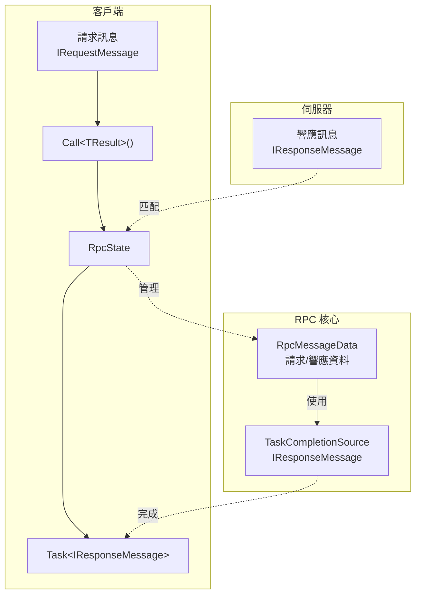
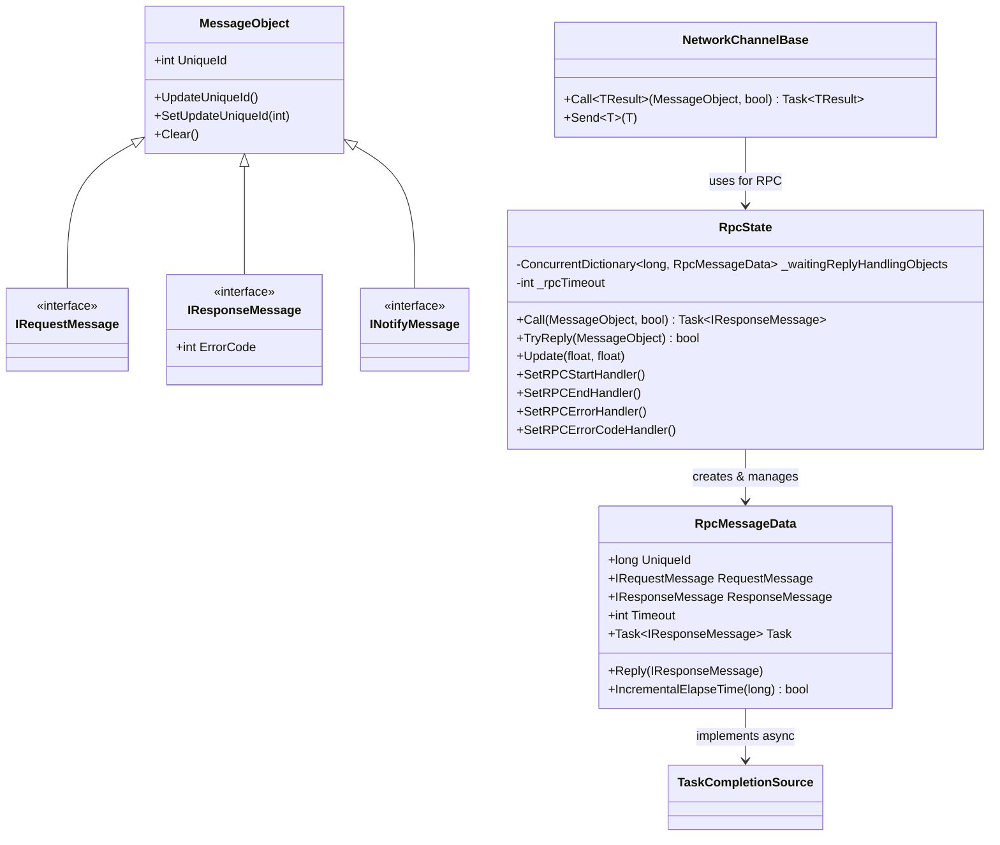
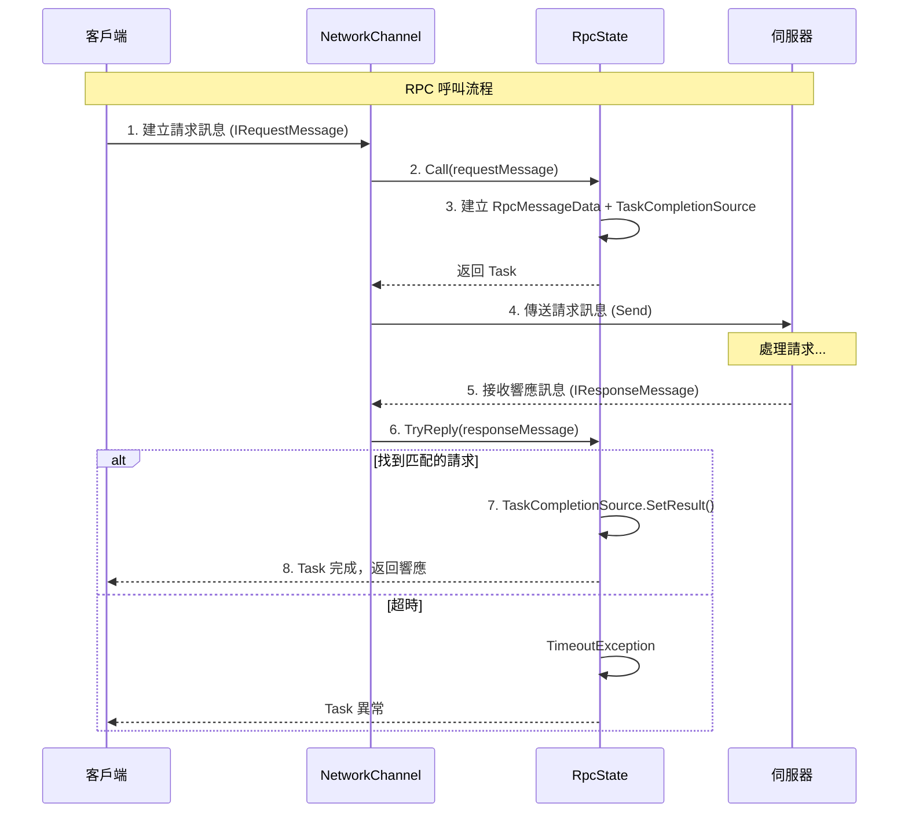

# RPC 遠端呼叫

RPC（Remote Procedure Call，遠端過程呼叫）機制允許客戶端向伺服器傳送請求並等待響應，是網路遊戲中最常用的客戶端-伺服器通訊方式。

## 概述

GameFrameX 網路庫提供了完整的 RPC 實現，支援：

- **同步呼叫**：傳送請求後阻塞等待響應
- **非同步呼叫**：使用 async/await 模式非同步等待響應
- **超時處理**：自動檢測並處理 RPC 超時
- **錯誤處理**：支援錯誤碼回呼和異常處理
- **事件通知**：RPC 開始、完成、錯誤的全程事件監聽

### 訊息型別

系統定義了三種訊息型別用於不同的通訊場景：

| 型別 | 介面 | 用途 |
|------|------|------|
| 請求訊息 | `IRequestMessage` | 客戶端傳送給伺服器的請求 |
| 響應訊息 | `IResponseMessage` | 伺服器返回給客戶端的響應，包含 ErrorCode |
| 通知訊息 | `INotifyMessage` | 伺服器主動傳送給客戶端的通知，無需響應 |

## 架構

RPC 系統由以下核心組件構成：



### 核心組件



## 訊息定義

在 GameFrameX 網路庫中，所有網路訊息都繼承自 `MessageObject` 基類，並實現相應的介面：

### 請求訊息

```csharp
namespace GameFrameX.Network.Runtime
{
    /// <summary>
    /// 客戶端傳送給伺服器的訊息的基類介面
    /// </summary>
    public interface IRequestMessage
    {
    }
}
```

> Source: [IRequestMessage.cs](https://github.com/GameFrameX/com.gameframex.unity.network/blob/main/Runtime/Network/Base/IRequestMessage.cs#L1-L9)

### 響應訊息

```csharp
namespace GameFrameX.Network.Runtime
{
    /// <summary>
    /// 伺服器返回給客戶端的訊息基類介面
    /// </summary>
    public interface IResponseMessage
    {
        /// <summary>
        /// 錯誤碼，非 0 表示錯誤
        /// </summary>
        int ErrorCode { get; }
    }
}
```

> Source: [IResponseMessage.cs](https://github.com/GameFrameX/com.gameframex.unity.network/blob/main/Runtime/Network/Base/IResponseMessage.cs#L1-L13)

### 通知訊息

```csharp
namespace GameFrameX.Network.Runtime
{
    /// <summary>
    /// 伺服器傳送給客戶端的訊息基類介面
    /// </summary>
    public interface INotifyMessage
    {
    }
}
```

> Source: [INotifyMessage.cs](https://github.com/GameFrameX/com.gameframex.unity.network/blob/main/Runtime/Network/Base/INotifyMessage.cs#L1-L9)

### 訊息基類

```csharp
namespace GameFrameX.Network.Runtime
{
    public class MessageObject : IReference
    {
        /// <summary>
        /// 訊息唯一編號
        /// </summary>
        public int UniqueId { get; private set; }

        protected MessageObject()
        {
            UpdateUniqueId();
        }

        public void UpdateUniqueId()
        {
            UniqueId = Utility.IdGenerator.GetNextUniqueIntId();
        }

        public virtual void Clear()
        {
        }
    }
}
```

> Source: [MessageObject.cs](https://github.com/GameFrameX/com.gameframex.unity.network/blob/main/Runtime/Network/Base/MessageObject.cs#L1-L56)

## RPC 呼叫流程

RPC 呼叫的完整流程如下：



## 使用示例

### 基本 RPC 呼叫

```csharp
using GameFrameX.Network.Runtime;

// 定義請求訊息
public class LoginRequest : MessageObject, IRequestMessage
{
    public string Username { get; set; }
    public string Password { get; set; }
}

// 定義響應訊息
public class LoginResponse : MessageObject, IResponseMessage
{
    public int ErrorCode { get; set; }
    public string Token { get; set; }
    public long UserId { get; set; }
}

// 呼叫 RPC
var channel = networkComponent.GetNetworkChannel("Game");
var request = new LoginRequest 
{ 
    Username = "player1", 
    Password = "password123" 
};

// 非同步呼叫
var response = await channel.Call<LoginResponse>(request);

if (response.ErrorCode == 0)
{
    Debug.Log($"登入成功，使用者ID: {response.UserId}");
}
else
{
    Debug.LogError($"登入失敗，錯誤碼: {response.ErrorCode}");
}
```

> Sources:
> - [NetworkChannelBase.cs](https://github.com/GameFrameX/com.gameframex.unity.network/blob/main/Runtime/Network/Network/NetworkManager.NetworkChannelBase.cs#L765-L771)
> - [RpcState.cs](https://github.com/GameFrameX/com.gameframex.unity.network/blob/main/Runtime/Network/Network/NetworkManager.RpcState.cs#L125-L144)

### 處理錯誤碼

```csharp
// 設定錯誤碼回呼
channel.SetRPCErrorCodeHandler((sender, message) =>
{
    var response = message as IResponseMessage;
    Debug.LogError($"RPC 錯誤碼: {response?.ErrorCode}");
});

// 呼叫時忽略錯誤碼（不會丟擲異常）
var response = await channel.Call<LoginResponse>(request, isIgnoreErrorCode: true);
```

> Source: [NetworkChannelBase.cs](https://github.com/GameFrameX/com.gameframex.unity.network/blob/main/Runtime/Network/Network/NetworkManager.NetworkChannelBase.cs#L592-L629)

### 處理超時

```csharp
// 設定 RPC 超時錯誤回呼
channel.SetRPCErrorHandler((sender, message) =>
{
    Debug.LogError($"RPC 超時: {message.GetType().Name}");
});
```

> Source: [RpcState.cs](https://github.com/GameFrameX/com.gameframex.unity.network/blob/main/Runtime/Network/Network/NetworkManager.RpcState.cs#L195-L232)

### 監聽 RPC 事件

```csharp
// RPC 開始傳送
channel.SetRPCStartHandler((sender, message) =>
{
    Debug.Log($"RPC 開始: {message.GetType().Name}");
});

// RPC 成功完成
channel.SetRPCEndHandler((sender, message) =>
{
    Debug.Log($"RPC 完成: {message.GetType().Name}");
});

// RPC 超時
channel.SetRPCErrorHandler((sender, message) =>
{
    Debug.LogError($"RPC 錯誤: {message.GetType().Name}");
});

// RPC 返回錯誤碼
channel.SetRPCErrorCodeHandler((sender, message) =>
{
    var response = message as IResponseMessage;
    Debug.LogError($"RPC 錯誤碼: {response?.ErrorCode}");
});
```

## 配置選項

### NetworkComponent 配置

在 Unity 編輯器中可以透過 NetworkComponent 配置 RPC 超時時間：

| 屬性 | 型別 | 預設值 | 描述 |
|------|------|--------|------|
| m_rpcTimeout | int | 5000 | RPC 超時時間（毫秒） |
| m_FocusHeartbeat | bool | false | 應用程式失去焦點時是否繼續傳送心跳 |

```csharp
// 建立網路頻道時應用配置
public INetworkChannel CreateNetworkChannel(string channelName, INetworkChannelHelper networkChannelHelper)
{
    var networkChannel = m_NetworkManager.CreateNetworkChannel(channelName, networkChannelHelper, m_rpcTimeout);
    return networkChannel;
}
```

> Source: [NetworkComponent.cs](https://github.com/GameFrameX/com.gameframex.unity.network/blob/main/Runtime/Network/NetworkComponent.cs#L176-L182)

### RpcState 配置

RpcState 建構函式要求超時時間不能小於 3000 毫秒：

```csharp
public RpcState(int timeout)
{
    _rpcTimeout = timeout;
    if (_rpcTimeout < 3000)
    {
        throw new ArgumentOutOfRangeException(nameof(timeout), "RPC超時時間不能小於3000毫秒");
    }
}
```

> Source: [RpcState.cs](https://github.com/GameFrameX/com.gameframex.unity.network/blob/main/Runtime/Network/Network/NetworkManager.RpcState.cs#L61-L68)

## API 參考

### INetworkChannel.Call<TResult>

```csharp
Task<TResult> Call<TResult>(MessageObject messageObject, bool isIgnoreErrorCode = false) where TResult : MessageObject, IResponseMessage
```

向遠端主機傳送 RPC 請求並等待響應。

**泛型引數：**
- `TResult` : 響應訊息型別，必須繼承 MessageObject 並實現 IResponseMessage

**引數：**
- `messageObject` (MessageObject): 請求訊息物件
- `isIgnoreErrorCode` (bool): 是否忽略錯誤碼，預設為 false

**返回：**
- `Task<TResult>`: 非同步任務，包含響應訊息

**異常：**
- `ArgumentNullException`: messageObject 為 null
- `TimeoutException`: RPC 超時
- `GameFrameworkException`: 傳送失敗

> Source: [NetworkChannelBase.cs](https://github.com/GameFrameX/com.gameframex.unity.network/blob/main/Runtime/Network/Network/NetworkManager.NetworkChannelBase.cs#L765-L771)

### INetworkChannel.SetRPCStartHandler

```csharp
void SetRPCStartHandler(EventHandler<MessageObject> handler)
```

設定 RPC 開始傳送時的回呼函式。

**引數：**
- `handler` (EventHandler<MessageObject>): 回呼處理函式

> Source: [NetworkChannelBase.cs](https://github.com/GameFrameX/com.gameframex.unity.network/blob/main/Runtime/Network/Network/NetworkManager.NetworkChannelBase.cs#L613-L618)

### INetworkChannel.SetRPCEndHandler

```csharp
void SetRPCEndHandler(EventHandler<MessageObject> handler)
```

設定 RPC 成功完成時的回呼函式。

**引數：**
- `handler` (EventHandler<MessageObject>): 回呼處理函式

> Source: [NetworkChannelBase.cs](https://github.com/GameFrameX/com.gameframex.unity.network/blob/main/Runtime/Network/Network/NetworkManager.NetworkChannelBase.cs#L624-L629)

### INetworkChannel.SetRPCErrorHandler

```csharp
void SetRPCErrorHandler(EventHandler<MessageObject> handler)
```

設定 RPC 錯誤（超時）的回呼函式。

**引數：**
- `handler` (EventHandler<MessageObject>): 回呼處理函式

> Source: [NetworkChannelBase.cs](https://github.com/GameFrameX/com.gameframex.unity.network/blob/main/Runtime/Network/Network/NetworkManager.NetworkChannelBase.cs#L602-L607)

### INetworkChannel.SetRPCErrorCodeHandler

```csharp
void SetRPCErrorCodeHandler(EventHandler<MessageObject> handler)
```

設定 RPC 返回錯誤碼時的回呼函式。

**引數：**
- `handler` (EventHandler<MessageObject>): 回呼處理函式

> Source: [NetworkChannelBase.cs](https://github.com/GameFrameX/com.gameframex.unity.network/blob/main/Runtime/Network/Network/NetworkManager.NetworkChannelBase.cs#L591-L596)

## 訊息處理器

對於非 RPC 型別的訊息（通知訊息），使用 `MessageHandlerAttribute` 來註冊訊息處理器：

```csharp
public class GameMessageHandler : IMessageHandler
{
    [MessageHandler(typeof(ServerNotifyMessage), nameof(OnServerNotify))]
    private void OnServerNotify(MessageObject message)
    {
        var notify = message as ServerNotifyMessage;
        Debug.Log($"收到伺服器通知: {notify.Content}");
    }
}

// 註冊訊息處理器
ProtoMessageHandler.Add(new GameMessageHandler());
```

> Source: [MessageHandlerAttribute.cs](https://github.com/GameFrameX/com.gameframex.unity.network/blob/main/Runtime/Network/Base/MessageHandlerAttribute.cs#L1-L195)

## 最佳實踐

### 1. 合理設定超時時間

```csharp
// 根據業務需求設定合適的超時時間
// 重要業務操作（如登入、支付）: 10-30 秒
// 普通遊戲操作: 5-10 秒
// 高頻操作: 3-5 秒
var channel = networkComponent.CreateNetworkChannel("Game", helper);
// 或在 NetworkComponent 中設定 m_rpcTimeout
```

### 2. 使用錯誤碼回呼

```csharp
// 統一處理錯誤碼
channel.SetRPCErrorCodeHandler((sender, message) =>
{
    var response = message as IResponseMessage;
    switch (response.ErrorCode)
    {
        case 1001:
            // 處理特定錯誤
            break;
        default:
            // 通用錯誤處理
            break;
    }
});
```

### 3. 避免重複請求

```csharp
// 使用 CancellationToken 取消重複請求
private CancellationTokenSource _loginCts;

async Task LoginAsync()
{
    // 取消之前的登入請求
    _loginCts?.Cancel();
    _loginCts = new CancellationTokenSource();
    
    try
    {
        var response = await channel.Call<LoginResponse>(request);
        // 處理響應
    }
    catch (OperationCanceledException)
    {
        // 請求被取消
    }
}
```

### 4. 分離訊息定義

```csharp
// 建議按模組分離訊息定義
// Messages/LoginMessages.cs
public class LoginRequest : MessageObject, IRequestMessage { ... }
public class LoginResponse : MessageObject, IResponseMessage { ... }

// Messages/BattleMessages.cs
public class BattleStartRequest : MessageObject, IRequestMessage { ... }
public class BattleStartResponse : MessageObject, IResponseMessage { ... }
```

## 相關連結

- [訊息型別](./4-core-concepts.3-message-types)
- [網路管理器](./4-core-concepts.1-network-manager)
- [網路頻道](./4-core-concepts.2-network-channel)
- [心跳機制](./5-heartbeat)
- [事件系統](./6-events)
- [訊息壓縮](./7-message-compression)
