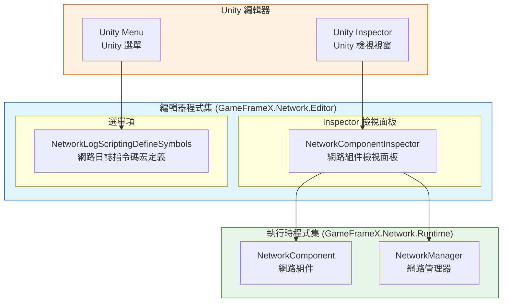
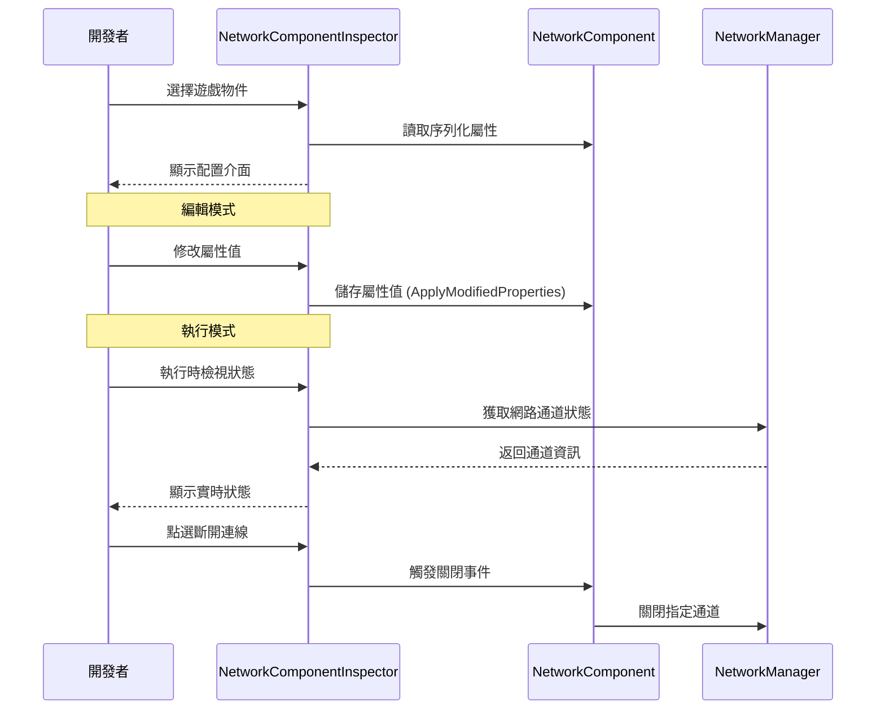
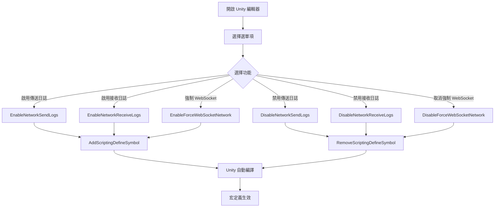

# 編輯器配置

GameFrameX Network 外掛提供了豐富的 Unity 編輯器配置功能，允許開發者透過 Inspector 面板和選單項靈活配置網路模組的各項引數。

## 概述

編輯器配置是 GameFrameX Network 框架的重要組成部分，主要透過以下兩種方式提供：

1. **Inspector 面板配置**：透過自定義檢視面板（Inspector）實時檢視和修改 NetworkComponent 的各項屬性
2. **選單項配置**：透過 Unity 選單提供指令碼宏定義的快速開關，用於控制網路日誌輸出和行為

這些編輯器工具貫穿於整個開發週期，幫助開發者除錯網路功能、最佳化效能，並提供執行時網路狀態的實時監控。

## 架構

GameFrameX Network 的編輯器模組採用分層架構設計，核心組件如下：



### 組件職責

| 組件 | 職責 | 檔案位置 |
|------|------|----------|
| NetworkComponentInspector | 提供 NetworkComponent 的 Inspector 介面，支援屬性編輯和執行時狀態顯示 | Editor/Inspector/NetworkComponentInspector.cs |
| NetworkLogScriptingDefineSymbols | 提供選單項用於管理指令碼宏定義，控制日誌輸出 | Editor/NetworkLogScriptingDefineSymbols.cs |
| NetworkComponent | 網路核心組件，儲存配置屬性 | Runtime/Network/NetworkComponent.cs |

### 程式集配置

編輯器程式集配置檔案定義了模組的編譯環境和依賴關係：

> Source: [GameFrameX.Network.Editor.asmdef](https://github.com/GameFrameX/com.gameframex.unity.network/blob/main/Editor/GameFrameX.Network.Editor.asmdef#L1-L19)

```json
{
    "name": "GameFrameX.Network.Editor",
    "references": [
        "GameFrameX.Network.Runtime",
        "GameFrameX.Editor",
        "GameFrameX.Runtime"
    ],
    "includePlatforms": [
        "Editor"
    ]
}
```

**設計意圖**：編輯器程式集僅在 Unity 編輯器環境下編譯，避免將編輯器程式碼打包到釋出版本中，減少釋出包體積。

## Inspector 面板配置

NetworkComponentInspector 是 NetworkComponent 的自定義檢視面板，提供了視覺化的配置介面。

### 配置屬性

| 屬性 | 型別 | 預設值 | 說明 |
|------|------|--------|------|
| RPC Timeout Time In Milliseconds | int | 5000 | RPC 呼叫超時時間（毫秒），範圍 3000-50000 |
| Focus Send Heartbeat | bool | false | 應用程式獲得焦點時是否傳送心跳包 |
| Ignore Log Printing For Sent Message IDs | `List<int>` | 空列表 | 傳送時忽略日誌列印的訊息ID列表 |
| Ignore Log Printing Of Received Message IDs | `List<int>` | 空列表 | 接收時忽略日誌列印的訊息ID列表 |

### 屬性詳解

#### RPC 超時時間

```csharp
// Source: Runtime/Network/NetworkComponent.cs#L60-L63
// RPC超時時間，以毫秒為單位,預設為5秒
[SerializeField] private int m_rpcTimeout = 5000;
```

RPC 超時時間決定了遠端過程呼叫（RPC）的最大等待時間。當呼叫遠端方法時，如果在該時間內未收到響應，將觸發超時回呼。合理設定此值對於使用者體驗至關重要：

- **值過小**：在網路環境較差時容易觸發誤超時
- **值過大**：使用者等待時間過長，體驗不佳
- **建議值**：根據網路環境調整，開發環境可設定較短，生產環境建議 5000-10000 毫秒

#### 焦點心跳

```csharp
// Source: Runtime/Network/NetworkComponent.cs#L65-L68
// 是否在應用程式獲得焦點時傳送心跳包,預設為false
[SerializeField] private bool m_FocusHeartbeat = false;
```

此選項控制應用程式在獲得/失去焦點時是否調整心跳策略。當遊戲切換到後臺時：

- **關閉時（預設）**：保持原有心跳策略
- **開啟時**：獲得焦點時恢復心跳，失去焦點時暫停心跳（節省資源）

#### 忽略日誌訊息ID

```csharp
// Source: Runtime/Network/NetworkComponent.cs#L50-L58
// 忽略傳送的網路訊息ID的日誌列印
[SerializeField] private List<int> m_IgnoredSendNetworkIds = new List<int>();
// 忽略接收的網路訊息ID的日誌列印
[SerializeField] private List<int> m_IgnoredReceiveNetworkIds = new List<int>();
```

網路通訊會產生大量日誌，對於高頻但不需要關注的（如心跳、序列幀同步）訊息ID，可以新增到忽略列表中，減少日誌干擾。

### 執行時狀態顯示

在遊戲執行時，Inspector 面板會顯示當前網路通道的實時狀態：

```csharp
// Source: Editor/Inspector/NetworkComponentInspector.cs#L95-L119
private void DrawNetworkChannel(INetworkChannel networkChannel)
{
    EditorGUILayout.BeginVertical("box");
    {
        EditorGUILayout.LabelField(networkChannel.Name, networkChannel.Connected ? "Connected" : "Disconnected");
        EditorGUILayout.LabelField("Address Family", networkChannel.AddressFamily.ToString());
        EditorGUILayout.LabelField("Local Address", networkChannel.Connected ? networkChannel.Socket.LocalEndPoint.ToString() : "Unavailable");
        EditorGUILayout.LabelField("Remote Address", networkChannel.Connected ? networkChannel.Socket.RemoteEndPoint.ToString() : "Unavailable");
        EditorGUILayout.LabelField("Send Packet", Utility.Text.Format("{0} / {1}", networkChannel.SendPacketCount, networkChannel.SentPacketCount));
        EditorGUILayout.LabelField("Miss Heart Beat Count", networkChannel.MissHeartBeatCount.ToString());
        EditorGUILayout.LabelField("Heart Beat", Utility.Text.Format("{0:F2} / {1:F2}", networkChannel.HeartBeatElapseSeconds, networkChannel.HeartBeatInterval));
        // ... 斷開連線按鈕
    }
    EditorGUILayout.EndVertical();
}
```

**執行時顯示的資訊包括：**

| 狀態項 | 說明 |
|--------|------|
| 連線狀態 | 當前是否已連線 |
| Address Family | 地址型別（IPv4/IPv6） |
| Local Address | 本地終端地址 |
| Remote Address | 遠端終端地址 |
| Send Packet | 傳送資料包統計 |
| Miss Heart Beat Count | 丟失心跳計數 |
| Heart Beat | 心跳間隔與已過時間 |

### 使用示例

在 Unity 場景中建立 NetworkComponent 後，可以在 Inspector 面板中進行配置：

1. 在 Hierarchy 面板中選擇包含 NetworkComponent 的遊戲物件
2. 在 Inspector 面板中檢視 Network 組件
3. 編輯配置屬性（部分屬性在執行時只讀）
4. 遊戲執行時檢視實時網路狀態

```csharp
// NetworkComponent 建立程式碼示例
// Source: Runtime/Network/NetworkComponent.cs#L42-L45
[AddComponentMenu("GameFrameX/Network")]
[UnityEngine.Scripting.Preserve]
public sealed class NetworkComponent : GameFrameworkComponent
```

## 指令碼宏定義配置

NetworkLogScriptingDefineSymbols 提供了選單項來管理指令碼宏定義，這些宏定義用於控制網路模組的編譯時行為。

### 可用宏定義

| 宏定義 | 選單項路徑 | 用途 |
|--------|------------|------|
| ENABLE_GAMEFRAMEX_NETWORK_SEND_LOG | GameFrameX/Scripting Define Symbols/Enable Network Send Logs | 啟用網路傳送日誌 |
| ENABLE_GAMEFRAMEX_NETWORK_RECEIVE_LOG | GameFrameX/Scripting Define Symbols/Enable Network Receive Logs | 啟用網路接收日誌 |
| FORCE_ENABLE_GAME_FRAME_X_WEB_SOCKET | GameFrameX/Scripting Define Symbols/Enable Force WebSocket | 強制使用 WebSocket 網路 |

### 選單項實現

```csharp
// Source: Editor/NetworkLogScriptingDefineSymbols.cs#L42-L98
public static class NetworkLogScriptingDefineSymbols
{
    public const string EnableNetworkReceiveLogScriptingDefineSymbol = "ENABLE_GAMEFRAMEX_NETWORK_RECEIVE_LOG";
    public const string EnableNetworkSendLogScriptingDefineSymbol = "ENABLE_GAMEFRAMEX_NETWORK_SEND_LOG";
    public const string ForceEnableNetworkSendLogScriptingDefineSymbol = "FORCE_ENABLE_GAME_FRAME_X_WEB_SOCKET";

    /// <summary>
    /// 開啟網路傳送日誌指令碼宏定義。
    /// </summary>
    [MenuItem("GameFrameX/Scripting Define Symbols/Enable Network Send Logs(開啟網路傳送日誌列印)", false, 201)]
    public static void EnableNetworkSendLogs()
    {
        ScriptingDefineSymbols.AddScriptingDefineSymbol(EnableNetworkSendLogScriptingDefineSymbol);
    }

    /// <summary>
    /// 禁用網路傳送日誌指令碼宏定義。
    /// </summary>
    [MenuItem("GameFrameX/Scripting Define Symbols/Disable Network Send Logs(關閉網路傳送日誌列印)", false, 200)]
    public static void DisableNetworkSendLogs()
    {
        ScriptingDefineSymbols.RemoveScriptingDefineSymbol(EnableNetworkSendLogScriptingDefineSymbol);
    }
    // ... 其他方法類似
}
```

### 使用說明

1. 開啟 Unity 編輯器
2. 在選單欄選擇 **GameFrameX → Scripting Define Symbols**
3. 選擇要啟用/禁用的宏定義選項
4. Unity 會自動重新編譯指令碼

### 宏定義詳解

#### 網路日誌宏

啟用網路日誌宏後，系統會在控制檯輸出詳細的網路通訊日誌：

- **ENABLE_GAMEFRAMEX_NETWORK_SEND_LOG**：輸出所有傳送的網路訊息
- **ENABLE_GAMEFRAMEX_NETWORK_RECEIVE_LOG**：輸出所有接收的網路訊息

**適用場景**：
- 開發階段除錯網路通訊
- 排查網路連線問題
- 分析訊息序列化和傳輸效率

**效能注意**：啟用日誌會產生大量輸出，影響效能，建議僅在開發除錯時開啟。

#### 強制 WebSocket 宏

- **FORCE_ENABLE_GAME_FRAME_X_WEB_SOCKET**：強制網路模組使用 WebSocket 協議

**適用場景**：
- 伺服器僅支援 WebSocket 協議
- 需要透過瀏覽器進行測試
- 穿透防火牆限制

## 核心流程

### Inspector 配置流程



### 宏定義配置流程



## 相關連結

- [網路管理器](./4-core-concepts.1-network-manager) - 網路核心管理組件
- [網路頻道](./4-core-concepts.2-network-channel) - 網路通訊通道
- [心跳機制](./5-heartbeat) - 心跳檢測配置
- [事件系統](./6-events) - 網路事件處理
- [快速開始](./3-getting-started) - 快速入門指南
