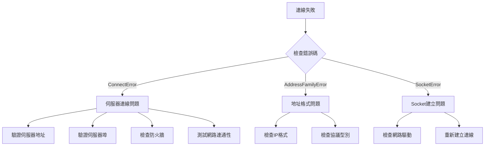

# 常見問題

本文件彙總了使用 GameFrameX Network 網路庫過程中常見的錯誤問題、原因分析以及解決方案。

## 概述

GameFrameX Network 是 Unity 遊戲引擎的長連線網路組件，提供 TCP 和 WebSocket 兩種網路協議支援。在實際使用過程中，開發者可能遇到連線失敗、訊息處理錯誤、心跳超時等問題。本文件旨在幫助開發者快速定位和解決這些常見問題。

## 常見錯誤碼與原因分析

### 網路錯誤碼詳解

> Source: [NetworkErrorCode.cs](https://github.com/GameFrameX/com.gameframex.unity.network/blob/main/Runtime/Network/Base/NetworkErrorCode.cs#L80-L136)

| 錯誤碼 | 說明 | 常見原因 |
|--------|------|----------|
| `Unknown` | 未知錯誤 | 未知異常或未捕獲的錯誤 |
| `AddressFamilyError` | 地址族錯誤 | IP地址格式不正確或協議不匹配 |
| `SocketError` | Socket 錯誤 | 網路套接字建立或操作失敗 |
| `ConnectError` | 連線錯誤 | 伺服器未開啟、防火牆阻止、網路不通 |
| `SendError` | 傳送錯誤 | 網路中斷、緩衝區滿、連線已關閉 |
| `ReceiveError` | 接收錯誤 | 網路中斷、伺服器主動關閉連線 |
| `SerializeError` | 序列化錯誤 | 訊息物件序列化失敗 |
| `DeserializePacketHeaderError` | 包頭解析錯誤 | 資料包格式不正確或被篡改 |
| `DeserializePacketError` | 包體解析錯誤 | 訊息體解析失敗 |
| `MissHeartBeatError` | 心跳丟失錯誤 | 長時間未收到伺服器心跳響應 |
| `DisposeError` | 資源釋放錯誤 | 重複釋放或釋放時機不當 |

### 網路連線關閉原因

> Source: [NetworkErrorCode.cs](https://github.com/GameFrameX/com.gameframex.unity.network/blob/main/Runtime/Network/Base/NetworkErrorCode.cs#L38-L74)

| 關閉原因 | 說明 | 處理建議 |
|----------|------|----------|
| `Normal` | 正常關閉 | 無需處理，正常業務流程 |
| `Timeout` | 超時關閉 | 檢查網路狀況，調整超時設定 |
| `Dispose` | 主動釋放 | 檢查程式碼中是否有誤呼叫 |
| `ConnectClose` | 連線斷開 | 檢查伺服器狀態和網路連線 |
| `ConnectAddressError` | 地址錯誤 | 檢查伺服器地址和埠配置 |
| `ConnectAddressExceptionError` | 地址異常 | 檢查DNS解析和伺服器可達性 |
| `MissHeartBeat` | 心跳丟失 | 見心跳問題章節 |

## 連線問題

### 無法連線到伺服器

**症狀**：呼叫連線方法後，觸發 `NetworkError` 事件但未觸發 `NetworkConnected` 事件。

**可能原因**：

1. **伺服器地址錯誤**
   - IP 地址或域名填寫錯誤
   - 埠號不正確
   - 防火牆阻止連線

2. **伺服器未啟動**
   - 後端服務未執行
   - 服務埠未正確監聽

3. **網路環境問題**
   - 客戶端網路不通
   - 代理或VPN干擾

**排查步驟**：



**解決方案**：

1. 確認伺服器地址和埠正確
2. 使用 ping 或 telnet 測試伺服器可達性
3. 檢查防火牆和安全組配置
4. 確認伺服器端已正確啟動並監聽相應埠

### 連線成功後又立即斷開

**症狀**：觸發 `NetworkConnected` 事件後，很快觸發 `NetworkClosed` 事件。

**可能原因**：

1. 伺服器主動斷開連線（認證失敗等）
2. 客戶端傳送的資料格式錯誤
3. 心跳配置問題

**解決方案**：

1. 檢查伺服器日誌，瞭解斷開原因
2. 驗證訊息協議格式是否與伺服器一致
3. 檢查心跳配置是否正確

## 訊息處理問題

### 訊息處理器註冊失敗

**症狀**：應用程式啟動時丟擲異常，或訊息無法被正確處理。

> Source: [MessageHandlerAttribute.cs](https://github.com/GameFrameX/com.gameframex.unity.network/blob/main/Runtime/Network/Base/MessageHandlerAttribute.cs#L47-L63)

**常見錯誤**：

1. **訊息型別未繼承 MessageObject**

```csharp
// 錯誤示例
[MessageHandler(typeof(MyMessage), nameof(OnReceiveMyMessage))]
public class MyMessageHandler
{
    public void OnReceiveMyMessage(MyMessage msg) { }
}

// MyMessage 定義錯誤 - 未繼承 MessageObject
public class MyMessage  // 錯誤：未繼承 MessageObject
{
    public int Id;
}
```

```csharp
// 正確示例
public class MyMessage : MessageObject  // 必須繼承 MessageObject
{
    public int Id;
}
```

2. **訊息型別未實現介面**

```csharp
// 錯誤示例
public class MyMessage : MessageObject  // 缺少介面實現
{
    public int Id;
}

// 正確示例 - 需要實現 INotifyMessage 或 IRequestMessage/IResponseMessage
public class MyMessage : MessageObject, INotifyMessage
{
    public int Id;
}
```

3. **處理方法引數錯誤**

> Source: [MessageHandlerAttribute.cs](https://github.com/GameFrameX/com.gameframex.unity.network/blob/main/Runtime/Network/Base/MessageHandlerAttribute.cs#L136-L144)

```csharp
// 錯誤示例 1：引數個數不為1
[MessageHandler(typeof(MyMessage), nameof(OnReceiveMyMessage))]
public void OnReceiveMyMessage(MyMessage msg, string extra)  // 錯誤：引數個數為2
{
}

// 錯誤示例 2：引數型別不匹配
[MessageHandler(typeof(MyMessage), nameof(OnReceiveMyMessage))]
public void OnReceiveMyMessage(OtherMessage msg)  // 錯誤：引數型別不匹配
{
}

// 正確示例
[MessageHandler(typeof(MyMessage), nameof(OnReceiveMyMessage))]
public void OnReceiveMyMessage(MyMessage msg)  // 正確：引數個數為1，型別為 MyMessage
{
}
```

### 訊息處理器方法未找到

**症狀**：執行時丟擲異常 `未找到方法：xxx.請確認是否註冊成功`

> Source: [MessageHandlerAttribute.cs](https://github.com/GameFrameX/com.gameframex.unity.network/blob/main/Runtime/Network/Base/MessageHandlerAttribute.cs#L77-L80)

**排查步驟**：

1. 確認方法名稱與 `MessageHandlerAttribute` 中指定的一致
2. 確認方法訪問修飾符正確（public 或 internal）
3. 確認方法在正確的類中
4. 確認使用了 `[MessageHandler]` 特性

```csharp
// 確保方法名正確匹配
[MessageHandler(typeof(LoginResponse), nameof(OnLoginResponse))]  // 方法名必須完全匹配
public class PlayerHandler : IMessageHandler
{
    // 方法名必須與 nameof 中的名稱完全一致
    public void OnLoginResponse(LoginResponse msg) { }
}
```

### 訊息ID重複衝突

**症狀**：啟動時丟擲異常 `請求Id重複` 或 `返回Id重複`

> Source: [ProtoMessageIdHandler.cs](https://github.com/GameFrameX/com.gameframex.unity.network/blob/main/Runtime/Network/ProtoMessageIdHandler.cs#L140-L161)

**原因**：同一個訊息型別使用了重複的訊息ID

**解決方案**：檢查訊息型別定義，確保每個訊息型別的ID唯一

```csharp
// 錯誤示例 - ID重複
[MessageTypeHandler(MessageId = 1001)]
public class LoginRequest : MessageObject, IRequestMessage { }

[MessageTypeHandler(MessageId = 1001)]  // 錯誤：重複的ID
public class Login2Request : MessageObject, IRequestMessage { }

// 正確示例 - ID唯一
[MessageTypeHandler(MessageId = 1001)]
public class LoginRequest : MessageObject, IRequestMessage { }

[MessageTypeHandler(MessageId = 1002)]  // 正確：使用不同的ID
public class Login2Request : MessageObject, IRequestMessage { }
```

### 心跳訊息重複

**症狀**：啟動時丟擲異常 `心跳訊息重複`

> Source: [ProtoMessageIdHandler.cs](https://github.com/GameFrameX/com.gameframex.unity.network/blob/main/Runtime/Network/ProtoMessageIdHandler.cs#L126-L129)

**原因**：多個訊息型別被標記為心跳訊息

**解決方案**：確保只有一個訊息型別被標記為心跳訊息

## 心跳問題

### 心跳超時斷開連線

**症狀**：觸發 `NetworkMissHeartBeat` 事件後連線被關閉

**可能原因**：

1. 網路延遲過高
2. 伺服器心跳間隔配置與客戶端不一致
3. 伺服器負載過高未能及時響應心跳
4. 客戶端進入後臺時心跳暫停（如果未配置 `FocusHeartbeat`）

> Source: [NetworkComponent.cs](https://github.com/GameFrameX/com.gameframex.unity.network/blob/main/Runtime/Network/NetworkComponent.cs#L68-L91)

**解決方案**：

1. 檢查網路環境，最佳化網路質量
2. 調整心跳超時配置，增加容忍度
3. 如果遊戲支援後臺執行，啟用 `FocusHeartbeat` 選項
4. 在應用程式切換到後臺時暫停心跳檢測

```csharp
// 在 NetworkComponent 中啟用焦點心跳
// 在 Unity 編輯器中: NetworkComponent -> Focus Send Heartbeat = true
// 或透過程式碼設定
networkChannel.SetEnableHeartbeat(true);
```

### 心跳訊息未被正確處理

**症狀**：心跳正常傳送但伺服器未響應，或客戶端收到心跳但未正確處理

**解決方案**：

1. 確認心跳訊息型別實現了 `IHeartBeatMessage` 介面
2. 確認心跳訊息ID與伺服器約定一致
3. 檢查心跳處理器實現

> Source: [DefaultPacketHeartBeatHandler.cs](https://github.com/GameFrameX/com.gameframex.unity.network/blob/main/Runtime/Network/Helper/DefaultPacketHeartBeatHandler.cs#L22-L25)

```csharp
// 心跳處理器需要正確實現
public class HeartBeatHandler : IPacketHeartBeatHandler
{
    public MessageObject Handler()
    {
        // 返回心跳訊息物件，不應丟擲 NotImplementedException
        return new HeartBeatMessage();
    }
}
```

## RPC 呼叫問題

### RPC 超時

**症狀**：RPC 呼叫未在預期時間內收到響應

**可能原因**：

1. 網路延遲過高
2. 伺服器處理超時
3. 網路連線不穩定

> Source: [NetworkManager.RpcState.cs](https://github.com/GameFrameX/com.gameframex.unity.network/blob/main/Runtime/Network/Network/NetworkManager.RpcState.cs#L64-L67)

**重要提示**：RPC 超時時間最小值為 3000 毫秒（3秒）

```csharp
// 錯誤示例 - 超時時間小於3000ms
var channel = networkManager.CreateNetworkChannel("game", helper, 1000);  // 錯誤：小於最小值

// 正確示例 - 超時時間大於等於3000ms
var channel = networkManager.CreateNetworkChannel("game", helper, 5000);  // 正確：5000ms
```

**解決方案**：

1. 增加 RPC 超時時間配置
2. 最佳化網路環境
3. 檢查伺服器響應時間

```csharp
// 在 NetworkComponent 中配置 RPC 超時
// 預設值: 5000ms (5秒)
// 範圍: 3000ms - 50000ms
```

### RPC 響應未找到

**症狀**：收到響應但無法匹配到對應的請求

**排查點**：

1. 確認請求訊息的 `UniqueId` 正確設定
2. 確認請求/響應訊息ID匹配
3. 檢查響應訊息型別是否與請求型別對應

## 序列化問題

### 序列化失敗

**症狀**：傳送訊息時觸發 `NetworkError` 事件，錯誤碼為 `SerializeError`

> Source: [NetworkManager.NetworkChannelBase.cs](https://github.com/GameFrameX/com.gameframex.unity.network/blob/main/Runtime/Network/Network/NetworkManager.NetworkChannelBase.cs#L867-L870)

**可能原因**：

1. 訊息物件包含不可序列化的欄位
2. 自定義序列化器實現錯誤
3. 訊息體過大超出緩衝區限制

**解決方案**：

1. 檢查訊息類的欄位型別，確保都是可序列化的
2. 驗證自定義序列化邏輯
3. 檢查訊息大小限制

### 反序列化失敗

**症狀**：接收訊息時觸發 `NetworkError` 事件，錯誤碼為 `DeserializePacketError` 或 `DeserializePacketHeaderError`

**可能原因**：

1. 伺服器傳送的資料格式與客戶端預期不一致
2. 資料包被篡改或損壞
3. 客戶端和服務端協議版本不匹配

**解決方案**：

1. 確認服務端和客戶端使用相同的訊息協議
2. 檢查資料包完整性
3. 確保協議版本一致

## 平臺相關問題

### WebGL 平臺連線問題

**症狀**：在 WebGL 平臺無法建立連線

**原因**：WebGL 平臺只支援 WebSocket 協議，不支援原生 TCP 連線

> Source: [NetworkManager.cs](https://github.com/GameFrameX/com.gameframex.unity.network/blob/main/Runtime/Network/Network/NetworkManager.cs#L212-L216)

**解決方案**：

```csharp
// WebGL 平臺會自動使用 WebSocket
// 如需強制使用 WebSocket，可新增以下宏定義
// Unity 選單: GameFrameX -> Scripting Define Symbols -> Enable Force WebSocket
```

### 編輯器中連線問題

**症狀**：在 Unity 編輯器中連線正常，但打包後無法連線

**可能原因**：

1. 打包後的平臺與編輯器平臺不同
2. 缺少相應的程式集定義
3. 網路許可權未配置

**解決方案**：

1. 檢查目標平臺的網路許可權配置
2. 確認相關程式集已正確引用
3. 測試不同網路環境

## 除錯技巧

### 啟用網路日誌

> Source: [Editor/NetworkLogScriptingDefineSymbols.cs](https://github.com/GameFrameX/com.gameframex.unity.network/blob/main/Editor/NetworkLogScriptingDefineSymbols.cs)

透過選單啟用網路除錯日誌：

```
GameFrameX -> Scripting Define Symbols -> Enable Network Send Log
GameFrameX -> Scripting Define Symbols -> Enable Network Receive Log
```

### 事件監聽除錯

監聽所有網路事件進行除錯：

```csharp
private void Start()
{
    var networkManager = GameEntry.GetComponent<NetworkManager>();
    
    networkManager.NetworkConnected += OnNetworkConnected;
    networkManager.NetworkClosed += OnNetworkClosed;
    networkManager.NetworkError += OnNetworkError;
    networkManager.NetworkMissHeartBeat += OnNetworkMissHeartBeat;
}

private void OnNetworkConnected(object sender, NetworkConnectedEventArgs e)
{
    UnityEngine.Debug.Log($"連線成功: {e.NetworkChannel.Name}");
}

private void OnNetworkClosed(object sender, NetworkClosedEventArgs e)
{
    UnityEngine.Debug.Log($"連線關閉: {e.NetworkChannel.Name}, 原因: {e.Reason}, 錯誤碼: {e.ErrorCode}");
}

private void OnNetworkError(object sender, NetworkErrorEventArgs e)
{
    UnityEngine.Debug.LogError($"網路錯誤: {e.ErrorCode}, Socket錯誤: {e.SocketErrorCode}, 訊息: {e.ErrorMessage}");
}

private void OnNetworkMissHeartBeat(object sender, NetworkMissHeartBeatEventArgs e)
{
    UnityEngine.Debug.LogWarning($"心跳丟失: {e.MissCount}次");
}
```

### 忽略特定訊息日誌

> Source: [NetworkComponent.cs](https://github.com/GameFrameX/com.gameframex.unity.network/blob/main/Runtime/Network/NetworkComponent.cs#L73-L79)

對於高頻訊息，可以配置忽略日誌列印：

```csharp
// 配置忽略傳送日誌的訊息ID
networkChannel.SetIgnoreLogNetworkIds(new[] { 1001, 1002 }, new[] { 1003, 1004 });
```

## 常見錯誤排查清單

| 錯誤型別 | 檢查項 |
|----------|--------|
| 連線失敗 | 伺服器地址、埠、防火牆、網路連通性 |
| 連線斷開 | 心跳配置、網路質量、伺服器狀態 |
| 訊息處理 | 訊息型別繼承、實現介面、方法簽名 |
| 序列化失敗 | 欄位型別、協議版本、資料完整性 |
| RPC 超時 | 網路延遲、伺服器響應、超時配置 |
| 平臺問題 | 網路許可權、協議支援、程式集引用 |

## 相關連結

- [網路管理器](./4-core-concepts.1-network-manager)
- [網路頻道](./4-core-concepts.2-network-channel)
- [訊息型別](./4-core-concepts.3-message-types)
- [心跳機制](./5-heartbeat)
- [事件系統](./6-events)
- [RPC 遠端呼叫](./8-rpc)
- [編輯器配置](./9-editor-configuration)
