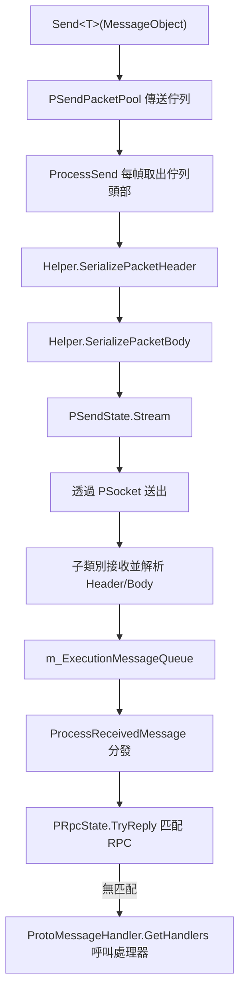

# 運作原理：網路通道與資料傳送/接收流程

網路通道(`NetworkChannelBase`)是 `NetworkManager` 中負責單一連線的傳送/接收單元：要送出的訊息會先進入佇列，再由 `Update` 於每幀序列化並寫出；接收的訊息則在子類別(TCP / WebSocket)中解析，放入執行緒安全的佇列，再由主執行緒統一分發給 RPC 或訊息處理器，並內建心跳與逾時斷線機制。

## 整體資料流程



傳送與接收最終都匯合於 `NetworkChannelBase.Update`;子類別實作僅負責具體的 Socket 傳送/接收操作。

## 通道輪詢：單一 Update 幀中發生的事情

每幀會按固定順序執行：傳送、接收、心跳、訊息分發以及 RPC 逾時檢查：

```csharp
public virtual void Update(float elapseSeconds, float realElapseSeconds)
{
    if (PSocket == null || !PActive)
    {
        return;
    }

    ProcessSend();
    ProcessReceive();
    if (PSocket == null || !PActive)
    {
        return;
    }

    ProcessHeartBeat(realElapseSeconds);
    ProcessReceivedMessage();
    PRpcState.Update(elapseSeconds, realElapseSeconds);
}
```

來源:[NetworkManager.NetworkChannelBase.cs](https://github.com/GameFrameX/com.gameframex.unity.network/blob/main/Runtime/Network/Network/NetworkManager.NetworkChannelBase.cs#L378-L395)

## 傳送流程

1. 完成前置檢查後，`Send<T>` 會將訊息放入傳送佇列 `PSendPacketPool`(`GameFrameworkLinkedList<MessageObject>`)。
2. `ProcessSend` 會在每幀從佇列頭部取出訊息並呼叫 `ProcessSendMessage`。
3. `ProcessSendMessage` 會依序呼叫通道輔助器的 `INetworkChannelHelper.SerializePacketHeader` 與 `SerializePacketBody`,將序列化結果寫入 `PSendState.Stream`,然後呼叫 `ReferencePool.Release(messageObject)` 回收訊息物件。
4. 若任一序列化步驟失敗，會觸發 `NetworkChannelError`(`NetworkErrorCode.SerializeError`)或拋出 `GameFrameworkException`。

```csharp
public void Send<T>(T messageObject) where T : MessageObject
{
    GameFrameworkGuard.NotNull(messageObject, nameof(messageObject));
    if (PSocket == null)
    {
        const string errorMessage = "You must connect first.";
        // ... 觸發 NetworkChannelError 或拋出例外
    }

    if (!PActive)
    {
        const string errorMessage = "Socket is not active.";
        // ...
    }

    lock (PSendPacketPool)
    {
        PSendPacketPool.AddLast(messageObject);
    }
}
```

來源:[NetworkManager.NetworkChannelBase.cs](https://github.com/GameFrameX/com.gameframex.unity.network/blob/main/Runtime/Network/Network/NetworkManager.NetworkChannelBase.cs#L799-L830)

```csharp
protected virtual bool ProcessSendMessage(MessageObject messageObject)
{
    bool serializeResult = PNetworkChannelHelper.SerializePacketHeader(messageObject, PSendState.Stream, out var messageBodyBuffer);
    if (serializeResult)
    {
        serializeResult = PNetworkChannelHelper.SerializePacketBody(messageBodyBuffer, PSendState.Stream);
    }
    else
    {
        const string errorMessage = "Serialized packet failure.";
        throw new InvalidOperationException(errorMessage);
    }

    ReferencePool.Release(messageObject);
    return serializeResult;
}
```

來源:[NetworkManager.NetworkChannelBase.cs](https://github.com/GameFrameX/com.gameframex.unity.network/blob/main/Runtime/Network/Network/NetworkManager.NetworkChannelBase.cs#L867-L882)

## 接收流程

接收到的訊息物件會進入 `m_ExecutionMessageQueue`(`ConcurrentQueue<MessageObject>`,由子類別在接收執行緒上寫入);主執行緒每幀會在 `ProcessReceivedMessage` 中對其進行分發：

1. 首先呼叫 `PRpcState.TryReply(messageObject)`,嘗試匹配待處理的 RPC 呼叫；若匹配成功，該訊息的處理會立即結束。
2. 若匹配失敗，則透過 `ProtoMessageHandler.GetHandlers(messageObject.GetType())` 依訊息型別取得已註冊的處理器，並對每個處理器依序呼叫 `SetMessageObject` 與 `Invoke()`。
3. 單一處理器拋出的例外會透過 `Log.Fatal(e)` 記錄，且不會中斷同一幀內其餘訊息的分發。

```csharp
private void ProcessReceivedMessage()
{
    while (m_ExecutionMessageQueue.TryDequeue(out var messageObject))
    {
        try
        {
            // 執行 RPC 匹配
            var replySuccess = PRpcState.TryReply(messageObject);
            if (replySuccess)
            {
                continue;
            }

            // 處理通知訊息
            var handlers = ProtoMessageHandler.GetHandlers(messageObject.GetType());
            foreach (var handler in handlers)
            {
                handler.SetMessageObject(messageObject);
                try
                {
                    handler.Invoke();
                }
                catch (Exception e)
                {
                    Log.Fatal(e);
                }
            }
        }
        catch (Exception e)
        {
            Log.Fatal(e);
        }
    }
}
```

來源:[NetworkManager.NetworkChannelBase.cs](https://github.com/GameFrameX/com.gameframex.unity.network/blob/main/Runtime/Network/Network/NetworkManager.NetworkChannelBase.cs#L400-L433)

基底類別中的 `ProcessReceive()` 目前為空實作；實際的位元組接收與 Header/Body 解析由子類別 `SystemTcpNetworkChannel` 與 `WebSocketNetworkChannel` 完成，解析成功後會將結果統一寫入 `m_ExecutionMessageQueue`。

## RPC 呼叫

`Call<TResult>` 是「傳送 + 等待回應」的組合：它先透過 `Send(messageObject)` 將訊息加入佇列，再透過 `await PRpcState.Call(messageObject, isIgnoreErrorCode)` 等待該回應在同一通道的接收流程中被 `TryReply` 匹配。若回傳型別與 `TResult` 不符，則會拋出：

```
RPC response type mismatch. Expected: {0}, Actual: {1}
```

來源:[NetworkManager.NetworkChannelBase.cs](https://github.com/GameFrameX/com.gameframex.unity.network/blob/main/Runtime/Network/Network/NetworkManager.NetworkChannelBase.cs#L777-L791)

## 心跳與逾時斷線

心跳預設值：間隔為 `DefaultHeartBeatInterval = 30f` 秒，且遺漏心跳次數超過 `DefaultMissHeartBeatCountByClose = 10` 次後即觸發斷線。這些預設值可透過 `RegisterHeartBeatHandler(IPacketHeartBeatHandler)` 覆寫(當處理器的 `HeartBeatInterval` 與 `MissHeartBeatCountByClose` 大於 0 時生效)。

`ProcessHeartBeat` 的判斷邏輯：

- `HeartBeatElapseSeconds` 會累加 `realElapseSeconds`;達到 `PHeartBeatInterval` 時，會設定 `sendHeartBeat`、將計時器歸零，並執行 `MissHeartBeatCount++`。
- 若傳送心跳(`PNetworkChannelHelper.SendHeartBeat()`)成功，且先前曾遺漏心跳，則會觸發 `NetworkChannelMissHeartBeat` 回呼。
- 當 `MissHeartBeatCount > MissHeartBeatCountByClose` 時，會呼叫 `Close(NetworkCloseReason.MissHeartBeat, (ushort)NetworkErrorCode.MissHeartBeatError)` 主動斷線。

來源:[NetworkManager.NetworkChannelBase.cs](https://github.com/GameFrameX/com.gameframex.unity.network/blob/main/Runtime/Network/Network/NetworkManager.NetworkChannelBase.cs#L439-L488)

## 連線與關閉

`Connect(Uri address, object userData = null)` 會：關閉舊連線 → 將主機解析為 `IPEndPoint`(解析失敗時，以 `NetworkCloseReason.ConnectAddressError` / `ConnectAddressExceptionError` 關閉並觸發 `NetworkChannelError` 回呼)→ 根據 `AddressFamily` 設定 `PAddressFamily`(IPv4/IPv6;不支援的型別會回報 `NetworkErrorCode.AddressFamilyError`)→ 執行 `PSendState.Reset()` 與 `PReceiveState.PrepareForPacketHeader()`,為接收封包標頭做好準備。

在 lock 區塊內，`Close(string reason, ushort code = 0)` 會依序執行:`PActive = false` → `PSocket.Shutdown()` / `Close()` → 觸發 `NetworkChannelClosed` 回呼 → 清空傳送佇列、心跳狀態、RPC 狀態，以及 `m_ExecutionMessageQueue` 中尚未分發的訊息。

來源:[NetworkManager.NetworkChannelBase.cs](https://github.com/GameFrameX/com.gameframex.unity.network/blob/main/Runtime/Network/Network/NetworkManager.NetworkChannelBase.cs#L723-L768)

## 通道上的處理器註冊

| 方法 | 處理器 | 用途 |
|------|------|------|
| `RegisterHandler(IPacketSendHeaderHandler)` | 傳送封包標頭 | 對訊息封包標頭進行序列化 |
| `RegisterHandler(IPacketSendBodyHandler)` | 傳送封包內文 | 對訊息封包內文進行序列化 |
| `RegisterHandler(IPacketReceiveHeaderHandler)` | 接收封包標頭 | 解析訊息封包標頭 |
| `RegisterHandler(IPacketReceiveBodyHandler)` | 接收封包內文 | 解析訊息封包內文 |
| `RegisterHeartBeatHandler(IPacketHeartBeatHandler)` | 心跳 | 定義心跳訊息並覆寫間隔/斷線次數 |
| `RegisterMessageCompressHandler(IMessageCompressHandler)` | 壓縮 | 傳送端的訊息壓縮；傳入 null 可停用 |
| `RegisterMessageDecompressHandler(IMessageDecompressHandler)` | 解壓縮 | 接收端的訊息解壓縮；傳入 null 可停用 |
| `SetRPCErrorHandler(EventHandler<MessageObject>)` | RPC | RPC 錯誤回呼 |

所有註冊方法內部都會執行 `GameFrameworkGuard.NotNull` 驗證；傳入 null 會拋出引數例外。預設參考實作請見 [DefaultNetworkChannelHelper.cs](https://github.com/GameFrameX/com.gameframex.unity.network/blob/main/Runtime/Network/Helper/DefaultNetworkChannelHelper.cs#L13)。

## 常見錯誤

| 症狀 | 原因 | 解決方式 |
|------|------|------|
| `You must connect first.` | `Send` 時 `PSocket == null`;尚未連線 | 先呼叫 `Connect` 並等待連線成功 |
| `Socket is not active.` | 連線已建立但 `PActive` 為 false | 檢查通道是否已被關閉，或因錯誤而設為非作用中 |
| `Serialized packet failure.` / `NetworkErrorCode.SerializeError` | Header 或 Body 序列化失敗 | 檢查 `INetworkChannelHelper` 的序列化實作與訊息定義 |
| 沒有錯誤但未收到訊息回呼 | 回應已被 `PRpcState.TryReply` 消耗掉，或該訊息型別未註冊處理器 | 確認處理器已透過 `ProtoMessageHandler` 註冊 |
| 連線主動斷開並出現錯誤碼 `MissHeartBeatError` | 遺漏心跳次數超過 `MissHeartBeatCountByClose` | 調整心跳處理器參數或檢查網路品質 |

## 相關連結

- 通道子類別實作:[NetworkManager.SystemTcpNetworkChannel.cs](https://github.com/GameFrameX/com.gameframex.unity.network/blob/main/Runtime/Network/Network/SystemSocket/NetworkManager.SystemTcpNetworkChannel.cs#L45), [NetworkManager.WebSocketNetworkChannel.cs](https://github.com/GameFrameX/com.gameframex.unity.network/blob/main/Runtime/Network/Network/WebSocket/NetworkManager.WebSocketNetworkChannel.cs#L48)
- 預設通道輔助器:[DefaultNetworkChannelHelper.cs](https://github.com/GameFrameX/com.gameframex.unity.network/blob/main/Runtime/Network/Helper/DefaultNetworkChannelHelper.cs#L13)
- 心跳處理器基底類別:[BasePacketHeartBeatHandler.cs](https://github.com/GameFrameX/com.gameframex.unity.network/blob/main/Runtime/Network/Helper/BasePacketHeartBeatHandler.cs)
- 錯誤碼定義:[NetworkErrorCode.cs](https://github.com/GameFrameX/com.gameframex.unity.network/blob/main/Runtime/Network/Base/NetworkErrorCode.cs)