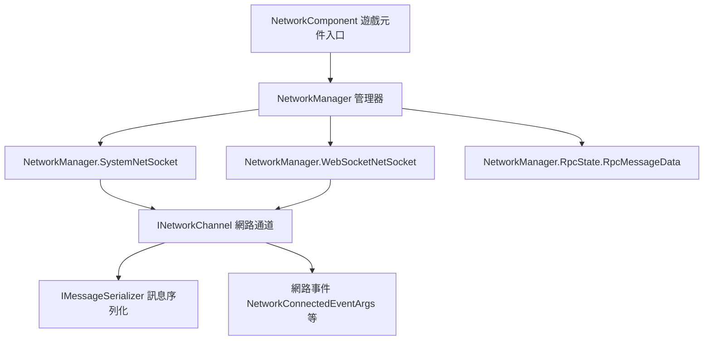

# 概述

Game Frame X Network 是 GameFrameX 的**長連線網路元件**（套件名稱 `com.gameframex.unity.network`），為 Unity 專案提供 TCP / WebSocket 長連線、RPC 呼叫、心跳保活、可插拔訊息序列化以及網路事件，涵蓋 Windows、macOS、Linux、Android、iOS 與 WebGL 平台。

## 快速開始

### 安裝

選擇以下任一方法即可（內容取自官方中文 README）：

1. 編輯 Unity 專案的 `Packages/manifest.json`，新增 `scopedRegistries` 並宣告相依套件：

```json
{
  "scopedRegistries": [
    {
      "name": "GameFrameX",
      "url": "https://gameframex.upm.alianblank.uk",
      "scopes": [
        "com.gameframex"
      ]
    }
  ],
  "dependencies": {
    "com.gameframex.unity.network": "2.6.6"
  }
}
```

來源：[README.zh-CN.md](https://github.com/GameFrameX/com.gameframex.unity.network/blob/main/README.zh-CN.md#L44-L59)

2. 直接在 `manifest.json` 的 `dependencies` 節點下新增：

```json
{
  "com.gameframex.unity.network": "https://github.com/gameframex/com.gameframex.unity.network.git"
}
```

來源：[README.zh-CN.md](https://github.com/GameFrameX/com.gameframex.unity.network/blob/main/README.zh-CN.md#L64-L69)

3. 在 Unity 的 `Package Manager` 中，以 `Git URL` 方式新增儲存庫 URL：`https://github.com/gameframex/com.gameframex.unity.network.git`。
4. 直接下載儲存庫並放入 Unity 專案的 `Packages` 目錄，Unity 會自動載入並識別。

安裝完成後，需要重新啟動 Unity 或重新整理 Package Manager，`scopedRegistries` 才會生效；`scopes` 僅對以 `com.gameframex` 開頭的套件生效。

### 相依套件

| 相依套件 | 版本 |
|--------|------|
| `com.gameframex.unity` | 1.1.1 |
| `com.gameframex.unity.event` | 1.0.0 |

來源：[README.zh-CN.md](https://github.com/GameFrameX/com.gameframex.unity.network/blob/main/README.zh-CN.md#L97-L102)

### 核心功能

| 功能 | 說明 |
|------|------|
| 長連線 | 兩種 Socket 實作：TCP（`SystemNetSocket`）與 WebSocket（`WebSocketNetSocket`） |
| RPC 呼叫 | RPC 呼叫機制與逾時處理（`RpcState` / `RpcMessageData`） |
| 心跳 | 心跳保活，可設定在應用程式取得/失去焦點時傳送 |
| 可插拔序列化 | `IMessageSerializer` 介面，支援兩層註冊（全域預設 + 依通道覆寫） |
| 網路通道管理 | 以通道為單位建立與管理連線（`INetworkChannel`） |
| 網路事件 | 連線 / 斷線 / 錯誤 / 心跳遺失等事件參數（`NetworkConnectedEventArgs` 等） |

來源：[README.zh-CN.md](https://github.com/GameFrameX/com.gameframex.unity.network/blob/main/README.zh-CN.md#L28-L36)

## 運作原理一覽

本元件以 `NetworkComponent`（掛載於 Unity 場景上的 `GameFrameworkComponent`）作為統一入口，內部委派給 `NetworkManager` 的多個部分實作（`SystemNetSocket` / `WebSocketNetSocket` / `RpcState`），以處理不同的傳輸層與 RPC 狀態管理：



- 來源入口：[NetworkComponent.cs](https://github.com/GameFrameX/com.gameframex.unity.network/blob/main/Runtime/Network/NetworkComponent.cs#L45)(`public sealed class NetworkComponent : GameFrameworkComponent`)
- 通道介面：[INetworkChannel.cs](https://github.com/GameFrameX/com.gameframex.unity.network/blob/main/Runtime/Network/Interface/INetworkChannel.cs#L42)(`public interface INetworkChannel`)
- 通道輔助介面：[INetworkChannelHelper.cs](https://github.com/GameFrameX/com.gameframex.unity.network/blob/main/Runtime/Network/Interface/INetworkChannelHelper.cs#L39)(`public interface INetworkChannelHelper`)
- TCP 實作：[NetworkManager.SystemNetSocket.cs](https://github.com/GameFrameX/com.gameframex.unity.network/blob/main/Runtime/Network/Network/SystemSocket/NetworkManager.SystemNetSocket.cs#L7)
- WebSocket 實作：[NetworkManager.WebSocketNetSocket.cs](https://github.com/GameFrameX/com.gameframex.unity.network/blob/main/Runtime/Network/Network/WebSocket/NetworkManager.WebSocketNetSocket.cs#L10)
- RPC 狀態：[NetworkManager.RpcState.RpcMessageData.cs](https://github.com/GameFrameX/com.gameframex.unity.network/blob/main/Runtime/Network/Network/NetworkManager.RpcState.RpcMessageData.cs#L7)

## 下一步

- 官方文件：https://gameframex.doc.alianblank.com
- 更新日誌：請參閱儲存庫的 [CHANGELOG.md](https://github.com/GameFrameX/com.gameframex.unity.network/blob/main/CHANGELOG.md)
- 開源授權條款：請參閱 [LICENSE.md](https://github.com/GameFrameX/com.gameframex.unity.network/blob/main/LICENSE.md)
- 社群支援：QQ 群組 467608841 / 233840761（可透過 [QR Code](https://qm.qq.com/cgi-bin/qm/qr?k=ikT9gA5m2sKwOyNOfYmQvSAPK_c3GmD6) 加入）