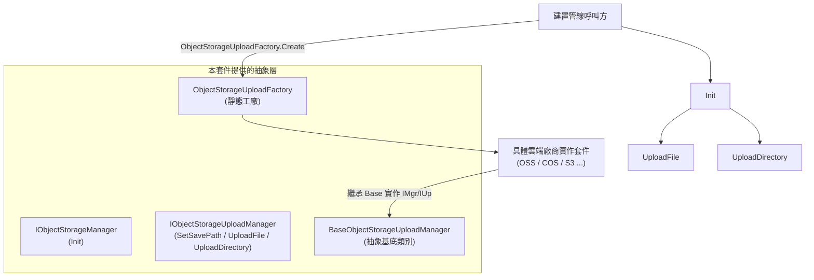

# 物件儲存元件概述

GameFrameX 物件儲存元件（`com.gameframex.unity.objectstorage`）為 Unity 專案提供上傳檔案與目錄到雲端物件儲存服務的基礎介面與抽象。它本身不綁定具體雲端廠商，而是透過 `IObjectStorageManager` / `IObjectStorageUploadManager` 介面約定核心契約，各家服務商（OSS、COS、S3 等）的具體實作以獨立套件的形式提供。

## 快速開始

1. **安裝套件**。在 Unity 專案根目錄的 `Packages/manifest.json` 中新增相依性（任選其一）：
   - 透過 GameFrameX 的 scoped registry：
     ```json
     {
       "scopedRegistries": [
         {
           "name": "GameFrameX",
           "url": "https://gameframex.upm.alianblank.uk",
           "scopes": ["com.gameframex"]
         }
       ],
       "dependencies": {
         "com.gameframex.unity.objectstorage": "1.1.0"
       }
     }
     ```
   - 直接以 Git URL 形式新增：
     ```json
     {
       "dependencies": {
         "com.gameframex.unity.objectstorage": "https://github.com/gameframex/com.gameframex.unity.objectstorage.git"
       }
     }
     ```
   - 或者把儲存庫複製到 `Packages/` 目錄下，Unity 會自動載入。

   Source: [README.md](https://github.com/GameFrameX/com.gameframex.unity.objectstorage/blob/main/README.md#L37-L68)

2. **確認目標平台受支援**：

   | 平台 | 支援 |
   |------|------|
   | Windows | 是 |
   | macOS | 是 |
   | Linux | 是 |
   | Android | 是 |
   | iOS | 是 |

   Source: [README.zh-CN.md](https://github.com/GameFrameX/com.gameframex.unity.objectstorage/blob/main/README.zh-CN.md#L69-L78)

3. **選用一個具體實作**。本套件只提供抽象與預設實作，需要按雲端廠商接入對應實作套件，例如 OSS、COS、MinIO 等。

4. **呼叫上傳介面**。在編輯器建置管線中，透過 `ObjectStorageUploadFactory` 取得上傳管理器實例，呼叫 `Init` 設定憑證，再呼叫 `UploadFile` / `UploadDirectory` 上傳資源。

## 工作原理速覽



- 介面 `IObjectStorageManager` 只暴露 `Init`，負責接入憑證與桶名稱；
- `IObjectStorageUploadManager` 在其上擴展 `SetSavePath`、`UploadFile`、`UploadDirectory`；
- `BaseObjectStorageUploadManager` 是抽象基底類別，第三方實作套件繼承它後由 `ObjectStorageUploadFactory` 建構實例。

Source: [IObjectStorageManager.cs](https://github.com/GameFrameX/com.gameframex.unity.objectstorage/blob/main/Editor/IObjectStorageManager.cs#L1-L14)、[IObjectStorageUploadManager.cs](https://github.com/GameFrameX/com.gameframex.unity.objectstorage/blob/main/Editor/IObjectStorageUploadManager.cs#L1-L22)、[ObjectStorageUploadFactory.cs](https://github.com/GameFrameX/com.gameframex.unity.objectstorage/blob/main/Editor/ObjectStorageUploadFactory.cs)

## 接下來

- 關於介面契約與簽名細節，請見《[介面參考](reference/interfaces)》。
- 關於如何接入一個具體雲端廠商實作並完成首次上傳，請見《[如何上傳檔案到物件儲存](tasks/upload-file)》。
- 關於上傳失敗時的疑難排解思路，請見《[上傳失敗怎麼辦](troubleshooting/upload-failures)》。