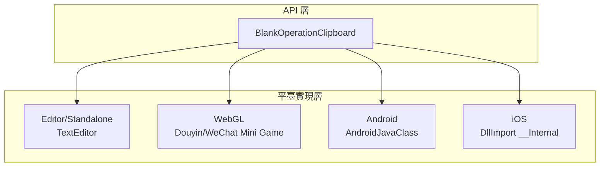
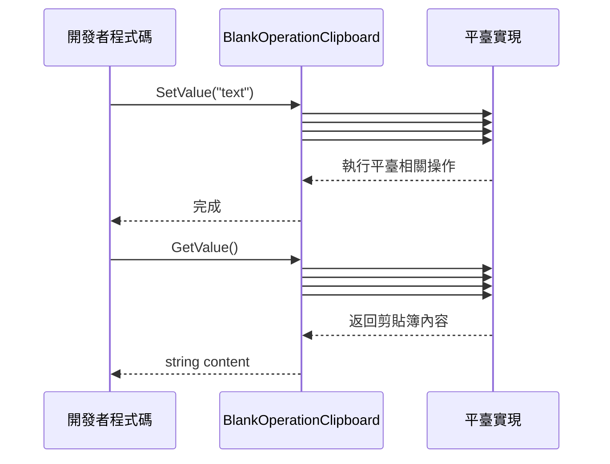

# 使用方法

本文件介紹如何使用 BlankOperationClipboard 外掛進行剪貼簿的讀寫操作。

## 概述

BlankOperationClipboard 是一個跨平臺的 Unity 剪貼簿操作工具類，提供了簡潔的 API 介面用於獲取和設定系統剪貼簿內容。該庫透過條件編譯支援多種平臺，包括 Unity 編輯器、桌面平臺、WebGL（抖音/微信小遊戲）、Android 和 iOS。

**設計意圖**：透過統一的靜態方法介面，開發者無需關心底層平臺實現細節，即可完成跨平臺的剪貼簿操作。

## 架構



**架構說明**：
- **API 層**：提供統一的 `GetValue()` 和 `SetValue(string)` 靜態方法
- **平臺實現層**：透過 C# 條件編譯 (`#if`) 實現各平臺的原生呼叫

## 核心 API

### `GetValue(): string`

獲取當前系統剪貼簿中的文字內容。

**返回值**：剪貼簿中的文字內容；如果剪貼簿為空則返回空字串。

> Source: [BlankOperationClipboard.cs](https://github.com/GameFrameX/com.gameframex.unity.operationclipboard/blob/main/Runtime/BlankOperationClipboard.cs#L31-L69)

### `SetValue(text: string): void`

將指定的文字內容設定到系統剪貼簿。

**引數**：
- `text` (string)：要設定到剪貼簿的文字內容

> Source: [BlankOperationClipboard.cs](https://github.com/GameFrameX/com.gameframex.unity.operationclipboard/blob/main/Runtime/BlankOperationClipboard.cs#L78-L106)

## 基本用法

### 讀取剪貼簿內容

```csharp
using UnityEngine;

public class ClipboardDemo : MonoBehaviour
{
    void ReadClipboard()
    {
        // 獲取剪貼簿內容
        string clipboardContent = BlankOperationClipboard.GetValue();
        Debug.Log("剪貼簿內容: " + clipboardContent);
    }
}
```
> Source: [BlankOperationClipboardExample.cs](https://github.com/GameFrameX/com.gameframex.unity.operationclipboard/blob/main/Samples~/BlankOperationClipboardExample.cs#L46-L50)

### 寫入剪貼簿內容

```csharp
using UnityEngine;

public class ClipboardDemo : MonoBehaviour
{
    void WriteClipboard()
    {
        // 設定剪貼簿內容
        string textToCopy = "要複製的文字內容";
        BlankOperationClipboard.SetValue(textToCopy);
        Debug.Log("已設定剪貼簿內容");
    }
}
```
> Source: [BlankOperationClipboardExample.cs](https://github.com/GameFrameX/com.gameframex.unity.operationclipboard/blob/main/Samples~/BlankOperationClipboardExample.cs#L44-L47)

### 完整示例

以下是一個完整的 MonoBehaviour 示例，演示瞭如何結合讀寫操作：

```csharp
using UnityEngine;

public class BlankOperationClipboardExample : MonoBehaviour
{
    private string text = "AAAA";
    private string result = "";

    void OnGUI()
    {
        // 文字輸入框
        text = GUILayout.TextField(text, GUILayout.Width(500), GUILayout.Height(100));

        // 設定剪貼簿按鈕
        if (GUILayout.Button("SetValue", GUILayout.Width(500), GUILayout.Height(100)))
        {
            BlankOperationClipboard.SetValue(text);
        }

        // 讀取剪貼簿按鈕
        if (GUILayout.Button("GetValue", GUILayout.Width(500), GUILayout.Height(100)))
        {
            result = BlankOperationClipboard.GetValue();
        }

        // 顯示讀取結果
        GUILayout.Label(result);
    }
}
```
> Source: [BlankOperationClipboardExample.cs](https://github.com/GameFrameX/com.gameframex.unity.operationclipboard/blob/main/Samples~/BlankOperationClipboardExample.cs#L37-L53)

## 平臺行為差異

不同平臺獲取剪貼簿的行為存在差異：

| 平臺 | 獲取剪貼簿 | 設定剪貼簿 | 備註 |
|------|-----------|-----------|------|
| Unity Editor | 使用 TextEditor 模擬貼上操作 | 使用 TextEditor 模擬複製操作 | 開發除錯用 |
| Standalone | 使用 TextEditor 模擬貼上操作 | 使用 TextEditor 模擬複製操作 | 桌面平臺 |
| WebGL (抖音) | 非同步回呼獲取 | 同步設定 | 需要開啟 ENABLE_DOUYIN_MINI_GAME |
| WebGL (微信) | 非同步回呼獲取 | 同步設定 | 需要開啟 ENABLE_WECHAT_MINI_GAME |
| Android | 呼叫 Java 方法 GetClipBoard | 呼叫 Java 方法 SetClipBoard | 需要 Android 原生外掛 |
| iOS | 呼叫原生方法 GetClipBoard | 呼叫原生方法 SetClipBoard | 需要 iOS 原生外掛 |

> ⚠️ 注意：Android 和 iOS 平臺需要配置對應的原生外掛才能正常工作。詳細配置請參考 [平臺配置](./5-platforms) 文件。

## 核心流程



## 注意事項

1. **空值處理**：`GetValue()` 方法在剪貼簿為空時返回空字串 `""`，而不是 `null`。

2. **Unity 編輯器限制**：在編輯器中執行時，使用 `TextEditor` 類模擬剪貼簿操作，這意味著需要編輯器視窗處於啟用狀態才能正確獲取焦點。

3. **WebGL 非同步獲取**：在 WebGL 平臺（抖音/微信小遊戲），獲取剪貼簿內容是非同步操作，當前實現使用回呼方式處理。

4. **平臺原生外掛**：Android 和 iOS 平臺需要配合原生外掛使用，請確保已正確配置平臺相關的原生程式碼。

## 相關連結

- [概述](./1-overview) - 專案整體介紹
- [安裝](./2-installation) - 安裝指南
- [平臺配置](./5-platforms) - 各平臺詳細配置說明
- [示例](./6-samples) - 更多使用示例
- [常見問題](./7-troubleshooting) - 常見問題與解決方案
