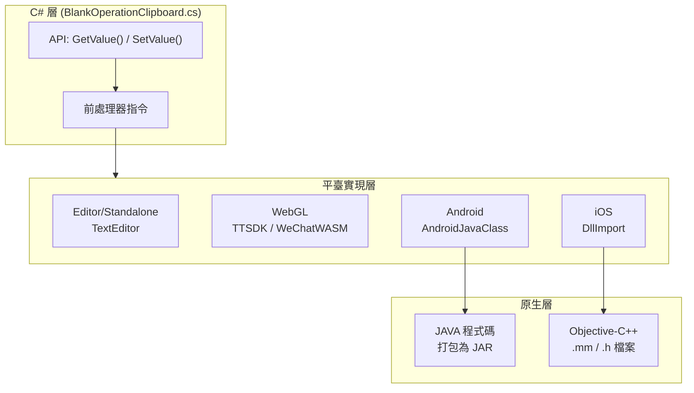

# 平臺配置

本文件詳細介紹 BlankOperationClipboard 外掛在各平臺上的配置方法，包括 Android、iOS、WebGL 小遊戲等平臺的原生程式碼整合和配置要求。

## 概述

BlankOperationClipboard 外掛透過平臺特定的前處理器指令實現跨平臺剪貼簿操作。不同平臺需要不同的原生程式碼配置：

| 平臺 | 實現方式 | 關鍵檔案 |
|------|----------|----------|
| Android | AndroidJavaClass 呼叫 JAR | `Plugins/Android/com.alianhome.operationclipboard.jar` |
| iOS | DllImport 呼叫 Objective-C++ | `Plugins/iOS/BlankOperationClipboard/` |
| WebGL (抖音) | TTSDK.TT API | C# 條件編譯 `ENABLE_DOUYIN_MINI_GAME` |
| WebGL (微信) | WeChatWASM API | C# 條件編譯 `ENABLE_WECHAT_MINI_GAME` |
| Editor/Standalone | TextEditor 類 | 無需額外配置 |

## 架構



### 平臺呼叫流程

```mermaid
sequenceDiagram
    participant User as 使用者程式碼
    participant CSharp as C# 層
    participant Native as 原生平臺
    participant System as 系統剪貼簿

    User->>CSharp: BlankOperationClipboard.GetValue()
    CSharp->>CSharp: #if UNITY_IOS 判斷平臺
    
    alt UNITY_IOS
        CSharp->>Native: DllImport 呼叫 GetClipBoard()
        Native->>System: UIPasteboard.generalPasteboard
        System-->>Native: 剪貼簿內容
        Native-->>CSharp: char* 返回值
    elif UNITY_ANDROID
        CSharp->>Native: AndroidJavaClass.CallStatic()
        Native->>System: Android ClipboardManager
        System-->>Native: 剪貼簿內容
        Native-->>CSharp: String 返回值
    elif UNITY_WEBGL
        CSharp->>Native: TTSDK.TT / WeChatWASM API
        Native-->>CSharp: 非同步回呼
    else
        CSharp->>System: GUIUtility.systemCopyBuffer
    end
    
    CSharp-->>User: string 內容
```

## 平臺詳細配置

### Android 平臺配置

Android 平臺需要將原生 JAR 檔案放置在 `Plugins/Android` 目錄下。

**檔案位置：**
```
Plugins/
└── Android/
    └── com.alianhome.operationclipboard.jar
```

**JAR 包結構：**
JAR 檔案中包含 `MainActivity` 類，提供以下靜態方法：
- `GetClipBoard()`: 獲取剪貼簿內容
- `SetClipBoard(String text)`: 設定剪貼簿內容

**C# 呼叫程式碼：**
```csharp
#if UNITY_ANDROID
using (AndroidJavaClass androidJavaClass = new AndroidJavaClass("com.alianhome.operationclipboard.MainActivity"))
{
    // 獲取剪貼簿
    string content = androidJavaClass.CallStatic<string>("GetClipBoard");
    
    // 設定剪貼簿
    androidJavaClass.CallStatic("SetClipBoard", text);
}
#endif
```
> Source: [BlankOperationClipboard.cs](https://github.com/GameFrameX/com.gameframex.unity.operationclipboard/blob/main/Runtime/BlankOperationClipboard.cs#L58-L62)

### iOS 平臺配置

iOS 平臺需要在 `Plugins/iOS` 目錄下放置原生 Objective-C++ 程式碼檔案。

**檔案結構：**
```
Plugins/
└── iOS/
    └── BlankOperationClipboard/
        ├── BlankOperationClipboard.h
        └── BlankOperationClipboard.mm
```

**標頭檔案 (BlankOperationClipboard.h)：**
```objc
#import <Foundation/Foundation.h>

@interface BlankOperationClipboard : NSObject

#if defined (__cplusplus)
extern "C" {
#endif
    char * GetClipBoard();
    void SetClipBoard(char* text);
#if defined (__cplusplus)
}
#endif

@end
```
> Source: [BlankOperationClipboard.h](https://github.com/GameFrameX/com.gameframex.unity.operationclipboard/blob/main/Plugins/iOS/BlankOperationClipboard/BlankOperationClipboard.h#L1-L14)

**實現檔案 (BlankOperationClipboard.mm)：**
```objc
#import "BlankOperationClipboard.h"

@implementation BlankOperationClipboard

    char * GetClipBoard(){
        UIPasteboard * pasteboard = [UIPasteboard generalPasteboard];			
        const char * a = [pasteboard.string UTF8String];
        char * b = (char*)malloc(strlen(a)+1);
        strcpy(b, a);
        return b;
    }
    void SetClipBoard(char * text){
        UIPasteboard * pasteboard = [UIPasteboard generalPasteboard];
        pasteboard.string = [NSString stringWithUTF8String:text];
    }

@end
```
> Source: [BlankOperationClipboard.mm](https://github.com/GameFrameX/com.gameframex.unity.operationclipboard/blob/main/Plugins/iOS/BlankOperationClipboard/BlankOperationClipboard.mm#L1-L22)

**C# 呼叫程式碼：**
```csharp
#if UNITY_IOS
using System.Runtime.InteropServices;

[DllImport("__Internal")]
private static extern string GetClipBoard();

[DllImport("__Internal")]
private static extern void SetClipBoard(string text);
#endif
```
> Source: [BlankOperationClipboard.cs](https://github.com/GameFrameX/com.gameframex.unity.operationclipboard/blob/main/Runtime/BlankOperationClipboard.cs#L15-L21)

### WebGL 平臺配置

WebGL 平臺支援抖音和微信小遊戲，需要透過條件編譯啟用相應的功能。

**抖音小遊戲配置：**

```csharp
#if ENABLE_DOUYIN_MINI_GAME
TTSDK.TT.GetClipboardData((b, text) =>
{
    if (b)
    {
        content = text;
    }
});
TTSDK.TT.SetClipboardData(text);
#endif
```
> Source: [BlankOperationClipboard.cs](https://github.com/GameFrameX/com.gameframex.unity.operationclipboard/blob/main/Runtime/BlankOperationClipboard.cs#L41-L49)

**微信小遊戲配置：**

```csharp
#if ENABLE_WECHAT_MINI_GAME
var clipboardDataOption = new WeChatWASM.GetClipboardDataOption
{
    success = option => { content = option.data; },
};
WeChatWASM.WX.GetClipboardData(clipboardDataOption);

WeChatWASM.WX.SetClipboardData(new WeChatWASM.SetClipboardDataOption
{
    data = text,
});
#endif
```
> Source: [BlankOperationClipboard.cs](https://github.com/GameFrameX/com.gameframex.unity.operationclipboard/blob/main/Runtime/BlankOperationClipboard.cs#L50-L56)

**啟用條件編譯符號：**

在 Unity 專案中啟用小遊戲支援，需要在 Player Settings 中新增編譯符號：

| 編譯符號 | 平臺 | 說明 |
|----------|------|------|
| `ENABLE_DOUYIN_MINI_GAME` | WebGL | 啟用抖音小遊戲支援 |
| `ENABLE_WECHAT_MINI_GAME` | WebGL | 啟用微信小遊戲支援 |

### Editor 和 Standalone 配置

Editor 和 Standalone 平臺使用 Unity 內建的 `TextEditor` 類，無需額外的原生程式碼配置。

```csharp
#if UNITY_EDITOR || UNITY_STANDALONE
TextEditor textEditor = new TextEditor();
textEditor.OnFocus();
textEditor.Paste();  // 獲取
textEditor.Copy();  // 設定
#endif
```
> Source: [BlankOperationClipboard.cs](https://github.com/GameFrameX/com.gameframex.unity.operationclipboard/blob/main/Runtime/BlankOperationClipboard.cs#L33-L38)

### 其他平臺配置

對於不支援的平臺，外掛會回退到使用 `GUIUtility.systemCopyBuffer`：

```csharp
UnityEngine.GUIUtility.systemCopyBuffer = text;
```
> Source: [BlankOperationClipboard.cs](https://github.com/GameFrameX/com.gameframex.unity.operationclipboard/blob/main/Runtime/BlankOperationClipboard.cs#L67)

## 連結器配置

外掛包含 `link.xml` 檔案以防止程式碼在 IL2CPP 編譯時被裁剪：

```xml
<?xml version="1.0" encoding="UTF-8"?>
<linker>
    <assembly fullname="BlankGetChannel.Runtime" preserve="all"/>
</linker>
```
> Source: [link.xml](https://github.com/GameFrameX/com.gameframex.unity.operationclipboard/blob/main/Runtime/link.xml#L1-L4)

## 平臺相容性總結

| 平臺 | 讀取剪貼簿 | 寫入剪貼簿 | 備註 |
|------|------------|------------|------|
| Unity Editor | ✅ | ✅ | 使用 TextEditor |
| Standalone (PC/Mac) | ✅ | ✅ | 使用 TextEditor |
| Android | ✅ | ✅ | 需要 JAR 外掛 |
| iOS | ✅ | ✅ | 需要 .mm/.h 檔案 |
| 抖音小遊戲 | ✅ | ✅ | 需要 ENABLE_DOUYIN_MINI_GAME |
| 微信小遊戲 | ✅ | ✅ | 需要 ENABLE_WECHAT_MINI_GAME |
| 其他平臺 | ✅ | ✅ | 使用 GUIUtility.systemCopyBuffer |

## 相關連結

- [概述](./1-overview) - 專案概述和核心功能介紹
- [安裝](./2-installation) - 外掛安裝方法
- [使用方法](./4-usage) - API 使用說明和程式碼示例
- [示例](./6-samples) - 完整示例程式碼
- [常見問題](./7-troubleshooting) - 常見問題排查
