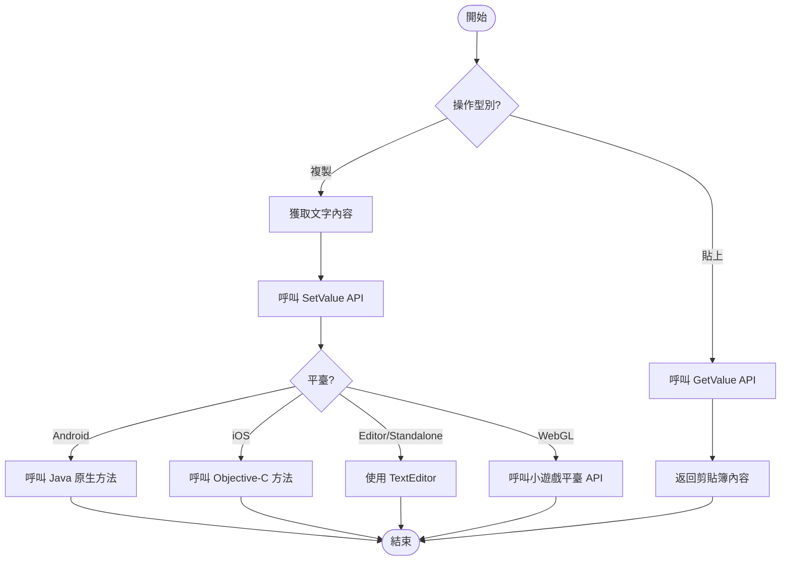

# 示例

本文件提供 `BlankOperationClipboard` 工具類的完整程式碼示例，演示如何在 Unity 專案中實現剪貼簿的讀取和寫入操作。

## 概述

`BlankOperationClipboard` 是一個跨平臺的靜態工具類，支援在 Unity 編輯器、桌面平臺、WebGL（小遊戲）、Android 和 iOS 等多種平臺上進行剪貼簿操作。該類提供兩個核心 API：`GetValue()` 用於獲取剪貼簿內容，`SetValue(string text)` 用於設定剪貼簿內容。

> 注意：完整的 API 方法簽名和引數說明請參閱 [使用方法](./4-usage) 文件。

## 基礎使用示例

以下示例展示了最基礎的剪貼簿讀寫操作，透過 Unity 的舊版 OnGUI 系統實現簡單的互動介面。

```csharp
using UnityEngine;

public class BlankOperationClipboardExample : MonoBehaviour
{
    private string text = "AAAA";
    private string result = "";
    void OnGUI()
    {
        // 文字輸入框
        text = GUILayout.TextField(text, GUILayout.Width(500), GUILayout.Height(100));
        
        // 設定剪貼簿按鈕
        if (GUILayout.Button("SetValue", GUILayout.Width(500), GUILayout.Height(100)))
        {
            BlankOperationClipboard.SetValue(text);
        }
        
        // 獲取剪貼簿按鈕
        if (GUILayout.Button("GetValue", GUILayout.Width(500), GUILayout.Height(100)))
        {
            result = BlankOperationClipboard.GetValue();
        }
        
        // 顯示獲取的結果
        GUILayout.Label(result);
    }
}
```

> Source: [BlankOperationClipboardExample.cs](https://github.com/GameFrameX/com.gameframex.unity.operationclipboard/blob/main/Samples~/BlankOperationClipboardExample.cs#L37-L54)

### 程式碼解析

| 程式碼段 | 說明 |
|--------|------|
| `private string text = "AAAA"` | 儲存要複製到剪貼簿的文字 |
| `private string result = ""` | 儲存從剪貼簿讀取的結果 |
| `GUILayout.TextField()` | 建立可編輯的文字輸入框 |
| `BlankOperationClipboard.SetValue(text)` | 將文字內容寫入系統剪貼簿 |
| `BlankOperationClipboard.GetValue()` | 從系統剪貼簿讀取文字內容 |
| `GUILayout.Label()` | 顯示讀取的文字結果 |

## 進階使用示例

### 在 UI 按鈕中使用

以下示例展示如何在現代 Unity UI 系統中使用剪貼簿功能：

```csharp
using UnityEngine;
using UnityEngine.UI;

public class ClipboardUIExample : MonoBehaviour
{
    [SerializeField] private InputField inputField;
    [SerializeField] private Text resultText;
    [SerializeField] private Button copyButton;
    [SerializeField] private Button pasteButton;

    void Start()
    {
        // 繫結按鈕點選事件
        copyButton.onClick.AddListener(OnCopyClicked);
        pasteButton.onClick.AddListener(OnPasteClicked);
    }

    private void OnCopyClicked()
    {
        // 獲取輸入框內容並複製到剪貼簿
        string content = inputField.text;
        BlankOperationClipboard.SetValue(content);
        Debug.Log($"已複製到剪貼簿: {content}");
    }

    private void OnPasteClicked()
    {
        // 從剪貼簿讀取內容並顯示
        string content = BlankOperationClipboard.GetValue();
        resultText.text = content;
        Debug.Log($"從剪貼簿讀取: {content}");
    }
}
```

### 在 UGUI 中使用

對於使用 UGUI（Unity GUI）系統的專案，可以按以下方式整合：

```csharp
using UnityEngine;
using UnityEngine.UI;

public class UGUIClipboardExample : MonoBehaviour
{
    [SerializeField] private TMP_InputField inputField;
    [SerializeField] private TextMeshProUGUI resultText;

    public void CopyToClipboard()
    {
        if (string.IsNullOrEmpty(inputField.text))
        {
            Debug.LogWarning("輸入框內容為空");
            return;
        }
        BlankOperationClipboard.SetValue(inputField.text);
    }

    public void PasteFromClipboard()
    {
        string clipboardContent = BlankOperationClipboard.GetValue();
        resultText.text = string.IsNullOrEmpty(clipboardContent) 
            ? "剪貼簿為空" 
            : clipboardContent;
    }
}
```

### 在遊戲邏輯中使用

以下示例展示如何在遊戲內購買或兌換碼場景中使用剪貼簿功能：

```csharp
using UnityEngine;

public class GameClipboardExample : MonoBehaviour
{
    // 複製邀請連結
    public void CopyInviteLink(string playerId)
    {
        string inviteLink = $"https://game.example.com/invite/{playerId}";
        BlankOperationClipboard.SetValue(inviteLink);
        Debug.Log($"邀請連結已複製: {inviteLink}");
    }

    // 複製遊戲內金幣地址
    public void CopyWalletAddress(string walletAddress)
    {
        BlankOperationClipboard.SetValue(walletAddress);
        Debug.Log($"錢包地址已複製");
    }

    // 貼上兌換碼
    public string GetRedeemCode()
    {
        string code = BlankOperationClipboard.GetValue();
        // 簡單驗證兌換碼格式
        if (string.IsNullOrWhiteSpace(code) || code.Length < 8)
        {
            Debug.LogWarning("無效的兌換碼");
            return null;
        }
        return code.Trim().ToUpper();
    }
}
```

## 使用流程圖

以下流程圖展示了剪貼簿操作的標準流程：



## 平臺注意事項

| 平臺 | 注意事項 |
|------|----------|
| Unity Editor | 使用 TextEditor 類，需要編輯器視窗處於啟用狀態 |
| Standalone | 同樣使用 TextEditor，需要目標視窗獲得焦點 |
| Android | 需要在 Android 原生程式碼中實現 `GetClipBoard` 和 `SetClipBoard` 方法 |
| iOS | 需要在 iOS 原生程式碼中實現對應的 C 函式 |
| WebGL (微信/抖音) | 需要在小遊戲平臺正確配置剪貼簿許可權 |

> 詳細的平臺特定配置說明請參閱 [平臺配置](./5-platforms) 文件。

## 常見錯誤處理

### 處理空剪貼簿

```csharp
public string SafeGetClipboardValue()
{
    string value = BlankOperationClipboard.GetValue();
    return value ?? string.Empty;
}
```

### 處理異常情況

```csharp
public bool TryCopyToClipboard(string text)
{
    try
    {
        if (string.IsNullOrEmpty(text))
        {
            Debug.LogWarning("複製的文字為空");
            return false;
        }
        BlankOperationClipboard.SetValue(text);
        return true;
    }
    catch (System.Exception ex)
    {
        Debug.LogError($"複製到剪貼簿失敗: {ex.Message}");
        return false;
    }
}
```

## 相關連結

- [概述](./1-overview) - 專案概述與功能介紹
- [安裝](./2-installation) - 外掛安裝指南
- [使用方法](./4-usage) - API 詳細說明與參數列
- [平臺配置](./5-platforms) - 各平臺具體配置方法
- [常見問題](./7-troubleshooting) - 常見問題與解決方案
