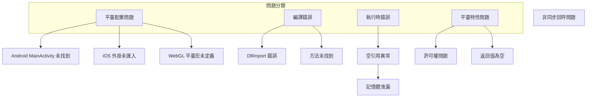

# 常見問題

本文件收集了使用 GameFrameX Unity Operation Clipboard 外掛時常見的問題及其解決方案。

## 概述

BlankOperationClipboard 是一個跨平臺的 Unity 貼上板操作工具，支援 Editor、Standalone、WebGL（抖音小遊戲、微信小遊戲）、Android 和 iOS 平臺。在實際使用過程中，開發者可能會遇到各種平臺相關的問題。



## 平臺配置問題

### Android 平臺

#### 問題：Android MainActivity 未找到

**症狀**: 在 Android 平臺上呼叫 `GetValue()` 或 `SetValue()` 時，出現 `AndroidJavaException` 或方法找不到的錯誤。

**原因**: Android 原生實現依賴 `com.alianhome.operationclipboard.MainActivity` 類，該類需要在 Android 專案中存在。

**解決方案**:

1. 確保 `Plugins/Android/com.alianhome.operationclipboard.jar` 檔案已正確放置在 Unity 專案的 `Plugins/Android` 目錄下

2. 在 Android 專案中確儲存在對應的 MainActivity 類，實現以下方法：
   ```java
   public static String GetClipBoard() {
       ClipboardManager clipboard = (ClipboardManager) getSystemService(Context.CLIPBOARD_SERVICE);
       ClipData clip = clipboard.getPrimaryClip();
       if (clip != null && clip.getItemCount() > 0) {
           return clip.getItemAt(0).getText().toString();
       }
       return "";
   }
   
   public static void SetClipBoard(String text) {
       ClipboardManager clipboard = (ClipboardManager) getSystemService(Context.CLIPBOARD_SERVICE);
       ClipData clip = ClipData.newPlainText("text", text);
       clipboard.setPrimaryClip(clip);
   }
   ```

> Source: [BlankOperationClipboard.cs](https://github.com/GameFrameX/com.gameframex.unity.operationclipboard/blob/main/Runtime/BlankOperationClipboard.cs#L58-L62)

---

### iOS 平臺

#### 問題：iOS 原生方法未找到

**症狀**: 在 iOS 平臺上呼叫方法時出現 `EntryPointNotFoundException` 或類似錯誤。

**原因**: iOS 原生外掛未正確匯入或方法名不匹配。

**解決方案**:

1. 確保 `Plugins/iOS/BlankOperationClipboard` 資料夾已正確放置在專案中

2. 檢查 Unity 的 iOS Build Settings 中是否包含了該外掛

3. 驗證方法名是否正確匹配：
   ```objc
   // iOS 原生方法名必須與 C# DllImport 宣告一致
   extern "C" {
       char * GetClipBoard();    // 對應 C# 的 GetClipBoard
       void SetClipBoard(char * text);  // 對應 C# 的 SetClipBoard
   }
   ```

> Source: [BlankOperationClipboard.mm](https://github.com/GameFrameX/com.gameframex.unity.operationclipboard/blob/main/Plugins/iOS/BlankOperationClipboard/BlankOperationClipboard.mm#L8-L18)

---

### WebGL 平臺

#### 問題：WebGL 平臺剪貼簿功能不工作

**症狀**: 在 WebGL 平臺打包後，剪貼簿讀取或寫入功能無效。

**原因**: WebGL 平臺需要啟用對應小遊戲的平臺宏才能編譯相關程式碼。

**解決方案**:

1. 對於 **抖音小遊戲**，需要在 Player Settings 中新增 `ENABLE_DOUYIN_MINI_GAME` 符號

2. 對於 **微信小遊戲**，需要新增 `ENABLE_WECHAT_MINI_GAME` 符號

3. 新增步驟：
   - 開啟 Unity 選單：`Edit > Project Settings > Player`
   - 切換到 WebGL 平臺
   - 在 `Publishing Settings` > `Scripting Define Symbols` 中新增對應的宏

> Source: [BlankOperationClipboard.cs](https://github.com/GameFrameX/com.gameframex.unity.operationclipboard/blob/main/Runtime/BlankOperationClipboard.cs#L39-L57)

---

## 編譯錯誤

### 問題：DllImport 匯入失敗

**症狀**: 編譯時出現 `DllImport` 相關的錯誤資訊。

**原因**: Unity 在編譯時無法找到對應的原生外掛。

**解決方案**:

1. 確認平臺對應的 Plugins 資料夾結構正確：
   ```
   Assets/
   └── Plugins/
       ├── Android/
       │   └── com.alianhome.operationclipboard.jar
       └── iOS/
           └── BlankOperationClipboard/
               ├── BlankOperationClipboard.h
               └── BlankOperationClipboard.mm
   ```

2. 檢查副檔名是否正確（.jar 而不是 .zip）

3. 對於 iOS，確保 .mm 和 .h 檔案的 Metafile 也一同提交

---

## 執行時錯誤

### 問題：空引用異常 (NullReferenceException)

**症狀**: 呼叫 `GetValue()` 或 `SetValue()` 時丟擲空引用異常。

**原因**: 當前執行平臺沒有匹配到任何前處理器分支，導致執行到預設分支時出現問題。

**解決方案**:

1. 確保在 Player Settings 中正確配置了目標平臺

2. 對於不支援的平臺，程式碼有預設實現：
   ```csharp
   // 如果所有平臺宏都不匹配，使用 GUIUtility.systemCopyBuffer
   return UnityEngine.GUIUtility.systemCopyBuffer ?? string.Empty;
   ```

3. 在呼叫前新增平臺檢查：
   ```csharp
   #if UNITY_ANDROID || UNITY_IOS || UNITY_WEBGL
       string clipboardText = BlankOperationClipboard.GetValue();
   #else
       Debug.LogWarning("當前平臺不支援剪貼簿操作");
   #endif
   ```

> Source: [BlankOperationClipboard.cs](https://github.com/GameFrameX/com.gameframex.unity.operationclipboard/blob/main/Runtime/BlankOperationClipboard.cs#L67-L68)

---

### 問題：iOS 記憶體洩漏

**症狀**: 長時間在 iOS 平臺上使用剪貼簿功能可能導致記憶體持續增長。

**原因**: iOS 原生程式碼中 `GetClipBoard()` 方法使用 `malloc()` 分配記憶體但未提供釋放機制。

**問題程式碼**:
```objc
char * GetClipBoard(){
    UIPasteboard * pasteboard = [UIPasteboard generalPasteboard];			
    const char * a = [pasteboard.string UTF8String];
    char * b = (char*)malloc(strlen(a)+1);  // 分配記憶體
    strcpy(b, a);
    return b;  // 記憶體未被釋放
}
```

**解決方案**:

1. 方案一：在 C# 端使用 `Marshal.FreeHGlobal` 釋放記憶體
   ```csharp
   [DllImport("__Internal")]
   private static extern IntPtr GetClipBoard();
   
   public static string GetValueSafe()
   {
       IntPtr ptr = GetClipBoard();
       try
       {
           return Marshal.PtrToStringAnsi(ptr);
       }
       finally
       {
           if (ptr != IntPtr.Zero)
               Marshal.FreeHGlobal(ptr);
       }
   }
   ```

2. 方案二：修改 iOS 原生程式碼使用autorelease
   ```objc
   char * GetClipBoard(){
       UIPasteboard * pasteboard = [UIPasteboard generalPasteboard];			
       NSString * str = pasteboard.string;
       const char * a = [str UTF8String];
       char * b = (char*)malloc(strlen(a)+1);
       strcpy(b, a);
       return b;
   }
   // 呼叫方負責釋放
   ```

> Source: [BlankOperationClipboard.mm](https://github.com/GameFrameX/com.gameframex.unity.operationclipboard/blob/main/Plugins/iOS/BlankOperationClipboard/BlankOperationClipboard.mm#L8-L14)

---

## 平臺特性問題

### 問題：WebGL 非同步回呼導致返回值不正確

**症狀**: 在抖音小遊戲平臺，使用 `GetValue()` 獲取剪貼簿內容返回空字串。

**原因**: 抖音小遊戲的剪貼簿 API 是非同步的，方法在非同步回呼完成前就返回了。

**問題程式碼**:
```csharp
// 當前實現
public static string GetValue()
{
    var content = string.Empty;
#if ENABLE_DOUYIN_MINI_GAME
    TTSDK.TT.GetClipboardData((b, text) =>
    {
        if (b)
        {
            content = text;  // 非同步回呼，回呼完成時方法已返回
        }
    });
#endif
    return content;  // 總是返回空字串
}
```

**解決方案**:

使用回呼函式模式替代同步返回：

```csharp
public delegate void ClipboardCallback(string text);

public static void GetValueAsync(ClipboardCallback callback)
{
#if ENABLE_DOUYIN_MINI_GAME
    TTSDK.TT.GetClipboardData((b, text) =>
    {
        callback?.Invoke(b ? text : string.Empty);
    });
#else
    callback?.Invoke(string.Empty);
#endif
}

// 使用示例
BlankOperationClipboard.GetValueAsync(result => 
{
    Debug.Log("剪貼簿內容: " + result);
});
```

> Source: [BlankOperationClipboard.cs](https://github.com/GameFrameX/com.gameframex.unity.operationclipboard/blob/main/Runtime/BlankOperationClipboard.cs#L41-L49)

---

### 問題：剪貼簿返回值為 null

**症狀**: 呼叫 `GetValue()` 返回 `null` 而不是空字串。

**原因**: 某些平臺實現可能返回 null 而不是空字串。

**解決方案**:

使用 null 合併運算子確保返回值不為 null：

```csharp
public static string GetValue()
{
    string result = // 平臺特定實現
    
    // 確保不會返回 null
    return result ?? string.Empty;
}
```

---

### 問題：Android 6.0+ 剪貼簿許可權

**症狀**: 在 Android 6.0 及以上版本，剪貼簿功能正常工作，但某些裝置上可能出現許可權問題。

**原因**: 從 Android 10 開始，對剪貼簿訪問有了更多限制。

**解決方案**:

1. 對於大多數應用，剪貼簿訪問不需要特殊許可權

2. 如果應用需要作為輸入法使用，需要在 AndroidManifest.xml 中宣告許可權：
   ```xml
   <uses-permission android:name="android.permission.FOREGROUND_SERVICE" />
   ```

3. 對於後臺服務訪問剪貼簿，建議使用 `ClipboardManager` 的前臺服務

---

## 除錯技巧

### 啟用詳細日誌

在開發階段，可以新增除錯日誌來幫助定位問題：

```csharp
public static string GetValue()
{
    string result;
    
#if UNITY_ANDROID
    using (AndroidJavaClass androidJavaClass = new AndroidJavaClass("com.alianhome.operationclipboard.MainActivity"))
    {
        result = androidJavaClass.CallStatic<string>("GetClipBoard");
        Debug.Log($"[Clipboard] Android GetValue result: {result}");
    }
#elif UNITY_IOS
    result = GetClipBoard();
    Debug.Log($"[Clipboard] iOS GetValue result: {result}");
#else
    result = UnityEngine.GUIUtility.systemCopyBuffer ?? string.Empty;
    Debug.Log($"[Clipboard] Default GetValue result: {result}");
#endif
    
    return result ?? string.Empty;
}
```

### 檢查平臺

使用前處理器指令確認當前編譯的平臺：

```csharp
void Start()
{
    Debug.Log($"當前編譯平臺: ");
#if UNITY_EDITOR
    Debug.Log(" - Unity Editor");
#endif
#if UNITY_ANDROID
    Debug.Log(" - Android");
#endif
#if UNITY_IOS
    Debug.Log(" - iOS");
#endif
#if UNITY_WEBGL
    Debug.Log(" - WebGL");
#if ENABLE_DOUYIN_MINI_GAME
    Debug.Log("   + 抖音小遊戲");
#endif
#if ENABLE_WECHAT_MINI_GAME
    Debug.Log("   + 微信小遊戲");
#endif
#endif
}
```

---

## 相關連結

- [概述](./1-overview) - 專案概述與功能介紹
- [安裝](./2-installation) - 外掛安裝指南
- [使用方法](./4-usage) - API 使用說明
- [平臺配置](./5-platforms) - 各平臺詳細配置說明
- [示例](./6-samples) - 程式碼示例與演示
