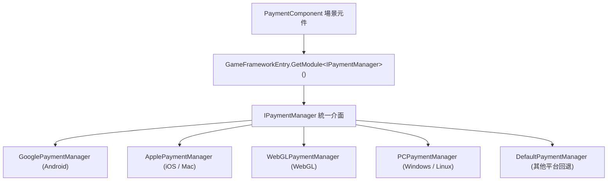

# 安裝與快速上手

Game Frame X Payment 是一個 Unity 付款套件，為應用程式內購買和訂閱提供統一介面，支援 Google Play 與 Apple App Store。本頁帶你從安裝套件、掛載元件到發起第一次購買，幾分鐘內跑通完整流程。

## 快速開始

### 1. 確認環境

| 相依套件 | 版本需求 |
|--------|----------|
| Unity | 2019.4 及以上 |
| `com.gameframex.unity` | 2.5.1 |
| `com.gameframex.unity.payment.google` | 1.0.1 |

以上相依宣告來自套件的 `package.json`，安裝時由 UPM 自動解析。

Source: [package.json](https://github.com/GameFrameX/com.gameframex.unity.payment/blob/main/package.json#L24-L27)

### 2. 安裝套件

任選以下一種方式：

**方式一：scopedRegistries（推薦）**

編輯 Unity 專案的 `Packages/manifest.json`，新增 `scopedRegistries` 區段：

```json
{
  "scopedRegistries": [
    {
      "name": "GameFrameX",
      "url": "https://gameframex.upm.alianblank.uk",
      "scopes": [
        "com.gameframex"
      ]
    }
  ],
  "dependencies": {
    "com.gameframex.unity.payment": "1.1.0"
  }
}
```

`scopes` 控制哪些套件會透過此登錄檔解析，只有以 `com.gameframex` 開頭的套件才會從這個登錄檔取得。

Source: [README.zh-CN.md](https://github.com/GameFrameX/com.gameframex.unity.payment/blob/main/README.zh-CN.md#L40-L58)

**方式二：直接寫 Git 網址**

在 `manifest.json` 的 `dependencies` 節點下新增：

```json
{
   "com.gameframex.unity.payment": "https://github.com/gameframex/com.gameframex.unity.payment.git"
}
```

Source: [README.zh-CN.md](https://github.com/GameFrameX/com.gameframex.unity.payment/blob/main/README.zh-CN.md#L60-L65)

**方式三：Package Manager 新增 Git URL**

Unity 選單 `Window > Package Manager > + > Add package from git URL`，網址填入 `https://github.com/gameframex/com.gameframex.unity.payment.git`。

**方式四：原始碼直放**

直接下載儲存庫放置到 Unity 專案的 `Packages` 目錄下，Unity 會自動載入識別。

Source: [README.zh-CN.md](https://github.com/GameFrameX/com.gameframex.unity.payment/blob/main/README.zh-CN.md#L66-L67)

### 3. 掛載 PaymentComponent 元件

在場景中建立 GameFrameX 物件，透過 `AddComponentMenu` 路徑 `GameFrameX/Payment` 新增 `PaymentComponent`。元件帶有 `[RequireComponent(typeof(GameFrameXPaymentCroppingHelper))]`，會自動附帶裁切輔助元件，且 `[DisallowMultipleComponent]` 限制同一物件只能掛載一個。

```csharp
[DisallowMultipleComponent]
[RequireComponent(typeof(GameFrameXPaymentCroppingHelper))]
[AddComponentMenu("GameFrameX/Payment")]
[UnityEngine.Scripting.Preserve]
public class PaymentComponent : GameFrameworkComponent
```

Source: [PaymentComponent.cs](https://github.com/GameFrameX/com.gameframex.unity.payment/blob/main/Runtime/PaymentComponent.cs#L17-L21)

元件會在 `Awake()` 中依目前編譯平台自動選擇對應平台的付款管理器實作（Android 用 Google、iOS/Mac 用 Apple、WebGL、PC 各自獨立，其餘平台回退到 `DefaultPaymentManager`），無需手動指定：

```csharp
#if UNITY_ANDROID
    componentType = m_componentAndroidType;
#elif UNITY_IOS
    componentType = m_componentIOSType;
#elif UNITY_WEBGL
    componentType = m_componentWebGLType;
#elif UNITY_STANDALONE_WIN || UNITY_STANDALONE_LINUX
    componentType = m_componentPCType;
#elif UNITY_STANDALONE_OSX
    componentType = m_componentMacType;
#else
    componentType = typeof(DefaultPaymentManager).FullName;
#endif
    ImplementationComponentType = Utility.Assembly.GetType(componentType);
    InterfaceComponentType = typeof(IPaymentManager);
    base.Awake();
```

Source: [PaymentComponent.cs](https://github.com/GameFrameX/com.gameframex.unity.payment/blob/main/Runtime/PaymentComponent.cs#L69-L86)

### 4. 初始化付款系統

啟動時呼叫 `Init`，參數 `isDebug` 控制沙箱模式，`isClientVerify` 控制是否執行用戶端購買驗證：

```csharp
public void Init(bool isDebug = false, bool isClientVerify = true)
{
    _paymentManager.Init(isDebug, isClientVerify);
}
```

Source: [PaymentComponent.cs](https://github.com/GameFrameX/com.gameframex.unity.payment/blob/main/Runtime/PaymentComponent.cs#L102-L105)

如需預先載入商品資訊，在初始化之前呼叫 `SetPredefinedProductIds`（原始碼註解明確要求此方法要在 `Initialize()` 之前呼叫），分別傳入內購商品 ID 清單和訂閱商品 ID 清單：

```csharp
public void SetPredefinedProductIds(List<string> inAppProductIds, List<string> subsProductIds)
{
    _paymentManager.SetPredefinedProductIds(inAppProductIds, subsProductIds);
}
```

Source: [PaymentComponent.cs](https://github.com/GameFrameX/com.gameframex.unity.payment/blob/main/Runtime/PaymentComponent.cs#L122-L126)

初始化後可用 `IsReady()` 檢查付款系統是否準備就緒，回傳 `bool`。

### 5. 訂閱事件並發起購買

先訂閱結果事件（元件上直接暴露了四個事件：`OnPurchaseSuccess`、`OnPurchaseFailed`、`OnQueryPurchasesResult`、`OnConsumePurchaseResult`，均為 `EventHandler<PaymentEventArgs>`），再用推薦的 `Buy(PurchaseParams)` 發起購買：

```csharp
public void Buy(PurchaseParams purchaseParams)
```

Source: [PaymentComponent.cs](https://github.com/GameFrameX/com.gameframex.unity.payment/blob/main/Runtime/PaymentComponent.cs#L233-L238)

`PurchaseParams` 攜帶產品 ID、訂單 ID 等參數，各付款通路可使用對應子類別傳入通路特有參數。注意舊的 `BuyInApp` / `BuySubs` / `Buy(productId, productType, ...)` 已標記 `[Obsolete("请使用 Buy(PurchaseParams) 替代")]`，新程式碼請勿使用。

Source: [PaymentComponent.cs](https://github.com/GameFrameX/com.gameframex.unity.payment/blob/main/Runtime/PaymentComponent.cs#L161-L163)

### 6. 處理購買結果並消耗

購買成功後，對一次性商品呼叫 `ConsumePurchase(purchaseToken)` 消耗購買（`purchaseToken` 為空時元件會輸出 `Log.Warning("Purchase token is null or empty.")` 並直接傳回）；用 `QueryPurchases(PaymentProductType)` 查詢歷史購買記錄，`productType` 取 `PaymentProductType` 列舉的 inapp 或 subs 值。

Source: [PaymentComponent.cs](https://github.com/GameFrameX/com.gameframex.unity.payment/blob/main/Runtime/PaymentComponent.cs#L133-L151)

## 工作原理速覽

元件本身只是一層薄封裝：`PaymentComponent` 在 `Awake()` 中依平台解析實作類別型別，再透過 `GameFrameworkEntry.GetModule<IPaymentManager>()` 取得目前平台的付款管理器，後續所有 API 呼叫都會轉交給它。



## 接下來

- 完整 API 說明與參數細節：見儲存庫 [README.zh-CN.md](https://github.com/GameFrameX/com.gameframex.unity.payment/blob/main/README.zh-CN.md#L68-L126)
- 版本歷史：[CHANGELOG.md](https://github.com/GameFrameX/com.gameframex.unity.payment/blob/main/CHANGELOG.md)
- 官方文件與支援：[https://gameframex.doc.alianblank.com](https://gameframex.doc.alianblank.com)，QQ 群 467608841 / 233840761