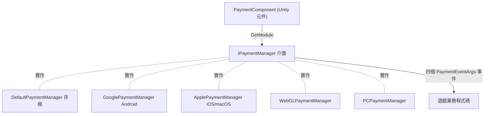

# 支付元件概述

Payment 支付元件是 GameFrameX 的 Unity 內購套件，為應用程式內購買與訂閱提供統一介面 `IPaymentManager`。你在場景裡掛上一個 `PaymentComponent`，執行階段會依平台自動裝配對應的通路實作（Android → Google Play、iOS/macOS → App Store 等），業務程式碼只面向同一套 `Init` / `Buy` / `QueryPurchases` / `ConsumePurchase` API。

## 快速開始

### 1. 安裝套件

編輯 Unity 專案的 `Packages/manifest.json`，任選一種方式：

```json
{
  "scopedRegistries": [
    {
      "name": "GameFrameX",
      "url": "https://gameframex.upm.alianblank.uk",
      "scopes": [
        "com.gameframex"
      ]
    }
  ],
  "dependencies": {
    "com.gameframex.unity.payment": "1.1.0"
  }
}
```

也可以在 `dependencies` 下直接寫入 Git 位址 `https://github.com/gameframex/com.gameframex.unity.payment.git`，或使用 Package Manager 的 Add package from git URL 新增。

Source: [README.zh-CN.md](https://github.com/GameFrameX/com.gameframex.unity.payment/blob/main/README.zh-CN.md#L40-L66)

### 2. 掛載支付元件

在 Unity 選單中選擇 `GameFrameX/Payment` 新增元件，它會強制帶上裁剪輔助元件：

```csharp
[DisallowMultipleComponent]
[RequireComponent(typeof(GameFrameXPaymentCroppingHelper))]
[AddComponentMenu("GameFrameX/Payment")]
[UnityEngine.Scripting.Preserve]
public class PaymentComponent : GameFrameworkComponent
```

Source: [PaymentComponent.cs](https://github.com/GameFrameX/com.gameframex.unity.payment/blob/main/Runtime/PaymentComponent.cs#L17-L21)

元件會在 `Awake` 中依編譯平台選擇實作類型，並從框架模組系統取出 `IPaymentManager`：

```csharp
#if UNITY_ANDROID
    componentType = m_componentAndroidType;
#elif UNITY_IOS
    componentType = m_componentIOSType;
#elif UNITY_WEBGL
    componentType = m_componentWebGLType;
#elif UNITY_STANDALONE_WIN || UNITY_STANDALONE_LINUX
    componentType = m_componentPCType;
#elif UNITY_STANDALONE_OSX
    componentType = m_componentMacType;
#else
    componentType = typeof(DefaultPaymentManager).FullName;
#endif
    ImplementationComponentType = Utility.Assembly.GetType(componentType);
    InterfaceComponentType = typeof(IPaymentManager);
    base.Awake();

    _paymentManager = GameFrameworkEntry.GetModule<IPaymentManager>();
```

Source: [PaymentComponent.cs](https://github.com/GameFrameX/com.gameframex.unity.payment/blob/main/Runtime/PaymentComponent.cs#L71-L93)

平台與預設實作的對應：

| 平台 | 預設實作類型（可在 Inspector 修改） |
|------|------------------------------------|
| UNITY_ANDROID | `GameFrameX.Payment.Google.Runtime.GooglePaymentManager` |
| UNITY_IOS / UNITY_STANDALONE_OSX | `GameFrameX.Payment.Apple.Runtime.ApplePaymentManager` |
| UNITY_WEBGL | `GameFrameX.Payment.WebGL.Runtime.WebGLPaymentManager` |
| UNITY_STANDALONE_WIN / LINUX | `GameFrameX.Payment.PC.Runtime.PCPaymentManager` |
| 其他平台 | `DefaultPaymentManager`（存根，僅警告） |

### 3. 初始化並預先載入商品

`SetPredefinedProductIds` 必須在 `Init` 之前呼叫，用於預先載入商品快取：

```csharp
public void Init(bool isDebug = false, bool isClientVerify = true)
{
    _paymentManager.Init(isDebug, isClientVerify);
}
```

Source: [PaymentComponent.cs](https://github.com/GameFrameX/com.gameframex.unity.payment/blob/main/Runtime/PaymentComponent.cs#L102-L105)

`isDebug` 為沙箱模式開關；`isClientVerify` 決定是否在用戶端驗證購買，採用伺服器驗證（強制連線）時應設為 `false`（注意：元件層 `Init` 的預設值是 `true`，介面 `IPaymentManager.Init` 的預設值是 `false`）。

### 4. 訂閱支付事件

元件公開四個事件，會直接轉發到目前平台的 `IPaymentManager` 實作：`OnPurchaseSuccess`、`OnPurchaseFailed`、`OnQueryPurchasesResult`、`OnConsumePurchaseResult`，參數均為 `PaymentEventArgs`。

Source: [PaymentComponent.cs](https://github.com/GameFrameX/com.gameframex.unity.payment/blob/main/Runtime/PaymentComponent.cs#L33-L64)

### 5. 發起購買

建議使用 `Buy(PurchaseParams)`，各通路以對應的子類別傳入該通路特有的參數；元件層會先進行參數驗證（`ProductId`、`OrderId` 為空時會輸出 `Log.Warning` 並直接回傳）：

```csharp
public void Buy(PurchaseParams purchaseParams)
{
    if (purchaseParams == null)
    {
        Log.Warning("Purchase params is null.");
        return;
    }

    if (string.IsNullOrEmpty(purchaseParams.ProductId))
    {
        Log.Warning("Product ID is null or empty.");
        return;
    }

    if (string.IsNullOrEmpty(purchaseParams.OrderId))
    {
        Log.Warning("Order ID is null or empty.");
        return;
    }

    _paymentManager.Buy(purchaseParams);
}
```

Source: [PaymentComponent.cs](https://github.com/GameFrameX/com.gameframex.unity.payment/blob/main/Runtime/PaymentComponent.cs#L238-L259)

舊的 `BuyInApp` / `BuySubs` / `Buy(productId, productType, orderId, ...)` 均已標記 `[Obsolete("请使用 Buy(PurchaseParams) 替代")]`，仍可使用，但不建議用於新程式碼。

Source: [IPaymentManager.cs](https://github.com/GameFrameX/com.gameframex.unity.payment/blob/main/Runtime/IPaymentManager.cs#L79-L105)

### 6. 查詢與消耗

- `QueryPurchases(PaymentProductType productType)`：依產品類型查詢購買記錄，結果透過 `OnQueryPurchasesResult` 事件回報。
- `ConsumePurchase(string purchaseToken)`：消耗購買，`purchaseToken` 為空時會輸出 `Purchase token is null or empty.` 並回傳。
- `IsReady()`：支付系統是否初始化完成，購買前建議先檢查。

Source: [PaymentComponent.cs](https://github.com/GameFrameX/com.gameframex.unity.payment/blob/main/Runtime/PaymentComponent.cs#L112-L152)

## 運作原理速覽

`PaymentComponent` 只負責平台路由與參數驗證，真正的支付邏輯在各通路的 `IPaymentManager` 實作中；`DefaultPaymentManager` 是空存根，呼叫其方法只會輸出提示 "You are using DefaultPaymentManager which is a stub. Please integrate a channel-specific implementation (e.g. Google, Apple)."。



Source: [PaymentComponent.cs](https://github.com/GameFrameX/com.gameframex.unity.payment/blob/main/Runtime/PaymentComponent.cs#L23-L28)、[DefaultPaymentManager.cs](https://github.com/GameFrameX/com.gameframex.unity.payment/blob/main/Runtime/DefaultPaymentManager.cs#L17-L27)

## 接下來

- 介面契約與事件定義：[IPaymentManager.cs](https://github.com/GameFrameX/com.gameframex.unity.payment/blob/main/Runtime/IPaymentManager.cs#L16-L113)
- 元件層全部公開 API 與驗證邏輯：[PaymentComponent.cs](https://github.com/GameFrameX/com.gameframex.unity.payment/blob/main/Runtime/PaymentComponent.cs)
- Editor 下的 Inspector 客製化：[PaymentComponentInspector.cs](https://github.com/GameFrameX/com.gameframex.unity.payment/blob/main/Editor/PaymentComponentInspector.cs)
- 版本歷史：[CHANGELOG.md](https://github.com/GameFrameX/com.gameframex.unity.payment/blob/main/CHANGELOG.md)
- 官方文件站：<https://gameframex.doc.alianblank.com>