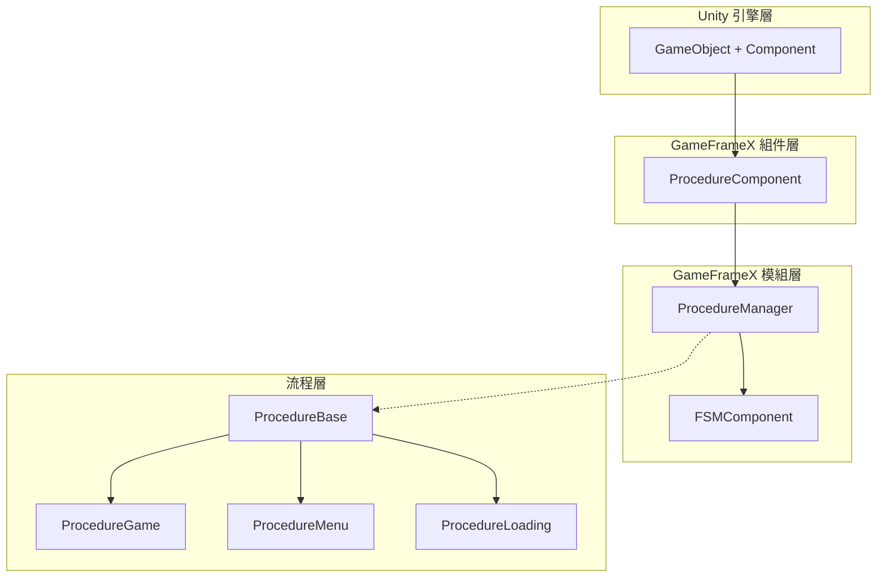
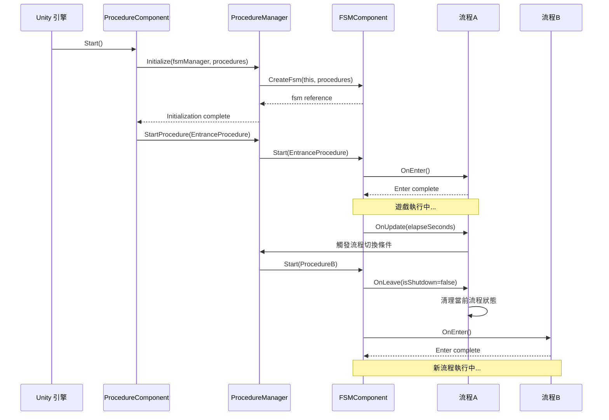

# 功能特性

GameFrameX Procedure 流程管理組件為 Unity 遊戲提供了一套完整的遊戲流程狀態管理解決方案，支援透過有限狀態機（FSM）管理遊戲的各個階段。

## 概述

Procedure 流程管理組件是 GameFrameX 框架的核心模組之一，專門用於管理遊戲的業務流程和狀態切換。該組件基於有限狀態機（FSM）設計，允許開發者將遊戲劃分為多個獨立的流程階段，如啟動流程、載入流程、主選單流程、遊戲流程、暫停流程和結束流程等。

每個流程都是一個獨立的狀態，擁有完整的生命週期管理，包括初始化、進入、更新、離開和銷燬等階段。這種設計使得遊戲邏輯更加模組化，便於維護和擴充套件，同時也為團隊協作提供了清晰的分工邊界。

## 核心功能

### 流程狀態管理

組件提供了完整的流程狀態管理能力，支援在遊戲執行時動態切換不同的流程狀態。開發者可以透過簡單的 API 呼叫實現從載入介面到遊戲主選單、再到具體遊戲玩法的平滑過渡。流程管理器維護了所有可用流程的引用，並提供了查詢當前流程、獲取流程持續時間等實用功能。

```csharp
// 檢查是否存在指定流程
bool hasProcedure = procedureComponent.HasProcedure<ProcedureGame>();

// 獲取當前正在執行的流程
ProcedureBase current = procedureComponent.CurrentProcedure;

// 獲取當前流程已持續的時間
float elapsedTime = procedureComponent.CurrentProcedureTime;
```

> Source: [ProcedureComponent.cs](https://github.com/GameFrameX/com.gameframex.unity.procedure/blob/main/Runtime/Procedure/ProcedureComponent.cs#L114-L147)

### 自動流程初始化

組件在遊戲啟動時自動完成所有流程的建立和初始化工作。開發者只需要在 Unity 編輯器中配置好可用的流程型別，組件會自動使用反射機制建立流程例項，並在遊戲幀載入完成後自動啟動入口流程。這種設計大大簡化了遊戲的啟動邏輯，開發者可以專注於業務邏輯的實現。

```csharp
// ProcedureComponent 在 Start 方法中自動完成流程初始化
private IEnumerator Start()
{
    ProcedureBase[] procedures = new ProcedureBase[m_AvailableProcedureTypeNames.Length];
    for (int i = 0; i < m_AvailableProcedureTypeNames.Length; i++)
    {
        Type procedureType = Utility.Assembly.GetType(m_AvailableProcedureTypeNames[i]);
        procedures[i] = (ProcedureBase)Activator.CreateInstance(procedureType);
    }
    m_ProcedureManager.Initialize(GameFrameworkEntry.GetModule<IFsmManager>(), procedures);
    yield return new WaitForEndOfFrame();
    m_ProcedureManager.StartProcedure(m_EntranceProcedure.GetType());
}
```

> Source: [ProcedureComponent.cs](https://github.com/GameFrameX/com.gameframex.unity.procedure/blob/main/Runtime/Procedure/ProcedureComponent.cs#L71-L107)

### 流程生命週期鉤子

每個自定義流程都可以透過重寫基類方法來實現特定的業務邏輯。組件提供了完整的生命週期鉤子，覆蓋了流程從建立到銷燬的全過程。這些鉤子包括：`OnInit`（初始化時呼叫）、`OnEnter`（進入流程時呼叫）、`OnUpdate`（每幀更新時呼叫）、`OnFixedUpdate`（固定幀率更新時呼叫）、`OnLeave`（離開流程時呼叫）和`OnDestroy`（流程銷燬時呼叫）。

```csharp
public abstract class ProcedureBase : FsmState<IProcedureManager>
{
    // 狀態初始化時呼叫
    protected override void OnInit(IFsm<IProcedureManager> procedureOwner) { }

    // 進入狀態時呼叫
    protected override void OnEnter(IFsm<IProcedureManager> procedureOwner) { }

    // 狀態輪詢時呼叫
    protected override void OnUpdate(IFsm<IProcedureManager> procedureOwner, float elapseSeconds, float realElapseSeconds) { }

    // 固定幀率更新時呼叫
    protected override void OnFixedUpdate(IFsm<IProcedureManager> procedureOwner, float elapseSeconds, float realElapseSeconds) { }

    // 離開狀態時呼叫
    protected override void OnLeave(IFsm<IProcedureManager> procedureOwner, bool isShutdown) { }

    // 狀態銷燬時呼叫
    protected override void OnDestroy(IFsm<IProcedureManager> procedureOwner) { }
}
```

> Source: [ProcedureBase.cs](https://github.com/GameFrameX/com.gameframex.unity.procedure/blob/main/Runtime/Procedure/ProcedureBase.cs#L16-L76)

### 流程查詢與獲取

提供了靈活的程式化查詢介面，支援透過型別或型別名稱檢查流程是否存在，以及獲取特定流程的例項引用。這些功能使得遊戲程式碼可以在執行時動態與流程系統互動，例如在非流程類中檢查當前遊戲狀態或獲取特定流程進行資料交換。

```csharp
// 透過泛型方法檢查和獲取流程
if (procedureComponent.HasProcedure<ProcedureMenu>())
{
    var menuProcedure = procedureComponent.GetProcedure<ProcedureMenu>();
}

// 透過 Type 物件檢查和獲取流程
Type menuType = typeof(ProcedureMenu);
if (procedureComponent.HasProcedure(menuType))
{
    var menuProcedure = (ProcedureMenu)procedureComponent.GetProcedure(menuType);
}
```

> Source: [IProcedureManager.cs](https://github.com/GameFrameX/com.gameframex.unity.procedure/blob/main/Runtime/Procedure/IProcedureManager.cs#L47-L73)

### 編輯器視覺化配置

組件提供了自定義 Unity 編輯器檢查器，支援在 Inspector 面板中直觀地配置可用流程列表和入口流程。透過勾選框可以方便地選擇需要包含在流程系統中的流程型別，並透過下拉選單設定遊戲啟動時的首個流程。執行狀態下，檢查器還會顯示當前正在執行的流程名稱，便於除錯。

```csharp
// 編輯器檢查器核心邏輯
foreach (string procedureTypeName in m_ProcedureTypeNames)
{
    bool selected = m_CurrentAvailableProcedureTypeNames.Contains(procedureTypeName);
    if (selected != EditorGUILayout.ToggleLeft(procedureTypeName, selected))
    {
        // 處理流程選擇狀態變更
    }
}

// 執行狀態下顯示當前流程
if (EditorApplication.isPlaying)
{
    EditorGUILayout.LabelField("Current Procedure", t.CurrentProcedure == null ? "None" : t.CurrentProcedure.GetType().ToString());
}
```

> Source: [ProcedureComponentInspector.cs](https://github.com/GameFrameX/com.gameframex.unity.procedure/blob/main/Editor/Inspector/ProcedureComponentInspector.cs#L46-L96)

## 系統架構



如上圖所示，系統採用分層架構設計。`ProcedureComponent` 作為 Unity 組件層，負責與 Unity 引擎互動並暴露公共介面。`ProcedureManager` 作為核心模組，負責實際的流程管理邏輯，並依賴於 `FSMComponent` 提供的有限狀態機功能。`ProcedureBase` 是所有自定義流程的基類，提供了生命週期的統一抽象。

## 流程切換機制



流程切換由 FSM 組件統一管理。當呼叫 `StartProcedure` 方法時，FSM 會先觸發當前流程的 `OnLeave` 回呼，執行清理工作，然後觸發目標流程的 `OnEnter` 回呼，完成初始化。這種設計確保了流程切換時的狀態一致性，避免了資源洩漏和資料混亂。

## 典型使用場景

### 遊戲啟動流程

典型的遊戲啟動流程通常包含多個階段：資源載入、資料初始化、配置讀取、登入驗證等。每個階段都可以作為一個獨立的流程實現，透過流程管理器按順序切換。這種設計使得啟動邏輯清晰可控，也便於在每個階段顯示不同的載入介面。

### 遊戲狀態管理

在遊戲進行過程中，可以使用流程系統管理不同的遊戲狀態。例如：遊戲準備狀態、遊戲中狀態、遊戲暫停狀態、遊戲結算狀態等。流程之間的切換條件可以是玩家操作、計時器到期、或者某些遊戲事件的觸發。

### 場景切換管理

當遊戲需要在不同場景之間切換時，流程系統可以很好地協調載入和初始化工作。例如：從主選單進入遊戲場景時，可以先切換到載入流程，顯示載入進度條，後臺完成場景資源載入和初始化，完成後再切換到遊戲流程。

## 依賴關係

該組件依賴於 GameFrameX 框架的其他核心模組：

| 依賴組件 | 說明 |
|---------|------|
| FSMComponent | 提供有限狀態機功能，用於實現流程的狀態轉換 |
| GameFrameworkEntry | 框架入口，用於獲取和註冊各模組 |
| GameFrameworkComponent | 組件基類，提供組件通用功能 |
| GameFrameworkModule | 模組基類，提供模組通用功能 |

## 平臺支援

該組件基於 Unity 引擎開發，支援以下平臺：

- **iOS**：使用 IL2CPP 或 Mono 指令碼後端
- **Android**：使用 IL2CPP 或 Mono 指令碼後端
- **Windows**：Editor 和獨立執行版本
- **macOS**：Editor 和獨立執行版本
- **Linux**：獨立執行版本
- **WebGL**：基於 WebGL 構建目標

## 注意事項

1. **流程基類繼承**：所有自定義流程必須繼承自 `ProcedureBase` 基類
2. **入口流程配置**：必須在 Inspector 中配置入口流程，否則遊戲無法正常啟動
3. **流程型別註冊**：需要在 `m_AvailableProcedureTypeNames` 陣列中新增所有可用的流程型別
4. **單組件限制**：同一個 GameObject 上只能新增一個 `ProcedureComponent`（由 `[DisallowMultipleComponent]` 屬性限制）
5. **FSM 依賴**：組件正常工作需要先正確配置和初始化 FSMComponent

## 相關連結

- [外掛簡介](./1-overview.introduction) - 瞭解組件的基本概念和使用前提
- [安裝指南](./2-installation) - 詳細的安裝和配置步驟
- [ProcedureComponent](./3-core-concepts.procedure-component) - 組件的詳細 API 文件
- [ProcedureBase](./3-core-concepts.procedure-base) - 流程基類的詳細說明
- [IProcedureManager](./3-core-concepts.iprocedure-manager) - 流程管理器介面
- [ProcedureManager](./3-core-concepts.procedure-manager) - 流程管理器實現
- [自定義流程](./4-custom-procedures) - 如何建立自定義流程
- [編輯器使用](./5-editor-usage) - 編輯器配置指南
