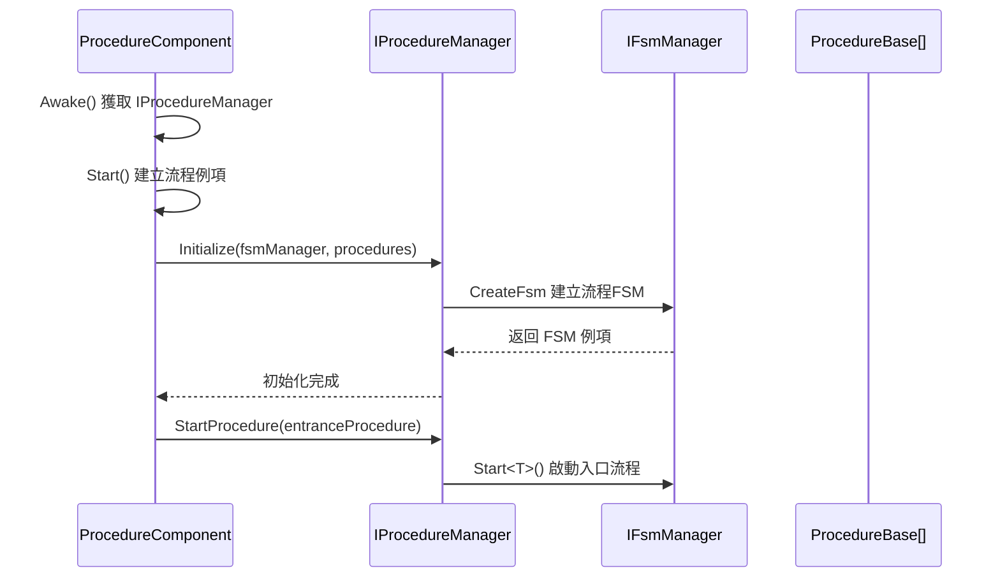
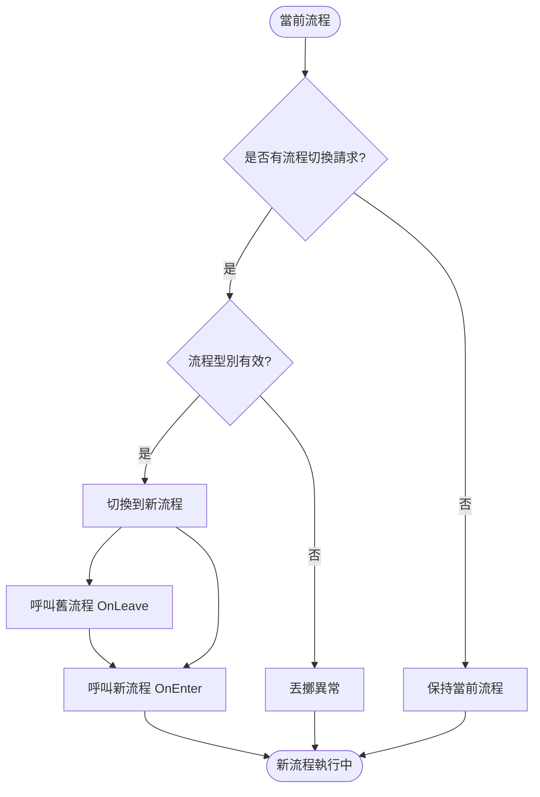

# IProcedureManager

流程管理器介面，定義了流程管理的基本操作，用於管理遊戲中的各種流程狀態轉換。

## 概述

IProcedureManager 是 GameFrameX 流程系統的核心介面，負責管理遊戲中的各種流程（如登入流程、主選單流程、遊戲流程等）。它基於有限狀態機（FSM）模式實現，提供了流程的初始化、切換、查詢等功能。

**設計意圖：**
- 提供統一的流程管理介面，遮蔽底層實現細節
- 基於 FSM 模式實現，確保流程狀態轉換的可靠性和可追蹤性
- 支援泛型和非泛型兩種 API，滿足不同的使用場景

## 架構

```mermaid
flowchart TD
    subgraph External["外部呼叫者"]
        User[使用者程式碼]
    end

    subgraph Component["Unity組件層"]
        PC[ProcedureComponent]
    end

    subgraph Interface["介面層"]
        IPM[IProcedureManager]
    end

    subgraph Implementation["實現層"]
        PM[ProcedureManager]
    end

    subgraph FSM["FSM子系統"]
        FSM[IFsmManager]
        FSMState[IFsm&lt;IProcedureManager&gt;]
    end

    subgraph Procedure["流程層"]
        PB1[ProcedureBase - 登入流程]
        PB2[ProcedureBase - 主選單流程]
        PB3[ProcedureBase - 遊戲流程]
    end

    User --> PC
    PC --> IPM
    IPM <|.. PM
    PM --> FSM
    FSM --> FSMState
    FSMState --> PB1
    FSMState --> PB2
    FSMState --> PB3
```

**架構說明：**

| 組件 | 職責 |
|------|------|
| **ProcedureComponent** | Unity 組件，作為入口點獲取 IProcedureManager 例項 |
| **IProcedureManager** | 定義流程管理的公共介面 |
| **ProcedureManager** | 介面的具體實現，內部使用 FSM 管理流程狀態 |
| **IFsmManager** | 有限狀態機管理器，由外部注入 |
| **ProcedureBase** | 所有具體流程的基類，表示一個流程狀態 |

## 核心流程

### 初始化流程



### 流程切換流程



## API 參考

### 屬性

#### `CurrentProcedure: ProcedureBase`

獲取當前正在執行的流程例項。

**返回：** 當前流程物件，如果未初始化則丟擲異常

---

#### `CurrentProcedureTime: float`

獲取當前流程已持續的時間（秒）。

**返回：** 流程持續時間，如果未初始化則丟擲異常

---

### 方法

### `Initialize(fsmManager: IFsmManager, procedures: ProcedureBase[]): void`

初始化流程管理器。

**引數：**
- `fsmManager` (IFsmManager): 有限狀態機管理器，不能為空
- `procedures` (params ProcedureBase[]): 要管理的流程陣列

**說明：** 
- 必須在呼叫其他方法之前呼叫此方法
- 該方法會建立一個內部 FSM 來管理所有流程狀態

> Source: [IProcedureManager.cs](https://github.com/GameFrameX/com.gameframex.unity.procedure/blob/main/Runtime/Procedure/IProcedureManager.cs#L28-L33)

---

### `StartProcedure<T>(): void` (泛型版本)

開始指定型別的流程。

**型別引數：**
- `T`: 要開始的流程型別，必須繼承自 ProcedureBase

**說明：**
- 泛型版本提供編譯時型別檢查
- 如果流程管理器未初始化，丟擲 GameFrameworkException

> Source: [IProcedureManager.cs](https://github.com/GameFrameX/com.gameframex.unity.procedure/blob/main/Runtime/Procedure/IProcedureManager.cs#L35-L39)

---

### `StartProcedure(procedureType: Type): void` (非泛型版本)

開始指定型別的流程。

**引數：**
- `procedureType` (Type): 要開始的流程型別

**說明：**
- 非泛型版本支援執行時動態指定流程型別
- 如果流程管理器未初始化，丟擲 GameFrameworkException

> Source: [IProcedureManager.cs](https://github.com/GameFrameX/com.gameframex.unity.procedure/blob/main/Runtime/Procedure/IProcedureManager.cs#L41-L45)

---

### `HasProcedure<T>(): bool` (泛型版本)

檢查是否存在指定型別的流程。

**型別引數：**
- `T`: 要檢查的流程型別

**返回：** 是否存在該流程

> Source: [IProcedureManager.cs](https://github.com/GameFrameX/com.gameframex.unity.procedure/blob/main/Runtime/Procedure/IProcedureManager.cs#L47-L52)

---

### `HasProcedure(procedureType: Type): bool` (非泛型版本)

檢查是否存在指定型別的流程。

**引數：**
- `procedureType` (Type): 要檢查的流程型別

**返回：** 是否存在該流程

> Source: [IProcedureManager.cs](https://github.com/GameFrameX/com.gameframex.unity.procedure/blob/main/Runtime/Procedure/IProcedureManager.cs#L54-L59)

---

### `GetProcedure<T>(): ProcedureBase` (泛型版本)

獲取指定型別的流程例項。

**型別引數：**
- `T`: 要獲取的流程型別

**返回：** 流程例項，如果不存在則丟擲異常

> Source: [IProcedureManager.cs](https://github.com/GameFrameX/com.gameframex.unity.procedure/blob/main/Runtime/Procedure/IProcedureManager.cs#L61-L66)

---

### `GetProcedure(procedureType: Type): ProcedureBase` (非泛型版本)

獲取指定型別的流程例項。

**引數：**
- `procedureType` (Type): 要獲取的流程型別

**返回：** 流程例項，如果不存在則丟擲異常

> Source: [IProcedureManager.cs](https://github.com/GameFrameX/com.gameframex.unity.procedure/blob/main/Runtime/Procedure/IProcedureManager.cs#L68-L73)

---

## 使用示例

### 基本使用

透過 ProcedureComponent 獲取 IProcedureManager 並切換流程：

```csharp
// 獲取流程組件
var procedureComponent = UnityEngine.Object.FindObjectOfType<ProcedureComponent>();

// 獲取當前流程
var currentProcedure = procedureComponent.CurrentProcedure;

// 獲取流程管理器
var procedureManager = procedureComponent.Procedure;

// 檢查是否存在某個流程
if (procedureManager.HasProcedure<MenuProcedure>())
{
    // 切換到選單流程
    procedureManager.StartProcedure<MenuProcedure>();
}
```

> Source: [ProcedureComponent.cs](https://github.com/GameFrameX/com.gameframex.unity.procedure/blob/main/Runtime/Procedure/ProcedureComponent.cs#L42-L52)

### 初始化流程

IProcedureManager 的初始化由 ProcedureComponent 自動完成：

```csharp
// ProcedureComponent.Start() 方法中
IEnumerator Start()
{
    // ... 建立流程例項 ...
    
    // 初始化流程管理器
    m_ProcedureManager.Initialize(
        GameFrameworkEntry.GetModule<IFsmManager>(), 
        procedures
    );
    
    yield return new WaitForEndOfFrame();
    
    // 啟動入口流程
    m_ProcedureManager.StartProcedure(m_EntranceProcedure.GetType());
}
```

> Source: [ProcedureComponent.cs](https://github.com/GameFrameX/com.gameframex.unity.procedure/blob/main/Runtime/Procedure/ProcedureComponent.cs#L102-L106)

## 注意事項

1. **初始化順序**：必須在 IFsmManager 初始化之後才能呼叫 Initialize 方法
2. **入口流程**：需要指定一個入口流程（Entrance Procedure），遊戲啟動時自動開始執行
3. **異常處理**：大部分方法在未初始化時會丟擲 GameFrameworkException
4. **執行緒安全**：流程管理器不是執行緒安全的，應在主執行緒中操作
5. **FSM 依賴**：IProcedureManager 內部依賴 IFsmManager，需要確保 FsmModule 已註冊

## 相關連結

- [ProcedureComponent](./3-core-concepts.procedure-component) - 流程組件
- [ProcedureBase](./3-core-concepts.procedure-base) - 流程基類
- [ProcedureManager](./3-core-concepts.procedure-manager) - 流程管理器實現
- [自定義流程](./4-custom-procedures) - 如何建立自定義流程
