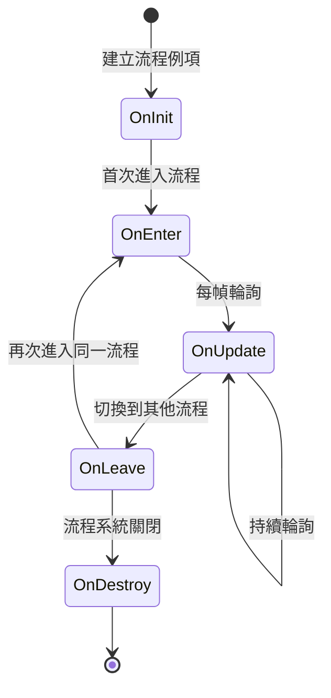

# ProcedureBase

流程基類，用於定義遊戲中的各個流程狀態。

## 概述

`ProcedureBase` 是 GameFrameX 流程管理系統的核心抽象類，繼承自 `FsmState<IProcedureManager>`。它提供了遊戲流程生命週期的完整模板方法，開發者可以透過繼承該類來建立自定義的遊戲流程，如啟動流程、主選單流程、遊戲流程、暫停流程、結算流程等。

**設計意圖：**
GameFrameX 的流程管理系統採用有限狀態機（FSM）模式設計。`ProcedureBase` 作為狀態基類，為每個流程狀態定義了一套標準的生命週期鉤子方法。這種設計使得遊戲流程的管理變得清晰、可控，便於在不同流程之間平滑切換，同時支援流程間的資料傳遞和狀態保持。

**核心特性：**
- 完整的流程生命週期管理（初始化 → 進入 → 更新 → 離開 → 銷燬）
- 支援幀更新（Update）和固定幀更新（FixedUpdate）
- 基於有限狀態機的流程切換機制
- 與 ProcedureManager 無縫整合

## 架構

```mermaid
graph TD
    subgraph GameFrameX 核心模組
        FsmState[FsmState&lt;IProcedureManager&gt;]
    end

    subgraph Procedure 流程模組
        ProcedureBase["ProcedureBase<br/>(抽象基類)"]
        IProcedureManager[IProcedureManager<br/>(介面)]
        ProcedureManager["ProcedureManager<br/>(流程管理器)"]
    end

    subgraph Unity 整合層
        ProcedureComponent["ProcedureComponent<br/>(流程組件)"]
    end

    subgraph 自定義流程
        CustomProcedure1["自定義流程 A<br/>(繼承 ProcedureBase)"]
        CustomProcedure2["自定義流程 B<br/>(繼承 ProcedureBase)"]
        CustomProcedureN["自定義流程 N<br/>(繼承 ProcedureBase)"]
    end

    FsmState <|-- ProcedureBase
    ProcedureBase <|-- CustomProcedure1
    ProcedureBase <|-- CustomProcedure2
    ProcedureBase <|-- CustomProcedureN
    
    IProcedureManager <|.. ProcedureManager
    ProcedureManager --> ProcedureBase
    ProcedureComponent --> ProcedureManager
```

**架構說明：**

| 組件 | 角色 | 職責 |
|------|------|------|
| `FsmState<IProcedureManager>` | 基類 | 提供有限狀態機的基礎功能 |
| `ProcedureBase` | 抽象基類 | 定義流程的標準生命週期模板 |
| `IProcedureManager` | 介面 | 定義流程管理器的標準操作 |
| `ProcedureManager` | 實現類 | 管理和排程所有流程狀態 |
| `ProcedureComponent` | Unity組件 | 在 Unity 環境中初始化流程系統 |
| 自定義流程 | 具體實現 | 繼承 ProcedureBase 實現具體業務邏輯 |

## 生命週期



**生命週期階段說明：**

| 階段 | 方法 | 呼叫時機 | 典型用途 |
|------|------|----------|----------|
| 初始化 | `OnInit` | 流程例項建立後首次進入前 | 初始化流程資料、載入配置 |
| 進入 | `OnEnter` | 進入流程狀態時 | 準備流程資源、顯示介面 |
| 更新 | `OnUpdate` | 每幀呼叫（邏輯幀） | 業務邏輯處理、狀態檢查 |
| 固定更新 | `OnFixedUpdate` | 固定時間間隔呼叫 | 物理相關邏輯 |
| 離開 | `OnLeave` | 離開流程狀態時 | 釋放臨時資源、儲存狀態 |
| 銷燬 | `OnDestroy` | 流程系統關閉時 | 清理所有資源 |

## 核心方法

### OnInit - 流程初始化

```csharp
protected override void OnInit(IFsm<IProcedureManager> procedureOwner)
```
> Source: [ProcedureBase.cs](https://github.com/GameFrameX/com.gameframex.unity.procedure/blob/main/Runtime/Procedure/ProcedureBase.cs#L22-L25)

在流程狀態首次初始化時呼叫。此方法在流程例項建立後、首次進入流程前被呼叫。

**設計意圖：**
提供一次性的初始化機會，用於載入流程所需的靜態資料、配置資訊或預建立遊戲物件。此方法在整個流程生命週期中只會被呼叫一次。

**引數：**
- `procedureOwner` (IFsm<IProcedureManager>)：流程持有者的有限狀態機

---

### OnEnter - 進入流程

```csharp
protected override void OnEnter(IFsm<IProcedureManager> procedureOwner)
```
> Source: [ProcedureBase.cs](https://github.com/GameFrameX/com.gameframex.unity.procedure/blob/main/Runtime/Procedure/ProcedureBase.cs#L31-L34)

當流程狀態從其他狀態切換到當前狀態時呼叫。

**設計意圖：**
每次進入流程時都會呼叫，適合用於準備流程所需的資源、顯示對應的 UI 介面、開始特定的聲音或動畫等。每次流程被啟用時都會觸發。

**引數：**
- `procedureOwner` (IFsm<IProcedureManager>)：流程持有者的有限狀態機

---

### OnUpdate - 流程更新

```csharp
protected override void OnUpdate(IFsm<IProcedureManager> procedureOwner, float elapseSeconds, float realElapseSeconds)
```
> Source: [ProcedureBase.cs](https://github.com/GameFrameX/com.gameframex.unity.procedure/blob/main/Runtime/Procedure/ProcedureBase.cs#L42-L45)

在流程狀態處於活動狀態時每幀呼叫。

**設計意圖：**
這是實現流程核心業務邏輯的主要鉤子。可以在這裡檢測流程切換條件、更新遊戲狀態、處理使用者輸入等。

**引數：**
- `procedureOwner` (IFsm<IProcedureManager>)：流程持有者的有限狀態機
- `elapseSeconds` (float)：邏輯流逝時間，以秒為單位（受時間縮放影響）
- `realElapseSeconds` (float)：真實流逝時間，以秒為單位（不受時間縮放影響）

---

### OnFixedUpdate - 固定頻率更新

```csharp
protected override void OnFixedUpdate(IFsm<IProcedureManager> procedureOwner, float elapseSeconds, float realElapseSeconds)
```
> Source: [ProcedureBase.cs](https://github.com/GameFrameX/com.gameframex.unity.procedure/blob/main/Runtime/Procedure/ProcedureBase.cs#L53-L56)

以固定時間間隔呼叫，用於物理相關的邏輯處理。

**設計意圖：**
Unity 的 FixedUpdate 以固定時間間隔（預設 0.02 秒）呼叫，適合處理物理引擎相關邏輯，確保邏輯的確定性。

**引數：**
- `procedureOwner` (IFsm<IProcedureManager>)：流程持有者的有限狀態機
- `elapseSeconds` (float)：邏輯流逝時間，以秒為單位
- `realElapseSeconds` (float)：真實流逝時間，以秒為單位

---

### OnLeave - 離開流程

```csharp
protected override void OnLeave(IFsm<IProcedureManager> procedureOwner, bool isShutdown)
```
> Source: [ProcedureBase.cs](https://github.com/GameFrameX/com.gameframex.unity.procedure/blob/main/Runtime/Procedure/ProcedureBase.cs#L63-L66)

當流程狀態從當前狀態切換到其他狀態時呼叫。

**設計意圖：**
用於清理當前流程的臨時資源、儲存狀態資料、隱藏 UI 介面等。注意：如果 `isShutdown` 為 true，表示是關閉整個流程系統而非切換流程。

**引數：**
- `procedureOwner` (IFsm<IProcedureManager>)：流程持有者的有限狀態機
- `isShutdown` (bool)：是否是關閉狀態機時觸發

---

### OnDestroy - 流程銷燬

```csharp
protected override void OnDestroy(IFsm<IProcedureManager> procedureOwner)
```
> Source: [ProcedureBase.cs](https://github.com/GameFrameX/com.gameframex.unity.procedure/blob/main/Runtime/Procedure/ProcedureBase.cs#L72-L75)

當流程狀態被銷燬時呼叫。

**設計意圖：**
在整個流程系統關閉時呼叫，用於執行最終的清理工作，釋放所有資源。這是流程生命週期的最後一個階段。

**引數：**
- `procedureOwner` (IFsm<IProcedureManager>)：流程持有者的有限狀態機

## 使用示例

### 基本自定義流程

建立一個簡單的啟動流程：

```csharp
using GameFrameX.Procedure.Runtime;
using GameFrameX.Fsm.Runtime;

public class ProcedureLaunch : ProcedureBase
{
    protected override void OnInit(IFsm<IProcedureManager> procedureOwner)
    {
        base.OnInit(procedureOwner);
        // 初始化啟動資料
    }

    protected override void OnEnter(IFsm<IProcedureManager> procedureOwner)
    {
        base.OnEnter(procedureOwner);
        // 顯示啟動介面
    }

    protected override void OnUpdate(IFsm<IProcedureManager> procedureOwner, float elapseSeconds, float realElapseSeconds)
    {
        base.OnUpdate(procedureOwner, elapseSeconds, realElapseSeconds);
        
        // 檢查是否完成啟動，可以切換到下一個流程
        // procedureOwner.Owner.StartProcedure<ProcedureMenu>();
    }

    protected override void OnLeave(IFsm<IProcedureManager> procedureOwner, bool isShutdown)
    {
        base.OnLeave(procedureOwner, isShutdown);
        // 隱藏啟動介面
    }
}
```

### 流程切換示例

在流程中切換到另一個流程：

```csharp
protected override void OnUpdate(IFsm<IProcedureManager> procedureOwner, float elapseSeconds, float realElapseSeconds)
{
    base.OnUpdate(procedureOwner, elapseSeconds, realElapseSeconds);
    
    // 假設滿足某個條件後切換到選單流程
    if (someCondition)
    {
        // 獲取流程管理器並啟動下一個流程
        procedureOwner.Owner.StartProcedure<ProcedureMenu>();
    }
}
```

### 獲取當前流程資訊

```csharp
// 在任意位置獲取當前流程和持續時間
var procedureComponent = UnityEngine.Object.FindObjectOfType<ProcedureComponent>();
var currentProcedure = procedureComponent.CurrentProcedure;
var elapsedTime = procedureComponent.CurrentProcedureTime;
```

## 與其他組件的關係

| 組件 | 關係 | 說明 |
|------|------|------|
| ProcedureComponent | 使用 | Unity 組件，用於初始化流程系統 |
| ProcedureManager | 管理 | 實際管理 ProcedureBase 狀態轉換的類 |
| IProcedureManager | 實現 | ProcedureManager 實現的介面 |
| FsmState | 繼承 | 來自 GameFrameX.Fsm 的基類 |

## 常見問題

### Q: 為什麼不直接在 Update 中處理邏輯？

**A:** `ProcedureBase` 提供了結構化的生命週期方法，這種設計：
- 使程式碼更清晰，每個階段職責明確
- 便於除錯和維護
- 支援狀態的正確進入/退出處理
- 與其他系統（如 UI 系統、資源系統）更好地整合

### Q: 如何在流程間傳遞資料？

**A:** 可以透過以下方式：
1. 使用靜態變數（不推薦，可能導致記憶體洩漏）
2. 將資料儲存在獨立的配置類中，透過 `procedureOwner.Owner` 獲取 ProcedureManager 訪問
3. 使用遊戲框架的資料庫或配置系統

### Q: OnInit 和 OnEnter 有什麼區別？

**A:** 
- `OnInit`：只在流程例項建立後呼叫一次，整個生命週期中不會再呼叫
- `OnEnter`：每次進入該流程狀態時都會呼叫，可能被呼叫多次

## 相關連結

- [ProcedureComponent](./3-core-concepts.procedure-component) - 流程組件
- [IProcedureManager](./3-core-concepts.iprocedure-manager) - 流程管理器介面
- [ProcedureManager](./3-core-concepts.procedure-manager) - 流程管理器實現
- [自定義流程](./4-custom-procedures) - 建立自定義流程
