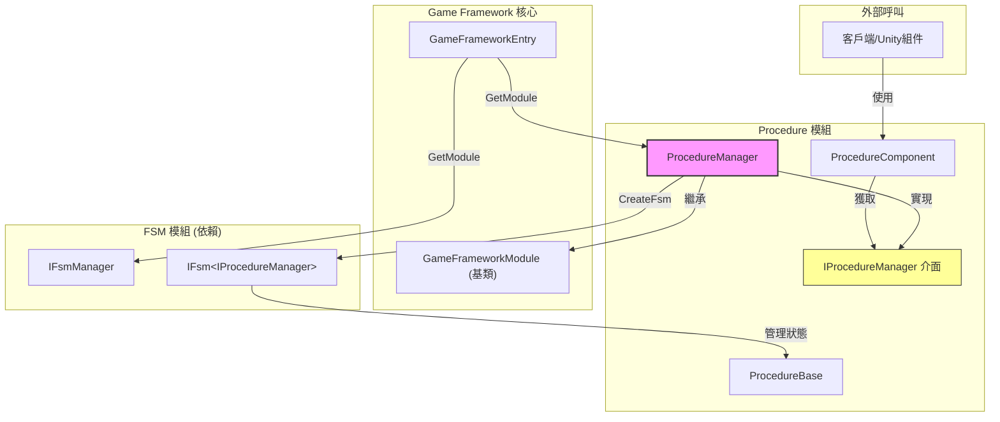

# ProcedureManager

ProcedureManager 是 GameFrameX 流程管理系統的核心實現類，負責管理遊戲中的各種流程狀態及其切換。

## 概述

ProcedureManager 實現了 `IProcedureManager` 介面，繼承自 `GameFrameworkModule` 基類，是流程管理模組的主要實現。它基於有限狀態機（FSM）來實現流程的建立、切換和管理功能。

**設計意圖：**
- 提供統一的流程管理機制，支援遊戲在不同階段（如啟動、選單、遊戲中、暫停、結算等）之間平滑切換
- 利用 FSM 的特性，確保流程切換的可靠性和可追蹤性
- 作為 GameFramework 的核心模組，支援熱更新和模組化擴充套件

## 架構



### 組件職責

| 組件 | 職責 |
|------|------|
| **ProcedureManager** | 核心實現類，管理流程的建立、切換、查詢 |
| **IProcedureManager** | 介面定義，抽象流程管理操作 |
| **ProcedureComponent** | Unity 組件，用於在場景中配置和初始化流程 |
| **ProcedureBase** | 流程基類，每個具體流程繼承此類 |
| **IFsmManager** | 有限狀態機管理器（外部依賴） |

## 核心功能

### 1. 初始化流程管理器

在使用流程管理器之前，需要先進行初始化。初始化時需要提供 FSM 管理器和所有可用的流程型別。

```csharp
public void Initialize(IFsmManager fsmManager, params ProcedureBase[] procedures)
```

> Source: [ProcedureManager.cs](https://github.com/GameFrameX/com.gameframex.unity.procedure/blob/main/Runtime/Procedure/ProcedureManager.cs#L104-L110)

**引數說明：**
- `fsmManager`: 有限狀態機管理器，負責建立和管理 FSM 例項
- `procedures`: 可用的流程例項陣列

### 2. 啟動流程

初始化完成後，需要指定一個入口流程來啟動流程管理器。

```csharp
// 泛型方式
public void StartProcedure<T>() where T : ProcedureBase

// Type方式
public void StartProcedure(Type procedureType)
```

> Source: [ProcedureManager.cs](https://github.com/GameFrameX/com.gameframex.unity.procedure/blob/main/Runtime/Procedure/ProcedureManager.cs#L116-L138)

### 3. 查詢流程狀態

提供多種方式查詢當前流程資訊和檢查特定流程是否存在。

```csharp
// 獲取當前流程
public ProcedureBase CurrentProcedure { get; }

// 獲取當前流程持續時間
public float CurrentProcedureTime { get; }

// 檢查是否存在指定流程（泛型）
public bool HasProcedure<T>() where T : ProcedureBase

// 檢查是否存在指定流程（Type）
public bool HasProcedure(Type procedureType)
```

> Source: [ProcedureManager.cs](https://github.com/GameFrameX/com.gameframex.unity.procedure/blob/main/Runtime/Procedure/ProcedureManager.cs#L44-L71), [L145-L168](https://github.com/GameFrameX/com.gameframex.unity.procedure/blob/main/Runtime/Procedure/ProcedureManager.cs#L145-L168)

### 4. 獲取流程例項

可以在執行時獲取任意已註冊的流程例項進行操作。

```csharp
// 泛型方式獲取
public ProcedureBase GetProcedure<T>() where T : ProcedureBase

// Type方式獲取
public ProcedureBase GetProcedure(Type procedureType)
```

> Source: [ProcedureManager.cs](https://github.com/GameFrameX/com.gameframex.unity.procedure/blob/main/Runtime/Procedure/ProcedureManager.cs#L175-L198)

## 流程切換流程

```mermaid
sequenceDiagram
    participant Unity as Unity引擎
    participant PC as ProcedureComponent
    participant PM as ProcedureManager
    participant FSM as IFsmManager
    participant PB as ProcedureBase

    Unity->>PC: Awake()
    PC->>PM: GameFrameworkEntry.GetModule&lt;IProcedureManager&gt;()
    PC->>PC: Start() 協程
    PC->>PM: Initialize(fsmManager, procedures)
    PM->>FSM: CreateFsm(this, procedures)
    FSM-->>PM: IFsm&lt;IProcedureManager&gt;
    PM-->>PC: 初始化完成
    PC->>PM: StartProcedure&lt;T&gt;()
    PM->>FSM: Start&lt;T&gt;()
    FSM->>PB: OnEnter() - 進入流程
    Note over FSM,PB: 流程執行中...
    PB->>FSM: 觸發流程切換
    FSM->>PB: OnLeave() - 離開舊流程
    FSM->>PB: OnEnter() - 進入新流程
```

## 使用示例

### 基本使用流程

1. **建立自定義流程類**

```csharp
using GameFrameX.Procedure.Runtime;

public class LoginProcedure : ProcedureBase
{
    protected override void OnEnter(IFsm<IProcedureManager> procedureOwner)
    {
        base.OnEnter(procedureOwner);
        // 初始化登入流程
    }

    protected override void OnUpdate(IFsm<IProcedureManager> procedureOwner, float elapseSeconds, float realElapseSeconds)
    {
        base.OnUpdate(procedureOwner, elapseSeconds, realElapseSeconds);
        // 檢查是否滿足切換條件
        // 如果滿足，切換到下一個流程
    }
}

public class GameProcedure : ProcedureBase
{
    protected override void OnEnter(IFsm<IProcedureManager> procedureOwner)
    {
        base.OnEnter(procedureOwner);
        // 開始遊戲
    }
}
```

2. **配置 ProcedureComponent**

在 Unity 場景中新增 `ProcedureComponent` 組件，並配置：
- `Available Procedure Type Names`: 新增所有流程的型別名稱
- `Entrance Procedure Type Name`: 設定入口流程型別名稱

3. **在程式碼中切換流程**

```csharp
// 假設在某個 Procedure 中切換到下一個流程
public class LoginProcedure : ProcedureBase
{
    protected override void OnUpdate(IFsm<IProcedureManager> procedureOwner, float elapseSeconds, float realElapseSeconds)
    {
        base.OnUpdate(procedureOwner, elapseSeconds, realElapseSeconds);
        
        // 登入完成後，切換到遊戲流程
        if (IsLoginSuccess)
        {
            procedureOwner.ChangeState<GameProcedure>();
        }
    }
}
```

> Source: [ProcedureBase.cs](https://github.com/GameFrameX/com.gameframex.unity.procedure/blob/main/Runtime/Procedure/ProcedureBase.cs#L1-L77)

### 直接使用 ProcedureManager

如果需要直接使用 ProcedureManager 而非透過 ProcedureComponent：

```csharp
// 獲取流程管理器
IProcedureManager procedureManager = GameFrameworkEntry.GetModule<IProcedureManager>();

// 獲取 FSM 管理器
IFsmManager fsmManager = GameFrameworkEntry.GetModule<IFsmManager>();

// 初始化
procedureManager.Initialize(fsmManager, new LoginProcedure(), new GameProcedure());

// 啟動入口流程
procedureManager.StartProcedure<LoginProcedure>();

// 在遊戲迴圈中查詢
ProcedureBase current = procedureManager.CurrentProcedure;
float time = procedureManager.CurrentProcedureTime;
```

## API 參考

### 屬性

| 屬性 | 型別 | 描述 |
|------|------|------|
| **CurrentProcedure** | `ProcedureBase` | 獲取當前正在執行的流程例項 |
| **CurrentProcedureTime** | `float` | 獲取當前流程已持續的時間（秒） |

### 方法

#### `Initialize(IFsmManager fsmManager, params ProcedureBase[] procedures)`

初始化流程管理器。

**引數：**
- `fsmManager` (IFsmManager): 有限狀態機管理器
- `procedures` (params ProcedureBase[]): 可用的流程例項陣列

**異常：**
- `GameFrameworkException`: 當 fsmManager 為 null 時丟擲

---

#### `StartProcedure<T>() where T : ProcedureBase`

開始指定的流程（泛型方式）。

**引數：**
- 無

**異常：**
- `GameFrameworkException`: 當流程管理器未初始化時丟擲

---

#### `StartProcedure(Type procedureType)`

開始指定的流程（Type 方式）。

**引數：**
- `procedureType` (Type): 要開始的流程型別

**異常：**
- `GameFrameworkException`: 當流程管理器未初始化時丟擲

---

#### `HasProcedure<T>() where T : ProcedureBase`

檢查是否存在指定的流程。

**返回：** 
- `bool`: 如果存在返回 true，否則返回 false

**異常：**
- `GameFrameworkException`: 當流程管理器未初始化時丟擲

---

#### `GetProcedure<T>() where T : ProcedureBase`

獲取指定型別的流程例項。

**返回：** 
- `ProcedureBase`: 流程例項

**異常：**
- `GameFrameworkException`: 當流程管理器未初始化時丟擲

---

### 生命週期方法

ProcedureManager 繼承自 `GameFrameworkModule`，主要生命週期方法：

| 方法 | 描述 |
|------|------|
| `Update(elapseSeconds, realElapseSeconds)` | 輪詢方法，當前實現為空（由 FSM 自行處理） |
| `Shutdown()` | 關閉並清理流程管理器，銷燬 FSM |

> Source: [ProcedureManager.cs](https://github.com/GameFrameX/com.gameframex.unity.procedure/blob/main/Runtime/Procedure/ProcedureManager.cs#L78-L97)

## 依賴關係

ProcedureManager 依賴以下組件：

| 依賴項 | 描述 | 來源 |
|--------|------|------|
| **IFsmManager** | 有限狀態機管理器 | GameFrameX.Fsm.Runtime |
| **IFsm\<IProcedureManager\>** | 流程狀態機例項 | GameFrameX.Fsm.Runtime |
| **GameFrameworkModule** | GameFramework 模組基類 | GameFrameX.Runtime |
| **ProcedureBase** | 流程基類 | 本模組 |

## 相關連結

- [IProcedureManager](./3-core-concepts.iprocedure-manager) - 流程管理器介面定義
- [ProcedureBase](./3-core-concepts.procedure-base) - 流程基類
- [ProcedureComponent](./3-core-concepts.procedure-component) - Unity 流程組件
- [FSM 模組](https://github.com/GameFrameX/com.alianblank.gameframex.unity.fsm) - 有限狀態機模組
- [自定義流程](./4-custom-procedures) - 如何建立自定義流程
