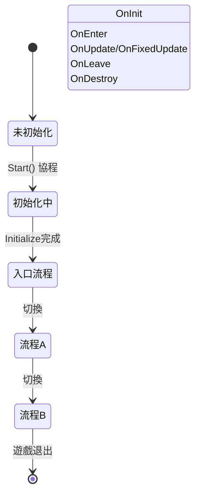

# ProcedureComponent

 ProcedureComponent 是 GameFrameX 流程系統的核心 Unity 組件，負責管理和協調遊戲中的各種流程狀態。

## 概述

ProcedureComponent 是一個 Unity MonoBehaviour 組件，作為遊戲流程管理的入口點。它封裝了 IProcedureManager 介面，提供了面向 Unity 的組件化介面，方便在 Unity 編輯器中進行配置和管理。

該組件的主要職責包括：
- 在遊戲啟動時初始化流程管理器
- 透過反射建立所有可用的流程例項
- 自動啟動入口流程
- 提供流程查詢和獲取的公共介面

### 核心概念

| 概念 | 說明 |
|------|------|
| **流程 (Procedure)** | 遊戲中的不同階段或狀態，如啟動流程、選單流程、遊戲流程等 |
| **入口流程 (Entrance Procedure)** | 遊戲啟動時首先執行的流程 |
| **流程管理器 (ProcedureManager)** | 負責管理所有流程的建立、切換和銷燬 |

## 架構

```mermaid
flowchart TD
    subgraph Unity["Unity 層面"]
        PC[ProcedureComponent]
        Inspector[ProcedureComponentInspector]
    end

    subgraph GameFramework["Game Framework 核心"]
        GFC[GameFrameworkComponent]
        GFE[GameFrameworkEntry]
    end

    subgraph Procedure["流程系統"]
        IPM[IProcedureManager]
        PM[ProcedureManager]
        PB[ProcedureBase]
    end

    subgraph FSM["狀態機系統"]
        FSMComp[FSMComponent]
        FSM[IFsmManager]
    end

    PC -->|繼承| GFC
    PC -->|獲取模組| GFE
    GFE -->|返回| IPM
    IPM -->|實現| PM
    PM -->|使用| FSM
    FSM -->|依賴| FSMComp
    PB -->|狀態| PM
    Inspector -->|編輯| PC
```

### 組件關係說明

- **ProcedureComponent**: 繼承自 GameFrameworkComponent，是 Unity 層面的入口組件
- **IProcedureManager**: 定義流程管理介面，封裝了所有流程操作
- **ProcedureManager**: IProcedureManager 的具體實現，內部使用 FSM 管理流程
- **ProcedureBase**: 所有自定義流程的基類，繼承自 FsmState<IProcedureManager>
- **FSMComponent**: 提供底層有限狀態機功能，是流程系統的依賴

## 核心功能

### 初始化流程

ProcedureComponent 在組件Awake和Start階段完成初始化：

```csharp
protected override void Awake()
{
    ImplementationComponentType = Utility.Assembly.GetType(componentType);
    InterfaceComponentType = typeof(IProcedureManager);
    base.Awake();
    m_ProcedureManager = GameFrameworkEntry.GetModule<IProcedureManager>();
    // ...
}
```

> Source: [ProcedureComponent.cs](https://github.com/GameFrameX/com.gameframex.unity.procedure/blob/main/Runtime/Procedure/ProcedureComponent.cs#L58-L69)

```csharp
private IEnumerator Start()
{
    ProcedureBase[] procedures = new ProcedureBase[m_AvailableProcedureTypeNames.Length];
    for (int i = 0; i < m_AvailableProcedureTypeNames.Length; i++)
    {
        Type procedureType = Utility.Assembly.GetType(m_AvailableProcedureTypeNames[i]);
        // ... 錯誤檢查 ...
        procedures[i] = (ProcedureBase)Activator.CreateInstance(procedureType);
        // ... 記錄入口流程 ...
    }
    
    m_ProcedureManager.Initialize(GameFrameworkEntry.GetModule<IFsmManager>(), procedures);
    yield return new WaitForEndOfFrame();
    m_ProcedureManager.StartProcedure(m_EntranceProcedure.GetType());
}
```

> Source: [ProcedureComponent.cs](https://github.com/GameFrameX/com.gameframex.unity.procedure/blob/main/Runtime/Procedure/ProcedureComponent.cs#L71-L107)

**設計意圖**: 使用 Start() 協程確保在所有組件Awake完成後，再進行流程的初始化和啟動。WaitForEndOfFrame 確保Unity完全初始化後再啟動流程。

### 流程查詢

ProcedureComponent 提供了多種查詢當前流程狀態的介面：

```csharp
/// <summary>
/// 獲取當前流程管理器。
/// </summary>
public IProcedureManager Procedure
{
    get { return m_ProcedureManager; }
}

/// <summary>
/// 獲取當前正在執行的流程。
/// </summary>
public ProcedureBase CurrentProcedure
{
    get { return m_ProcedureManager.CurrentProcedure; }
}

/// <summary>
/// 獲取當前流程已持續的時間。
/// </summary>
public float CurrentProcedureTime
{
    get { return m_ProcedureManager.CurrentProcedureTime; }
}
```

> Source: [ProcedureComponent.cs](https://github.com/GameFrameX/com.gameframex.unity.procedure/blob/main/Runtime/Procedure/ProcedureComponent.cs#L31-L53)

### 流程存在性檢查

```csharp
/// <summary>
/// 檢查是否存在指定型別的流程。
/// </summary>
public bool HasProcedure<T>() where T : ProcedureBase
{
    return m_ProcedureManager.HasProcedure<T>();
}

public bool HasProcedure(Type procedureType)
{
    return m_ProcedureManager.HasProcedure(procedureType);
}
```

> Source: [ProcedureComponent.cs](https://github.com/GameFrameX/com.gameframex.unity.procedure/blob/main/Runtime/Procedure/ProcedureComponent.cs#L109-L127)

### 獲取流程例項

```csharp
/// <summary>
/// 獲取指定型別的流程例項。
/// </summary>
public ProcedureBase GetProcedure<T>() where T : ProcedureBase
{
    return m_ProcedureManager.GetProcedure<T>();
}

public ProcedureBase GetProcedure(Type procedureType)
{
    return m_ProcedureManager.GetProcedure(procedureType);
}
```

> Source: [ProcedureComponent.cs](https://github.com/GameFrameX/com.gameframex.unity.procedure/blob/main/Runtime/Procedure/ProcedureComponent.cs#L129-L147)

## 流程生命週期



### 流程回呼方法

ProcedureBase 提供了完整的生命週期回呼：

| 回呼方法 | 呼叫時機 | 用途 |
|----------|----------|------|
| OnInit | 流程狀態初始化時 | 初始化流程資料 |
| OnEnter | 進入流程時 | 準備流程資源 |
| OnUpdate | 每幀更新時 | 流程邏輯更新 |
| OnFixedUpdate | 物理更新時 | 物理相關邏輯 |
| OnLeave | 離開流程時 | 清理流程資源 |
| OnDestroy | 流程銷燬時 | 釋放所有資源 |

> Source: [ProcedureBase.cs](https://github.com/GameFrameX/com.gameframex.unity.procedure/blob/main/Runtime/Procedure/ProcedureBase.cs#L16-L76)

## 使用示例

### 在 Unity 編輯器中配置

1. 在場景中建立一個空的 GameObject
2. 新增 `Procedure` 組件（選單：`Game Framework` → `Procedure`）
3. 在 Inspector 面板中配置：
   - **Available Procedures**: 選擇需要管理的流程型別
   - **Entrance Procedure**: 選擇遊戲啟動時的入口流程

### 程式碼中獲取當前流程

```csharp
// 獲取 ProcedureComponent 例項
var procedureComponent = UnityEngine.Object.FindObjectOfType<ProcedureComponent>();

// 獲取當前流程
var currentProcedure = procedureComponent.CurrentProcedure;

// 獲取當前流程持續時間
float elapsedTime = procedureComponent.CurrentProcedureTime;

// 檢查是否存在指定流程
if (procedureComponent.HasProcedure<MenuProcedure>())
{
    // 獲取指定流程例項
    var menuProcedure = procedureComponent.GetProcedure<MenuProcedure>();
}
```

### 流程切換

流程的切換通常在 ProcedureBase 的 OnUpdate 方法中根據條件判斷：

```csharp
public class MenuProcedure : ProcedureBase
{
    protected override void OnUpdate(IFsm<IProcedureManager> procedureOwner, 
        float elapseSeconds, float realElapseSeconds)
    {
        base.OnUpdate(procedureOwner, elapseSeconds, realElapseSeconds);
        
        // 假設點選開始按鈕後切換到遊戲流程
        if (Input.GetMouseButtonUp(0))
        {
            // 獲取流程管理器並切換流程
            procedureOwner.GetComponent<ProcedureManager>()
                .StartProcedure<GameProcedure>();
        }
    }
}
```

> Source: [ProcedureManager.cs](https://github.com/GameFrameX/com.gameframex.unity.procedure/blob/main/Runtime/Procedure/ProcedureManager.cs#L112-L138)

## 配置說明

| 屬性 | 型別 | 說明 |
|------|------|------|
| m_AvailableProcedureTypeNames | string[] | 可用流程的型別名稱陣列 |
| m_EntranceProcedureTypeName | string | 入口流程的型別名稱 |

### 配置約束

- `[DisallowMultipleComponent]`: 每個 GameObject 只能新增一個 ProcedureComponent
- `[AddComponentMenu("Game Framework/Procedure")]`：在 Unity 選單中可快速新增

## 注意事項

1. **執行順序**: ProcedureComponent 依賴 FSMComponent，確保 FSMComponent 已正確配置
2. **入口流程**: 必須設定有效的入口流程，否則遊戲無法啟動
3. **流程型別**: 所有流程類必須繼承自 ProcedureBase
4. **編輯器配置**: 在 Play 模式下無法修改可用流程列表

## 相關連結

- [ProcedureBase](./3-core-concepts.procedure-base) - 流程基類
- [IProcedureManager](./3-core-concepts.iprocedure-manager) - 流程管理器介面
- [ProcedureManager](./3-core-concepts.procedure-manager) - 流程管理器實現
- [自定義流程](./4-custom-procedures) - 如何建立自定義流程
- [編輯器使用](./5-editor-usage) - 編輯器配置指南
