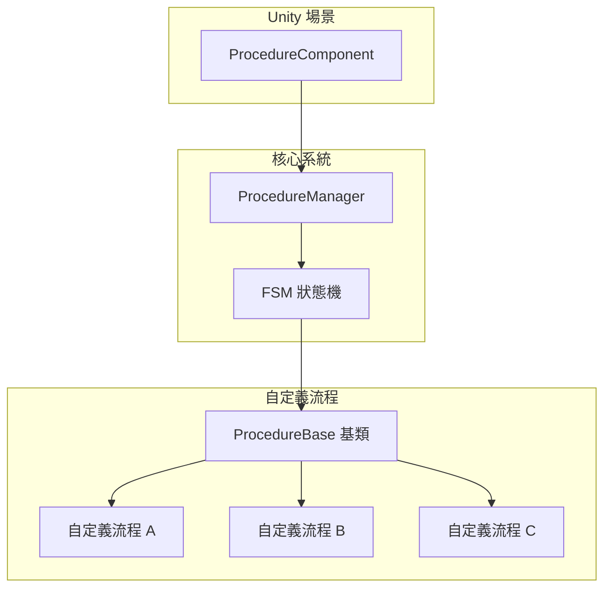
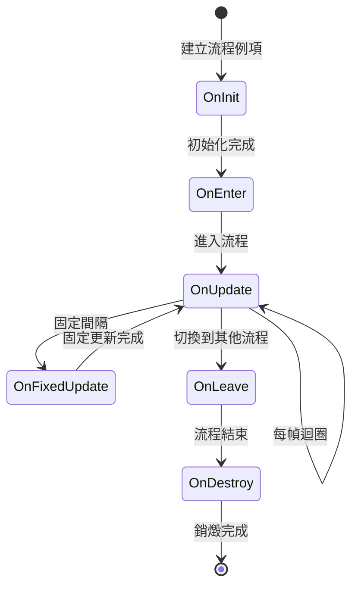

# 自定義流程

自定義流程是 GameFrameX 流程系統的核心擴充套件機制。透過繼承 `ProcedureBase` 基類並重寫相應的生命週期方法，開發者可以建立適用於遊戲各種階段的自定義流程，如啟動流程、選單流程、遊戲流程等。

## 概述

GameFrameX 的流程系統基於有限狀態機（FSM）設計，每個流程（Procedure）代表遊戲中的一個獨立狀態或階段。系統透過 `ProcedureComponent` 組件在 Unity 場景中管理所有流程，而具體的流程邏輯則透過自定義類實現。



### 設計意圖

採用 FSM 模式管理流程的優勢：
- **狀態明確**：每個流程代表遊戲的明確階段，便於管理和除錯
- **解耦邏輯**：各流程相互獨立，便於單獨開發和測試
- **平滑過渡**：支援流程間的平滑切換和過渡動畫
- **可擴充套件性**：新增流程只需建立新類，無需修改現有程式碼

## 建立自定義流程

### 基礎結構

建立自定義流程需要繼承 `ProcedureBase` 類並重寫需要的生命週期方法。

```csharp
using GameFrameX.Procedure.Runtime;
using GameFrameX.Fsm.Runtime;

namespace MyGame.Procedure
{
    /// <summary>
    /// 示例自定義流程。
    /// </summary>
    public class DemoProcedure : ProcedureBase
    {
        /// <summary>
        /// 流程初始化時呼叫。
        /// </summary>
        protected override void OnInit(IFsm<IProcedureManager> procedureOwner)
        {
            base.OnInit(procedureOwner);
            // 初始化程式碼，如載入配置、預載入資源等
        }

        /// <summary>
        /// 進入流程時呼叫。
        /// </summary>
        protected override void OnEnter(IFsm<IProcedureManager> procedureOwner)
        {
            base.OnEnter(procedureOwner);
            // 進入流程的邏輯，如顯示介面、播放音樂等
        }

        /// <summary>
        /// 流程更新時每幀呼叫。
        /// </summary>
        protected override void OnUpdate(IFsm<IProcedureManager> procedureOwner, float elapseSeconds, float realElapseSeconds)
        {
            base.OnUpdate(procedureOwner, elapseSeconds, realElapseSeconds);
            // 每幀執行的邏輯
            
            // 示例：滿足條件後切換到下一個流程
            // if (someCondition)
            // {
            //     ChangeState<NextProcedure>(procedureOwner);
            // }
        }

        /// <summary>
        /// 流程固定更新時呼叫。
        /// </summary>
        protected override void OnFixedUpdate(IFsm<IProcedureManager> procedureOwner, float elapseSeconds, float realElapseSeconds)
        {
            base.OnFixedUpdate(procedureOwner, elapseSeconds, realElapseSeconds);
            // 物理相關的固定更新邏輯
        }

        /// <summary>
        /// 離開流程時呼叫。
        /// </summary>
        protected override void OnLeave(IFsm<IProcedureManager> procedureOwner, bool isShutdown)
        {
            base.OnLeave(procedureOwner, isShutdown);
            // 離開流程的清理工作，如隱藏介面、停止音效等
        }

        /// <summary>
        /// 流程銷燬時呼叫。
        /// </summary>
        protected override void OnDestroy(IFsm<IProcedureManager> procedureOwner)
        {
            base.OnDestroy(procedureOwner);
            // 資源釋放、記憶體清理等
        }
    }
}
```
> Source: [ProcedureBase.cs](https://github.com/GameFrameX/com.gameframex.unity.procedure/blob/main/Runtime/Procedure/ProcedureBase.cs#L1-L77)

## 生命週期詳解

### 流程狀態流轉



### 各生命週期方法說明

| 方法 | 呼叫時機 | 典型用途 |
|------|----------|----------|
| `OnInit` | 流程狀態首次被建立時 | 預載入資料、初始化資料結構 |
| `OnEnter` | 進入該流程狀態時 | 顯示介面、播放音效、資源載入 |
| `OnUpdate` | 每幀更新時 | 業務邏輯檢查、超時檢測、條件判斷 |
| `OnFixedUpdate` | 固定時間間隔更新 | 物理計算、輸入處理 |
| `OnLeave` | 離開該流程狀態時 | 隱藏介面、儲存狀態、清理資源 |
| `OnDestroy` | 流程狀態被銷燬時 | 釋放引用、記憶體清理 |

### 流程引數說明

`OnUpdate` 和 `OnFixedUpdate` 方法提供兩個時間引數：

- **`elapseSeconds`**：邏輯流逝時間（受遊戲暫停、時間縮放影響）
- **`realElapseSeconds`**：真實流逝時間（不受遊戲暫停影響）

```csharp
protected override void OnUpdate(IFsm<IProcedureManager> procedureOwner, float elapseSeconds, float realElapseSeconds)
{
    base.OnUpdate(procedureOwner, elapseSeconds, realElapseSeconds);
    
    // 使用 elapseSeconds 計算受時間縮放影響的計時
    // 使用 realElapseSeconds 計算真實超時
}
```

## 流程間切換

### 切換到下一流程

在 `OnUpdate` 方法中根據業務條件切換流程：

```csharp
using GameFrameX.Fsm.Runtime;

protected override void OnUpdate(IFsm<IProcedureManager> procedureOwner, float elapseSeconds, float realElapseSeconds)
{
    base.OnUpdate(procedureOwner, elapseSeconds, realElapseSeconds);
    
    // 示例：超時自動切換
    if (procedureOwner.CurrentStateTime >= 3.0f)
    {
        // 切換到下一個流程
        ChangeState<MenuProcedure>(procedureOwner);
    }
}
```

### 獲取當前流程資訊

```csharp
protected override void OnUpdate(IFsm<IProcedureManager> procedureOwner, float elapseSeconds, float realElapseSeconds)
{
    base.OnUpdate(procedureOwner, elapseSeconds, realElapseSeconds);
    
    // 獲取當前流程
    ProcedureBase current = procedureOwner.CurrentState;
    
    // 獲取當前流程已執行時間
    float time = procedureOwner.CurrentStateTime;
    
    // 示例：執行5秒後切換
    if (time > 5.0f)
    {
        ChangeState<NextProcedure>(procedureOwner);
    }
}
```

## 註冊自定義流程

### 透過 Editor 註冊

1. 在 Unity 場景中建立或選擇帶有 `ProcedureComponent` 的 GameObject
2. 在 Inspector 面板中，可以看到 "Available Procedures" 列表
3. 勾選需要包含的自定義流程型別
4. 在 "Entrance Procedure" 下拉選單中選擇入口流程

```csharp
// ProcedureComponent 在 Unity 編輯器中的配置
// 原始碼位置: Runtime/Procedure/ProcedureComponent.cs
[SerializeField] private string[] m_AvailableProcedureTypeNames = null;
[SerializeField] private string m_EntranceProcedureTypeName = null;
```
> Source: [ProcedureComponent.cs](https://github.com/GameFrameX/com.gameframex.unity.procedure/blob/main/Runtime/Procedure/ProcedureComponent.cs#L27-L29)

### 執行時註冊

如果需要在執行時動態註冊流程，可以使用反射或直接透過程式碼：

```csharp
// 透過程式碼初始化流程管理器
IProcedureManager procedureManager = GameFrameworkEntry.GetModule<IProcedureManager>();
procedureManager.Initialize(fsmManager, 
    new ProcedureA(), 
    new ProcedureB(), 
    new ProcedureC());

// 啟動入口流程
procedureManager.StartProcedure<EntranceProcedure>();
```
> Source: [ProcedureManager.cs](https://github.com/GameFrameX/com.gameframex.unity.procedure/blob/main/Runtime/Procedure/ProcedureManager.cs#L104-L124)

## 完整示例

以下是一個典型的遊戲流程實現示例：

```csharp
using GameFrameX.Procedure.Runtime;
using GameFrameX.Fsm.Runtime;
using UnityEngine;

namespace MyGame.Procedure
{
    /// <summary>
    /// 啟動流程 - 負責遊戲初始化和資源載入。
    /// </summary>
    public class LaunchProcedure : ProcedureBase
    {
        private float _loadingDuration = 2.0f; // 模擬載入時間
        
        protected override void OnEnter(IFsm<IProcedureManager> procedureOwner)
        {
            base.OnEnter(procedureOwner);
            Debug.Log("進入啟動流程，開始初始化...");
            // 顯示載入介面
        }

        protected override void OnUpdate(IFsm<IProcedureManager> procedureOwner, float elapseSeconds, float realElapseSeconds)
        {
            base.OnUpdate(procedureOwner, elapseSeconds, realElapseSeconds);
            
            // 模擬載入進度
            float progress = procedureOwner.CurrentStateTime / _loadingDuration;
            
            if (procedureOwner.CurrentStateTime >= _loadingDuration)
            {
                Debug.Log("載入完成，切換到選單流程");
                ChangeState<MenuProcedure>(procedureOwner);
            }
        }

        protected override void OnLeave(IFsm<IProcedureManager> procedureOwner, bool isShutdown)
        {
            base.OnLeave(procedureOwner, isShutdown);
            // 隱藏載入介面
            Debug.Log("離開啟動流程");
        }
    }

    /// <summary>
    /// 選單流程 - 負責顯示主選單和處理選單互動。
    /// </summary>
    public class MenuProcedure : ProcedureBase
    {
        private bool _startGameRequested = false;
        
        protected override void OnEnter(IFsm<IProcedureManager> procedureOwner)
        {
            base.OnEnter(procedureOwner);
            Debug.Log("進入選單流程");
            // 顯示主選單介面
            // 繫結開始遊戲按鈕事件
        }

        protected override void OnUpdate(IFsm<IProcedureManager> procedureOwner, float elapseSeconds, float realElapseSeconds)
        {
            base.OnUpdate(procedureOwner, elapseSeconds, realElapseSeconds);
            
            // 檢查是否請求開始遊戲
            if (_startGameRequested)
            {
                ChangeState<GameProcedure>(procedureOwner);
            }
        }

        protected override void OnLeave(IFsm<IProcedureManager> procedureOwner, bool isShutdown)
        {
            base.OnLeave(procedureOwner, isShutdown);
            // 隱藏選單介面
            Debug.Log("離開選單流程");
        }

        // 供外部呼叫的方法
        public void RequestStartGame()
        {
            _startGameRequested = true;
        }
    }

    /// <summary>
    /// 遊戲流程 - 負責遊戲核心邏輯。
    /// </summary>
    public class GameProcedure : ProcedureBase
    {
        protected override void OnEnter(IFsm<IProcedureManager> procedureOwner)
        {
            base.OnEnter(procedureOwner);
            Debug.Log("進入遊戲流程");
            // 初始化遊戲場景、載入遊戲資料等
        }

        protected override void OnUpdate(IFsm<IProcedureManager> procedureOwner, float elapseSeconds, float realElapseSeconds)
        {
            base.OnUpdate(procedureOwner, elapseSeconds, realElapseSeconds);
            
            // 遊戲主迴圈邏輯
            // 檢測遊戲是否結束、是否暫停等
            
            // 示例：按 ESC 返回選單
            // if (Input.GetKeyDown(KeyCode.Escape))
            // {
            //     ChangeState<MenuProcedure>(procedureOwner);
            // }
        }

        protected override void OnLeave(IFsm<IProcedureManager> procedureOwner, bool isShutdown)
        {
            base.OnLeave(procedureOwner, isShutdown);
            // 儲存遊戲資料、清理遊戲場景
            Debug.Log("離開遊戲流程");
        }
    }
}
```

## 最佳實踐

### 1. 單一職責原則

每個流程應該只負責一個明確的遊戲階段，不要在一個流程中混合多個功能：

```csharp
// ✅ 好的設計
public class LoadingProcedure : ProcedureBase { /* 負責載入 */ }
public class MenuProcedure : ProcedureBase { /* 負責選單 */ }
public class GameProcedure : ProcedureBase { /* 負責遊戲邏輯 */ }

// ❌ 避免的設計
public class LoadingAndMenuAndGameProcedure : ProcedureBase { /* 混合多種功能 */ }
```

### 2. 流程間通訊

使用事件或資料容器進行流程間的資料傳遞：

```csharp
// 透過自定義資料類傳遞資料
public class ProcedureData
{
    public string PlayerName;
    public int LevelId;
}

// 在流程中獲取資料
protected override void OnEnter(IFsm<IProcedureManager> procedureOwner)
{
    base.OnEnter(procedureOwner);
    
    // 獲取傳入的資料
    var data = procedureOwner.GetData<ProcedureData>("Key");
    if (data != null)
    {
        Debug.Log($"玩家: {data.PlayerName}, 關卡: {data.LevelId}");
    }
}
```

### 3. 資源管理

在 `OnLeave` 和 `OnDestroy` 中正確清理資源：

```csharp
protected override void OnLeave(IFsm<IProcedureManager> procedureOwner, bool isShutdown)
{
    base.OnLeave(procedureOwner, isShutdown);
    
    // 取消所有非同步載入
    // 釋放本流程使用的資源
}

protected override void OnDestroy(IFsm<IProcedureManager> procedureOwner)
{
    base.OnDestroy(procedureOwner);
    
    // 徹底清理引用
}
```

### 4. 除錯技巧

利用 `CurrentStateTime` 進行超時檢測和進度顯示：

```csharp
protected override void OnUpdate(IFsm<IProcedureManager> procedureOwner, float elapseSeconds, float realElapseSeconds)
{
    base.OnUpdate(procedureOwner, elapseSeconds, realElapseSeconds);
    
    // 顯示載入進度
    float progress = Mathf.Clamp01(procedureOwner.CurrentStateTime / 3.0f);
    Debug.Log($"載入進度: {progress * 100}%");
}
```

## 相關連結

- [ProcedureComponent 流程組件](./3-core-concepts.procedure-component)
- [ProcedureBase 流程基類](./3-core-concepts.procedure-base)
- [IProcedureManager 介面](./3-core-concepts.iprocedure-manager)
- [ProcedureManager 管理器](./3-core-concepts.procedure-manager)
- [編輯器使用指南](./5-editor-usage)
- [安裝指南](./2-installation)
